Do forests 'fall silent' following aerial applications of 1080 poison? Development and application of bird monitoring methods using automated sound recording devices

By

Asher Cook

A thesis submitted to Victoria University of Wellington in partial fulfilment of the requirements for the degree of Master of Science in Ecology and Biodiversity


Victoria University of Wellington

2017

## ABSTRACT

Electronic bioacoustic techniques are providing new and effective ways of monitoring birds and have a number of advantages over other traditional monitoring methods. Given the increasing popularity of bioacoustic methods, and the difficulties associated with automated analyses (e.g. high Type I error rates), it is important that the most effective ways of scoring audio recordings are investigated. In Chapter Two I describe a novel sub-sampling and scoring technique (the '10 in 60 sec' method) which estimates the vocal conspicuousness of bird species through the use of repeated presence-absence counts and compare its performance with a current manual method. The '10 in 60 sec' approach reduced variability in estimates of vocal conspicuousness, significantly increased the number of species detected per count and reduced temporal autocorrelation. I propose that the '10 in 60 sec' method will have greater overall ability to detect changes in underlying birdsong parameters and hence provide more informative data to scientists and conservation managers. It is often anecdotally suggested that forests 'fall silent' and are devoid of birdsong following aerial 1080 operations. However, it is difficult to objectively assess the validity of this claim without quantitative information that addresses the claim specifically. Therefore in Chapter Three I applied the methodological framework outlined in Chapter Two to answer a controversial conservation question: Do New Zealand forests 'fall silent' after aerial 1080 operations? At the community level I found no evidence for a reduction in birdsong after the 1080 operation and eight out of the nine bird taxa showed no evidence for a decline in vocal conspicuousness. Only one species, tomtit (Petroica macrocephala), showed evidence for a decline in vocal conspicuousness, though this effect was non-significant after applying a correction for multiple tests. In Chapter Four I used tomtits as a case study species to compare manual and automated

approaches to: (1) estimating vocal conspicuousness and (2) determine the feasibility of using an automated detector on a New Zealand passerine. I found that data from the automated method were significantly positively correlated with the manual method although the relationship was not particularly strong (Pearson's r = 0.62, P &lt; 0.0001). The automated method suffered from a relatively high false negative rate and the data it produced did not reveal a decline in tomtit call rates following the 1080 drop. Given the relatively poor performance of the automated method, I propose that the automatic detector developed in this thesis requires further refinement before it is suitable for answering management-level questions for tomtit populations. However, as pattern recognition technology continues to improve automated methods are likely to become more viable in the future.

## ACKNOWLEDGEMENTS

Firstly many thanks must go to my supervisor Dr Stephen Hartley for his support and great ideas. I have learned so much from Stephen about the scientific research process, statistics, fundamental ecological principles and much more - his input has been invaluable. I would also like to give a big thanks to Dan Crossett and Adrian Pike for organising field work expeditions. These field trips were extremely enjoyable and were most certainly among the highlights of my time at Victoria University. I must also thank the countless number of other people that helped deploy and collect song meters around the Wairarapa. I would also like to thank Victoria University's Bug Club who listened to practice talks and offered advice on research matters. Thanks must also go to TBfree New Zealand who provided funding for the 1080 research, and the Aorangi Restoration Trust who have been very supportive of the ongoing ecosystem monitoring that Victoria University undertakes in the Aorangi Forest Park. I would also like to thank Graeme Elliott and James Griffiths (from DOC) who I had some very informative discussions with and who offered some great advice regarding bioacoustic monitoring. Andre Geldenhuis (an eResearch specialist at VUW) was also very helpful in providing advice on automating data entry. I would also like to thank David Cook, Khoi Dinh and Lynley Cook for help with proofreading and formatting.

And finally, I would like to thank all my family and friends for their support and understanding during the past two years and, particularly, in the last few months. Most importantly I would like to thank my parents, Chrissy and David, who have provided an amazing amount of encouragement, love and all-round support.

Abstract ............................................................................................................................................. i

Appendix ......................................................................................................................................... 77

iv

## LIST OF FIGURES

| Figure 1 (page 15):  | Position of study sites across the lower North Island, New Zealand.                                                                                                     |
| -------------------- | ----------------------------------------------------------------------------------------------------------------------------------------------------------------------- |
| Figure 2 (page 16):  | Image of automated sound recording device (Song Meter)                                                                                                                  |
| Figure 3 (page 20):  | A visual representation of a presence-absence sequence for a hypothetical species produced by a hypothetical 300 second count.                                          |
| Figure 4 (page 21):  | A visual representation of lagged presence-absence sequences.                                                                                                           |
| Figure 5 (page 22):  | A depiction of scale-occupancy.                                                                                                                                         |
| Figure 6 (page 24):  | Mean vocal conspicuousness estimates (+/- S.D.) for nine native and exotic bird species according to two different presence-absence manual bioacoustic scoring methods. |
| Figure 7 (page 26):  | Mean autocorrelation scores (for lags 1 to 14) for nine native and exotic bird species according to two different presence-absence manual bioacoustic scoring methods.  |
| Figure 8 (page 28):  | Scale-occupancy curves for nine native and exotic bird species according to two different presence-absence bioacoustic scoring methods.                                 |
| Figure 9 (page 38):  | Location of treatment sites and non-treatment sites across the lower North Island, New Zealand.                                                                         |
| Figure 10 (page 41): | Visual description of nested field data.                                                                                                                                |
| Figure 11 (page 43): | Mean bird vocal conspicuousness estimate in 1080 sites and non-1080 sites before and after an aerial 1080 application.                                                  |
| Figure 12 (page 44): | Mean frequency of silent 10 second sub-samples per count for 1080 sites and non-1080 sites before and after an aerial 1080 application.                                 |
| Figure 13 (page 45): | Vocal conspicuousness estimates for nine bird taxa before after an aerial 1080 operation in treatment and non-treatment sites.                                          |
| Figure 14 (page 54): | Location of study sites and regions across the lower North Island, New Zealand                                                                                          |
| Figure 15 (page 54): | Image of a tomtit.                                                                                                                                                      |

Figure 16 (page 56): Spectrograph of a male tomtit vocalisation. Figure 17 (page 60): A comparison between the number of true positive tomtit vocalisations per 40 minute audio recordings (as predicted by the automated detector) and the vocal conspicuousness scores estimated by the manual method. Figure 18 (page 61): A comparison between tomtit vocal conspicuousness generated by a manual method and automated method. Figure 19 (page 63): The respective true positive rates, false positive rates, true negative rates and false negative rates for an automated tomtit detector across four separate

- sampling regions.

## LIST OF TABLES

| Table 1 (page 23): | Summary statistics for nine native and exotic bird species according to two different presence-absence manual bioacoustic scoring methods.                                                                                                   |
| ------------------ | -------------------------------------------------------------------------------------------------------------------------------------------------------------------------------------------------------------------------------------------- |
| Table 2 (page 27): | Significance results for Student's t-tests (one-way) comparing mean autocorrelation scores to zero (at lags 1 to 14) for nine native and exotic bird species according to two different presence-absence manual bioacoustic scoring methods. |
| Table 3 (page 62): | The number of true positive (TP), false positive (FP), true negative (TN) and false negative (FN) detections for an automated tomtit detector across four separate sampling regions.                                                         |
| Table 4 (page 64): | The two binomial regression models predicting the precision of the automated detector.                                                                                                                                                       |

## General introduction

This general introduction provides a brief summary of scientific literature on two topics: (1) the bioacoustic monitoring of avifauna and (2) the use of 1080 (sodium monofluoroacetate) poison in New Zealand and its subsequent impact on birds. It is designed to provide the reader with context to frame the research described in Chapters Two, Three and Four of this thesis. These chapters collectively investigate the methods for extracting bird abundance parameters from acoustic data using presence-absence manual listening techniques, and then applies the methods to answer a controversial conservation conundrum: do New Zealand forests 'fall silent' following aerial 1080 operations? I also investigate the feasibility of using automated detection methods in a New Zealand context. The thesis structure is outlined at the end of the chapter.

## 1.1 BIOACOUSTIC MONITORING OF AVIFAUNA

## Bioacoustic monitoring

The science of bioacoustics involves the recording of biotic sounds for the purposes of species identification, comparison and/or analysis (Steer, 2010). A wide range of taxa have been monitored using bioacoustic technologies including amphibians (Acevedo &amp; VillanuevaRivera, 2006), insects (Ganchev, Potamitis, &amp; Fakotakis, 2007; Riede, 1997) and mammals (Thompson, Schwager, Payne, &amp; Turkalo, 2010), though birds remain the most popular taxa (Evans &amp; Mellinger, 1999; Evans &amp; Rosenberg, 2000). Birds are especially appropriate for bioacoustic monitoring given that they: (1) primarily communicate via conspicuous vocalisations and (2) have species-specific vocalisations which makes species identification possible.

Bioacoustic techniques for studying bird vocalisations have existed since the 1950s, though the field has grown substantially in the last 30 years (Steer, 2010). Most of the early research focused on behavioural characteristics of vocalisations with the use of hand-held directional microphones (Brough, 1969; A. P. King, West, Eastzer, &amp; Staddon, 1981). Attempts to monitor bird populations (as opposed to individuals) using bioacoustic data are more recent (Efford, Dawson, &amp; Borchers, 2009; Oppel et al., 2014).

- a.) Advantages of bioacoustic monitoring

Bioacoustic approaches have a number of advantages over other traditional in situ bird monitoring methods (Laiolo, 2010). Firstly, recording units can be deployed to enhance spatial coverage of a site and have the potential to greatly enhance effective field time without increasing the actual amount of field work required (Steer, 2010). Secondly, sound recordings provide an archival record that can be either verified by qualified third parties or later re-sampled by experts to determine long-term population trends. Thirdly, field-based observations of rare or unusual birds often rely on a single vocalisation and the potential for false positives is high. The accuracy of these detections can be greatly enhanced with bioacoustic technology, as vocalisations can be verified against 'reference' spectrograms (Steer, 2010). Fourthly, sound recording devices can record during periods of high bird activity such as dawn and dusk, which are logistically more difficult to survey with traditional methods. Acoustic recorders are also useful for monitoring visually cryptic but vocal species (Lambert &amp; McDonald, 2014). Traditional bird monitoring techniques generally involve the presence of an observer in the field; this introduces possible bias by altering bird behaviour. This problem is eliminated, however, with a bioacoustic approach, as sound recorders can record data in the field for several months without being visited by a technician (Bardeli et al., 2010). Bioacoustic techniques are also advantageous in that all audio recordings can be scored by a single individual; this removes inter-observer variability which is a major source of unwanted variation in traditional in situ bird monitoring methods (Faanes &amp; Bystrak, 1981).

- b.) Disadvantages of bioacoustic monitoring

Disadvantages include: (1) the length of time and difficulty involved with the analysis of audio recordings, (2) cost of the recording equipment and (3) storage difficulties associated with large sets of audio recordings (Steer, 2010). However, continued technological advancements are likely to reduce the importance of these problems.

Extraneous background noise (such as that produced by wind, rain and insects) can render a large proportion of recordings useless, particularly if acoustic recorders are placed in exposed conditions. This problem can be minimised by ensuring that recordings occur when background noise is likely to be diminished (i.e. dusk or dawn).

## Data analysis

Acoustic monitoring relies on the relative vocal conspicuousness of bird species being used as an index for bird abundance. Though some studies, using microphone arrays, have generated absolute population estimates by adapting the principles of spatially-explicit capturerecapture (Efford et al., 2009).

- a.) Manual analysis

Acoustic data can be manually analysed by using software (e.g. Raven Pro) that displays the data as a spectrogram (a spectrogram is a visual representation of the frequencies of a sound over time). Generally, a technician will scan the audio recordings aurally and visually for sounds made by a target species (Marques et al., 2013). Extraction software can be used to reduce the time spent sorting through superfluous recordings dominated by non-target noise (Steer, 2010). Audio recordings can also be treated with amplitude and frequency filters to remove unwanted environmental and anthropogenic noise (Depraetere et al., 2012) through the use of the R package Seewave (Sueur, Aubin, &amp; Simonis, 2008). Those who are not confident with the classification of bird noise may benefit from referring to a databank of reference calls such as the McPherson Natural History Unit Sound Archive (Steer, 2010). Furthermore, data can be verified by qualified third parties (Efford et al., 2009). Manual methods tend to be time and labour intensive, but are often necessary for species that are either difficult to classify automatically or poorly known (Marques et al., 2013).

- b.) Automated analysis

Automated analysis involves the use of software systems to isolate sounds of interest. Automated analysis is generally more time efficient and is suited to quantification given that it is objective and repeatable. The software systems use detection and classification algorithms to identify and differentiate target sounds from background noise (Marques et al., 2013). Algorithms have been created for a range of bird species including zebra finches, indigo buntings (Kogan &amp; Margoliash, 1998) and others (Collier, Kirschel, &amp; Taylor, 2010). Commonly used software packages for automated analysis include ISHMAEL (Mellinger, 2002), XBAT (Figueroa &amp; Robbins, 2008) and Song Scope (Buxton &amp; Jones, 2012). An important problem posed by the automated detection and classification of sounds is that false negatives (a sound of interest being missed) and false positives (a detection being recorded despite the absence of the sound of interest), are inevitable (Marques et al., 2013). To improve the effectiveness of detection algorithms they should be developed specifically in the environment of interest as the rate of false positives and false negatives depends on the density of competing sounds (Marques et al., 2013).

- c.) Calculating population density from bioacoustic data

To generate density estimates either, the location of sound sources (i.e. distance and direction) or simply the distance from the sound source relative to the acoustic recorder is required. This data can then be applied to methodologies such as spatially-explicit capturerecapture and distance sampling to calculate density estimates (Efford et al., 2009; Marques et al., 2013) Localisation can be achieved by using the time difference for the arrival of the same sound at multiple widely spaced acoustic recorders (Collier et al., 2010; Ward et al., 2008). Location information can also be achieved with a single microphone, through the use of propagation modelling techniques such as single-sensor multipath arrivals (Marques et al., 2013). The received volume of a sound may also provide some location information and spectral content may also be utilised (as high frequency sounds are attenuated more rapidly than low frequency sounds). Although these methods may be inaccurate due to the influence of biotic and abiotic interference (Marques et al., 2013).

## New Zealand case studies

In several ongoing studies undertaken by New Zealand's Department of Conservation, bird population trends are being monitored using bioacoustic technology (personal communication, G. Elliott; personal communication, J. Griffiths). Bioacoustic methods have also been used as part of ecological assessments at proposed wind farm sites in the Kaipara district (Steer, 2010). However, despite the increasingly frequent use of acoustic recorders to survey bird abundance, little published research has been conducted in New Zealand.

## 1.2 USE OF 1080 FOR PEST MANAGEMENT AND BIRD CONSERVATION 1080 (sodium monofluoroacetate)

Baits containing sodium monofluoroacetate (1080) have been used widely to control brushtail possums (Trichosurus vulpecula) and other pest mammal species, such as rats (Rattus rattus and Rattus norvegicus) and stoats (Mustela erminea), across New Zealand since the 1950s (Eason, 2002; Spurr &amp; Powlesland, 1997). Possums (introduced from Australia in the 1800s) are controlled on a large-scale as they pose a major threat to both New Zealand's agricultural industry, through the spread of bovine tuberculosis (Morris &amp; Pfeiffer, 1995) and conservation estate, through browsing and predation (Brown, Innes, &amp; Shorten, 1993; Cowan, Chilvers, Efford, &amp; McElrea, 1997; Schadewinkel, Senior, Wilson, &amp; Jamieson, 2014). 1080 is a vertebrate pesticide that works by inhibiting energy production in the tricarboxylic acid (Krebs) cycle. This means that carbohydrates cannot be broken down to provide energy for regular cell function. Possums that consume a lethal dose die from heart or respiratory failure within 6 to 18 hours (Eason, 2002). Animals that receive a sub-lethal dose rapidly metabolise or secrete 1080, making it less likely to accumulate in the food chain compared to long-lasting, slow-acting poisons but also increases the potential for bait shyness to develop (Eason, 2002). 1080 is a synthetic version of a naturally occurring toxic compound found in plants in Australia, South Africa, South America and India (Eason, 2002) and is generally non-persistent, being rapidly broken down by microbial activity. In good conditions (i.e. 11 - 20 o C and 8 - 15% moisture) 1080 can be significantly broken down in two weeks, but in cold and dry conditions residues may persist for weeks, or even several months in extreme cases (D. King, Kirkpatrick, Wong, &amp; Kinnear, 1994). 1080 is used in both aerial and ground-based operations. In ground operations, the baits are placed in bait stations (which are designed to exclude non-target animals) or applied directly

to the ground. Aerial operations often occur over conservation estate to control possums, rats and stoats. Almost all aerial 1080 operations use cereal baits and apply bait at a rate of approximately 2 kg (or less) per hectare. Approximately 3000 kilograms of 1080 is used per year in New Zealand - about 0.1% of the total pesticide use (Wright, 2011). 1080 is currently the only aerially applied poison used on the mainland to control mammal pests, though brodifacoum is used in a very small number of cases (Wright, 2011). 1080 has also been used in Australia (for fox control), Mexico and Israel (Eason, 2002). Alternatives to 1080 include cyanide (which is relatively humane but does not kill stoats) and brodifacoum (which is particularly inhumane and persists in the environment for a long time meaning the risk of unwanted by-kill is high) (Wright, 2011).

## Impact of 1080 on birds

- a.) Positive effects

New Zealand has no native terrestrial mammals (excluding 2 extant bat species), therefore the avifauna is particularly vulnerable to mammalian predation and competition (C. M. King, 1984). Thus, the reduced abundance of possums, rats and stoats following 1080 operations generally results in increased nesting success for a range of bird species (Innes &amp; Barker, 1999). There is evidence that shows multiple bird species respond positively to 1080 operations through increases in adult and chick survival and increases in the overall population. For example; the north island robin (Powlesland, Knegtmans, &amp; Marshall, 1999), mohua (Elliott &amp; Suggate, 2007), New Zealand falcon (Seaton, Holland, Minot, &amp; Springett, 2009), kakariki (Elliott &amp; Suggate, 2007) and kereru (Innes, Nugent, Prime, &amp; Spurr, 2004).

- b.) Negative effects

A review by Veltman and Westbrooke (2011) showed that 38 out of 48 surveys that tracked the fate of individual birds through 1080 operations detected zero mortality. However, due to small sample sizes, mortality rates of greater than 20 % could not be ruled out in 55 % of the surveys. Most research has focussed on common and charismatic species and as of 2009, a total of 11 native bird species for which deaths have been recorded after 1080 operations, had not been studied (Veltman &amp; Westbrooke, 2011). In total, 19 native and 13 introduced bird species have been found dead following 1080 operations since they started in New Zealand in 1956 (Spurr &amp; Powlesland, 2000). There is considerable inter-specific variability in vulnerability to 1080 use; particularly vulnerable species include kea (Weser &amp; Ross, 2013), robin (Powlesland et al., 1999), tomtit (Powlesland, Knegtmans, &amp; Styche, 2000) and weka (Veltman &amp; Westbrooke, 2011). However, most significant mortality events were in early operations where carrot bait was used. For instance, a 1996 operation resulted in the death of approximately 50% of all monitored individuals in a north island robin population (Powlesland et al., 1999), whereas a more recent operation resulted in 0 % mortality (Schadewinkel et al., 2014) On the other hand, there is a strong body of evidence to suggest species such as kiwi (Robertson, Colbourne, Graham, Miller, &amp; Pierce, 1999), kereru (Innes et al., 2004) and kaka suffer very little or no negative impact from 1080 (Veltman &amp; Westbrooke, 2011).

## Changes on bait specifications

Improved bait quality and application, and declining sowing rates may have reduced the risk of non-target poisoning. Although it is unknown whether the recent prominence of prefeeding (when non-toxic baits are distributed shortly before the toxic bait to reduce bait shyness) is increasing the risk of non-target poisoning (Veltman &amp; Westbrooke, 2011). Bait quality specifications have been designed to improve the effectiveness of possum control and reduce risk to non-target species. Specifications relate to a number of bait characteristics such as 1080 content, colour, size and lure content (Spurr &amp; Powlesland, 1997).

## Forests 'falling silent'

It is often anecdotally suggested that forests 'fall silent' (i.e. become devoid of bird song) after 1080 is aerially applied to forests in NZ (Graf, 2009; Slater, 2015). When discussing forests 'falling silent' during this thesis I am specifically referring to the anecdotally suggested decline in the overall level of birdsong in forests after aerial 1080 operations.

## Methods used to quantify the impact of 1080 on birds

A number of possible techniques exist for quantifying the impact of 1080 on birds. Some of these techniques involve tracking the survival of individuals and are generally designed to measure short-term changes in abundance. These methods include: roll-calls for birds trained to approach observers, searches for banded birds or birds fitted with radio-transmitters, and checking for birds in known nests or territories (Spurr &amp; Powlesland, 1997; Westbrooke, Etheridge, &amp; Powlesland, 2003). In these studies little consideration is given to how mortality at one stage of the life cycle will actually affect the overall population trend in real terms - this is important as changes in mortality rates at certain stages of the life cycle do not mandatorily initiate changes to the population trend (Innes &amp; Barker, 1999). Other techniques attempt to elucidate population level trends and are often used over longer time scales. These include methods such as: distance sampling (Westbrooke et al., 2003), mark recapture (Armstrong &amp; Ewen, 2001; Davidson &amp; Armstrong, 2002) and five-minute bird counts. Simulation modelling has also been used to predict how long a population will take to recover from 1080 induced mortality for saddlebacks (Davidson &amp; Armstrong, 2002), stitchbirds (Armstrong, Perrott, &amp; Castro, 2001) and robins (Armstrong &amp; Ewen, 2001). Despite the existence of these methods, and the fundamental importance of population level parameters, few studies actually describe population-level trends in relation to the aerial application of 1080 (Innes &amp; Barker, 1999). Veltman and Westbrooke (2011) suggest that surveying effort has been low in relation to the number of poisoning operations and it has not kept up with changes in 1080 operational practices. While Innes and Barker (1999) argue that early attempts to quantify the impact of 1080 on non-target species were simplistic and short-term because little consideration was given to how mortality would affect population trends. To date, no published study I found has used bioacoustic technology to look solely and directly at quantifying birdsong in a way that would allow a true test of the claim that forests 'fall silent' following aerial 1080 applications.

## 1.3 AORANGI FOREST PARK

This Master of Science thesis is part of a wider research program that aims to determine the response of birds, as well as other biodiversity indicators (primarily invertebrates), to 1080 possum-control in Aorangi Forest Park (Wairarapa). The Aorangi Forest Park received an aerial application of 1080 in August 2014 (see Appendix Four).

The Aorangi Forest Park (19 380 ha approx.) straddles the Aorangi Range at the south-eastern corner of the North Island, New Zealand. Since the arrival of humans in New Zealand the vegetation of the Aorangi range has been modified by fire, browsing (from introduced mammals) and erosion (Wardle, 1967). Wardle (1967) described four main categories into which the vegetation of the Aorangi Forest Park can be broadly classified: (1) mixed broadleaf forest dominated by mahoe (Melicytus ramiflorus), hinau (Eleaocarpus dentatus) and rewarewa (Knightia excelsa) common on the stable slopes and flats below 400-600 m, (2) black beech (Fuscospora solandri) forest located on dry and exposed sites up to 500-600 m, (3) red beech (Fuscospora fusca) forest located in middle altitudes between 400 m and 600 m and (4) silver beech (Lophozonia menziesii) forest which is located on the ridges above 600 m. Scattered podocarps are also found throughout the park (pers. obs.).

## 1.4 THESIS STRUCTURE

Chapter Two delves into the methodology of extracting measures of bird abundance from acoustic data using manual presence-absence techniques. This chapter provides the groundwork and the methodological framework for Chapter Three which uses the methods explored in Chapter Two to answer a controversial conservation conundrum: do New Zealand forests 'fall silent' following aerial 1080 operations? Both Chapters Two and Three are written in the style of stand-alone scientific papers (with supplementary material supplied in the appendix). Therefore there is some inevitable repetition in introduction and discussion sections but in some cases reference is made to the original description of a method to prevent too much repetition. Automated detection and pattern recognition technology is often touted as the future of bioacoustics but has, to this stage, struggled to cope with the complexity of 'in the field' acoustic recordings. Chapter Four outlines the development of an automated detector for an endemic passerine (tomtit) and compares the automated and manual analysis of audio recordings for this species. This chapter is also written in the style of a scientific paper but refers to some work completed in Chapters Two and Three to reduce repetition. Chapter Five

is a short synthesis that ties the thesis together with some final concluding statements.

## Research Aims

I aim to:

- i.) Investigate the statistical properties of a method developed to extract measures

of bird abundance from acoustic data using presence-absence techniques ii.) Directly test whether forests 'fall silent' (at both the species and community levels) following aerial applications of 1080 poison iii.) Use the tomtit as a case study species to compare the automated and manual analysis of audio recordings and determine the feasibility of using an automated

- detector to answer management-level questions.

## CHAPTER TWO

## Monitoring birds with automated sound recording devices - a comparison of two manual presenceabsence methods

## 2.1 ABSTRACT

Electronic bioacoustic techniques provide new and effective ways of monitoring birds. However, given both the ease of collecting audio recordings, and the difficulty in developing pattern recognition algorithms that can cope with acoustically complex field recordings, monitoring projects that attempt to utilise bioacoustic techniques often end up with an overwhelming amount of data with little means of utilising it in a meaningful way. That said, estimates of the vocal conspicuousness of various bird species can be generated with relative ease through manually scoring audio recordings using repeated presence-absence counts. These estimates can be used as proxies for population density based on the assumption that vocal conspicuousness is positively correlated with population density. Given that this assumption is often made, it is important to generate precise estimates of vocal conspicuousness to ensure that inferences made at the population-level are accurate. In this chapter, I scored 50 audio recordings using two different presence-absence methods to determine whether increasing the temporal extent from which audio recordings are collected (with the total amount of listening time remaining constant) reduced the variability of vocal conspicuousness estimates and/or influenced any other detection parameters. I also wanted to determine the level to which the effect of method varied among species. One method (the 'five minute method') used a chronologically continuous five-minute sub-set of the 30 minute audio recordings, the second method - a novel approach called the '10 in 60 sec method' - used the first 10 seconds of every minute to create a non-continuous five minute subset of the original recoding. Audio recordings were taken from across 10 forest sites in the southern North Island, New Zealand and I generated vocal conspicuousness scores for a total of nine native and exotic bird species. I determined that using the 10 in 60 sec method reduced variability in estimates of vocal conspicuousness, significantly increased the total number of species detected per count and reduced temporal autocorrelation for a number of species. I propose that the 10 in 60 sec method will have a greater overall ability to detect changes in underlying birdsong parameters than the existing five minute method and hence provide more informative data to scientists and conversation managers.

## 2.2 INTRODUCTION

It is of fundamental importance to monitor biological populations (Heywood, 1995). Effective monitoring allows population trends to be identified and, in turn, appropriate management intervention can be implemented preventing species decline and/or extinction (Lindenmayer &amp; Likens, 2009). Birds are a particularly important taxa to monitor given their ability to act as

environmental indicators (Bibby, 1999; Gregory &amp; Strien, 2010; Temple &amp; Wiens, 1989). Most bird monitoring is undertaken in the field using techniques such as point and transect counts (Bibby, 1999; Ralph &amp; Sauer, 1995), distance sampling (Buckland, Anderson, Burnham, &amp; Laake, 2005) and capture-mark-recapture (White &amp; Burnham, 1999). However, in recent years electronic bioacoustic methods have become an increasingly popular monitoring technique (Acevedo &amp; Villanueva-Rivera, 2006; Bardeli et al., 2010). Birds are especially appropriate for bioacoustic monitoring given that they primarily communicate via conspicuous species-specific vocalisations.

Bioacoustic monitoring projects often end up with an overwhelming amount of data, given the ease of collecting audio recordings. Automated acoustic data processing techniques (using pattern recognition technology) can struggle in multi-species monitoring projects with acoustically complex field recordings and have most commonly been used to study single species with relatively simple calls (Borker et al., 2014; Oppel et al., 2014). Therefore the process of manually scoring audio recordings for the purposes of bird monitoring is still particularly important. Manual scoring of bioacoustic recordings requires a person to listen to audio recordings (and/or sift through them visually) and record avian vocalisations of one or more species.

Indices of bird conspicuousness (such as calling rates) can be generated for a range of bird species through manually scoring audio recordings using repeated presence-absence counts (or more specifically detection-non-detection counts). These indices can be used as proxies for population density based on the assumption that the vocal conspicuousness of a particular species is positively correlated with its population density (Borker et al., 2014). Given that this assumption is often made, it is fundamentally important to generate precise vocal conspicuousness estimates to ensure that inferences made at the population-level are accurate. This is especially important when attempting to answer practical, management questions (such as those posed in Chapter Three of this thesis) which rely on accurate population-level parameters. In several ongoing studies undertaken by New Zealand's Department of Conservation, bird population trends are being monitored using bioacoustic technology (personal communication, G. Elliott; personal communication, J. Griffiths). In these studies indices of bird conspicuousness are being generated through manually scoring five minute audio recordings. The five minute recording is split into 30 ten second sub-samples and the mean proportion of sub-samples in which a particular species is detected is given as its vocal conspicuousness score. However, this method has not been described formally and questions remain over whether it would be beneficial to increase the temporal extent from which the five minutes is sourced, since temporally confined counts are more prone to biases arising from daily and random variation in the vocal activity of birds (Bas, Devictor, Moussus, &amp; Jiguet, 2008). In this study, 30 minute audio recordings were taken from across 10 forest sites in the southern North Island, New Zealand. I manually scored 50 of these audio recordings using two different presence-absence methods to generate vocal conspicuousness scores for a total of nine native and exotic bird species. One method (five minute method) used a chronologically continuous five-minute sub-set of the 30 minute audio recordings, the second method (10 in 60 sec method) used the first 10 seconds of every minute to create a noncontinuous 5 minute subset of the original recoding. By comparing the two methods I aim to:

1. Determine whether the mean number of species detected per count differs between methods.
2. Determine whether vocal conspicuousness estimates differ between methods.
3. Determine whether the variability of vocal conspicuousness estimates is reduced when using the 10 in 60 sec method.
4. Determine whether the structure of the binary presence-absence sequences differs between methods.
5. Determine whether temporal autocorrelation is reduced when using the 10 in 60 sec method.
6. Determine whether scale-occupancy is affected by using the 10 in 60 sec method.

Through answering these questions I also aim to:

7. Determine the level to which the effect of method varied among species.

## 2.3 METHODS

## Study sites

30 minute audio recordings were taken from 24 sound recording devices spread across 10 forest sites in the southern North Island, New Zealand (Figure 1). These 10 sites represented a range of forest types typical of the southern North Island including beech (Fuscospora spp. and Lophozonia spp.), mixed broadleaf, regenerating manuka-kanuka (Leptospermum scoparium - Kunzea ericoides) and mixed podocarp-broadleaf forest. There is a west-to-east rainfall gradient across the study area. So, on average, sound recording devices in western areas were exposed to a wetter climate than those in eastern areas.

Figure 1: Position of study sites (represented by black squares) across the lower North Island, New Zealand. There were either two or three sound recording devices per site. Forest areas are represented by blue polygons.

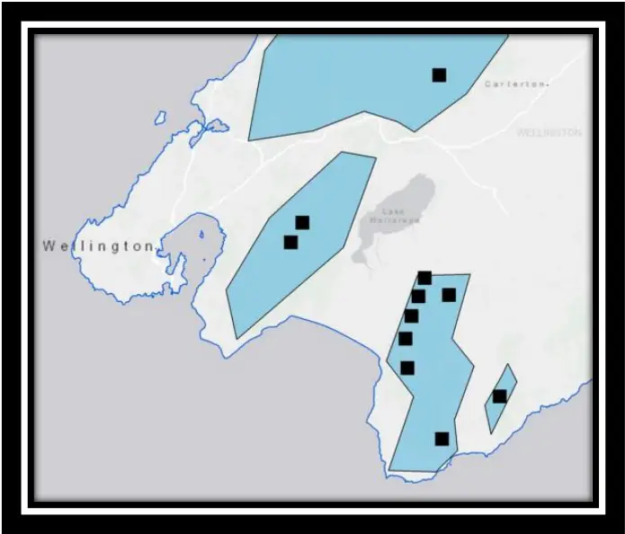

## Recording sound

The automated sound recording devices used in this study were the commercially available Song Meter devices, Model SM2+ (Wildlife Acoustics Inc.) (Figure 2). Devices recorded at a rate of 44 100 samples per second (so that bird vocalisations of up to 22.05 kHz could be documented). All recording was done with a single microphone per device (i.e. mono) and were mounted on tree trunks approximately 1.5 m above ground level. All devices were programmed to record synchronously for 30 minutes (0800 - 0830) every day for a period of at least 120 days starting in June 2014. Each 30 minute recording was saved as a 16-bit PCM uncompressed .WAV file. All sound recording devices were separated by a minimum of 1000 m (approx.) and were in fixed positions for the duration of the study. For a more detailed description of song meter settings refer to Appendix One.

Figure 2: A Song Meter (Model SM2+) unit as produced by Wildlife Acoustics Inc. A single microphone per unit was used in this study (rather than the two displayed in this image) (Wildlife Acoustics, 2016). Accessed from http://www.wildlifeacoustics.com/products/songmeter-sm2-birds


## Selecting audio recordings

To prevent scoring audio recordings that were affected by background noise - primarily that caused by wind and rain - daily climate information was collected from three weather stations (these weather stations were spread across the study area - see Appendix Two for more information). A set of weather criteria (24 hr average wind speed &lt; 10 km/hr, 24 hr max wind gust &lt; 10 km/hr and 24 hr rainfall total &lt; 2 mm) were applied so that only audio recordings that passed the weather criteria were considered for analysis. A sample of 50 audio recordings were then randomly chosen from a pool of audio recordings that passed the weather criteria.

## Scoring audio recordings

From each 30 minute recording a total of five minutes were manually scored for the presenceabsence of a species' bird song in a series of thirty ten-second sub-samples. The five minutes were either made up of a chronologically continuous five minute sub-sample (five minute method) or the first 10 seconds of every minute of the original recording (10 in 60 sec method). In the five minute method, the five minutes were extracted from a random starting point which was generated between the 1 st and 25 th minute of the original recording.

Scoring was undertaken by manually listening to audio recordings while simultaneously visually assessing the associated spectrogram. This was done using Raven 1.4 software (2011). The manual scoring process consisted of playing each 10 second sub-sample and scoring each bird species as either present or absent. I only recorded a species as present if they were heard vocalising at least once during the 10 second sub-sample and vocalisations were only counted if they met the following criteria: (1) it could be heard when the track was played at maximum volume, (2) it was visually located on the spectrogram and (3) it could be confidently identified to species level. When a sub-sample was completely devoid of birdsong it was scored as silent. Each audio recording was assigned a random code to prevent any biases associated with an awareness of its origin. Using presence-absence counts, rather than recording the number of calls, overcomes problems associated with determining when one call starts and another finishes. I named the birdsong parameter produced by the method a 'vocal conspicuousness score'. This name reflects the fact that the method does not directly measure calling rates but rather a detection probability that measures the likelihood of detecting at least one vocalisation of a targeted species within a 10 second audio recording. A vocal conspicuousness score for each count was calculated for all species by taking the proportion of 10 second sub-samples in which a particular species was recorded as present (see figure 6 for an example of how a vocal conspicuousness score is calculated). Detection probabilities - in this case a vocal conspicuousness score - can then be used to estimate species or community status (Hamel et al., 2013; MacKenzie, 2006). When undertaking the 10 in 60 sec method, Raven's paging function was used to automatically skip between the first 10 seconds of every minute. This function can also be used to adjust the duration of audio displayed on the screen though, in this case, the 10 second sub-sample was always displayed on the computer screen in its entirety. Panasonic OverEar (Noise Control) RP-HC200 headphones were used to listen to all audio recordings.

## Study species

Statistical analyses were undertaken on species that were deemed to have been detected frequently enough to allow for robust analysis. In this case species were used if they had been detected in at least half of all sites and present in at least 1% of all 10 second sub-samples.

17

The following species fulfilled these criteria: blackbird/song thrush (Turdus merula/ Turdus philomelos), chaffinch (Fringilla coelebs), fantail (Rhipifura fuliginosa), grey warbler (Greygone igata), rifleman (Acanthisitta chloris), silvereye (Zosterops lateralis), tomtit (Petroica macrocephala), tui/bellbird (Prosthemadera novaeseelanidae /Anthornis melanura

melanura) and whitehead (Mohoua albicilla). Therefore tui and bellbird [Family: Meliphagidae], were scored as an aggregate taxon, as were

Some species have very similar vocalisations which can be hard to differentiate, particularly in field conditions when birds may be calling some distance from the recording device. blackbird and song thrush [Family: Turidae] in order to streamline the species identification process and minimise false-positive detections. They are both referred to as single taxa throughout the chapter.

## Statistical analysis

Six comparisons were made between the structure of data produced by each sampling method. The underlying theme behind the comparisons was to determine the degree of autocorrelation in presence-absence sequences and how this may relate to variability of vocal conspicuousness estimates. The six comparisons are described below; all analyses were carried out in R version 3.2.3 (R Development Core Team 2015).

1. Comparing number of species detected between methods

The total number of species recorded per count was recorded. A Wilcoxon-signed rank test (with continuity correction) was then used to compare the number of species detected per count between methods.

2. Comparison of mean vocal conspicuousness estimates

For each species, a standardised major axis (SMA) regression was undertaken using the lmodel2 package in R (R Development Core Team 2015) to compare the vocal conspicuousness estimates generated by both methods. As opposed to standard least squares regression, SMA regression is designed to allow for error in both the x and y variables. This is done when there is no clear predictor or response variable, as is the case here. A regression coefficient of one would suggest that the vocal conspicuous scores generated by the five minute method were identical to those generated by the 10 in 60 sec method (or vice versa). If the 95% confidence intervals for the SMA regression coefficient excluded one, I determined that the vocal conspicuousness estimates generated by the five minute method were different to the 10 in 60 sec method.

3. Comparing variability of vocal conspicuousness estimates

The standard deviation of the vocal conspicuousness estimates for each species was calculated as a measure of variability. Comparisons were made between methods for each species by producing a standard deviation ratio. Standard deviation values generated using the five minute method were the denominators in the ratio; therefore SD ratios lower than one meant that vocal conspicuousness scores from the five minute method had a higher standard deviation than the 10 in 60 sec method. I expect that standard deviation values would generally be lower in the 10 in 60 sec method compared to the five minute method but I expect this difference to be more pronounced for species that are detected in an aggregated way with respect to time.

## 4. Comparing run-length and run-frequency of binary presence-absence sequences

A sequence of consecutive sub-samples (i.e. 10 second sub-samples) where the study unit is either always present or always absent is referred to as a 'run'. Here, I also allowed runs with a length of 1 to be defined as a run (Figure 3).

The mean maximum run length (only of 1's) and the mean number of runs (of either 1's or 0's) were calculated for each species and these values were then compared between methods using a Wilcoxon signed ranked test. I undertook this comparison to determine whether sampling a discontinuous set of ten second sub-samples would reduce the aggregation (and hence the mean run length) of species' detection My expectation is that the mean maximum run length scores, would be higher in the five minute method and the mean number of runs would be higher in the 10 in 60 sec method. I also expect that this would be more pronounced in species that are detected in an aggregated way with respect to time.

Figure 3: A visual representation of a presence-absence sequence for a hypothetical species (i.e. Species X) produced by a hypothetical 300 second count. Each number represents a single 10 second sub-sample (n = 30). 0 = 10 second sub-samples where Species X was not detected, 1 = 10 second sub-samples where species x was detected. In this example the number of runs = 7 and the maximum run length (of 1's) = 5. An example of how vocal conspicuousness scores are calculated is also given.

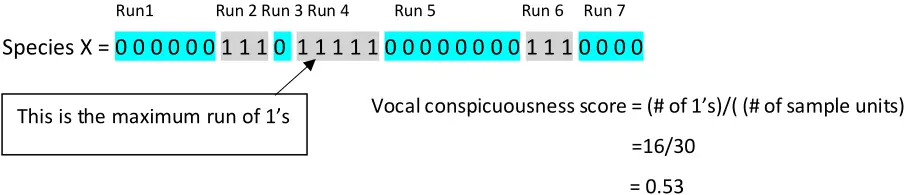

5. Temporal autocorrelation

When a variable is temporally autocorrelated the similarity between observations is a function of the time lag between them. It is possible that species' detections are either positively temporally autocorrelated i.e. positive 10 sec sub-samples are more likely to be found closer together than further apart or negatively temporally autocorrelated i.e. negative 10 sec sub-samples are more likely to be follow a positive 10 second sub-sample (or vice versa). Highly temporally autocorrelated data is undesirable as it violates assumptions of generalised linear models, and hence is advantageous to avoid. Therefore I wanted to determine the level to which bioacoustic presence-absence continuous five minute bird counts were autocorrelated and determine whether this could be reduced by sourcing sampling units from a longer temporal duration (i.e. 10 in 60 sec method). Mean temporal autocorrelation values for each species were calculated for the first 14 lagged states (Figure 4) using the acf function in the R package stats (R Development Core Team 2015). At each lag, autocorrelation values generated from the two methods were compared to zero using one-way Student's t-tests. A significant result would suggest that the particular species was autocorrelated at the lag in question. The frequency of significant t-tests (out of 14) was used to determine the level to which a particular species was autocorrelated and was compared between methods for each species. For each species, counts were eliminated from

the analysis if the species was not detected at all.

1 1 1 0 0

Lag1= 1

Lag2=

1 1 0

1 0 0 1

1 0 0

1 1 1 0 0 0

1 1 1 0 0

Lag3=

1 1 1 0 0 0 1 1 0 0 1 0 1 1 1 1 0 0 0 0 0 1 1 1 0 0 1 1

Figure 4: A visual representation of a presence-absence sequences for species x produced by a hypothetical five minute presence-absence count (the first line) as well as the data for the first 3 lagged states (the next 3 lines). At lag 1 the presence-absence sequence is offset by 1 so that values 1-29 in the lagged presence-absence sequence correspond to the values 2-30 in the original sequence. At lag 2 the presence-absence sequence is offset by 2 so that values 1-28 in the lagged presence-absence sequence correspond to the values 3-30 in the original sequence. In this case the autocorrelation values are: lag 1 = 0.26, lag 2 = - 0.3 and lag 3 = - 0.3.

0

## 6. Scale-occupancy

I computed estimates of vocal conspicuousness scores (i.e. species occupancy) at seven different sub-sample lengths (i.e. time scales): 10 sec (the sub-sample length), 20 sec, 30 sec, 50 sec, 60 sec, 150 sec and 300 sec. At each scale the mean occupancy was calculated for each species and method. The process of calculating occupancy is outlined in Figure Five.

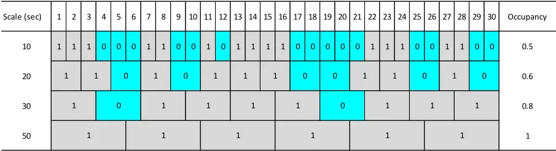

Figure 5: The presence-absence sequences for a hypothetical species produced by a hypothetical five-minute presence-absence count at four different scales. 0 = sub-samples where species x was not detected, 1 = 10 second sub-samples where species x was detected. The occupancy value for each scale is also given and is calculated by taking the mean value of a row.

| Scale (sec) | 1   | 2   |     | 3 4 | 5   | 6 7 | 8   | 9 10 | 11  | 12 13 | 14  | 15  | 16 17 | 18  | 19  | 20 21 | 22 23 | 24  | 25  | 26  | 27  | 28  | 29 30 | Occupancy |
| ----------- | --- | --- | --- | --- | --- | --- | --- | ---- | --- | ----- | --- | --- | ----- | --- | --- | ----- | ----- | --- | --- | --- | --- | --- | ----- | --------- |
| 10          | 1   | 1   | 1   | 0   | 0   | 0 1 | 1 0 | 0    | 1 0 | 1     | 1 1 | 1   | 0     | 0   | 0   | 0 0   | 1 1   | 1   | 0 0 | 1   | 1   | 0   | 0     | 0.5       |
| 20          |     | 1   |     | 1   | 0   | 1   | 0   | 1    |     | 1     |     | 1   | 0     | 0   |     | 1     | 1     |     | 0   | 1   |     | 0   |       | 0.6       |
| 30          |     | 1   |     | 0   |     | 1   |     | 1    |     |       | 1   |     |       | 1   | 0   | 1     |       | 1   |     |     |     |     | 1     | 0.8       |
| 50          | 1   | 1   | 1   | 1   | 1   | 1   |     |      |     | 1     | 1   |     |       |     |     | 1     | 1     |     |     |     |     |     |       | 1         |

I generated two scale-occupancy curves (one for each method) for each species. I expected that the two scale-occupancy curves produced for each species will diverge as the scale increases, with the curve produced by the 10 in 60 sec method being more positive than the curve produced by the five minute method. I expect that this will be more exaggerated in species which are detected in an aggregated way with respect to time.

## 2.4 RESULTS

## 1. Comparing mean number of species detected

A significantly higher number of species were detected per count using the 10 in 60 sec method (mean species richness per count +/- SE = 5.08 +/- 0.51 ) compared to the five minute method (mean species richness per count +/- SE = 4.04 +/- 0.44) (t = -5.4, df = 49, P &lt; 0.0001).

## 2. Comparison of mean vocal conspicuousness estimates

There was no evidence for a difference in vocal conspicuousness estimates generated between methods for blackbird/song thrush (SMA slope coefficient = 1.1), chaffinch (SMA slope coefficient = 1.06), grey warbler (SMA slope coefficient = 1.03) and whitehead (SMA slope coefficient = 1.07). However, there was evidence for a difference in mean vocal conspicuousness estimates between methods for fantail (SMA slope coefficient = 1.39), rifleman (SMA slope coefficient = 0.8), silvereye (SMA slope coefficient = 1.62), tui/bellbird (SMA slope coefficient = 1.68) and tomtit (SMA slope coefficient = 1.43) (Table 1).

Table 1: Summary statistics for nine native and exotic bird species according to two different presence-absence manual bioacoustic scoring methods. One method (method 5) used chronologically continuous five-minute sub-sets of 30 minute audio recordings, the second method (method 30) used the first 10 seconds of every minute to create a non-continuous 5 minute subset of the original recoding. Audio recordings were taken from 10 forest sites across the Southern North Island, New Zealand. \* = 0.05 &gt; P &gt; 0.01, \*\* = 0.01 &gt; P &gt; 0.001.

| Species               | S.D. ratio | SMA slope coefficient | Mean number of runs - 5 | Mean number of runs - 30 | Mean number of runs - 5 - 30 | Mean max run length - 5 | Mean max run length - 30 | Mean max run length - 5 - 30 |
| --------------------- | ---------- | --------------------- | ----------------------- | ------------------------ | ---------------------------- | ----------------------- | ------------------------ | ---------------------------- |
| Blackbird/Song Thrush | 0.91       | 1.10                  | 4.08                    | 4.1                      | -0.02                        | 2.98                    | 2.68                     | 0.3                          |
| Chaffinch             | 0.95       | 1.06                  | 3.5                     | 4.24                     | -0.74\*                      | 1.22                    | 1.64                     | -0.42                        |
| Fantail               | 0.72       | 1.39\*                | 2.84                    | 2.7                      | 0.14                         | 0.78                    | 0.54                     | 0.24                         |
| Grey Warbler          | 0.97       | 1.03                  | 4.22                    | 4.46                     | -0.24                        | 0.76                    | 0.86                     | -0.1                         |
| Rifleman              | 1.24       | 0.80                  | 1.66                    | 2.14                     | -0.48                        | 0.18                    | 0.36                     | -0.18\*                      |
| Silvereye             | 0.62       | 1.62\*                | 2.62                    | 3.94                     | -1.32\*\*                    | 0.98                    | 0.98                     | 0                            |
| Tomtit                | 0.70       | 1.43\*                | 2.78                    | 2.8                      | -0.02                        | 1.22                    | 1.44                     | -0.22                        |
| Tui/Bellbird          | 0.60       | 1.68\*                | 6.82                    | 6.22                     | 0.6                          | 2.92                    | 2.08                     | 0.84\*                       |
| Whitehead             | 0.94       | 1.07                  | 2.88                    | 3                        | -0.12                        | 0.84                    | 0.88                     | -0.04                        |

## 3. Comparing variability of vocal conspicuousness estimates

For eight out of nine species, the standard deviation of vocal conspicuousness estimates were lower when using the 10 in 60 sec method (Figure 6). However, the level to which the standard deviation reduced, differed among species. Silvereye (SD ratio = 0.62) and tui/bellbird (SD ratio = 0.60), had the greatest reduction in standard deviation and grey warbler had the smallest reduction SD ratio = 0.97). For one species (rifleman), the standard deviation of the vocal conspicuouness estimate was higher when using the 10 in 60 sec method (SD ratio =

1.24), though rifleman were detected 109% more frequently when using the 10 in 60 sec method (Table 1).

Figure 6: Mean vocal conspicuousness estimates (+/- S.D.) for nine native and exotic bird species according to two different presence-absence manual bioacoustic scoring methods. The five minute method used a continuous five-minute sub-sets of 30 minute audio recordings, the 10 in 60 sec method used the first 10 seconds of every minute to create a noncontinuous five minute subset of the original recoding. Audio recordings were taken from 10 forest sites across the Southern North Island, New Zealand.

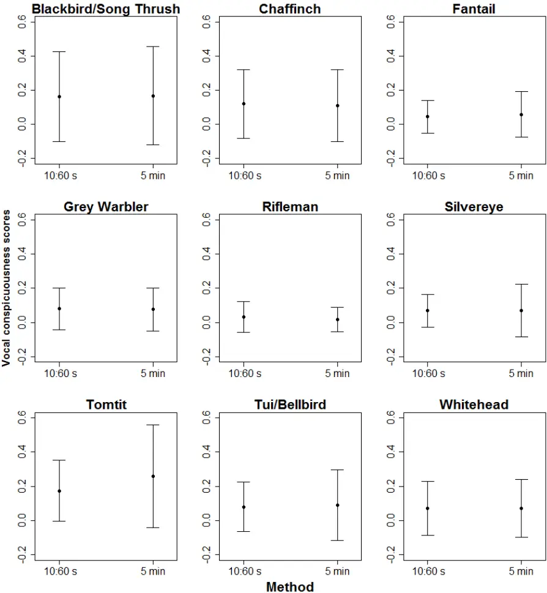

4. Comparing run-length and run-frequency of binary presence-absence sequences

Eight out of nine bird species showed no significant difference between methods in the mean number of runs per count. Silvereyes were the single species that did show a significant difference - with the 10 in 60 sec method producing a significantly higher number of runs (Wilcoxon singed-rank test: V = 89.5, P = 0.003). This indicates that the 10 in 60 sec method has reduced the aggregation of silvereye detections, given that there was no difference in the freqeuncy of silvereye detections between methods (mean vocal conspicuouesness score - five minute method = 0.069, mean vocal conspicuousness score - 10 in 60 sec method = 0.069). Seven out of nine bird species also showed no significant difference in mean max run lengths between methods. However, the two species (rifleman and tui/bellbird) that did show a significant difference in mean max run length, were detected differently between methods (with tui/bellbird being detected more frequently in the 10 in 60 sec method and rifleman being detected more in the five minute method). Therefore it is likely that the overall difference in detection levels is responsible for the difference in mean max run length, rather than a change in the structure of presensce-absence sequences brought about by differences

in methods.

5. Temporal autocorrelation

Typically species' were most positively autocorrelated at lag one and then dropped to near zero autocorrelation by lags 2 - 4 (Figure 7). For six out of nine bird species the 10 in 60 sec method did not change the number of lags (by more than one lag) at which the autocorrelation curve was significantly different to zero when compared to the five minute method. However, in three cases (grey warbler, rifleman and fantail) the 10 in 60 sec method resulted in a reduction in temporal autocorrelation (Table 2 and Figure 7). Therefore, when the 10 in 60 sec method did have an effect on temporal autocorrelation it always resulted in a reduction rather than an increase. Interestingly, at lag 14 all species were either non-autocorrelated or positively correlated when using the five minute method. When using the 10 in 60 sec method, the opposite pattern was observed with all species either being non-autocorrelated or negatively

autocorrelated (Table 2 and Figure 7).

Across both methods a total of five species were positively autocorrelated at lag 1 and no species were negatively autocorrelated. Therefore, for these five species, detection in any given 10 second sub-sample significantly increases the likelihood of detection in the subsequent 10 second sub-sample.

When looking solely at the five minute method, fantail and silvereye were the most temporally autocorrelated species. Whitehead were the least temporally autocorrelated.

Figure 7: Mean autocorrelation scores (for lags 1 to 14) for nine native and exotic bird species according to two different presence-absence manual bioacoustic scoring methods. The five minute method (green) used chronologically continuous five-minute sub-sets of 30 minute audio recordings, the 10 in 60 sec method (green) used the first 10 seconds of every minute to create a non-continuous five minute subset of the original recoding. Audio recordings were taken from 10 forest sites across the Southern North Island, New Zealand. Values are mean +/- S.E (dotted lines).

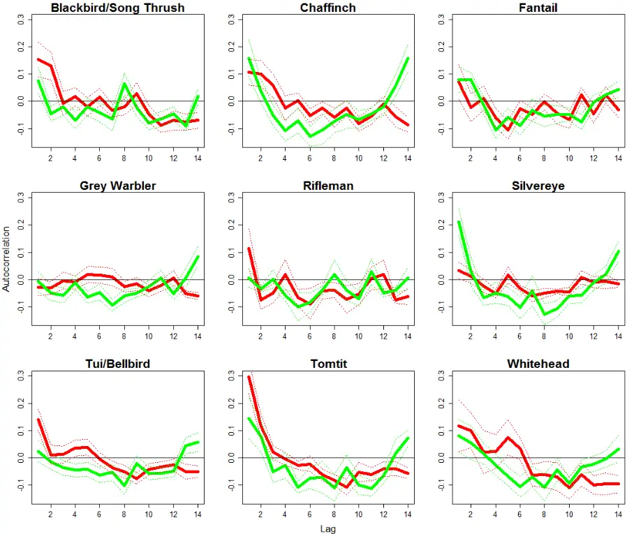

Table 2: Significance results for Student's t-tests (one-way) comparing mean autocorrelation scores to zero (at lags 1 to 14) for nine native and exotic bird species according to two different presence-absence manual bioacoustic scoring methods. A positive sign (+) indicates an autocorrelation score significantly greater than zero (i.e. positive autocorrelation), a negative sing (-) indicates an autocorrelation score significantly greater than zero (i.e. negative autocorrelation). The five minute method used chronologically continuous fiveminute sub-sets of 30 minute audio recordings, the 10 in 60 sec method (green) used the first 10 seconds of every minute to create a non-continuous five minute subset of the original recoding. Audio recordings were taken from 10 forest sites across the Southern North Island, New Zealand. \* = 0.05 &gt; P &gt; 0.01, \*\* = 0.01 &gt; P &gt; 0.001.

| Method   | Species               | Lag - 1  | Lag - 2 | Lag - 3 | Lag - 4  | Lag - 5  | Lag - 6 | Lag - 7  | Lag - 8  | Lag - 9  | Lag - 10 | Lag - 11 | Lag - 12 | Lag - 13 | Lag - 14 | Lag - Total |
| -------- | --------------------- | -------- | ------- | ------- | -------- | -------- | ------- | -------- | -------- | -------- | -------- | -------- | -------- | -------- | -------- | ----------- |
|          | Blackbird/Song Thrush | 0        | 0       | 0       | - \*     | 0        | 0       | 0        | 0        | 0        | - \*\*   | - \*     | 0        | - \*\*\* | 0        | 4           |
|          | Chaffinch             | + \*     | 0       | 0       | - \*     | 0        | - \*\*  | 0        | 0        | 0        | - \*     | 0        | 0        | 0        | + \*\*   | 5           |
|          | Fantail               | 0        | 0       | 0       | - \*\*\* | - \*     | - \*\*  | 0        | - \*     | - \*     | - \*     | - \*\*\* | 0        | 0        | 0        | 7           |
|          | Grey Warbler          | 0        | 0       | 0       | 0        | - \*\*   | 0       | - \*\*\* | - \*     | - \*\*   | 0        | 0        | - \*     | 0        | + \*     | 6           |
| 5        | Rifleman              | 0        | - \*    | 0       | - \*     | 0        | 0       | 0        | 0        | 0        | 0        | 0        | - \*     | - \*     | 0        | 4           |
|          | Silvereye             | + \*\*\* | 0       | - \*    | 0        | 0        | - \*    | 0        | - \*\*   | - \*\*   | 0        | - \*     | 0        | 0        | + \*     | 7           |
|          | Tomtit                | 0        | 0       | 0       | 0        | - \*\*\* | 0       | 0        | - \*     | 0        | - \*     | - \*\*   | - \*     | 0        | + \*     | 6           |
|          | Tui/Bellbird          | 0        | 0       | 0       | 0        | 0        | - \*    | 0        | - \*\*   | 0        | - \*     | - \*\*   | - \*     | 0        | 0        | 5           |
|          | Whitehead             | 0        | 0       | 0       | 0        | 0        | - \*    | 0        | - \*     | 0        | - \*\*\* | 0        | 0        | 0        | 0        | 3           |
|          | Blackbird/Song Thrush | + \*     | + \*    | 0       | 0        | 0        | 0       | 0        | 0        | 0        | 0        | - \*\*   | 0        | - \*     | - \*     | 5           |
|          | Chaffinch             | + \*     | + \*    | 0       | 0        | 0        | 0       | 0        | 0        | 0        | - \*     | 0        | 0        | 0        | - \*\*   | 4           |
|          | Fantail               | 0        | 0       | 0       | 0        | - \*\*   | 0       | 0        | 0        | 0        | - \*     | 0        | 0        | 0        | - \*     | 3           |
|          | Grey Warbler          | 0        | 0       | 0       | 0        | 0        | 0       | 0        | 0        | 0        | 0        | 0        | 0        | - \*\*\* | - \*\*\* | 2           |
| 10 in 60 | Rifleman              | 0        | 0       | 0       | 0        | 0        | 0       | 0        | 0        | 0        | 0        | 0        | 0        | - \*\*\* | 0        | 1           |
|          | Silvereye             | 0        | 0       | 0       | - \*\*   | 0        | - \*\*  | - \*\*   | - \*\*   | - \*\*\* | - \*\*   | 0        | 0        | 0        | 0        | 6           |
|          | Tomtit                | + \*\*\* | + \*    | 0       | 0        | 0        | 0       | - \*     | - \*\*\* | - \*\*   | 0        | - \*     | 0        | 0        | - \*     | 7           |
|          | Tui/Bellbird          | + \*\*\* | 0       | 0       | 0        | 0        | 0       | 0        | - \*     | - \*\*\* | - \*     | 0        | 0        | 0        | - \*     | 5           |
|          | Whitehead             | 0        | 0       | 0       | 0        | 0        | 0       | 0        | 0        | 0        | - \*     | 0        | - \*     | - \*     | - \*     | 4           |

## 6. Scale-occupancy

Eight out of nine bird species had scale-occupancy curves that were not significantly different between methods. Though, when there was a divergence between curves, the 10 in 60 sec method was generally higher than the five minute method (Figure 8). Despite both methods generating identical vocal conspicuousness estimates for silvereye, at a sampling unit of 10 sec they were detected in twice as many counts (overall) when using the 10 in 60 sec method (i.e. sampling unit = 300 sec) (t = 3.13, df = 49, P = 0.0029). The 10 in 60 sec method also produced significantly higher occupancy for silvereyes at a sampling unit of 150 sec (t = 2.32, df = 49, P = 0.025) (Figure 8). This gives further evidence that silvereyes were detected in a temporally aggregated way. Hence, silvereyes will either be present in many sub-samples in a continuous five-minute count or not at all, whereas the 10 in 60 sec method reduced this apparent aggregation by sub-sampling from a longer window of time.

Figure 8: Scale-occupancy curves for nine native and exotic bird species according to two different presence-absence bioacoustic scoring methods. The five minute method (green) used chronologically continuous five-minute sub-sets of 30 minute audio recordings, the 10 in 60 sec method (green) used the first 10 seconds of every minute to create a non-continuous five minute subset of the original recoding. Audio recordings were taken from 10 forest sites across the Southern North Island, New Zealand. Statistically significant differences between methods (at the 5% level) are indicated by o . Values are mean +/- S.E.

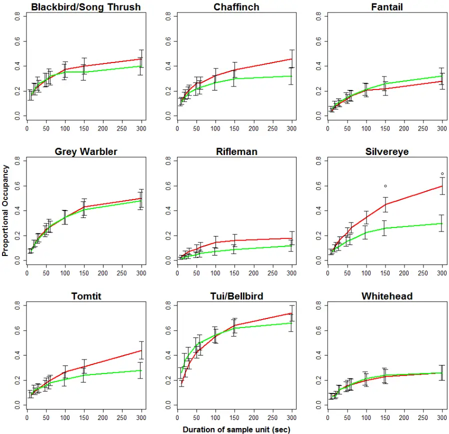

## 2.5 DISCUSSION

I determined that increasing the temporal extent from which five minute audio recordings are collected, from five minutes to 30 minutes, decreased the variability of vocal conspicuousness estimates, significantly increased the total number of species detected per count and reduced temporal autocorrelation for a number of species. Therefore I propose that the use of the 10 in 60 sec method will allow trends in species conspicuousness (which are generally correlated with population density) to be detected more sensitively and will consequently provide more informative data to conservation practitioners and managers. Contrary to predictions, changing from the five minute method to the 10 in 60 sec method did not generally change the structure of presence-absence sequences or scale occupancy, though responses were species-specific.

## What effect does the 10 in 60 sec method have on the variability of vocal conspicuousness estimates?

For eight out of nine species, the standard deviation of vocal conspicuousness estimates were lower when using the 10 in 60 sec method. Therefore it appears that increasing the temporal extent from which audio recordings are collected decreases the variability of conspicuousness estimates. The performance (or accuracy) of any given estimator is a product of its bias (the difference between the true mean and the estimated mean) and precision (standard deviation of the estimated mean) (Walther &amp; Moore, 2005). Therefore the 10 in 60 sec method has a greater overall ability to make an accurate estimation of vocal conspicuousness as I have no reason to believe that the methods differ in their bias.

Reducing the standard deviation associated with abundance indices is important because the ability of an index to statistically detect population changes increases with its precision (Engeman, 2005). This then should allow for better informed conservation-management procedures to be enacted if necessary. I have no reason to believe that the methods differ in their bias as a tool for estimating underlying population abundance, therefore the increase in precision comes with no statistical cost.

The level to which the 10 in 60 sec method reduced standard deviation varied among species. Both silvereye and tui/bellbird experienced more than a 50% reduction in standard deviation, whereas grey warblers experienced just a 3% reduction. This suggests that, as expected, the level to which the 10 in 60 sec method reduces variability of vocal conspicuousness estimates is species-specific. It is likely that the species which experienced the greatest reductions in variability were detected in a temporally aggregated way when using the five minute method.

The standard deviation of vocal conspicuousness scores for a single species (rifleman) was not lower when using the 10 in 60 sec method. There are a number of reasons why this may be the case. Firstly, error generally rises with an increase in the mean. Therefore, the fact that rifleman had, by chance, a mean vocal conspicuousness score two times higher in the 10 in 60 sec method could be responsible for the increase in standard deviation. Secondly, rifleman were the least frequently detected species in this study and therefore would be more susceptible to random variation alone causing the difference.

## What effect does the 10 in 60 sec method have on the number of species detected per count?

The 10 in 60 sec method detected a significantly higher number of species per count than the five minute method. Therefore this method would be more appropriate for biodiversity inventories because it reduces the likelihood of producing false negatives (i.e. not detecting a species when it is actually present) (Tyre et al., 2003). Research by Tyre et al. (2003) suggests that even low false negative rates can influence ecological inferences. Furthermore, despite detecting more species, the 10 in 60 sec method does not increase the quantity of work required to score audio recordings because both methods analyse the same amount of audio.

## What effect does the 10 in 60 sec method have on temporal autocorrelation?

The 10 in 60 sec method reduced the level of temporal autocorrelation for three species (fantails, silvereye and rifleman) and did not cause an increase in temporal autocorrelation for any species. When time-dependent data are used in regression models, temporal autocorrelation can violate the assumptions of generalised linear models and therefore reduce the reliability of their interpretation (Strachan &amp; Harvey, 1996). . Therefore, reducing levels of temporal autocorrelation in bioacoustic presence-absence data will allow for more reliable statistical analyses to be performed. Across both methods, a total of five species (chaffinch, silvereye, blackbird/song thrush,

chaffinch, tomtit and tui/bellbird) were positively autocorrelated at lag one and no species was negatively autocorrelated. Therefore, for these species, detection in any given 10 second sub-sample significantly increases the likelihood of detection in the subsequent 10 second sub-sample. Positive autocorrelation at lag one makes biological sense for a number of reasons. Firstly, if an individual bird is vocalising close enough to a recording device to be detected during 10 seconds of a recording, it is more likely to be vocalising close enough for detection during the subsequent 10 second sub-sample than any other preceding subsamples. For the other species, detection in a 10 second sub-sample does not change the likelihood of detection in the subsequent sub-sample. Interestingly, at lag 14 all species were either non-autocorrelated or positively correlated when using the five minute method. When using the 10 in 60 sec method, the opposite pattern was observed with all species either being non-autocorrelated or negatively autocorrelated. Therefore, when using the five minute method, detecting a species in any given 10 second sub-sample generally increases the likelihood of detecting a species 14 subsamples (or 140 seconds) later. In contrast, when using the 10 in 60 sec method, detecting a species in any given 10 second sub-sample generally decreases the likelihood of detecting a species 14 sub-samples (or 14 minutes) later.

## Structure of presence-absence sequences and scale-occupancy

Contrary to expectations increasing the temporal extent from which five minute audio recordings are collected, from five minutes to 30 minutes, did not generally change the structure of presence-absence sequences or scale-occupancy curves. Though responses were species-specific with silvereyes being the consistent exception to the common theme. Eight out of nine bird species showed no significant difference between methods in the mean number of runs per count. However, silvereyes experienced an increase in the number of runs per count when using the 10 in 60 sec method. When detections are temporally aggregated I would expect a lower number of runs than when detections are more randomly distributed (when the overall number of detections remains constant). Therefore, it appears that the 10 in 60 sec method has reduced the temporal aggregation of silvereye detections. The 10 in 60 sec method produced significantly different mean maximum run lengths for two species (rifleman and tui/bellbird). However, both species were detected differently between methods (with tui/bellbird being detected more frequently in the 10 in 60 sec method and rifleman being detected more in the five minute method). Therefore it is likely that the overall difference in detection levels is responsible for the difference in mean max run length, rather than a change in the structure of presence-absence sequencess brought about by differences in sampling methods. Eight out of nine bird species had scale-occupancy curves that were not significantly different between methods. Therefore, increasing the temporal extent from which acoustic data is collected has not altered scale-occupancy significantly. Again, silvereyes were an exception with the 10 in 60 sec method producing significantly higher vocal conspicuousness scores (i.e. occupancy) when using a sampling duration (i.e. time scale) of 150 and 300 seconds. Therefore, when using the 10 in 60 sec method silvereyes were present in more counts, but in the counts that they were present, they were detected at a lower frequency. Silvereyes are a gregarious species that often move in small flocks (Armitage, 2015). I suggest species with individuals that are located more evenly across a landscape. Silvereyes also specific. Therefore an understanding of the biology of study species during monitoring (and that flocking species (like silvereye) will benefit more from the 10 in 60 sec method than highlight that the level to which the 10 in 60 sec improves statistical parameters is speciestheir likely detection characteristics) will allow methods to be optimised accordingly.

## Incorporating knowledge from traditional presence-absence methods

Bioacoustic presence-absence methods are analogous with traditional presence-absence

techniques. Traditional presence-absence techniques are generally concerned with the presence (or absence) of species within a spatially-explicit sampling unit. The bioacoustic presence-absence methods I describe in this chapter are concerned with the presence or absence of species (using their vocalisations as a method of detection) within a temporallyexplicit sampling unit. The lessons learnt from traditional presence-absence surveys can be translated into biacoustic methods. In a traditional spatial presence-absence study, Zielinski and Stauffer (1996) used the average number of visits until first-detection as a parameter for correcting for the bias associated with the estimate of the proportion of sampling units occupied (analogous to the detection probability parameter used in this study - vocal conspicuousness). I propose that the time to

first detection could also be used in bioacoustic presence-absence studies for correcting bias in vocal conspicuousness estimates. Another approach used by Zielinski and Stauffer (1996) could prove useful in bioacoustics studies; they used a binomial model in a Monte Carlo simulation to estimate sample sizes required to detect specified levels of population decline (Vojta, 2005).

## Costs and benefits for the 10 in 60 sec method

The 10 in 60 sec method is beneficial in that it decreases the variability of vocal conspicuousness estimates, significantly increased the total number of species detected per count and reduced temporal autocorrelation for a number of species. However, in order to collect acoustic data for the 10 in 60 sec method, recording devices may need to record sound for six times longer (duration required = 30 minutes) than the five minute method (duration required = 5 minutes). This will lead to more rapid battery and memory usage and units will consequently be able to record for a shorter overall time period. However, many recording devices are sophisticated enough to allow for multiple start and end times. Therefore, this problem should be easily avoided by programming units to only record during 10 second bursts every minute, rather than continuously for 30 minutes.

## Conclusions

The 10 in 60 sec method decreases the variability of vocal conspicuousness estimates, significantly increased the total number of species detected per count and reduced temporal autocorrelation for a number of species. I propose that using this method will allow a more sensitive and accurate way of determining changes in bird conspicuousness which will then allow for more informed management intervention. Contrary to predictions, the 10 in 60 sec method did not generally change the run structure of presence-absence sequences or scale occupancy relationships, though responses were species-specific. The level to which the 10 in 60 sec method improves statistical parameters is likely to be species-specific. For instance, the 10 in 60 sec method is more likely to have an effect on species that are detected in a temporally aggregated way (i.e. flocking species like silvereye). Hence, an understanding of the biology of study species (and their likely detection characteristics) will allow sub-sampling methods to be optimised accordingly.

33

Do forests 'fall silent' following aerial applications of 1080 poison? An investigation into changes in the vocal conspicuousness of birds in the Aorangi Forest Park (Wairarapa, New Zealand)

## 3.1 ABSTRACT

Sodium monofluoroacetate (1080) is used widely in New Zealand to control possums and other pest mammal species which pose a major threat to birds through predation and competition. However, it can cause accidental by-kill of birds through both primary and secondary poisoning and it is often anecdotally suggested that forests 'fall silent' (i.e. become devoid of birdsong) following aerial 1080 operations. To quantitatively assess this claim I deployed 24 sound recording devices spread evenly across treatment and non-treatment sites. These collected audio recordings for a period of several months before and after an aerial 1080 application. I then manually scored a total of 232 audio recordings to generate two community-level birdsong parameters and vocal conspicuousness estimates for nine native and exotic bird species. Using a BACI (Before-After/Control-Impact) experimental design I determined whether the aerial 1080 operation caused any changes in these birdsong parameters. At the community level I found no evidence for a reduction in birdsong after the 1080 operation and eight out of the nine bird taxa showed no evidence for a decline in vocal conspicuousness. Only one species tomtit (Petroica macrocephala) showed evidence for a decline in vocal conspicuousness, though this became non-significant when correcting for multiple tests.

## 3.2 INTRODUCTION

Possums and rats pose a major threat to New Zealand's conservation estate through browsing and predation (Brown et al., 1993; Cowan et al., 1997; Schadewinkel et al., 2014). Sodium monofluoroacetate (1080) has been used widely to control brushtail possums (Trichosurus vulpecula) and other pest mammal species (such as rats), across New Zealand since the 1950s (Eason, 2002; Spurr &amp; Powlesland, 1997; Wright, 2011). 1080 is used in both aerial and ground-based operations. In aerial operations, toxic bait is generally broadcast laterally from GPS-guided helicopters along parallel flight paths (Nugent &amp; Morriss, 2013).

New Zealand has no native terrestrial mammals (excluding 2 extant bat species), therefore the avifauna is particularly vulnerable to mammalian predation and competition (C. M. King, 1984). The reduced abundance of possums, rats and stoats following 1080 operations has, on a number of occasions, resulted in population growth for a number of bird species (Innes et al., 2004).

Aerial 1080 applications have also caused incidental mortality (through both primary and secondary poisoning) for several native species (Spurr &amp; Powlesland, 1997; Veltman &amp; Westbrooke, 2011). In total, 19 native and 13 introduced bird species have been found dead following 1080 operations since they started in New Zealand in 1956 (Spurr &amp; Powlesland, 2000; Wright, 2011). For this reason, amongst others, the use of 1080 in New Zealand remains controversial. It is also often anecdotally suggested that forests 'fall silent' (i.e. become silent and devoid of birdsong) after 1080 is aerially applied to forests in NZ {Graf, 2009; Slater, 2015}. However, no published study has used bioacoustic technology to look solely and directly at quantifying birdsong and determine how it changes in relation to aerial applications of 1080 in a way that would allow a true test of this claim.

I used 24 sound recording devices, spread evenly across treatment and non-treatment sites, to collect acoustic data for a period of two months before and after an aerial 1080 application. I used this data to calculate community-level birdsong parameters, as well as vocal conspicuousness scores for a range of native and exotic bird species. In this chapter, I aim to directly and quantitatively test the claim that forests 'fall silent' in the weeks and months following aerial applications of 1080 poison. The questions I address are:

- (1) Does the overall level of bird song within forests reduce in the two month period following an aerial application of 1080 poison relative to the overall level of birdsong, in sites not exposed to 1080 (over the same time period)?
- (2) Do any individual bird species (exotic or native) exhibit a reduction in their vocal conspicuousness in the two month period following an aerial application of 1080 poison relative to the vocal conspicuousness of the same species, but in sites not exposed to 1080 (over the same period of time)?

## 3.3 METHODS

## Experimental design

I deployed 24 sound recording devices across treatment and non-treatment sites, to collect acoustic data for a period of several months before and after an aerial 1080 application. I manually scored a total of 232 audio recordings to calculate two community-level birdsong parameters and vocal conspicuousness scores for nine bird species. Using a BACI (BeforeAfter/Control-Impact) experimental design I compared changes in the birdsong parameters in relation to an aerial application of 1080 poison. All inferences regarding changes in birdsong parameters in response to the 1080 application were made relative to changes in birdsong parameters over the same time period in non-treatment sites.

## Field site descriptions

## Treatment sites

The state administered Aorangi Forest Park (19 380 ha approx.) straddles the Aorangi Range at the south-eastern corner of the North Island, New Zealand. Since the arrival of humans in New Zealand the vegetation of the Aorangi range has been modified by fire, browsing (from introduced mammals) and erosion. Wardle (1967) described four main categories into which the vegetation of the Aorangi Forest Park can be broadly classified: (1) mixed broadleaf forest dominated by mahoe (Melicytus ramiflorus), hinau (Eleaocarpus dentatus) and rewarewa (Knightia excelsa) common on the stable slopes and flats below 400-600m, (2) black beech (Fuscospora solandri) forest located on dry and exposed sites up to 500-600m, (3) red beech (Fuscospora fusca) forest located in middle altitudes between 400 m and 600 m and (4) silver beech (Lophozonia menziesii) forest which is located on the ridges above 600 m. Scattered podocarps are also found throughout the park (pers. obs.).

A total of 12 automated sound recording devices were spread across six sites (two per site) within the Aorangi Forest Park (Figure 9). Though not chosen at random, these six sites provided a good geographical coverage of the 1080 zone. Five of these six sites have had ongoing pest mammal monitoring lines for several years. Song meters were placed along preexisting monitoring lines which had been placed at quasi-random positions which were mostly, but not always, along ridges. Detailed descriptions of treatment sites and GPS coordinates of all sound recording devices are provided in Appendix Three.

## Non-treatment sites

Four non-treatment sites were chosen in nearby forested areas (Rimutaka Forest Park, Tararua Forest Park and Tora Bush) (Figure 9). They were chosen through a consideration of their proximity to treatment sites, similarity of vegetation and bird community to treatment sites, accessibility, and, importantly, sites were only used if they were not going to receive a 1080 operation at any time during the study. Detailed descriptions of non-treatment sites and GPS coordinates of all sound recording devices are provided in Appendix Three. All sound recording devices (in treatment and non-treatment sites) were separated by a minimum of 1000 m (approx.) and were in fixed positions for the duration of the study.

Figure 9: Location of treatment sites (black squares) and non-treatment sites (blue squares) across the lower North Island, New Zealand. There were two sound recording devices per treatment sites and three per non-treatment sites. The approximate extent of the aerial 1080 operation is shown by the grey polygon and non-treatment forested areas are shown by the blue polygons.

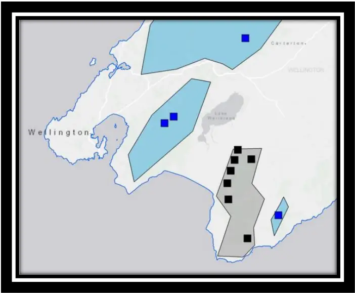

## Details of 1080 operation

A pre-feed application of non-toxic RS5 (6 gram) cereal baits occurred on 4 and 5 August 2014. RS5 (12 gram cereal) baits with 0.15 % 1080 toxicity were used in the toxic operation conducted on the August 18 2014 (area = 20 000 ha approx.) with a smaller area (2 000 ha approx.) treated on August 27 2014 (see Appendix Four for details). Both toxic and non-toxic baits were inoculated with deer repellent. All applications were aerially broadcast along 180 m swaths with intervening 40 m strips of non-application. The pre-feed bait was applied at 0.5 kg/ha and the toxic bait at 1.0 kg/ha.

## Recording sound

The automated sound recording devices used in this study were the commercially available Song Meter devices (Model SM2+: Wildlife Acoustics Inc.). Devices recorded at a rate of 44

100 samples per second (so that bird vocalisations of up to 22.05 kHz could be documented). All recording was done with a single microphone per device (i.e. mono) and were mounted on tree trunks approximately 1.5 m above ground level. All devices were programmed to record synchronously for 40 minutes (0800 - 0840) every day for a period of at least 60 days before and 60 days after the 1080 application. Because each device recorded at exactly the same time, the effect of intra-day and inter-day variability in the vocal conspicuousness of birds was reduced; performing synchronous bird counts amongst multiple count stations within multiple sampling regions would be impractical with traditional bird monitoring techniques. Each 40 minute recording was saved as a 16-bit PCM uncompressed .WAV file. For a more detailed description of song meter settings refer to Appendix One.

## Selecting audio recordings

I manually scored a total of 10 days of recording from each recording device, five of which were before the 1080 operation and five of which were after. The first four days were chosen as 6 &amp; 1 weeks before the 1080 drop (July 7 and August 11 2014) and 1 &amp; 6 weeks (August 25 and October 2) after the 1080 drop, without regard to weather conditions. The next six days were chosen by applying a set of weather criteria (24 hr average wind speed &lt; 10 km/hr, 24 hr max wind gust &lt; 10 km/hr and 24 hr rainfall total &lt; 2 mm) using local weather station data (NIWA, 2015). Of the 31 days that passed the criteria, those closest to 2, 4 and 8 weeks before and after the 1080 drop were chosen. This reduced the influence of background noise, primarily that caused by wind and rain, when scoring audio recordings.

Two of the original four days chosen did not pass the weather criteria but were retained in the analysis because they did not significantly influence the outcome of the results. The weather data was collected from three weather stations distributed throughout the study region (for more detail on the weather stations see Appendix Two). Eight audio recordings were missing due to faulty sound recording devices, therefore the total number of scored recordings was 232.

## Scoring audio recordings

## Species-level

Vocal conspicuousness estimates were calculated using the 10 in 60 sec method as described in Chapter Two. By avoiding a continuous five minute recording I increased the number of species detected per count, reduced the variance around the mean vocal conspicuousness estimates and reduced the likelihood of temporal autocorrelation in our data (for more detail see Chapter Two). Acoustic counts of five minutes duration have been used in other similar bird-monitoring studies in New Zealand (pers. comm. Graeme Elliott).

## Community-level

Two community-level birdsong parameters were calculated to allow a test of whether the bird community, as a whole, 'fell silent' following the 1080 operation. The first communitylevel parameter was calculated by taking the mean of the vocal conspicuousness scores of all species. For example, a single five minute count in which all 27 species were present in each of the 10 second sub-samples would have a mean conspicuousness score of one whereas a single five minute count completely devoid of birdsong would have a mean conspicuousness score of zero. The second community-level parameter quantified the frequency of silent 10 second sub-samples. If the forest did 'fall silent' after the 1080 operation then I would expect that the frequency of silent sub-samples would increase after the poison drop relative to non1080 sites. Both parameters were calculated for each count (n = 232).

To prevent any biases associated with the scoring of audio recordings, each audio recording was randomly coded so I was unaware of whether the audio recording originated from before or after the 1080 drop or whether it was from a 1080 or non-1080 site. Any temporal biases associated with changes in observer ability overtime were counteracted by scoring audio recordings in a random order. Panasonic OverEar (Noise Control) RP-HC200 headphones were used to listen to most audio recordings.

## Statistical analysis

## Community and species-level changes in conspicuousness

For each individual bird count, I recorded the following variables: treatment (1080 or non1080), time (before or after 1080), sound recording device, site, region and date. For each bird species and community-level parameter I fitted a logistic mixed-effects model to our data using the glmer function of the lme4 R package (Bates, Mächler, Bolker, &amp; Walker, 2014) (Bates et al. 2014):

Species (x) or community bird song parameter ~ Treatment\*Time + (1|Region/Site/sound recording device) + (1|Day)

Due to potentially unrecorded differences among sound recording devices, sites, regions and days each of their corresponding variables were fitted as random effects. The random effects also took into account the spatial nestedness of the data, in that each sound recording device was located within a site and each site was located within a region (Figure 10).

Figure 10: This figure aims to depict the nestedness of my data. Image 1 shows the position of three sound recording devices within a site. Image 2 shows the position of sites within each region; yellow circles represent regions that did not receive 1080, the red circle represents the region that did receive 1080. Some regions are made up of multiple sites, other regions are made up of a single site.

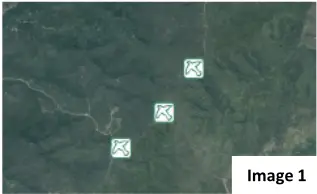

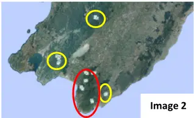

I was interested in whether the model returned a significant interaction term between treatment and time. A significant interaction would suggest that the change in the birdsong parameter from pre-1080 to post-1080, in the treatment sites, was significantly different to the change in the birdsong parameter, over the same time period, observed in the nontreatment sites. I was specifically interested in whether there was a decline in treatment sites relative to non-treatment sites (this would support the theory that forests 'fall silent' following the application of 1080).

An ANOVA (type III) was conducted to generate a chi-squared value for the interaction term. Then, to test the significance of the chi-square value I applied a permutation test (number of permutations = 1000). A permutation test is a non-parametric randomisation test in which the null distribution of a test statistic (a chi-square value in this case) is estimated by randomly assigning the class labels of observations (Phipson &amp; Smyth, 2010); this determined the likelihood of obtaining a test statistic as extreme or more extreme than the one observed due to chance. For our species-level analysis I also used a Holm-Bonferroni correction (Holm, 1979) to conservatively counteract the problem of multiple comparisons (which can lead to inflated risk of type 1 error). Given that the Holm-Bonferroni correction is occasionally criticised for being too conservative (Moran, 2003) I present the results before and after the correction.

Sound recording devices were deployed before the exact boundaries of the 1080 operation were known; the two devices at Waihora North (one of the treatment sites - refer to Appendix Three for details) ended up being near the boundary of the aerial 1080 operation (one just inside the boundary and one just outside). Therefore, as a conservative approach, this site was removed from the analysis for all taxa and community-level birdsong parameters that had a significant or near-significant interaction term (threshold set at P &lt; 0.2) to ensure that its inclusion was not influencing results. In all cases the removal of this site had a very minimal effect on the outcome of the permutation test; but both p-values are quoted for these taxa in results.

Statistical analyses were performed only on species which were: (1) present in at least half of both the treatment and non-treatment sites and (2) recorded as present in at least 1% of all 10 second sub-samples (across all counts).

## 3.4 RESULTS

## Effect of 1080 on community-level birdsong parameters

Neither community-level birdsong parameter provided any evidence to support the anecdotal claims that forests 'fall silent' after aerial 1080 operations. Mean bird vocal conspicuousness increased slightly in the treatment sites after the 1080 operation and there was no evidence for a significant interaction between time and treatment (P = 0.98). In general mean bird vocal conspicuousness was higher in treatment sites than in non-treatment sites (Figure 11).

Figure 11: Mean bird vocal conspicuousness estimate in 1080 sites (black line) and non-1080 sites (blue line) before and after an aerial 1080 application. Values are mean +/- S.E.

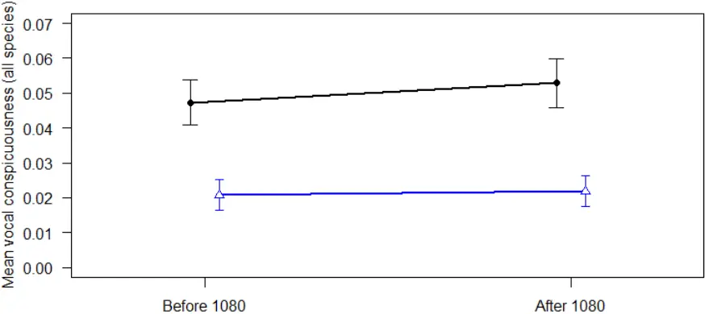

The frequency of silent sub-samples decreased slightly in the treatment sites after the 1080 drop (from 0.16 to 0.10) and there was no evidence for an interaction between time and treatment (P = 0.11) (Figure 12). This suggests that treatment sites were not any more silent after the 1080 drop relative to non-treatment sites and the result did not change when excluding Waihora North (p = 0.12). In non-treatment sites the frequency of silent 10 second sub-samples were at near identical levels before (0.44) and after (0.43), and in general non-treatment sites were more silent than treatment sites (Figure 12).

Figure 12: Mean frequency of silent 10 second sub-samples per count for 1080 sites (black line) and non-1080 sites (blue line) before and after an aerial 1080 application. Values are mean +/- S.E.

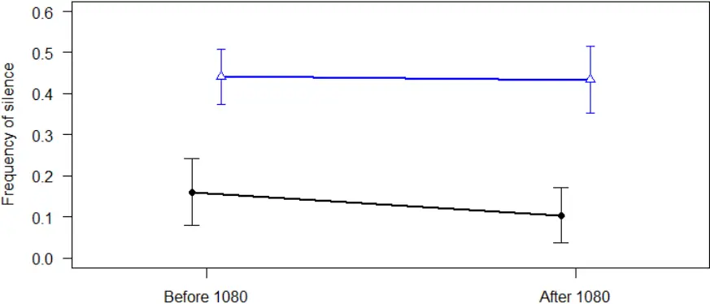

## Effect of 1080 on species-level changes in vocal conspicuousness estimates

A total of 27 bird taxa were detected across all counts. Nine of these taxa were present in at least half of both the treatment and non-treatment sites and recorded as present in at least 1% of all 10 second sub-samples (across all counts) and thus determined to be appropriate for statistical analyses. Before applying the Holm-Bonferroni correction, seven of these nine taxa showed no evidence for an interaction between time and treatment (Figure 13). After the Holm-Bonferroni correction had been applied all species showed no evidence for an interaction. The two species that did show a significant interaction between time and treatment before the Holm-Bonferroni correction was applied were tomtit (Petroica macrocephala) and whitehead (Mohoua albicilla).

In treatment sites, tomtits experienced a decline in mean vocal conspicuousness from 0.14 to 0.07 whereas in non-treatment sites the opposite trend was observed; mean vocal conspicuousness was higher after the 1080 drop (0.13) than before (0.077) (Figure 13). The interaction between time and treatment was significant before the Holm-Bonferroni correction (P = 0.009) but borderline significant after it was applied (P = 0.081). When excluding Waihora North the interaction was still significant (P = 0.012).

In contrast, whiteheads (in treatment sites) were more vocally conspicuous after the 1080 drop (0.15) compared to before (0.035) (Figure 13). In non-treatment sites they also increased but to a lesser extent from a vocal conspicuousness of 0.039 before the 1080 drop and 0.066 after. The interaction between time and treatment was significant before the Holm-Bonferroni correction (P = 0.034) but was insignificant after it was applied (P = 0.27). When excluding Waihora North the interaction was still significant (P = 0.045).

Figure 13: Vocal conspicuousness estimates for nine bird taxa before after an aerial 1080 operation in treatment (black lines) and non-treatment sites (blue lines). Vocal conspicuousness estimates are represented by a single mean value (+/- S.E.). P-values (2.s.f.) are from permutation tests which were used to test the significance of an interaction between time and treatment (all p-values displayed here are before the Holm-Bonferroni correction was applied and were calculated using the full data-set).

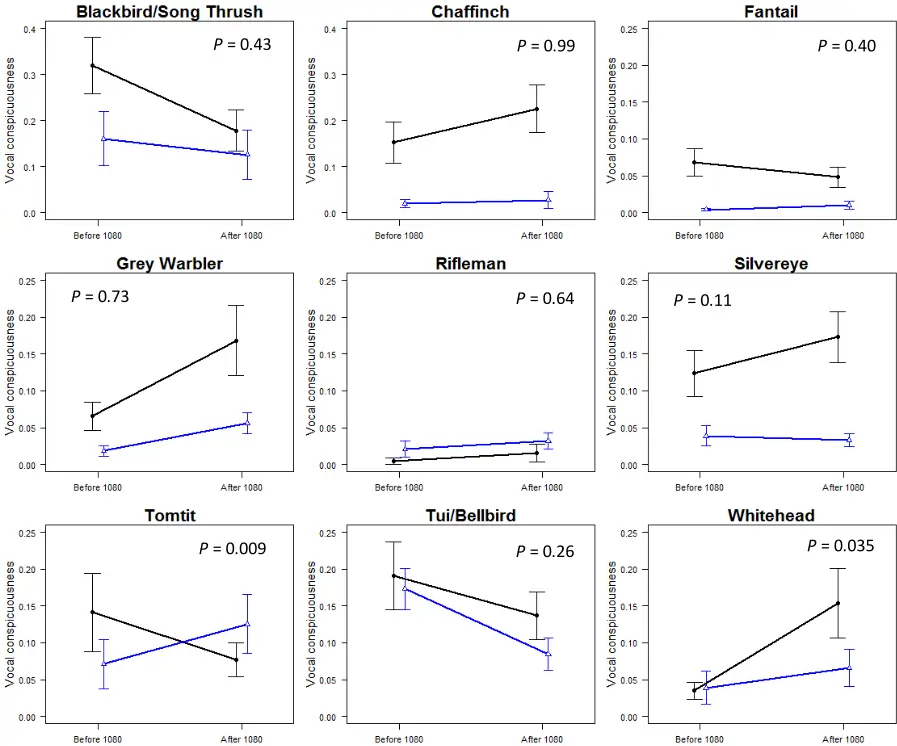

## 3.5 DISCUSSION

## Changes in community-level and species-specific birdsong parameters

Contrary to anecdotal claims that suggest forests 'fall silent' following aerial 1080 operations {Graf, 2009; Slater, 2015} I found no evidence for a decline in community-level birdsong parameters after an aerial 1080 operation in the Aorangi Forest Park. Both community-level birdsong parameters I measured (mean bird conspicuousness and the frequency of silence) showed no evidence of a change in the treatment sites and similar trends were observed over the same period in non-treatment sites. This corroborates with recent research by Greene, Dilks, Westbrooke, and Pryde (2013) and Schadewinkel et al. (2014) which found no discernible negative impact of two separate aerial 1080 applications on a selected range of

native birds. Community-level birdsong parameters could potentially mask species-level responses to 1080, therefore I also undertook species-specific analyses to determine whether this was the case. I found that eight out nine bird taxa showed no evidence for a decline in vocal conspicuousness in response to the aerial 1080 operation. Tomtits were the single species that did exhibit a decline in vocal conspicuousness after the 1080 operation relative to changes in conspicuousness in the non-treatment sites, though the result did become statistically insignificant after applying a Holm-Bonferroni correction. In treatment sites, tomtits experienced a decline in mean vocal conspicuousness from 0.14 to 0.07 whereas in non-treatment sites the opposite trend was observed; mean vocal conspicuousness was higher after the 1080 drop (0.13) than before (0.08). The increase in vocal conspicuousness of tomtits in non-treatment sites was expected given that they generally become more vocally active moving from winter to spring (Michaux, 2009). Tomtits are known to be at risk of being poisoned during aerial 1080 operations (Powlesland

et al., 2000; Veltman &amp; Westbrooke, 2011; Westbrooke et al., 2003). However, if the observed decline in vocal conspicuousness was real, and thus potentially indicating a population reduction, this is unexpected given work done by Westbrooke and Powlesland (2005) which suggested that cereal bait operations with low sowing rates (like the operation in this study) have little, if any, negative impact on tomtit populations.

However, given my goal was to determine whether forests 'fall silent' after aerial 1080 operations - rather than to directly measure changes in populations directly - I can only make tentative inferences at the population-level because population density is not always necessarily positively correlated with population density. For instance, a population reduction event could be masked by an increase in the vocal activity of remaining birds as a result of attempts to establish new territories (vacated by deceased individuals) or create new pair bonds (when one individual in a pair is killed). Whiteheads were the single species that exhibited a significant increase in vocal conspicuousness after the 1080 operation relative to non-treatment sites; though this effect became insignificant after applying a Holm-Bonferroni correction. If this increase in vocal conspicuousness was real, it is unlikely that it was caused by an increase in population density as the monitoring period (1-8 weeks after the 1080 operation) would not have been sufficient to recruit vocally-active individuals into the population. Additionally, whiteheads are small birds and are unlikely to have moved or dispersed into the treatment sites during the monitoring period. Birds in pest-free environments, such as those on New Zealand's offshore islands, tend to be more confident and conspicuous. The increase in whitehead conspicuousness in the treatment sites after the aerial 1080 operation, if real, could potentially represent a behavioural response to a reduction in the density of their main predators. Though, factors other than the aerial 1080 operation could also have been responsible for the change in vocal

conspicuousness observed in treatment sites.

## Silent forests

In most of New Zealand's backcountry forest where pest control is not undertaken, pest mammal densities are high and bird densities are low; therefore they are often described as being silent and devoid of birdsong (Wilson, 1997). For this reason, anecdotal claims that forests are silent after aerial 1080 operations could originate from the fact that New Zealand's unmanaged forests are relatively quiet in general, not because of incidental poisoning, but because bird populations are already low due to suppression by introduced mammals. However, claims are made that forests fall silent. This implies that there was more birdsong before the poisoning operation than after - my data does not support this claim.

## Advantages of the bioacoustic approach over traditional in situ methods

Many studies have used traditional point counts, such as five-minute bird counts (Dawson &amp; Bull, 1975), to assess changes in bird communities after 1080 operations (Miller &amp; Anderson, 1992; Pierce &amp; Montgomery, 1992; Spurr, 1991). Traditional five-minute bird counts simultaneously measure both the vocal and visual conspicuousness of bird species. However, the bioacoustic approach enabled me to look solely at changes in vocal conspicuousness to allow a more direct test of whether the level of birdsong declines after 1080 operations.

There are a number of other important advantages of the bioacoustic approach used in this study which give veracity to the findings. Firstly, when scoring audio recordings I was unaware of whether they came from before or after the aerial 1080 operation, or whether they came from a treatment or non-treatment site. Inherent biases can affect in situ monitoring, especially so in this case, given that 1080 is a controversial tool and predisposed assumptions regarding its use could influence the outcome of bird counts. The bioacoustic approach reduced the risk of any such inherent biases influencing the results. Secondly, in situ bird monitoring methods are often influenced by intra- and inter-day variability in bird conspicuousness because it is logistically difficult to conduct simultaneous bird counts. Using a bioacoustic approach meant that all bird counts were conducted at the same time of day across all sound recording devices. Thirdly, any temporal biases associated with changes in listener/observer ability overtime were counteracted by scoring audio recordings in a random order. By utilising a similar experimental design as described in this chapter, I suggest further studies should be undertaken during multiple aerial 1080 operations in a range of different forest types to further improve our understanding of how birds (and consequently birdsong) respond to aerial 1080 applications. Also, by monitoring in both treatment and nontreatment sites I could differentiate between changes in birdsong brought about by the aerial 1080 operation and changes that were simply due to seasonal and environmental effects.

## Conclusion

I found no evidence of the Aorangi Forest's bird community falling silent in the two months following an aerial 1080 operation in 2014. This goes against the anecdotal theory that forests are more silent in the days and months after 1080 drops than before. Eight out of nine taxa showed no significant decline in vocal conspicuousness after the 1080 drop. One species

(tomtit) did show a decline in vocal conspicuousness but the significance depended on whether a correction was made for multiple comparisons.

49

Man or machine? Comparing manual and automated methods for detecting tomtit (Petroica macrocephala) vocalisations from audio recordings

## 4.1 ABSTRACT

The automated detection of target species' vocalisations from audio recordings offer potential benefits over manual scoring methods. However, automated detectors often struggle in acoustically complex environments and it is unclear how well correlated the acoustic indices generated from these two methods are. In this chapter, I describe the development of a detector that automatically extracted tomtit (Petroica macrocephala) calls from audio recordings (n = 95) taken from a set of 24 sound recording devices spread across four sampling regions in the lower North Island of New Zealand. This raw count data was then converted into presence-absence form to allow direct comparison with manual presence-absence scoring methods. I also compared its performance among sampling regions and attempted to determine whether the presence of other bird species, or weather variables, could explain variation in the precision of the detector. I ran the automated detector on the same sample of audio recordings as used in Chapter Three (n = 232, duration = 40 mins) to determine whether the calling rate of tomtits declined after an aerial 1080 operation. I found that the data from the automated method were significantly positively correlated with the manual method (r = 0.84, df = 93, P &lt; 0.0001) but performed significantly differently among sampling regions (X 2 = 101.13, df = 9, P &lt; 0.0001). Neither weather variables nor the conspicuousness of other bird species were found to be significant predictors of the detector's precision and the detector found no evidence for a decline in tomtit calling rates following the 1080 drop. Given that the automated method failed to elucidate a potentially real effect of 1080 on the vocal conspicuousness of tomtits, I propose that using automated methods is not currently an appropriate approach for answering management-level questions for tomtit populations. Given that tomtits are a species more suited to automated detection than most, given their low call repertoire, it is likely that this is also the case for many of New Zealand's other endemic passerines.

## 4.2 INTRODUCTION

In recent years electronic bioacoustic methods have become an increasingly popular way to monitor birds (Acevedo &amp; Villanueva-Rivera, 2006; Bardeli et al., 2010). Though given the ease of collecting audio recordings, and the substantial expert time required to manually score them, bioacoustic monitoring projects often end up with an overwhelming amount of data. For projects targeting single-species, automated sound recognition software potentially offer cost- and time-effective ways of utilising large datasets (Bardeli et al., 2010). However, automated species detection techniques can often struggle in multi-species monitoring projects with acoustically complex field recordings and it is often difficult to minimise the number of false-positive and false-negative detections (Bardeli et al., 2010). Therefore manual scoring methods also remain a popular method for extracting relevant population-level parameters from audio recordings (Swiston &amp; Mennill, 2009; Wimmer, Towsey, Roe, &amp; Williamson, 2013). Given that both manual and automated methods are still being widely used, questions must be raised as to how the two methods relate to one another. In this chapter I describe the development of a detector that automatically extracted tomtit (Petroica macrocephala) calls from audio recordings taken from a set of 24 sound recording devices spread across four sampling regions in the lower North Island of New Zealand. I converted the raw count data into presence-absence form to allow direct comparison with the manual presence-absence scoring methods used in Chapters Two and Three. With this

data I aim to:

1. Determine whether the automated detector generates vocal conspicuousness estimates which are well correlated with those produced via manual scoring.
2. Determine whether the automated detector performs differently among sampling regions.

3. Determine whether the outcome from aims one and two are influenced by excluding false positive detections.
4. Determine whether weather conditions or the presence of other birds could explain variability in the precision of the detector.
5. Compare time expenditure between manual and automated methods.

I then ran the detector on the same sample of audio recordings as used in Chapter Three. With this data I aim to:

6. Use the detector to determine whether tomtit calling rates declined following an aerial 1080 operation.

## 4.3 METHODS

## Study design

Using pattern recognition technology I developed a detector (described below) that automatically extracted tomtit calls from audio recordings (n = 95) taken from a set of 24 sound recording devices. I converted the raw count data into presence-absence form to allow direct comparison with manual presence-absence scoring methods. I also compared its performance among sampling regions and attempted to determine whether the presence of other bird species, or weather variables, could explain variation in the precision of the detector. I ran the automated detector on the same sample of audio recordings as used in Chapter Three to determine whether the calling rate of tomtits declined after an aerial 1080 operation.

## Field site descriptions

The study sites used in this chapter are the same as used in Chapters Two and Three. The differences among regions are important to this chapter so descriptions are repeated here with some more information about differences in bird communities:

Region 1: Aorangi Forest Park (number of sound recording devices = 12)

The state administered Aorangi Forest Park (19 380 ha approx.) straddles the Aorangi Range at the south-eastern corner of the North Island, New Zealand (Figure 14). The forest consists of a range of mixed-broadleaf and beech (Wardle, 1967). It had a mean bird conspicuousness of 0.049 - the highest among the four regions (mean bird conspicuousness is an aggregate measure of bird abundance and diversity; see Chapter Three for a description of how it is calculated). Region 2: Orongorongo, Rimutaka Forest Park (number of sound recording devices = 6) The Orongorongo and Wainuiomata water catchment area is situated in the Rimutaka range approximately 20 km west of the Aorangi range (Figure 14). The sound recording devices were located in the centre of the area on a ridge to the west of the Orongorongo River. The forests consists of mixed beech broadleaf forest at higher altitudes and mixed podocarpbroadleaf forest at lower altitudes. It had a mean bird conspicuousness score of 0.016. Region 3: Waiohine-Tauherenikau, Tararua Forest Park (number of sound recording devices = 3) The Tararua Forest Park (116 535 ha) encompasses the Tararua range and is approximately 35 km north-west of the Aorangi range (Figure 14). The Waiohine-Tauherenikau area is located in the south-east of the park and consists of mixed beech-broadleaf forest with some emergent podocarps. It had a mean bird conspicuousness score of 0.011 - the lowest of all four sampling regions. Region 4: Tora Bush (number of sound recording devices = 3) Tora bush is located a few kilometres east of the Aorangi range (Figure 14). Tora Bush is separated from the Aorangi Forest Park by the Opouawe river valley. It mostly consists of

manuka/kanuka-broadleaf forest. It had a mean bird conspicuousness score of 0.042.

Figure 14: Location of study sites (squares) across the lower North Island, New Zealand. Each sampling region is represented by a coloured polygon - blue polygon = Tora Bush, grey polygon = Aorangi Forest Park, green polygon = Orongorongo (Rimutaka Forest Park) and yellow polygon = Waiohine-Tauherenikau (Tararua Forest Park).

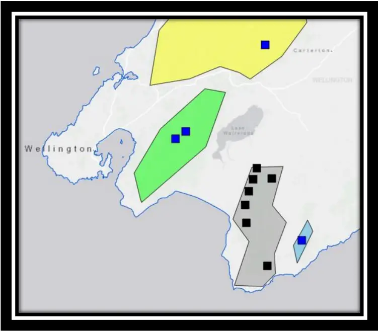

## Study species

Tomtits (Figure 15) are small insectivorous passerines endemic to New Zealand and have been identified as potentially good indicators for the effectiveness of pest control programmes (Michaux, 2009). They also have a small call repertoire which makes them a good candidate for automated call recognition.

Figure 15: Male tomtit (Baars, 2012). Accessed from http://nzbirdsonline.org.nz/species /tomtit.

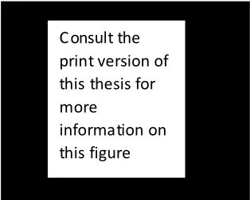

## Recording sound

Each device was programmed to record for 40 minutes once a day (0800 - 0840) for a period of at least 3 months in the same way as described in Chapters Two and Three.

## Selecting audio recordings

To assess aims one, two &amp; three a total of four audio recordings were taken from each recording device. One recording failed so this gave a total of 95 (Aorangi = 48, Rimutaka = 24, Tararua = 12, Tora = 12).

To assess aims four and six a further 137 audio recordings were analysed (giving a total of 232). This was the same sample as used in Chapter Three. For more detail on how these recordings were chosen see Chapter Three.

## Automated scoring of audio recordings

I used Song Scope 4.1 software (Wildlife Acoustics Inc.) to automatically detect male tomtit vocalisations in audio recordings (Figure 16). Song Scope's features enable the drawing of squares (i.e. annotations) around a sample of vocalisations of a target species. Using these annotations, the software then employs pattern technology to 'learn' the unique characteristics of the target species' vocalisations and generate an automated detector. The detector can then be run on a sample of audio recordings and a list of potential tomtit vocalisations are extracted. Inevitably, not all extracted vocalisations will be actual tomtit vocalisations. Therefore, every extracted vocalisation (n = 3607) was visually and/or aurally assessed to determine whether it was a true tomtit vocalisation (i.e. a true positive detection) or something else (i.e. a false positive detection). The data was then split into two datasets, one dataset contained all extracted vocalisations (regardless of whether they were true positive or false positive detections) and the other dataset excluded all false positive detections. This was done so that I could determine whether analyses were affected by the inclusion of false positive detections.

The detector was created using a total of 116 annotations of male tomtit vocalisations. Annotations were taken from across all sampling regions to reduce any effect regional differences in vocalisations would have on the detection process.

Figure 16: Spectrograph of a male tomtit vocalisation. This vocalisation was taken from Tora Bush.

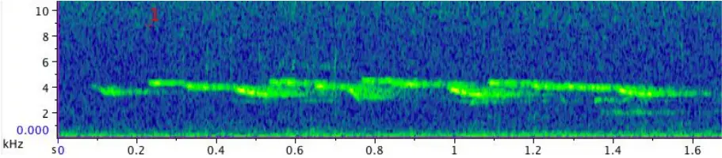

Various parameters can be adjusted to change the sensitivity and specificity of the detector. In this case, initial detectors were run on several audio recordings - in each instance parameters were adjusted in an attempt to improve balance between sensitivity and specificity. The top performing detector was then used in this study (see Appendix Five for the details of its settings).

## Converting automated count data into presence-absence form

To allow direct comparison with the manual presence-absence scoring method outlined in Chapter Two and Chapter Three, I converted the raw count data (which was produced by the automated detector) into presence-absence form. To do this, the automated detector was run on the exact same five minutes (i.e. 30 x 10 sec sub-samples) from each of the 95 audio recordings that was scored using the manual method. Tomtits were scored as present if one or more tomtit vocalisations was automatically detected in a sub-sample. If no tomtit vocalisations were detected then it was scored as absent. A vocal conspicuousness score for each count was then calculated for tomtits by taking the proportion of sub-samples in which tomtit were recorded as present. Manual vocal conspicuousness scores were generated for tomtits using the presence-absence method outlined in Chapter Two.

Any approach in automated bioacoustics is of little merit if the predictions cannot be assessed for their accuracy (Verbyla &amp; Litvaitis, 1989). By converting the raw count data into presenceabsence form, each 10 sec sub-sample was able to be scored as a true positive, false positive, true negative or false negative detection, relative to manual listening which was assumed to always produce 'true' results. I was then able to calculate the true-positive rate (sensitivity), true-negative rate (specificity), false positive rate (type I error) and false negative rate (type II error) of the detector. The definition and formulas are given below:

True positive detection (TP) - a 10 second sub-sample where a tomtit vocalisation was detected with both the manual and automated methods.

False positive detection (FP) - a 10 second sub-sample where a tomtit vocalisation was automatically detected but not manually detected.

True negative detection (TN) - a 10 second sub-sample where a tomtit vocalisation was neither automatically nor manually detected.

False negative detection (FN) - a 10 second sub-sample where a tomtit vocalisation was manually detected but not automatically detected.

Sensitivity (true positive rate) = (number of TP detections) / (number of TP detections + number of FN detections).

Specificity (true negative rate) = (number of FP detections) / (number of FP detections + number of TN detections).

Type I error (false positive rate) = (number of FP detections) / (number of FP detections + number of TN detections).

Type II error (false negative rate) = (number of FN detections) / (number of FN detections + number of TP detections).

## Details of 1080 operation

This chapter refers to the same 1080 operation referred to Chapter Three and Appendix Four.

## Statistical analysis

## Comparing manual listening with automated detection

Initially a Spearman's rank correlation coefficient was calculated to determine the relationship between the number of true positive tomtit vocalisations per 40 minute audio recording (as predicted by the automated detector) and the vocal conspicuousness scores estimated by the manual method. Then, to allow more direct comparison between methods, a Spearman's rank correlation coefficient was calculated to determine the relationship between vocal conspicuousness scores generated by both the manual and automated methods. The correlation coefficient calculated when using all automated detections (true and false positive) was compared to that calculated when excluding false positives to determine whether false positive detections were affecting the relationship between the two methods. A Wilcoxon signed rank test was used to determine whether there was a significant difference in vocal conspicuousness estimates generated between methods. A standardised-major axis regression was also undertaken using the lmodel2 package in R version 3.2.3 (R Development Core Team 2015) and the regression line was plotted on scatterplots to visualise the relationship between the two methods. A 1:1 line was also plotted to represent a hypothetical perfectly performing detector (i.e. sensitivity = 1, specificity = 1). Comparing performance of the automated detector among regions and determining predictors of detector precision Like human observers, the automated analysis of bioacoustic data is influenced by abiotic noise (i.e. wind and rain) and the noise of non-target vocal bird species (Bardeli et al., 2010) (Bardeli, 2010). Therefore the performance of detectors often varies according to the acoustic environment from which the audio recordings are sourced (Borker et al., 2014). For instance, recordings taken in species-poor environments where the targeted species is common are likely to generate higher likely to be more sensitive as there is less to 'confuse' the automated detector. Therefore, to quantitatively assess whether the detector performed differently among the four regions, I collectively compared the true positive, false positive, true negative and false negative rates using a chi-square test. This method accounts for differences in sample sizes among regions. I then used two binomial regression models to determine whether any abiotic or biotic variables could explain variability in the precision (number of true positive detection/ number of true positive detection + number of false positive detection) of the detector. The first model contained three weather variables (mean 24 hr wind speed, total 24 hr rainfall and maximum 24 hr wind gust). Weather data was collected from three local weather stations

(for more detail see Appendix Two). A separate model contained the conspicuousness scores for the eight most frequently detected bird taxa as predictor variables. Audio recordings where a tomtit vocalisation was not detected (regardless of whether it was a false positive) were not included in this analysis.

## Determining whether tomtit calling rates changes in relation to an aerial 1080 application

I fitted a poisson mixed effects model using the glmer function of the lme4 R package, similar to that used in Chapter Three. However, in this instance I used the total number of automatically detected true positive tomtit vocalisations per count (i.e. number of calls per 40 minutes) as the response variable. Separate models were fitted for the two automated data sets and were compared to determine whether exclusion of false positive detections influenced the outcome of the analysis. Due to potentially unrecorded differences among recording devices, sites, regions and the date, each of their corresponding variables were fitted as random effects (see Chapter Three for more details).

I was interested in whether the model returned a significant interaction between treatment and time. A significant interaction would suggest that the change in the calling rate of tomtits from pre-1080 to post-1080, in the treatment sites, was significantly different to the change in the call rate of tomtits, over the same time period, observed in the non-treatment sites. I was specifically interested in whether there was a decline in treatment sites relative to nontreatment sites (this would suggest that tomtits suffered a population reduction as a result of the 1080 operation).

An ANOVA (type III) was conducted to generate a chi-square value for the interaction term. Then, to test the significance of the interaction term I applied a permutation test (number of permutations = 1000). This determined the likelihood of obtaining a test statistic as extreme, or more extreme, than the one observed due to chance alone. By using a non-parametric test I made no assumptions about the underlying distribution of the data.

## 4.4 RESULTS

## Comparing manual listening with automated detection

The number of true positive tomtit vocalisations per 40 minute audio recordings (as predicted by the automated detector) was significantly positively correlated with the vocal conspicuousness scores estimated by the manual method (r = 0.62, df = 230, P &lt; 0.0001) (Figure 17).

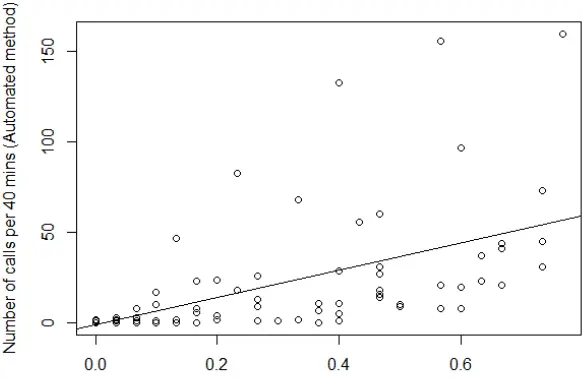

Vocal conspicuousness (Manual method)

Figure 17: A comparison between the number of true positive tomtit vocalisations per 40 minute audio recordings (as predicted by the automated detector) and the vocal conspicuousness scores estimated by the manual method.

The automated detector generated vocal conspicuousness estimates that were significantly positively correlated with the manual method (Figure 18). When including both true and false positive detections there was a highly significant positive correlation with the manual method (r = 0.78, df = 93, P &lt; 0.0001). However, vocal conspicuousness estimates generated using the automated method were significantly lower when using the manual method (Wilcoxon signed rank test: V = 254.5, P = 0.005).

When false positive detections were excluded the strength of the relationship improved (r = 0.84, df = 93, P &lt; 0.0001). Though, across all counts, the automated detector generated mean vocal conspicuousness estimates 69.6% lower than the manual method (when excluding false positives).

Figure 18: A comparison between tomtit vocal conspicuousness scores when using two different scoring methods. Vocal conspicuousness scores were generated by measuring the proportion of 30 ten-second audio samples where a tomtit call is detected from a 30 minute audio recording. The manual method (y-axis) involved manually listening to audio recordings whereas the automated method (x axis) used pattern recognition technology to automatically detect tomtit vocalisations. Graph (a.) includes true positive and false positive detections, graph (b.) excludes all false positive detections. The black line represents a 'perfect' relationship between the two methods (slope = 1, intercept = 0,0), the red line is a SMA regression line and therefore represents the actual relationship between the methods (blue dotted lines = 95 % C.I.).

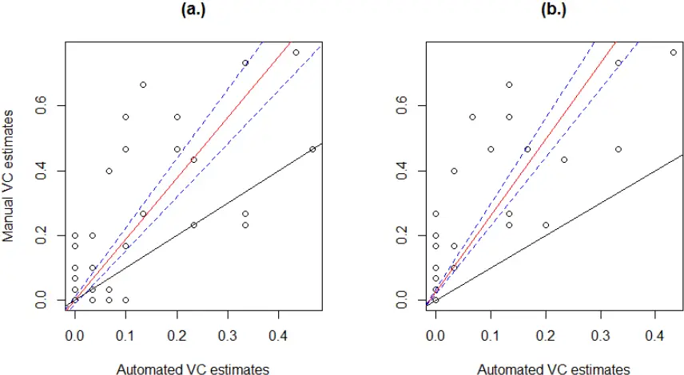

## Comparing performance of automated detector among regions

There were very few false positive detections in the Tararuas and Rimutakas but the overall number of detections was far lower in these regions (Table 3). Overall, true negative detections were by far the most frequent detection, which is to be expected given that subsamples were only 10 sec long and tomtit were rare at some sites.

Table 3: The number of true positive (TP), false positive (FP), true negative (TN) and false negative (FN) detections for an automated tomtit detector across four separate sampling regions. 30 minute audio recordings (n = 95) were split into 30 separate 10 second subsamples. The presence or absence of sounds identified as tomtit vocalisations within each sub-sample (n=2850) was determined using the automated detector and compared to results generated by a manual listening method. The total number of minutes of audio recording analysed in each region is also provided.

| Region              | TP  | FP  | TN   | FN  | Total |
| ------------------- | --- | --- | ---- | --- | ----- |
| Aorangi (235 mins)  | 40  | 51  | 1203 | 116 | 1410  |
| Rimutaka (120 mins) | 10  | 0   | 696  | 14  | 720   |
| Tararua (60 mins)   | 7   | 1   | 334  | 18  | 360   |
| Tora (60 mins)      | 21  | 5   | 301  | 33  | 360   |
| Total               | 78  | 57  | 2534 | 181 | 2850  |

When looking at all performance criteria (TP, FP, TN and FN rates), the automated detector performed significantly differently amongst regions (X 2 = 101.13, df = 9, P &lt; 0.0001). The automated detector performed most poorly in the Aorangi; the true positive rate was lower than all other regions and the false negative and false positive rates were higher than all other regions (Figure 19).

Figure 19: The respective true positive rates, false positive rates, true negative rates and false negative rates for an automated tomtit detector across four separate sampling regions. 30 minute audio recordings (n= 95) were split into 30 separate 10 second sub-samples. The presence or absence of tomtit vocalisations within each sub-sample (n=2850) was determined using the automated detector and compared to results generated by manually listening.

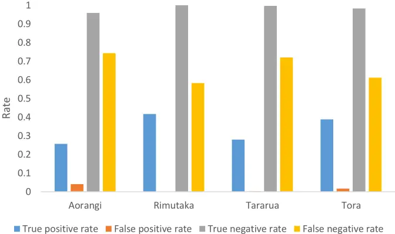

## Determining predictors of detector precision

Overall, the automated detector identified 3613 sounds as tomtit calls from the full sample of 232 audio recordings (total duration = 154.7 hrs). Of these supposed tomtit vocalisations, 1641 were true positives giving a precision score of 45.54%. None of the weather variables (mean 24 hr wind speed, total 24 hr rainfall and maximum 24 hr wind gust) were found to be significant predictors of the precision of the detector (Table 4). Similarly, no particular bird species were significant predictors, though they all had negative coefficients suggesting that there may be some weak negative relationship between bird conspicuousness and detector precision that was unable to be identified in this analysis (Table 4).

Table 4: The two binomial regression models predicting the precision of the automated detector

| Covariates            | Estimate | Std. Error | P    |
| --------------------- | -------- | ---------- | ---- |
| Blackbird/Song Thrush | -0.2     | 0.6        | 0.71 |
| Chaffinch             | -1.3     | 1.2        | 0.26 |
| Fantail               | -0.7     | 3          | 0.82 |
| Grey Warbler          | -1.8     | 1.7        | 0.31 |
| Rifleman              | -2.3     | 4.3        | 0.6  |
| Silvereye             | -2.4     | 1.9        | 0.2  |
| Tui/Bellbird          | -0.7     | 1.1        | 0.52 |
| Whitehead             | -0.5     | 1.3        | 0.71 |
| Wind                  | -0.3     | 0.05       | 0.5  |
| Rain                  | -0.2     | 0.24       | 0.31 |
| Max Gust              | 0        | 0.02       | 0.83 |

## Determining whether tomtit calling rates change in relation to an aerial 1080 application

When including both true positive and false positive detections there was no evidence for a significant interaction between time and treatment (P = 0.64). When false positive detections were excluded the interaction remained insignificant (P = 0.81). Therefore, the automated method did not provide corroboratory evidence to the results generated using the manual scoring technique (see Chapter Three), which found evidence that tomtits became less vocally conspicuous after the aerial 1080 operation.

## Comparison of time expenditure

The manual analysis of a five minute audio recording took approximately 20 minutes (though this varied according to the number of species and individuals vocalising). The automated method took approximately 30 seconds to analyse a 5 minute recording on a 2 x 2.4 GHz Quad-Core computer and took approximately 40 hours to develop the automated detector. However, manual scoring was undertaken simultaneously for all species and was not specifically targeting tomtits, it is likely that manually scoring audio recordings for a single species would have been substantially faster.

## 4.5 DISCUSSION

## Comparing manual listening with automated detection

The automated detector generated vocal conspicuousness estimates that were positively correlated with the manual scoring method and, as expected, removing false positive detections increased the strength of the relationship. However, the automated method was considerably less precise generating vocal conspicuousness estimates 69.6 % lower than the manual method. Similar studies by Digby, Towsey, Bell, and Teal (2013) and Swiston and Mennill (2009) also found that automated methods were much less precise than manual methods though they did not compare how well correlated the two methods were. The significant positive correlation between the methods, though not exceptionally tight, provides evidence that acoustic indices generated from either method could be compared with some confidence. It is important to note that the way in which these two methods correlate is likely to be species-specific. Automated bioacoustic methods are well suited to species such as tomtit that have low call variability. For bird species with more diverse vocalisations (i.e. tui) the detector is likely to perform more poorly and this could reduce the strength of the relationship between the methods. Predictors of detector precision and comparing its performance among regions I found that the detector performed significantly differently among sampling regions. This highlights the importance of assessing the performance of detectors in relation to the spatial and/or temporal origin of audio recordings so that adjustments can be made for variability in its performance. There are a number of factors that could have driven the variation in detector performance that I observed. Firstly, though I did not find bird conspicuousness to be negatively correlated with precision,

it is easy to see how it could be. When there are more birds present (individuals and species) the likelihood of target calls overlapping with non-target calls increases. Detection software generally struggles to resolve overlapping calls (Digby et al., 2013) and thus reduces its performance. In general, this problem reduces the effectiveness of automated methods in areas of high population density where the calling rate of a target species may be underestimated. In this study, the Aorangi region had a considerably more vocally conspicuous bird community than other regions - it also had the least sensitive detector with the highest level of type I and type II error. Therefore it is possible that unmeasured differences in bird communities (in terms of species make-up and number of individuals) were Secondly, I was also unable to discern any relationship between weather (rainfall, mean wind speed and maximum gust) and the precision of the detector. However, I was limited to using a total of only three weather stations, two of which provided data for a single region and the other provided data for two regions (Tora and Aorangi). Automated approaches, like manual methods are influenced by wind, rain and other noise that reduces the signal:noise ratio (Borker et al., 2014). Therefore, I expect that if weather data had been more closely tied to individual sound recorders, wind and rain would be significantly negatively correlated with detector precision. Similarly to Borker et al. (2014), I suggest that further research is required to: (1) understand the relationship between soundscape properties (such as wind and rain) and detection rates/detector performance and then (2) develop a framework to account for The true positive rate of our detector across all regions (30.1 %) was slighter higher than in studies where cross-correlation detectors were used. Swiston and Mennill (2009) reported 17 % and 24 % for detecting separate woodpecker noises, while Charif and Pitzrick (2008) reported a true positive rate of 22 % for detecting Cerulean Warbler (Setophaga cerulea) songs (Borker et al., 2014). Though, a study by Buxton and Jones (2012) using Song Scope driving differences in the precision of the detector. variability in soundscape properties. software reported higher true positive rates ranging from 56 % to 69 %. Comparison of time expenditure The automated analysis of audio recordings was 40 times faster but considerably less precise than using manual scoring methods. Therefore comparing methods involves a cost-benefit analysis in which the benefit of more rapid analysis of audio recordings (and therefore potential for more audio recordings to be analysed overall) must be weighed-up against the cost of reducing detection precision. Though, given that substantial time is required to develop the detector (40 hours approx. in our case), it would be more efficient to use a manual scoring method when analysing smaller sets of audio recordings, whereas automated methods provide a way of utilising larger datasets In this study, manual scoring was undertaken for all bird species and was not specifically targeting tomtits. It is likely that manually scoring audio recordings for a single species would be substantially faster than for multiple species and thus my time expenditure comparison may be overestimating the time required for manual methods in single species studies. However, I have also underestimated the value of the automated methods as I could have run the detector on a larger sample of audio recordings, because most of the work required is involved with developing the automated detector and not analysing audio recordings. I restricted the sample size of audio recordings to the same sample used in Chapter Three to allow a direct comparison between methods. Though, the greater efficiency of the automated method could be easily utilised by sampling more audio recordings and, in turn, could reduce temporal biases and allow longer-term trends to be identified (Digby et al. 2013). Determining whether tomtit calling rates change in relation to an aerial 1080 application Tomtits can suffer mortality as a result of aerial 1080 operations (Powlesland et al., 2000; Veltman &amp; Westbrooke, 2011; Westbrooke &amp; Powlesland, 2005). However, the automated detector found no evidence for a reduction in tomtit calling rates following the poison operation. This does not corroborate with the outcome of the analysis in Chapter Three which used a manual scoring method on the same dataset and found evidence for a decline in the vocal conspicuousness of (though the significance of the result depended on whether a correction was made for multiple comparisons). It is unclear which method (manual or automated) correlates most closely with population manual presence-absence methods) or calling rates (derived from automated methods), and density and thus it is hard to determine which analysis is more reliable when making inferences at the population level. I propose that future work should investigate the relationship between acoustic indices, such as vocal conspicuousness estimates (derived from the density of bird populations.

## Feasibility of using automated detection methods to answer management-level questions

The automated method did not corroborate with the manual method when it was used to determine a management-level question (i.e. Did tomtit calling rates decline after an aerial 1080 operation and thus potentially suffer a population reduction event?) The automated method found no difference in tomtit calling rates after the aerial 1080 operation, whereas the manual method did. I assume that the manual method is the more trustworthy method, as false negatives are essentially non-existent, and therefore it is possible that the automated method has failed to elucidate a potentially real effect of 1080 on the vocal conspicuousness of tomtits. Therefore, I propose that using automated methods to analyse audio recordings is not currently a strong method for answering management-level questions for tomtit populations. Given that tomtits are a species more suited to automated detection than most, because of their low call repertoire, it is likely that this is also the case for many of New Zealand's other endemic passerines.

## CONCLUSIONS AND SYNTHESIS

Electronic bioacoustic techniques provide new and effective ways of monitoring birds and other taxa, and have a number of advantages over other traditional in situ bird monitoring methods (Acevedo &amp; Villanueva-Rivera, 2006; Steer, 2010). Given the increasing popularity of using bioacoustic methods to monitor birds, it is important that the most effective ways of manually scoring audio recordings are investigated. Automated methods have been touted as the future of bioacoustic monitoring. However, they have struggled to cope with the complexity of 'in-field' acoustic recordings and therefore the process of manually scoring

audio recordings remains particularly poignant. In Chapter Two, I described a novel approach (10 in 60 sec method) to manually scoring audio recordings and compared its performance with a current method. This comparison was done with the goal of developing a methodological approach to extracting relevant data from audio recordings that would allow the most reliable inferences when applied to answer 'real-life' ecological questions. I determined that using the 10 in 60 sec method decreased the variability of vocal conspicuousness estimates, significantly increased the total number of species detected per count and reduced temporal autocorrelation for a number of species. In short, the research in Chapter Two provides a formal methodological and statistical description of a novel bioacoustic monitoring technique. I suggest that, if adopted, this method could improve the ability to detect changes in bird conspicuousness and therefore improve the value of manual bioacoustic presence-absence counts to conservation managers and scientists alike. It is often anecdotally suggested that forests 'fall silent' following aerial 1080 operations.

However, it is difficult to objectively assess the validity of such anecdotal claims without quantitative information that addresses the claim specifically. The research outlined in Chapter Three utilises the methodological framework developed in Chapter Two to address this controversial conservation conundrum.

I calculated two community-level birdsong parameters and vocal conspicuousness estimates for nine native and exotic bird species using the 10 in 60 sec method. Through the use of a before-after/control-impact experimental design I was then able to assess whether the aerial 1080 operation caused any changes in these birdsong parameters. At the community level I found no evidence for a reduction in birdsong after the 1080 operation and eight out of nine bird taxa showed no evidence for a decline in vocal conspicuousness. Only one species (tomtit) showed evidence for a decline in vocal conspicuousness, though this became non-

significant after applying a Holm-Bonferroni correction. In most of New Zealand's backcountry forest where pest control is not undertaken, pest mammal densities are high and bird densities are low; therefore they are often described as being silent and devoid of birdsong (Wilson, 1997). For this reason, anecdotal claims that forests are silent after aerial 1080 operations could originate from the fact that New Zealand's unmanaged forests are relatively quiet in general, not because of incidental poisoning, but because bird populations are already low due to suppression by introduced mammals. However, claims are made that forests fall silent. This implies that there was more birdsong before the poisoning operation than after - my data did not support this claim. No published study that I could find has directly test the claim that forests fall silent after aerial 1080 operations. Importantly, this research also contributes to the heated public and scientific debate regarding the use of 1080 in New Zealand and its impact on native birds. In Chapter Four I used the tomtit as a case study species to determine the feasibility of using an automated detector on an endemic passerine in a New Zealand context and compared the automated analysis and manual analysis of audio recordings for this species. I then put the automated detector to practical use by running it on the same sample of audio recordings as used in Chapter Three, in an attempt to determine whether the call rate of tomtits declined after an aerial 1080 operation. I found that that vocal conspicuousness estimates and call rates generated using the automated method was considerably less precise. Given that the automated method failed

automated method were significantly positively correlated with the manual method but the to elucidate a potentially real effect of 1080 on the vocal conspicuousness of tomtits, I propose that using automated methods is not currently an appropriate approach for answering management-level questions for tomtit populations. Given that tomtits are a species more suited to automated detection than most, it is likely that this is also the case for many of New Zealand's other endemic passerines. However, as pattern recognition technology continues to improve automated methods are likely to become more viable in the future. At the present, I propose that a hybrid approach (which used automated detection technology to generate a list of candidate vocalisations that then could be manually verified) could be used to good effect. Most of the published work on automated detectors focuses on European and North American bird species (Bardeli et al., 2010). Work using automated detectors in New Zealand is rare. Therefore the research in Chapter Four provides a valuable insight into the usefulness of automated detectors within a New Zealand context. I could not find any published New Zealand research that used an automated detector to answer a biodiversity management level question and thus further justifying the importance of this research in this chapter. In its entirety, this thesis provides a formal methodological and statistical description of a novel bioacoustic monitoring technique which was then utilised to answer a controversial conservation conundrum: "do New Zealand forests 'fall silent' following aerial 1080 tomtits as case study to explore the relationship between the automated and manual analysis of audio recordings and determine the feasibility of using automated detection methods to operations?" It then offers a glimpse into the future of bioacoustic monitoring by using answer management-level questions.

## REFERENCES

Acevedo, M. A., &amp; Villanueva-Rivera, L. J. (2006). Using automated digital recording systems as effective tools for the monitoring of birds and amphibians. Wildlife Society Bulletin, 34(1), 211-214. Armitage, I. (2015). Silvereye. NZ Birds Online. from www.nzbirdsonline.org.nz Armstrong, D. P., &amp; Ewen, J. G. (2001). Estimating impacts of poison operations using markrecapture analysis and population viability analysis: an example with New Zealand robins (Petroica australis). New Zealand Journal of Ecology, 29-38. Armstrong, D. P., Perrott, J. K., &amp; Castro, I. (2001). Estimating impacts of poison operations using mark-recapture analysis: hihi (Notiomystis cincta) on Mokoia Island. New Zealand Journal of Ecology, 49-54. Baars, J. (2012). North Island tomtit, male. Retrieved from http://nzbirdsonline.org.nz/species/tomtit Bardeli, R., Wolff, D., Kurth, F., Koch, M., Tauchert, K.-H., &amp; Frommolt, K.-H. (2010). Detecting bird sounds in a complex acoustic environment and application to bioacoustic monitoring. Pattern Recognition Letters, 31(12), 1524-1534. Bas, Y., Devictor, V., Moussus, J.-P., &amp; Jiguet, F. (2008). Accounting for weather and time-of-day parameters when analysing count data from monitoring programs. Biodiversity and Conservation, 17(14), 3403-3416. Bates, D., Mächler, M., Bolker, B., &amp; Walker, S. (2014). Fitting linear mixed-effects models using lme4. arXiv preprint arXiv:1406.5823. Bibby, C. J. (1999). Making the most of birds as environmental indicators. Ostrich, 70(1), 81-88. Bioacoustics Research Program. (2011). Raven Pro: Interactive Sound Analysis Software (Version 1.4) [Computer software]. Ithaca, NY: The Cornell Lab of Ornithology. Available from http://www.birds.cornell.edu/raven. Borker, A. L., McKown, M. W., Ackerman, J. T., EAGLES-SMITH, C. A., Tershy, B. R., &amp; Croll, D. A. (2014). Vocal activity as a low cost and scalable index of seabird colony size. Conservation Biology, 28(4), 1100-1108. Brough, T. (1969). The dispersal of starlings from woodland roosts and the use of bio-acoustics. Journal of Applied Ecology, 403-410. Brown, K., Innes, J., &amp; Shorten, R. (1993). Evidence that possums prey on and scavenge birds' eggs, birds and mammals. Notornis, 40(3), 169-177. Buckland, S. T., Anderson, D. R., Burnham, K. P., &amp; Laake, J. L. (2005). Distance sampling: Wiley Online Library. Buxton, R. T., &amp; Jones, I. L. (2012). Measuring nocturnal seabird activity and status using acoustic recording devices: applications for island restoration. Journal of Field Ornithology, 83(1), 4760. Charif, R., &amp; Pitzrick, M. (2008). Automated detection of Cerulean Warbler songs using XBAT data template detector software: preliminary report. Cornell Lab of Ornithology, Bioacoustics Research Program Technical Report, 02-02. Collier, T. C., Kirschel, A. N., &amp; Taylor, C. E. (2010). Acoustic localization of antbirds in a Mexican rainforest using a wireless sensor network. The Journal of the Acoustical Society of America, 128(1), 182-189. Cowan, P., Chilvers, B., Efford, M., &amp; McElrea, G. (1997). Effects of possum browsing on northern rata, Orongorongo Valley, Wellington, New Zealand. Journal of the Royal Society of New Zealand, 27(2), 173-179. Davidson, R. S., &amp; Armstrong, D. P. (2002). Estimating impacts of poison operations on non-target species using mark-recapture analysis and simulation modelling: an example with saddlebacks. Biological Conservation, 105(3), 375-381. Dawson, D., &amp; Bull, P. (1975). Counting birds in New Zealand forests. Notornis, 22(2), 101-109.

Depraetere, M., Pavoine, S., Jiguet, F., Gasc, A., Duvail, S., &amp; Sueur, J. (2012). Monitoring animal diversity using acoustic indices: implementation in a temperate woodland. Ecological Indicators, 13(1), 46-54. Digby, A., Towsey, M., Bell, B. D., &amp; Teal, P. D. (2013). A practical comparison of manual and autonomous methods for acoustic monitoring. Methods in Ecology and Evolution, 4(7), 675683. Eason, C. (2002). Sodium monofluoroacetate (1080) risk assessment and risk communication. Toxicology, 181, 523-530. Efford, M. G., Dawson, D. K., &amp; Borchers, D. L. (2009). Population density estimated from locations of individuals on a passive detector array. Ecology, 90(10), 2676-2682. Elliott, G., &amp; Suggate, R. (2007). Operation Ark: three year progress report: Southern Regional Office, Department of Conservation. Engeman, R. M. (2005). Indexing principles and a widely applicable paradigm for indexing animal populations. Wildlife Research, 32(3), 203-210. Evans, W. R., &amp; Mellinger, D. K. (1999). Monitoring grassland birds in nocturnal migration. Studies in Avian Biology, 19, 219-229. Evans, W. R., &amp; Rosenberg, K. V. (2000). Acoustic monitoring of night-migrating birds: a progress report. Strategies for bird conservation: The Partners in Flight planning process, 1-5. Faanes, C. A., &amp; Bystrak, D. (1981). The role of observer bias in the North American Breeding Bird Survey. Figueroa, H., &amp; Robbins, M. (2008). XBAT: An open-source extensible platform for bioacoustic research and monitoring. Computational bioacoustics for assessing biodiversity (KH Frommolt, R. Bardeli, AND M. Clausen, eds.), 143-155. Ganchev, T., Potamitis, I., &amp; Fakotakis, N. (2007). Acoustic monitoring of singing insects. Paper presented at the Acoustics, Speech and Signal Processing, 2007. ICASSP 2007. IEEE International Conference on. Google Earth. (2015). Map of lower North Island. Retrieved June 2015, from https://www.google.com/earth/ Graf, C. (Writer). (2009). Poisoning Paradise. https://www.youtube.com/watch?v=yQRuOj96CRs Greene, T. C., Dilks, P. J., Westbrooke, I. M., &amp; Pryde, M. A. (2013). Monitoring selected forest bird species through aerial application of 1080 baits, Waitutu, New Zealand. New Zealand Journal of Ecology, 41-50. Gregory, R. D., &amp; Strien, A. v. (2010). Wild bird indicators: using composite population trends of birds as measures of environmental health. Ornithological Science, 9(1), 3-22. Hamel, S., Killengreen, S. T., Henden, J. A., Eide, N. E., Roed-Eriksen, L., Ims, R. A., &amp; Yoccoz, N. G. (2013). Towards good practice guidance in using camera-traps in ecology: influence of sampling design on validity of ecological inferences. Methods in Ecology and Evolution, 4(2), 105-113. Heywood, V. (1995). 1 Global Biodiversity Assessment. (Cambridge University Press, Cambridge) Holm, S. (1979). A simple sequentially rejective multiple test procedure. Scandinavian journal of statistics, 65-70. Innes, J., &amp; Barker, G. (1999). Ecological consequences of toxin use for mammalian pest control in New Zealand-an overview. New Zealand Journal of Ecology, 111-127. Innes, J., Nugent, G., Prime, K., &amp; Spurr, E. B. (2004). Responses of kukupa (Hemiphaga novaeseelandiae) and other birds to mammal pest control at Motatau, Northland. New Zealand Journal of Ecology, 73-81. King, A. P., West, M. J., Eastzer, D. H., &amp; Staddon, J. (1981). An experimental investigation of the bioacoustics of cowbird song. Behavioral Ecology and Sociobiology, 9(3), 211-217. King, C. M. (1984). Immigrant killers: introduced predators and the conservation of birds in New Zealand: Oxford University Press.

King, D., Kirkpatrick, W., Wong, D., &amp; Kinnear, J. (1994). Degradation of 1080 in Australian soils. Paper presented at the Proceedings of the Science Workshop on. Kogan, J. A., &amp; Margoliash, D. (1998). Automated recognition of bird song elements from continuous recordings using dynamic time warping and hidden Markov models: A comparative study. The Journal of the Acoustical Society of America, 103(4), 2185-2196. Laiolo, P. (2010). The emerging significance of bioacoustics in animal species conservation. Biological Conservation, 143(7), 1635-1645. Lambert, K. T., &amp; McDonald, P. G. (2014). A low-cost, yet simple and highly repeatable system for acoustically surveying cryptic species. Austral Ecology, 39(7), 779-785. Lindenmayer, D. B., &amp; Likens, G. E. (2009). Adaptive monitoring: a new paradigm for long-term research and monitoring. Trends in Ecology &amp; Evolution, 24(9), 482-486. MacKenzie, D. I. (2006). Occupancy estimation and modeling: inferring patterns and dynamics of species occurrence: Academic Press. Marques, T. A., Thomas, L., Martin, S. W., Mellinger, D. K., Ward, J. A., Moretti, D. J., . . . Tyack, P. L. (2013). Estimating animal population density using passive acoustics. Biological Reviews, 88(2), 287-309. Mellinger, D. (2002). Ishmael 1.0 user's guide NOAA Technical Memorandum: vol OAR-PMEL-120. National Oceanographic and Atmospheric Administration, Seattle. Michaux, B. (2009). Use of song to monitor North Island tomtits (Petroica macrocephala toitoi) at Atuanui, Mount Auckland. Notornis, 56(1), 40-43. Miller, C., &amp; Anderson, S. (1992). Impacts of aerial 1080 poisoning on the birds of Rangitoto Island, Hauraki Gulf, New Zealand. New Zealand Journal of Ecology, 103-107. Moran, M. D. (2003). Arguments for rejecting the sequential Bonferroni in ecological studies. Oikos, 100(2), 403-405. Morris, R., &amp; Pfeiffer, D. (1995). Directions and issues in bovine tuberculosis epidemiology and control in New Zealand. New Zealand Veterinary Journal, 43(7), 256-265. NIWA. (2015). CliFlo: NIWA's National Climate Database on the Web. 2015, from http://cliflo.niwa.co.nz/ Nugent, G., &amp; Morriss, G. A. (2013). Delivery of toxic bait in clusters: a modified technique for aerial poisoning of small mammal pests. New Zealand Journal of Ecology, 246-255. Oppel, S., Hervias, S., Oliveira, N., Pipa, T., Silva, C., Geraldes, P., . . . McKown, M. (2014). Estimating population size of a nocturnal burrow-nesting seabird using acoustic monitoring and habitat mapping. Nature Conservation, 7, 1. Phipson, B., &amp; Smyth, G. K. (2010). Permutation P-values should never be zero: calculating exact Pvalues when permutations are randomly drawn. Statistical applications in genetics and molecular biology, 9(1). Pierce, R. J., &amp; Montgomery, P. (1992). The fate of birds and selected invertebrates during a 1080 operation: Head Office, Department of Conservation. Powlesland, R., Knegtmans, J., &amp; Marshall, I. (1999). Costs and benefits of aerial 1080 possum control operations using carrot baits to North Island robins (Petroica australis longipes), Pureora Forest Park. New Zealand Journal of Ecology, 149-159. Powlesland, R., Knegtmans, J., &amp; Styche, A. (2000). Mortality of North Island tomtits (Petroica macrocephala toitoi) caused by aerial 1080 possum control operations, 1997-98, Pureora Forest Park. New Zealand Journal of Ecology, 161-168. Ralph, C. J., &amp; Sauer, J. R. (1995). Monitoring bird populations by point counts. Riede, K. (1997). Bioacoustic monitoring of insect communities in a Bornean rainforest canopy. Canopy Arthropods. London: Chapman &amp; Hall, 442-452. Robertson, H., Colbourne, R., Graham, P., Miller, P., &amp; Pierce, R. (1999). Survival of brown kiwi exposed to 1080 poison used for control of brushtail possums in Northland, New Zealand. Wildlife Research, 26(2), 209-214.

Schadewinkel, R. B., Senior, A. M., Wilson, D. J., &amp; Jamieson, I. G. (2014). Effects on South Island robins (Petroica australis) from pest control using aerially applied 1080 poison. New Zealand Journal of Ecology, 315-321. Seaton, R., Holland, J. D., Minot, E. O., &amp; Springett, B. P. (2009). Breeding success of New Zealand falcons (Falco novaeseelandiae) in a pine plantation. New Zealand Journal of Ecology, 32-39. Slater, C. (2015). 3/8/2015. Retrieved from http://www.whaleoil.co.nz/2015/08/surely-this-isntreally-necessary/ Spurr, E. (1991). Effects of brushtail possum control operations on non-target bird populations: Forest Animal Ecology Section, Forest and Wildland Ecosystems Division, Forest Research Institute. Spurr, E., &amp; Powlesland, R. (1997). Impacts of aerial application of 1080 on non-target native fauna. Science for conservation (Wellington, NZ), 62(632.9510993), 20. Spurr, E., &amp; Powlesland, R. (2000). Monitoring the impacts of vertebrate pest control operations on non-target wildlife species: Department of Conservation. Steer, J. (2010). Bioacoustic monitoring of New Zealand birds. Notornis, 57(75), e80. Strachan, I. B., &amp; Harvey, L. E. (1996). Quantifying the effects of temporal autocorrelation on climatological regression models using geostatistical techniques. Canadian journal of forest research, 26(5), 864-871. Sueur, J., Aubin, T., &amp; Simonis, C. (2008). Equipment review: seewave, a free modular tool for sound analysis and synthesis. Bioacoustics, 18(2), 213-226. Swiston, K. A., &amp; Mennill, D. J. (2009). Comparison of manual and automated methods for identifying target sounds in audio recordings of Pileated, Pale-billed, and putative Ivory-billed woodpeckers. Journal of Field Ornithology, 80(1), 42-50. TBfree NZ, (2015). The spatial extent of the aerial 1080 (sodium monofluoroacetate) application conducted by TBfree NZ in 2014-2015, TBfreeNZ. Temple, S. A., &amp; Wiens, J. A. (1989). Bird populations and environmental changes: can birds be bioindicators. American Birds, 43(2), 260-270. Thompson, M. E., Schwager, S. J., Payne, K. B., &amp; Turkalo, A. K. (2010). Acoustic estimation of wildlife abundance: methodology for vocal mammals in forested habitats. African Journal of Ecology, 48(3), 654-661. Tyre, A. J., Tenhumberg, B., Field, S. A., Niejalke, D., Parris, K., &amp; Possingham, H. P. (2003). Improving precision and reducing bias in biological surveys: estimating false-negative error rates. Ecological Applications, 13(6), 1790-1801. Veltman, C. J., &amp; Westbrooke, I. M. (2011). Forest bird mortality and baiting practices in New Zealand aerial 1080 operations from 1986 to 2009. New Zealand Journal of Ecology, 21-29. Verbyla, D. L., &amp; Litvaitis, J. A. (1989). Resampling methods for evaluating classification accuracy of wildlife habitat models. Environmental Management, 13(6), 783-787. Vojta, C. D. (2005). Old dog, new tricks: innovations with presence-absence information. Journal of Wildlife Management, 69(3), 845-848. Walther, B. A., &amp; Moore, J. L. (2005). The concepts of bias, precision and accuracy, and their use in testing the performance of species richness estimators, with a literature review of estimator performance. Ecography, 28(6), 815-829. Ward, J., Morrissey, R., Moretti, D., DiMarzio, N., Jarvis, S., Johnson, M., . . . White, C. (2008). Passive Acoustic Detection and Localization of Mesoplodon Densirostris (Blainville's Beaked Whale) Vocalization Using Distributed Bottom-Mounted Hydrophones in Conjunction With a Digital Tag (DTAG) Recording: DTIC Document. Wardle, J. (1967). Vegetation of the Aorangi Range, southern Wairarapa. New Zealand journal of botany, 5(1), 22-48. Weser, C., &amp; Ross, J. (2013). The effect of colour on bait consumption of kea (Nestor notabilis): implications for deterring birds from toxic baits. New Zealand Journal of Zoology, 40(2), 137144.

Westbrooke, I. M., Etheridge, N. D., &amp; Powlesland, R. G. (2003). Comparing methods for assessing mortality impacts of an aerial 1080 pest control operation on tomtits (Petroica macrocephala toitoi) in Tongariro Forest. New Zealand Journal of Ecology, 115-123. Westbrooke, I. M., &amp; Powlesland, R. G. (2005). Comparison of impact between carrot and cereal 1080 baits on tomtits (Petroica macrocephala). New Zealand Journal of Ecology, 143-147. White, G. C., &amp; Burnham, K. P. (1999). Program MARK: survival estimation from populations of marked animals. Bird study, 46(S1), S120-S139. Wildlife Acoustics Inc. https://www.wildlifeacoustics.com/ Wildlife Acoustics (2016). Song Meter, model SM2+. Retrieved from http://www.wildlifeacoustics.com/products/song-meter-sm2-birds Wilson, K.-J. (1997). Extinct and introduced vertebrate species in New Zealand: a loss of biodistinctiveness and gain in biodiversity. Pacific Conservation Biology, 3(3), 301-305. Wimmer, J., Towsey, M., Roe, P., &amp; Williamson, I. (2013). Sampling environmental acoustic recordings to determine bird species richness. Ecological Applications, 23(6), 1419-1428. Wright, J. (2011). Evaluating the use of 1080: Predators, poisons and silent forests. Ministry of Environment. New Zealand Government Report. Wellington. Zielinski, W. J., &amp; Stauffer, H. B. (1996). Monitoring Martes populations in California: survey design and power analysis. Ecological Applications, 1254-1267.

## APPENDIX

## APPENDIX ONE - Song Meter settings

The settings used for Song Meter sound recording devices are listed below:

## Standard settings

Sample rate = 44100 Channels = Mono-L File format = WAV Gain left = + 0.0 dB Gain right = + 0.0 dB

## Advanced settings

Dig HPF Left: off Dig Hpf Right: off Dig LPF Left: off Dig LPF right: off TRG LVl Left: off Trg Lvl Right: off Trg win left: 1.0s Trg win right: 1.0s Trg Max length: 0s

## Sensor settings

0: (Linear ) 1: (Linear ) 0: 21.6 1: 0.003

## APPENDIX TWO - Weather stations

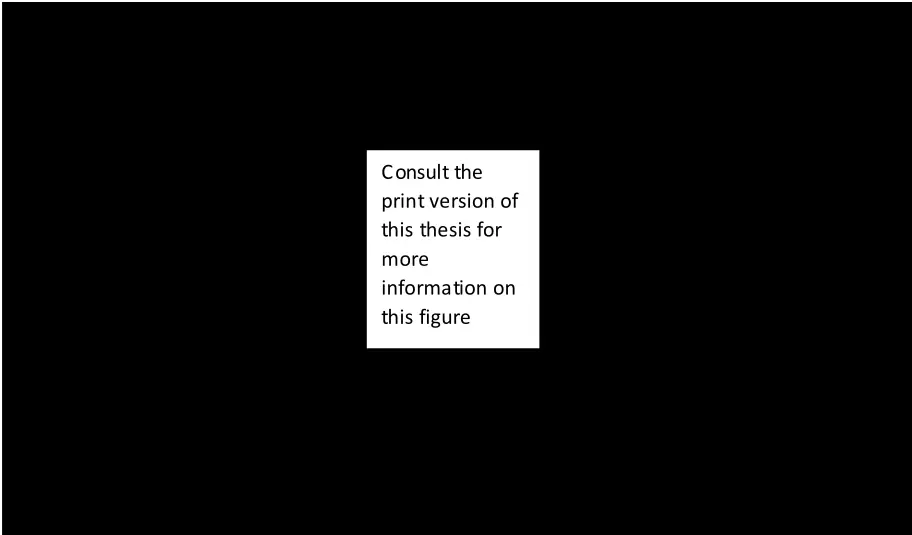

The location of the three weather stations used in this thesis (Lower North Island, New Zealand). Ngawi AwS (2685) was removed from analyses due to unreliable data. Map accessed from https://www.google.com/earth/ (Google Earth, approx. date accessed = June 2015).

## APPENDIX THREE - Field site descriptions

## Treatment-sites

Bull Hill (code = BUL)

Bull Hill (863 m) is located in the north of the park. Red, hard and silver beech are the

dominant canopy species with kamahi and hinau also present in places (ASRD\* 1 = -41.3464,

175.3616, 470 m asl, ASRD 2 = -41.3497, 175.3444, 720m asl).

Pinnacles (code = PIN)

The Pinnacles site is located in the south-east of the park and is characterised by Manuka

dominated secondary forest, gorse is also prominent in paces (ASRD 1 = -41.4444, 175.2484,

250 m asl, ASRD 2 = -41.4543, 175.2607, 400m asl).

Tauanui (code = TAU)

Tauanui is located on the eastern flanks of the park and is dominated by a combination of

mixed broadleaf and black beech forest. Scattered emergent podocarps are present

throughout (ASRD 1 = -41.3995, 175.2915, 290 m asl, ASRD 2 = -41.4014, 175.2848, 270m asl).

Waihora North (code = CLI)

Waihora North is located in the north-east of the park and is characterised by a mixture of regenerating manuka-kanuka, mixed-broadleaf and beech forest.

Song Meter Clive 1 = -41 20.122, 175 16.983, 99 m asl, Song Meter Clive 2 = -41 19.313, 175 17.227 56 m.

Waihora South (code = WAI)

Waihora South is located in the north-east of the park and is characterised by mixture of hard,

red and silver beech (ASRD 1 = -41.3538, 175.2961, 410 m asl, ASRD 2 = -41.3454, 175.2829,

180m asl).

Whawanui (code = WHA)

Black beech forest is also common at Whawanui along with mixed broadleaf species. Whawanui is located central eastern part of the park (ASRD 1 = -41.5281, 175.3428, 200 m asl, ASRD 2 = -41.5376, 175.3483, 320m asl).

## Non-Treatment sites

Orongorongo North (Rimutaka Forest Park) (code = ORO N)

The Rimutaka Forest Park (22 000 ha) encompasses the Rimutaka range approximately 20 km west of the Aorangi range. Orongorongo North is located in the centre of the park just west of the Orongorongo river. The forests consist of mixed beech broadleaf forest at higher altitudes (i.e. ASRD 2 &amp; 3) and mixed podocarp-broadleaf forest at lower altitudes (i.e. ASRD 1).

(ASRD 1 = -41.2453, 175.0311, 190 m asl, ASRD 2 = -41.2478, 175.0514, 537m asl, ASRD 3 = - 41.2593, 175.0465, 750m asl).

Orongorongo South (Rimutaka Forest Park) (code = ORO S)

Orongorongo South is located in the centre of the park just west of the Orongorongo River and just south of the Orongorongo north site. The forests consists of mixed beech broadleaf forest and some pure beech stands.

(ASRD 1 = -41.2777, 175.0535, 590 m asl, ASRD 2 = -41.2849, 175.0501, 510m asl, ASRD 3 = - 41.2912, 175.0439, 450m asl).

Waiohine-Tauherenikau, Tararua Forest Park (code = THN)

The Tararua Forest Park (116 535 ha) encompasses the Tararua range and is approximately 35 km north-west of the Aorangi range. The Waiohine-Tauherenikau area is located in the south-east of the park and consists of mixed beech-broadleaf forest with some emergent podocarps.

(ASRD 1 = -40.9907, 175.3538, 540 m asl, ASRD 2 = -40.9874, 175.3538, 630m asl, ASRD 3 = - 40.9818, 175.3547, 600m asl).

Tora Bush (code = TOR)

Tora bush is located just a few kilometres east of the Aorangi range. Tora Bush is separated from the Aorangi Forest Park by the Opouawe river valley. It mostly consists of mankua/kanuka-broadleaf forest.

(ASRD 1 = -41.4892, 175.4608, 380 m asl, ASRD 2 = -41.4855, 175.4664, 360m asl, ASRD 3 = - 41.481, 175.4702, 370m asl).

\*ASRD = automated sound recording device

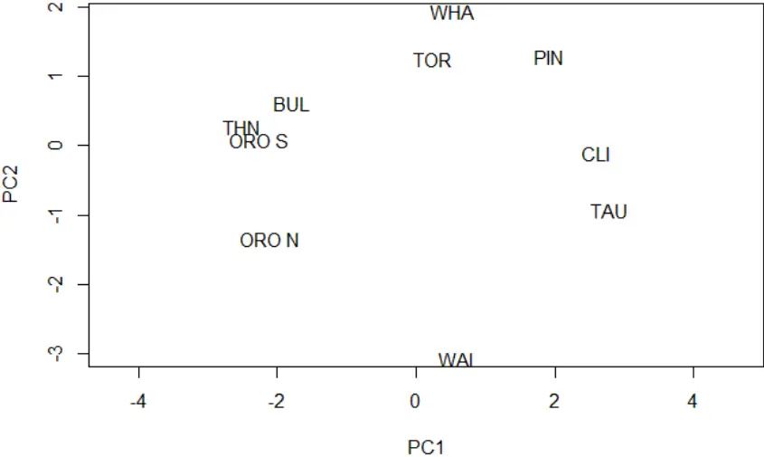

Two-dimensional principal coordination plot for the 10 field sites used in this thesis. This was calculated using the vocal conspicuousness data for the nine most common bird taxa.

## APPENDIX FOUR - Map of 1080 Zone


The spatial extent of the aerial 1080 (sodium monofluoroacetate) application conducted by TBfree NZ in 2014-2015 (TBfree NZ, 2015). Green areas were treated on August 18 2014, purple areas on August 27 2014 and the light blue area on May 28 2015. Pre-feed with nontoxic cereal baits occurred on 4 and 5 August 2014.

## APPENDIX FIVE - Settings for automated detector

These are the settings used to create the automated tomtit detector in Chapter Four. This was done using Song Scope settings.

```
Max complexity = 32. Max resolution = 8 Brightness = 0. Hue = 0. Contrast = 0. Saturation = 255 Luminosity = 128. Sample rate = 11025 kHz Play back rate = normal Max sample delay = 64. FFT Size = 256 FFT overlap = ½. Frequency min = 58 Frequency range = 70. Amplitude gain = 0 Background filter = 2s Max syllable size (ms) = 1501 Max syllable gap = 202 Max song = 2357 Dynamic range = 20 Algorithm = 2.0 Min quality = 20
```

Min score = 70
