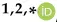
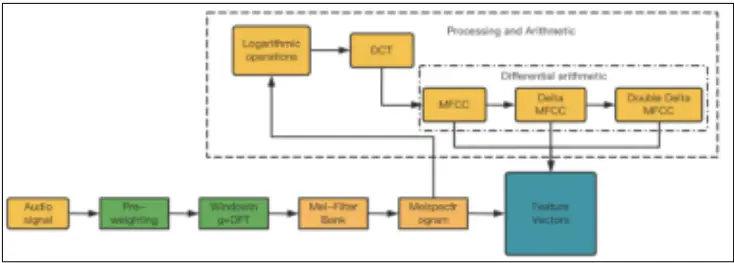
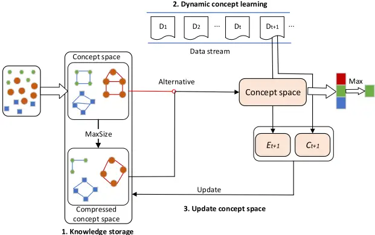
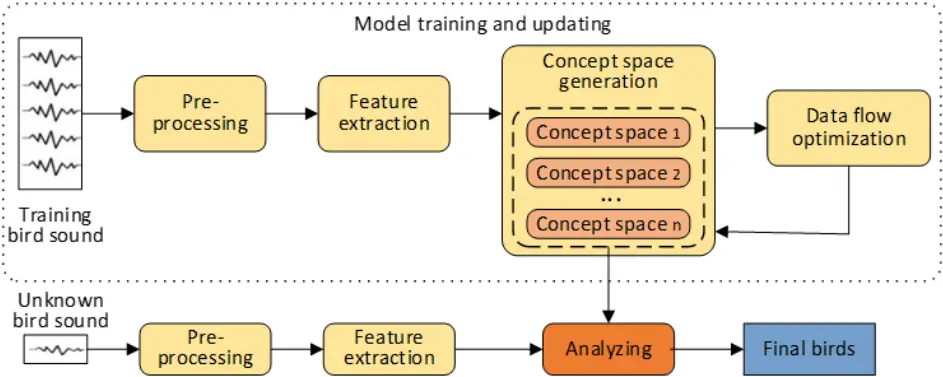
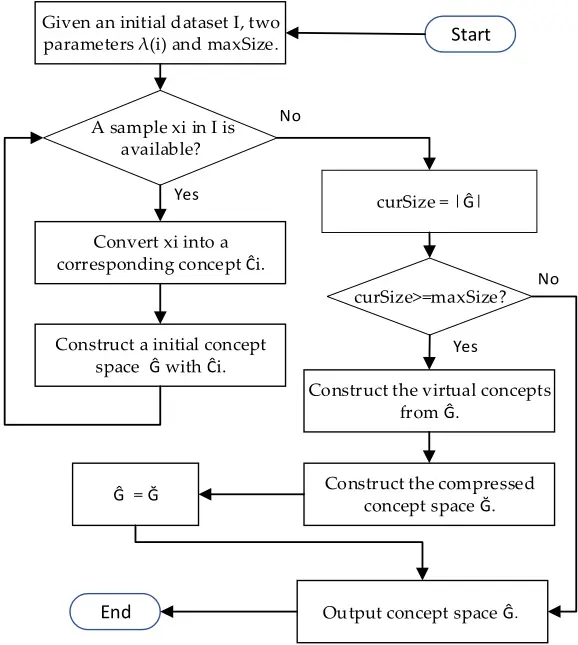
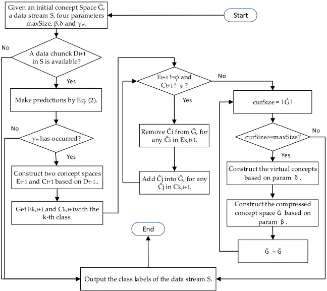
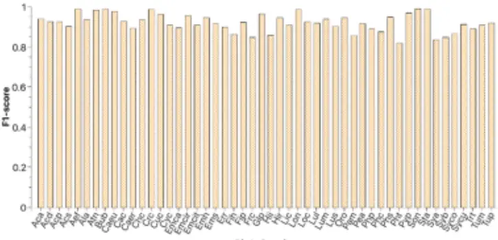

Article

## A Novel Concept-Cognitive Learning Method for Bird Song Classification

Citation: Lin, J.; Wen, W.; Liao, J. A Novel Concept-Cognitive Learning Method for Bird Song Classification. Mathematics 2023, 11, 4298. https:// doi.org/10.3390/math11204298

Academic Editors: Srikanta Patnaik and Kazumi Nakamatsu

Received: 21 September 2023

Revised: 11 October 2023

Accepted: 14 October 2023

Published: 16 October 2023

Copyright: © 2023 by the authors. Licensee MDPI, Basel, Switzerland. This article is an open access article distributed under the terms and conditions of the Creative Commons Attribution (CC BY) license (https:// creativecommons.org/licenses/by/ 4.0/).

Jing Lin 1,2, \* , WenkanWen 1 and Jiyong Liao 1,2

- 1 School of Computer and Artificial Intelligence, Huaihua University, Huaihua 418000, China; humorink\_cat@outlook.com (W.W.); ljy@hhtc.edu.cn (J.L.)
- 2 Brain-Computer Interface Laboratory, Huaihua University, Huaihua 418000, China

* Correspondence: linjing@hhtc.edu.cn

Abstract: Bird voice classification is a crucial issue in wild bird protection work. However, the existing strategies of static classification are always unable to achieve the desired outcomes in a dynamic data stream context, as the standard machine learning approaches mainly focus on static learning, which is not suitable for mining dynamic data and has the disadvantages of high computational overhead and hardware requirements. Therefore, these shortcomings greatly limit the application of standard machine learning approaches. This study aims to quickly and accurately distinguish bird species by their sounds in bird conservation work. For this reason, a novel concept-cognitive computing system (C3S) framework, namely, PyC3S, is proposed for bird sound classification in this paper. The proposed system uses feature fusion and concept-cognitive computing technology to construct a Python version of a dynamic bird song classification and recognition model on a dataset containing 50 species of birds. The experimental results show that the model achieves 92.77% accuracy, 92.26% precision, 92.25% recall, and a 92.41% F1-Score on the given 50 bird datasets, validating the effectiveness of our PyC3S compared to the state-of-the-art stream learning algorithms.

Keywords: bird song recognition; concept-cognitive learning; concept-cognitive computing; data stream; data streammining; dynamic learning

MSC: 68T05

## 1. Introduction

Accurately identifying birds helps to better protect birds and ecology. Especially in the wild, identifying birds through sound is the most economical and convenient method. With the overuse of the natural environment by humans, a large number of birds have lost their habitats, leading to the extinction of many rare birds. Therefore, in complex terrain and vast areas, bird conservationists need to monitor changes in the population size of species, which requires an effective method to assess the existence and richness of species and evaluate the impact of their works on species conservation [1]. Birds often sing, which can be an effective means of monitoring individuals or populations [2]. Therefore, bird song is often used to detect, monitor, and quantify species, as individuals can still be effectively identified through bird song even if they are not within sight. Generally, only a few species of birds can be identified by humans through audiovisual means, while experts can identify thousands of species of birds by their songs alone. However, traditional identification methods are time-consuming and laborious [3]. Compared to standard classification tasks, bird voice recognition has two main characteristics: dynamic and high-dimensional. The frequency range of bird sound can reach over 15 KHz, basically covering the human ear's discernible sound range of 20 to 20 KHz, which determines the high-dimensional nature of bird sound characteristics. The dynamic variability of bird songs is related to learning behavior, vocal organs, neural nuclei, and environmental factors. When birds are stimulated or their environment suddenly changes, such as seasons, sunshine length, and temperature changes, or when they are happy, sad, foraging, flying, occupying areas, nesting, courting, and defending, they will emit corresponding sounds (calls or songs).

Machine learning is a discipline that makes model assumptions about research problems, uses computers to learn model parameters from training data, and ultimately predicts and analyzes the data. According to different learning modes, it can be divided into supervised learning, semi-supervised learning, unsupervised learning, and reinforcement learning. The current popular method is to use standard machine learning methods to identify birds, which can not only save a lot of time and labor costs but can also effectively identify birds. For example, Jarcovic et al. [4] developed a hybrid deep neural networkhidden Markov model based on individual vocalization elements for the recognition of bird species from audio field recordings. Salamon et al. [5] investigated the automatic classification of bird species from flight calls and implemented an audio classification model based on unsupervised feature learning. Pahuja et al. [6] designed a more efficient and flexible bird sound-based recognition system. Using the well-labeled feature data of sound records, a multi-layer perceptron artificial neural network (MLP-NN) classifier model was designed and trained using a feedforward-backpropagation supervised learning algorithm. In [7], using the angular radial transform (ART) descriptor and a Gaussian mixture model for the feature extraction of 3 s and 5 s bird songs, the accuracy rates for 28 bird species were 86.30% and 94.62%, respectively. In machine learning, deep learning models, such as convolutional neural networks (CNN) [8-10], recurrent neural networks (RNN) [8], and binary neural networks (BNN) [10], have received widespread attention in the construction of automatic bird sound classification systems due to their high performance and have been widely used for bird sound detection and classification. In addition, data enhancement and preprocessing techniques have also been used to further improve the performance of bird sound classification, e.g., MMSE STSA for denoising [11], pre-processing spectrogram parameters [12], and two-dimensional cepstral coefficients [13]. Zhang et al. [14] used shorttime Fourier transform (STFT) and other methods to convert bird calls into a frequency spectrum and used convolutional neural networks to classify bird calls. Unlike using simple convolutional neural networks, Sankupelly et al. [15] used ResNet50 to classify the time threshold spectrum of bird songs. Huang et al. [16] used Densenet to extract time-threshold spectral features and classify them, thereby improving the classification effect and further improving recognition accuracy. Sheng et al. [17] used one-dimensional CNN-LSTM, two-dimensional VGG, and three-dimensional DenseNet models as feature extractors to extract advanced features, and then used a shallow classifier to identify 43 bird sounds, achieving a bird sound recognition accuracy of 93.89% on a balanced dataset. Undoubtedly, using ResNet50, DenseNet, Inceptionv3, Xception, and EfficientNet can also effectively extract and identify audio signals from different birds, with accurate prediction effects.

However, bird voice has two main characteristics: dynamic and high-dimensional; these standard machine learning methods focus mainly on static learning and are difficult to directly apply to dynamically changing data forms. In other words, deep learning replaces complex feature extraction algorithms with large parameter space network models, but a large number of parameters can also reduce the computing speed of the device, and complex models are difficult to apply to low-cost CPUs. Running these models on low-cost embedded devices is still unrealistic.

Generally speaking, a deep learning model requires large sample datasets for training, making it difficult to adapt to rapidly changing dynamic data stream learning, and the models do not have scalability and rotational invariance. Especially in high-dimensional dynamic datasets, the resource cost of model training will be greater, which also seriously hinders its large-scale application. Bird song classification and recognition is a highdimensional dynamic process, so deep learning needs to be further tested in the application of bird song classification tasks. In addition, the interpretability of the deep learning model is poor. At the same time, there are fundamental differences between deep learning models and the way humans think and learn. In other words, deep learning models lack the common sense to conclude cross-domain border areas. The concept-cognitive computing (CCC) method [18] simulates the learning process of humans, who not only learn from personal experience but also integrate known concepts to represent things they have never experienced before, learning in natural increments.

Therefore, this paper proposes an efficient incremental learning method for identifying

birds. In this study, the aim is to use feature fusion and the concept-cognitive computing

method to quickly and accurately identify birds based on bird songs. Specifically, using the

method of combining static and dynamic features of sound to obtain corresponding bird

song features, and using our method can improve the system performance and achieve an

accuracy rate of 92.77%, a precision rate of 92.26%, and a recall rate of 92.25% on a public dataset of 50 bird species. At the same time, an F1-Score of 92.41% is obtained, which has significant advantages compared to other mainstream models. Mathematics 2023, 11, x FOR PEER REVIEW 4 of 15

The main contributions of this article are as follows: (1) applying the dynamic data stream model to bird song classification for the first time; it is a novel method to use CCC in bird song classification, and we have obtained very good classification results; (2) designing a feature fusion method to improve the effectiveness of the algorithm, obtaining key features that can better characterize bird sounds, and improving the sensitivity of these features to bird song classification; and (3) assessing the effectiveness of the PyC3S widely adopted benchmark dataset. Comparative analysis with other proposed algorithms (CSMOTE, RebalanceStream, and IKNNwithPAW) reveals that PyC3S outperforms them. 2. Material and Methods 2.1. Dataset The bird audio dataset in this study comes from xeno-canto (https://www.xenocanto.org (accessed on 20 May 2023)), a website dedicated to sharing wildlife sounds from all over the world. Xeno-canto currently contains 789,761 recordings of approximately 11,026 species (12,359 subspecies). Thus, the balanced, medium-sized subset Bird Songs from Europe, consisting of 50 discrete European bird species with 43 high-quality natural recordings per species, was used for bird song classification in this work [19]. 2.1.2. Feature Extraction Subsequently, the Librosa library is used for the feature extraction of the Mel spectrum and MFCC. The system sets the frame length to 11.4 ms, frameshift to 1.42 ms, and 40 Mel bands. Although the MFCC conforms to the auditory perception characteristics of the human ear, the standard MFCC reflects the static characteristics brought about by voice data. In comparison, the human ear is more sensitive to the dynamic characteristics of speech. Therefore, the introduction of the MFCC's first-order difference (Formula (1)) and second-order difference (Formula (2)) can better extract the dynamic characteristics of speech to improve classification accuracy [21]. Therefore, first, the row information of the Mel spectrum and MFCC are scalarized into the basic features of bird sound, and then their first- and second-order differential coefficients are scalarized to obtain their dynamic characteristics. Then, these four types of features are combined into bird sound feature vectors (denoted by Formula (3)). Finally, a total of 148,021 samples were obtained. The data preprocessing process is shown in Figure 1. Δ𝑀(𝑛) = 1 ෍ 𝑖 ⋅ 𝑀(𝑛 +1) ௞

The data curation mainly includes the following steps: (1) original audio preprocessing, which includes resampling, conversion of the original audio format, audio truncation, bird song detection, audio merging, spectrogram generation, accurate data annotation, and data partitioning for training, verification and evaluation; and (2) feature extraction. Using Librosa (https://librosa.org/ (accessed on 20 May 2023)) to extract features and mixing the Mel spectrum and Mel frequency cepstrum coefficient (MFCC) [20] with dynamic features to enhance the effectiveness of bird song features (as shown in Figure 1). ට∑ ௜ୀି௞ ௞ 𝑖 ଶ ௜ୀି௞ (1) Δଶ𝑀(𝑛) = ଵ ට∑ ೔సషೖ ೖ ௜మ ∑ 𝑖 ⋅ Δ𝑀(𝑛 +1) ௞௜ୀି௞ (2) 𝑀௡ =𝑀+Δ𝑀+Δଶ𝑀 (3)

Figure 1. Preprocessing flowchart. Figure 1. Preprocessing flowchart.

## 2.2. Proposed Model 2.1.1. Data Preprocessing

Concept-cognitive learning (CCL) [22] originated from formal concept analysis and learning and was formed through the intersection of formal concept analysis, machine learning, granular computing, and dynamic learning, involving incremental concept learning and dynamic knowledge processing in dynamic environments. A very important and obvious feature of concept-cognitive learning is dynamic [22]. A concept-cognitive learning model was first proposed for dynamic data in [23]; this could integrate the contributions of new data to concept learning into the model in a dynamic environment for First, 16 kHz audio is resampled to 22.05 kHz and converted from MP3 to WAV format. Then, we divide the wave file into 2 s files, which plays an important role in increasing the amount of training data. After pre-emphasis, the sound clip is adjusted to the same length, i.e., sample alignment. To be precise, we align the sample duration by truncating the length of the wave file and using silent filling or discarding for samples less than 2 s; thereby, the size of all the audio samples is adjusted to the same length.

## 2.1.2. Feature Extraction

Subsequently, the Librosa library is used for the feature extraction of the Mel spectrum and MFCC. The system sets the frame length to 11.4 ms, frameshift to 1.42 ms, and 40 Mel bands. Although the MFCC conforms to the auditory perception characteristics of the human ear, the standard MFCC reflects the static characteristics brought about by voice data. In comparison, the human ear is more sensitive to the dynamic characteristics of speech. Therefore, the introduction of the MFCC's first-order difference (Formula (1)) and second-order difference (Formula (2)) can better extract the dynamic characteristics of speech to improve classification accuracy [21]. Therefore, first, the row information of the Mel spectrum and MFCC are scalarized into the basic features of bird sound, and then their first- and second-order differential coefficients are scalarized to obtain their dynamic characteristics. Then, these four types of features are combined into bird sound feature vectors (denoted by Formula (3)). Finally, a total of 148,021 samples were obtained. The data preprocessing process is shown in Figure 1.

<!-- formula-not-decoded -->

<!-- formula-not-decoded -->

<!-- formula-not-decoded -->

## 2.2. ProposedModel

Concept-cognitive learning (CCL) [22] originated from formal concept analysis and learning and was formed through the intersection of formal concept analysis, machine learning, granular computing, and dynamic learning, involving incremental concept learning and dynamic knowledge processing in dynamic environments. A very important and obvious feature of concept-cognitive learning is dynamic [22]. A concept-cognitive learning model was first proposed for dynamic data in [23]; this could integrate the contributions of new data to concept learning into the model in a dynamic environment for incremental learning. Subsequently, to solve different problems, a relevant series of models has been proposed. For example, to accelerate concept learning performance, a newC3LMmodel for concurrent computing is proposed in [24]. In order to adapt to dynamic data streammining, a concept-cognitive computing system (C3S) is proposed in [18]. In this paper, our work mainly refers to the idea of the C3S model in [18]. Its author has released a Java version of the model (https://github.com/YunlongMi/streamC3S\_release (accessed on 20 May 2023)), but for the application and research of machine learning, Python is more popular with researchers, so we have developed the Python version of the C3S model, named PyC3S. Because people can usually dynamically and quickly complete concept learning (CL) from different types of data, this study simulates human cognitive processes for learning, effectively storing and utilizing early acquired knowledge, and naturally integrating the contributions of new data to concept cognition into later concept learning. Unlike most stream learning methods and incremental learning algorithms based on data feature space, PyC3S is designed based on concept space, which is a structured knowledge representation topology. As shown in Figure 2, this model consists of three parts: knowledge storage, dynamic concept learning, and concept space update. In addition, PyC3S also has efficient computing power and can accurately complete classification tasks in a short time.

5 of 14 learning. Unlike most stream learning methods and incremental learning algorithms based on data feature space, PyC3S is designed based on concept space, which is a structured knowledge representation topology. As shown in Figure 2, this model consists of three parts: knowledge storage, dynamic concept learning, and concept space update. In addition, PyC3S also has efficient computing power and can accurately complete classifi-

cation tasks in a short time.

Figure 2. PyC3S framework. Figure 2. PyC3S framework.

## 2.2.1. Knowledge Storage 2.2.1. Knowledge Storage

Knowledge storage is the first problem that needs to be solved. Generally, the concept is the basic unit of human cognition, which consists of 𝑩 and 𝑨෩, recorded as ൫𝑩, 𝑨෩൯. 𝑩 = {𝒙𝒊 } is the sample object set, and 𝑨෩ = 𝓕෩𝒄(𝒙𝒊) is the sample attribute set, where 𝒙𝒊 is a sample and 𝓕෩𝒄 is considered to be mapping in a fuzzy formal context, i.e., 𝓕෩𝒄 ∶ 2஻ → 𝐿஺෨ , where 2஻ is a power set of B and 𝐿஺෨ denotes the set of all fuzzy sets on 𝑨෩. Therefore, this article uses concepts as the basic carrier of knowledge, first converting samples into concepts and then forming a concept space through concept clustering, thereby establishing the relationship between concepts and concept spaces. Here, the concept space corresponds to the class t to which the sample belongs. Given an initial dataset I, 𝝀(𝒊) is the sample space Ω = {𝝀(𝟏), 𝝀(𝟐),… , 𝝀(𝒏)}. (.)' is an induced operator that converts the sample into a concept. The initial concept space formed (denoted by 𝓖𝑰,𝒕 𝑺𝝀(𝒊),∗ ) is used to store early knowledge and serves as a basis for subsequent concept learning. In addition, to avoid the generation of excessive concept space, a parameter (maxSize) is set to control its size to avoid consuming excessive computing costs and storage space. Therefore, when the sample size of a class is greater than the given maxSize, a virtual concept is generated for the concept space and converted into a compressed concept space (denoted as 𝓖𝑰,𝒕 𝑺𝝀(𝒊),□ ). Knowledge storage is the first problem that needs to be solved. Generally, the concept is the basic unit of human cognition, which consists of B and ˜A, recorded as (B, ˜A). B = {xi} is the sample object set, and ˜A = ˜F c (xi) is the sample attribute set, where xi is a sample and ˜F c is considered to be mapping in a fuzzy formal context, i.e., ˜F c : 2 B → L ˜ A , where 2 B is a power set of B and L ˜ A denotes the set of all fuzzy sets on ˜A. Therefore, this article uses concepts as the basic carrier of knowledge, first converting samples into concepts and then forming a concept space through concept clustering, thereby establishing the relationship between concepts and concept spaces. Here, the concept space corresponds to the class t to which the sample belongs. Given an initial dataset I, l(i) is the sample space W = {l(1), l(2), . . . , l(n)}. (.)' is an induced operator that converts the sample into a concept. The initial concept space formed (denoted by G Sl(i),∗ I,t ) is used to store early knowledge and serves as a basis for subsequent concept learning. In addition, to avoid the generation of excessive concept space, a parameter (maxSize) is set to control its size to avoid consuming excessive computing costs and storage space. Therefore, when the sample size of a class is greater than the given maxSize, a virtual concept is generated for the concept space and converted into a compressed concept space (denoted as G Sl(i),□ I,t ).

## 2.2.2. Dynamic Concept Learning

## 2.2.2. Dynamic Concept Learning

Next, when new data streams are input, incremental learning is performed based on the existing concept space, and the concept space is optimized. During the learning process, the data in the data stream are divided into different independent subblocks, as shown in Figure 1. Considering the impact of data block size on the parallel computing efficiency of PyC3S, it is assumed that these data block sizes are fixed in this paper. Next, when new data streams are input, incremental learning is performed based on the existing concept space, and the concept space is optimized. During the learning process, the data in the data stream are divided into different independent subblocks, as shown in Figure 1. Considering the impact of data block size on the parallel computing efficiency of PyC3S, it is assumed that these data block sizes are fixed in this paper.

The concept space to which a new concept belongs is calculated using similarity indicators. This model uses an attribute-oriented concept similarity method to calculate the similarity between a new concept and all concepts in a concept space and takes the maximum similarity value as the similarity between the new concept and the concept space. Similarly, the similarity between the new concept and all concept spaces is calculated, and the concept space corresponding to the maximum similarity value is used as the prediction concept space for the new concept. Specifically, for any newly entered object xr. The corresponding concept can be obtained as follows: Cr = ({xr}, ˜F c (xr)). The similarity sim(.) between concepts and concept spaces is calculated using Equation (4):

<!-- formula-not-decoded -->

where (Xj, ˜Aj ) ∈ G Sl(i),∗ k,t andm = ∣∣∣G Sl(i),∗ k,t ∣∣∣.

<!-- formula-not-decoded -->

Then, in the entire space, the class vector corresponding to the maximum value can be obtained, denoted by ( ˆqa1,j , ˆqa2,j , . . . , ˆqak,j )T . And we can output the maximum value as the final prediction as follows:

<!-- formula-not-decoded -->

where L = {1, 2, . . . , k}. This represents the instance (or object) xr classification to ˆl of classes. If the final prediction is inconsistent with the ground truth, we can add the concept to a counteractive concept space E, and if the opposite is true, we can add the concept to an active concept space C.

Given the concept similarity threshold b ∈ [0, 1], the b-concept neighborhood regarding the concept (B, ˜A) can be defined as follows:

<!-- formula-not-decoded -->

The virtual concept introduced in this model is based on the b-concept neighborhood concerning real concepts, denoted by (B□, ˜A□ ). Given the threshold d, then d real concepts selected from G Sl(i),∗ k,t can be used for constructing a new virtual concept. Furthermore, we can also conclude d ∈ [1, ∣∣∣G Sl(i),∗ k,t ∣∣∣]. A concept space using the local b-concept neighborhood is called a compressed concept space, denoted by G Sl(i),□ k,t . Due to |G Sl(i),□ k,t |≤|G Sl(i),∗ k,t ∣∣∣, for a given data block, the compressed concept space can reduce the computational cost and improve the efficiency of the concept learning.

## 2.2.3. Updating Concept Space

Through the dynamic optimization of the concept space, continuous learning updates on the data streams are achieved. The update process performs the following three steps: (1) for any sample (xr, y r ), we convert it into a corresponding concept; (2) we assign the same weight to all attributes, calculate the similarity between the concept and the original cluster, and obtain the maximum similarity between the concept and different concept spaces; and (3) if the calculated concept space (ˆl) does not match the ground truth (y r ) to which it belongs, that is, ˆl ̸= y r , then we adjust the weights and update the concept space; otherwise, we update the concept space directly. It should be noted that only those concepts that conform to order similarity in the concept space are updated here.

The concept space updates can be formally described as follows: given a new object xj, the corresponding concept can be obtained as ({xj }, ˜F c(xj )). For convenience, the intent of the concept is expressed as ˜F c(xj, a)(∀a ∈ M). Set C Sl(n) j-1 is the concept space in phase j - 1, and for any (Xj-1, ˜Aj-1 ) ∈ C Sl(n) j-1 , the following update rules are followed.

If ˜Aa ≤ ˜F c(xj, a)(∀a ∈ M), that is, if the intent of the new concept is better than that of the original concept, then we have

<!-- formula-not-decoded -->

If ˜Aa &gt; ˜F c(xj, a)(∀a ∈ M), that is, if the original concept intent is superior to the new concept intent, then we have

<!-- formula-not-decoded -->

Otherwise, when the intent of the new concept is out of order with that of the original concept, ({xj }, ˜F c(xj )) can be added into C Sl(n) j . Formally, it can be denoted as

<!-- formula-not-decoded -->

Mathematics 2023, 11, x FOR PEER REVIEW

7 of 15

2.3. SystemConstruction

The construction of the bird song classification system is shown in Figure 3. The system will first extract a portion of sample data and use induction operators to form concepts, followed by forming an initial concept space. Specifically, a portion of the instance samples of each type of bird will be selected, and the instances will be converted into initial concepts by calculating their intent and extent. Then, the initial concept set will be clustered into the initial concept space. The process of constructing the initial concept space is shown in ൫𝑿𝒋, 𝑨෩𝒋൯ = (𝑿𝒋ି𝟏 ∪ {𝒙𝒋}, 𝑨෩𝒋ି𝟏). If 𝑨෩𝒂 &gt; 𝓕෩𝒄൫𝒙𝒋, 𝒂൯(∀𝒂 ∈ 𝑴), that is, if the original concept intent is superior to the new concept intent, then we have

<!-- formula-not-decoded -->

Algorithm 1. Constructing Initial Concept Space

1: Input: An initial dataset I, two required parameters l(i) and maxSize.

Otherwise, when the intent of the new concept is out of order with that of the original

- 2: Output: The concept space G Sl(i),∗ I,t

concept, ቀ൛𝒙𝒋ൟ, 𝓕෩𝒄൫𝒙𝒋൯ቁ can be added into 𝓒𝒋𝑺𝝀(𝒏) . Formally, it can be denoted as

- 3: while a data sample xi in I being available do 𝓒𝒋𝑺𝝀(𝒏) ← ({𝒙𝒋},𝓕෩𝒄 (𝒙𝒋)).
- 4: ({xi}, ˜F c (xi)) ← (xi)′

## 5: G Sl(i),∗ I,t ← ({xi}, ˜F c (xi)) 6: endwhile 2.3. System Construction

7: if ∣∣∣G Sl(i),∗ I,t ∣∣∣ ≥ maxSize then 8: Construct the virtual concepts fromG Sl(i),∗ I,t 9: Construct the compressed concept space G Sl(i),□ I,t 10: G Sl(i),∗ I,t ←G Sl(i),□ I,t 11: end if 12: return G Sl(i),∗ I,t . The construction of the bird song classification system is shown in Figure 3. The system will first extract a portion of sample data and use induction operators to form concepts, followed by forming an initial concept space. Specifically, a portion of the instance samples of each type of bird will be selected, and the instances will be converted into initial concepts by calculating their intent and extent. Then, the initial concept set will be clustered into the initial concept space. The process of constructing the initial concept space is shown in Algorithm 1 and Figure 4.

Figure 3. System flow diagram. Figure 3. System flow diagram.

## Algorithm 1. Constructing Initial Concept Space

- 1: Input: An initial dataset I, two required parameters λ(i) and maxSize.
- 2: Output: The concept space 𝓖𝑰,𝒕
- 𝑺𝝀(𝒊),∗ .

2. while e dete c unle x in Ubcinαouileblede

.

Figure 4. The flow diagram of constructing initial concept space. Here, Ĝ indicates 𝓖𝑰,𝒕 𝑺𝝀(𝒊),□ , and Ĉi means ({𝒙𝒊}, 𝓕෩𝒄 (𝒙𝒊)). Figure 4. The flowdiagramof constructing initial concept space. Here, ˆG indicates G Sl(i),∗ I,t , ˘Gmeans G Sl(i),□ I,t , and ˆCi means ({xi}, ˜F c (xi)).

The system will continuously input the song data stream of different birds and con-

The system will continuously input the song data stream of different tinuously update the model. During this process, the model will continu the existing concept space to achieve higher accuracy. As shown in Figure Algorithm 2, during the learning process, the data blocks in the data stre into different independent subblocks. On these data blocks, an attribute-o ity algorithm is used to calculate the similarity between the instance an space, and the concept space with the highest similarity is used as the pre the prediction is correct, the instance will be transformed into new conce the existing concept space. If the prediction is incorrect, the model will re rect concepts from the concept space and update the existing concept sp sulting new concepts. At the same time, technologies such as virtual conce concept space, and concurrent computing are introduced into the highprocesses of the system, such as the prediction of different data blocks in d the optimization of concept space updates. These effectively reduce com plexity and improve system computational efficiency and performance. tinuously update the model. During this process, the model will continuously optimize the existing concept space to achieve higher accuracy. As shown in Figure 2, Figure 5, and Algorithm 2, during the learning process, the data blocks in the data stream are divided into different independent subblocks. On these data blocks, an attribute-oriented similarity algorithm is used to calculate the similarity between the instance and each concept space, and the concept space with the highest similarity is used as the prediction result. If the prediction is correct, the instance will be transformed into new concepts to optimize the existing concept space. If the prediction is incorrect, the model will remove the incorrect concepts from the concept space and update the existing concept space with the resulting new concepts. At the same time, technologies such as virtual concept, compressed concept space, and concurrent computing are introduced into the high-cost computing processes of the system, such as the prediction of different data blocks in data streams and the optimization of concept space updates. These effectively reduce computational complexity and improve system computational efficiency and performance. Suppose the time complexity of constructing a concept space and its corresponding compressed concept space is O(t1) and O(t2), respectively. Then, we can get a time complexity of Algorithm 1 of O(t1 + t2). Meanwhile, for Algorithm 2, given a data chunk Dt+1, let the time complexity of making predictions and constructing concept spaces Et+1 and Ct+1 be O(t3), O(t4), and O(t5), respectively. Based on the above analysis, it is easy to verify that the time complexity of PyC3S is O(t1 + t2 + L(t2 + t3 + t5+|Et+1| + |Ct+1|)), where L denotes the number of data chunks.

## Algorithm 2. Dynamic Concept Learning

1: Input: An initial concept space 𝓖𝒌,𝒕 𝑺𝝀(𝒊),∗ , a data stream S, four parameters

- ，and 𝜸𝒘.
- 2: Output: The class labels of the data stream S.

## Algorithm 2. Dynamic Concept Learning

- 1: Input: An initial concept space G Sl(i),∗ k,t , a data streamS, four parameters maxSize, b, d, and gw.
- 2: Output: The class labels of the data stream S.
- 3: while a data chunk Dt+1 in S being available do
- 4: Make predictions by Equation (5).
- 5: if the concept warning level gw has occurred then
- 6: Construct two concept spaces Et+1 and Ct+1 based on the data chunk Dt+1.
- 7: Get Ck,t+1 and Ek,t+1 with the k-th class.

8: while (Et+1 ! = ∅ and Ct+1 ! = ∅)do Mathematics 2023, 11, x FOR PEER REVIEW

- 9: G Sl(i),∗ k,t ←G Sl(i),∗ k,t - {(Xi, ˜Ai )} , for any concept (Xi, ˜Ai ) ∈ Ek,t+1. 10: G Sl(i),∗ k,t ←G Sl(i),∗ k,t ∪ {(Xj, ˜Aj )} , for any concept (Xj, ˜Aj ) ∈ Ck,t+1.
- 12: if ∣∣∣G Sl(i),∗ k,t ∣∣∣ ≥ maxSize then 13: Construct the virtual concepts based on the param 𝜹
- 11: endwhile 12: if ቚ𝓖𝒌,𝒕 𝑺𝝀(𝒊),∗ ቚ ≥𝒎𝒂𝒙𝑺𝒊𝒛𝒆 then
- 13: Construct the virtual concepts based on the param d 14: Construct the compressed concept space G Sl(i),□ k,t based on the param b 14: Construct the compressed concept space 𝓖𝒌,𝒕 𝑺𝝀(𝒊),□ based on the param 𝜷 𝑺𝝀(𝒊),□
- 16: end if 16: end if
- 15: G Sl(i),∗ k,t ←G Sl(i),□ k,t 15: 𝓖𝒌,𝒕 𝑺𝝀(𝒊),∗ ← 𝓖𝒌,𝒕
- 17: end if 17: end if
- 18: endwhile 18: end while
- 19: return the class information. 19: return the class information.

9 of 15

Figure 5. The flow diagram of dynamic concept learning. Here, Ĝ indicates 𝓖𝑰,𝒕 𝑺𝝀(𝒊),∗ , Ğ means 𝓖𝑰,𝒕 𝑺𝝀(𝒊),□ , γw is the concept warning level and Ĉi means the concept ({𝒙𝒊}, 𝓕෩𝒄 (𝒙𝒊)). Figure 5. The flow diagram of dynamic concept learning. Here, ˆG indicates G Sl(i),∗ I,t , ˘Gmeans G Sl(i),□ I,t , γw is the concept warning level and ˆCi means the concept ({xi}, ˜F c (xi)).

- Suppose the time complexity of constructing a concept space and its corresponding compressed concept space is O(t1) and O(t2), respectively. Then, we can get a time complexity of Algorithm 1 of O(t1 + t2). Meanwhile, for Algorithm 2, given a data chunk Dt+1, let the time complexity of making predictions and constructing concept spaces Et+1 and Ct+1 be O(t3), O(t4), and O(t5), respectively. Based on the above analysis, it is easy to verify that the time complexity of PyC3S is O(t1 + t2 + L(t2 + t3 + t5+|Et+1| + |Ct+1|)), where L denotes the number of data chunks. 2.4. Evaluation Rule The 10-fold cross-validation method is a commonly used model evaluation technique, which has the advantages of fully utilizing data, high reliability of evaluation results, and avoiding overfitting. Therefore, we used the 10-fold method to test the model, repeating the process 10 times and reporting the average classification results. The method proposed in this paper was evaluated using a dataset of 50 bird sounds collected in [19]. We divide

## 2.4. Evaluation Rule

The 10-fold cross-validation method is a commonly used model evaluation techthe dataset into 10 roughly identical subsets (except for the last one), with 1 subset used as the initial set for constructing the initial concept space and 9 subsets used as the training set for updating the concept spaces. The performance of the bird song classification system is evaluated using average accuracy, weighted precision, weighted sensitivity, and weighted F1 scores, which are defined as follows:

<!-- formula-not-decoded -->

<!-- formula-not-decoded -->

<!-- formula-not-decoded -->

<!-- formula-not-decoded -->

where TP is true positive, TN is true negative, FP is false positive, and FN is false negative; c is the class index, rc is the ratio of the number of samples in a class c to the total number of samples in all classes, and Sc is the sample size of class c.

In this paper, PyC3S is compared with three stream learning algorithms, namely, CSMOTE, RebalanceStream, and IKNNwithPAW [25-27]. According to Section 2.2, we know that the construction of a concept space is influenced by the clue l(i). In theory, it is of great importance to adjust an approximate optimal l(i) for each dataset, and this has detailedly been analysed and discussed in Mi et al. [18]. According to the discussion in [18], our parameters l(i), maxSize, b, d, and gw should always be set to 0.8, 300, 0.6, 5, and -0.2, respectively. CSMOTE, RebalanceStream, and IKNNwithPAW all use the default settings of MOA. Moreover, for a fair comparison, all the experiments have been independently implemented 20 times, and the average performance is recorded in this paper.

## 3. Results and Discussion

All the experimental conditions are listed as follows: Intel(R) Core(TM) i7-9750HCPU @ 2.60 GHz CPU, 4 GB main memory, Python 3.9.13, and PyCharm Professional 2022.2.4 for windows 10. And we implement our system in Python.

## 3.1. Result of Comparison Experiment with Stream Learning Algorithms

The results of the performance comparison experiment with CSMOTE, RebalanceStream, and IKNNwithPAW are shown in Table 1 and Figure 6.

Table 1. Classification results of different approaches using 10-fold cross-validation method.

| Model           | Accuracy | Precision | Recall | F1-Score | Running Time |
| --------------- | -------- | --------- | ------ | -------- | ------------ |
| CSMOTE          | 88.23%   | 89.73%    | 88.24% | 85.69%   | 167.75 (s)   |
| RebalanceStream | 81.25%   | 84.79%    | 81.25% | 82.68%   | 1.635 (s)    |
| IKNNwithPAW     | 75.31%   | 74.76%    | 75.21% | 73.12%   | 13.27 (s)    |
| PyC3S           | 92.77%   | 92.26%    | 92.25% | 92.41%   | 2.43 (s)     |

The accuracy in bold means the best results of the compared methods.

## 3.2. Result of Ablation Experiment

To further verify the effectiveness of the two methods used in this paper, an ablation experiment was conducted by combining Mel + MFCC to represent the Mel spectrum and MFCC features, and Delta1 + Delta2 to represent the first- and second-order differential features. The experimental comparison results are shown in Table 2.

Birds Species

Figure 6. The accuracy for of each bird species. Figure 6. The accuracy of each bird species.

## 3.2. Result of Ablation Experiment Table 2. Result of ablation experiment.

To further verify the effectiveness of the two methods used in this paper, an ablation experiment was conducted by combining Mel + MFCC to represent the Mel spectrum and MFCC features, and Delta1 + Delta2 to represent the first- and second-order differential features. The experimental comparison results are shown in Table 2. Method Accuracy Precision Recall F1-Score Mel + MFCC 66.83% 68.33% 68.69% 55.40% Delta1 + Delta2 56.25% 77.83% 56.25% 61.65% PyC3S 92.77% 92.26% 92.25% 92.41%

Table 2. Result of ablation experiment. The accuracy in bold means the best results of the compared methods.

3.3. Discussion

Method Accuracy Precision Recall F1-Score

Mel + MFCC 66.83% 68.33% 68.69% 55.40% Delta1 + Delta2 56.25% 77.83% 56.25% 61.65% PyC3S 92.77% 92.26% 92.25% 92.41% The accuracy in bold means the best results of the compared methods. 3.3. Discussion From the evaluation indicators in Table 1, the PyC3S performed best, achieving an accuracy rate of 92.77%, a precision rate of 92.26%, and a recall rate of 92.25%. At the same time, it obtained 92.41% the F1-Score. It can be seen that the overall performance of PyC3S is excellent. This result also indicates that fusion features can well characterize various types of acoustic components. Figure 6 shows the classification results for each type of bird, and it is obvious that there are good results for each type of bird. From Figure 6, we can also observe that the F1-Score of each bird species is greater than 85%, indicating that our PyC3S model is very robust in classification performance on the balanced dataset. It can be seen that the F1-score, as a harmonic mean that overall considers precision and sensitivity (recall rate), can comprehensively evaluate the prediction accuracy and recall rate of the classifier. Compared with CSMOTE, RebalanceStream, and IKNNwithPAW, the proposed method PyC3S can improve the average accuracy by 4.54%, 11.52%, and 17.46%, respectively. In particular, the method in our work runs efficiently on the dataset. From the table, we can see that the CSMOTE algorithm runs in 167.75 s and IKNNwithPAW takes 13.27 s, while the PyC3S algorithm needs only 2.43 s. PyC3S is much faster than the comparison algorithms. Although the time cost of PyC3S is 0.75 s higher than that of RebalanceStream, the accuracy of classification has improved by 11.52%. The results further demonstrate that the proposed method can work in a fast and efficient manner while achieving good classification performance. The excellent classification performance of PyC3S mainly benefits from the following three aspects: (1) using cognitive concepts (including intent and extent) instead of feature vectors as basic information carriers to input the system enables the method in this paper to utilize both object and attribute From the evaluation indicators in Table 1, the PyC3S performed best, achieving an accuracy rate of 92.77%, a precision rate of 92.26%, and a recall rate of 92.25%. At the same time, it obtained 92.41% the F1-Score. It can be seen that the overall performance of PyC3S is excellent. This result also indicates that fusion features can well characterize various types of acoustic components. Figure 6 shows the classification results for each type of bird, and it is obvious that there are good results for each type of bird. From Figure 6, we can also observe that the F1-Score of each bird species is greater than 85%, indicating that our PyC3S model is very robust in classification performance on the balanced dataset. It can be seen that the F1-score, as a harmonic mean that overall considers precision and sensitivity (recall rate), can comprehensively evaluate the prediction accuracy and recall rate of the classifier. Compared with CSMOTE, RebalanceStream, and IKNNwithPAW, the proposed method PyC3S can improve the average accuracy by 4.54%, 11.52%, and 17.46%, respectively. In particular, the method in our work runs efficiently on the dataset. From the table, we can see that the CSMOTE algorithm runs in 167.75 s and IKNNwithPAW takes 13.27 s, while the PyC3S algorithm needs only 2.43 s. PyC3S is much faster than the comparison algorithms. Although the time cost of PyC3S is 0.75 s higher than that of RebalanceStream, the accuracy of classification has improved by 11.52%. The results further demonstrate that the proposed method can work in a fast and efficient manner while achieving good classification performance. The excellent classification performance of PyC3S mainly benefits from the following three aspects: (1) using cognitive concepts (including intent and extent) instead of feature vectors as basic information carriers to input the system enables the method in this paper to utilize both object and attribute information; (2) the compressed concept spaces constructed based on concept space and concept clustering technology improve the dynamic classification accuracy; and (3) a new CL mechanism and model updating method have been adopted in the system. All in all, the strategy of constructing a compressed concept space and removing counteractive concepts can significantly improve computational efficiency. Unfortunately, in the process of dynamic learning, those existing concept-cognitive computing algorithms do not consider concept drift [28]. Hence, their performance may dramatically drop when concept drift occurs in a dynamic learning process, especially for the abrupt concept drift. In our work, frequent changes in bird song can lead to frequent conceptual drift. Therefore, to avoid the adverse impact of concept drift on system performance, we will consider concept drift in our future work.

In this study, a feature fusion method was used to represent the characteristics of each bird. Firstly, the Mel spectrum and MFCC were combined, achieving an accuracy of 66.83%. After that, we added first-order differential features and second-order differential features (Delta MFCC and Double Delta MFCC). Because the human ear is more sensitive to the dynamic characteristics of speech [21] than to static ones of it, we successfully improved the accuracy rate to 92.77% after adding dynamic features. It can be seen that PyC3S is optimal in all four index values, and this ablation experiment fully verifies the effectiveness of the algorithm in this paper. PyC3S does not simply use the MFCC directly, but instead accumulates the energy of each Mel filter and then serves as a feature vector. This processing method not only effectively reduces the amount of computation and saves time overhead but also maintains an ideal accuracy rate. In [29], the authors conducted research on feature extraction techniques for speech recognition and classification, and focused on comparing and analyzing different types of MFCC feature extraction methods; after discussing the statistical results of different MFCC techniques, it was concluded that the Double Delta MFCC feature extraction technique is superior to other feature extraction techniques. This is one of the reasons why Delta MFCC and Double Delta MFCC were added to this study.

Currently, a large number of bird song classification studies are using increasingly large deep learning models for classification to achieve better accuracy. However, the reality is that a large number of wildlife reserves and environmental agencies cannot use such devices, which require significant computing power to help them with their work. PyC3S can dynamically and quickly complete concept learning (CL) and also has excellent performance compared to the most advanced incremental learning and data stream learning algorithms. In summary, the reasons for the excellent computing efficiency of PyC3S are generally as follows: (1) the design of PyC3S enables it to effectively perform parallel computing, with each sub-concept space being able to perform calculations without interference with each other; and (2) PyC3S will compress each sub-concept space at an appropriate time to achieve simplification and accuracy of concepts in the concept space.

In addition, the continuous improvement of the model is also considered. Modern deep neural network models can achieve excellent performance in static data through batch training, but this can cause catastrophic forgetting in incremental learning scenarios because the distribution of new data is unknown and the new data have a highly different probability from the former data. Therefore, the model must be both adaptable to acquire new knowledge and stable to consolidate existing knowledge [30]. Unlike traditional machine learning, the data streams processed by incremental learning will continue to be available over time. Therefore, traditional assumptions about the availability of representative training data can be abandoned during training to establish decision boundaries. In the scenario of the data stream, massive raw data streams will be transformed into information and knowledge representations, and experience will be accumulated over time to support future decision-making processes [31]. The PyC3S can precisely meet the needs of incremental learning to ensure the accuracy of long-term bird song recognition.

## 4. Conclusions

In this study, based on the static features of the MFCC, the fusion method of features of bird songs is used to integrate the first- and second-order differential dynamic features of the MFCC, obtaining key features that can better characterize bird sounds and improving the sensitivity of these features to bird song classification. At the same time, scalar processing is performed on these two types of MFCC features, transforming the high-dimensional MFCC feature matrix into one-dimensional feature vectors. This effective feature dimensionality reduction process can reduce subsequent computational costs and

## References

1. Oliveira, H.S.; Luiz, D.A. Silent changes in functionally stable bird communities of a large protected tropical forest monitored over 10 years. Biol. Conserv. 2022, 265, 109407. [CrossRef]
2. Mielke, A.; Zuberbühler, K. Amethod for automated individual, species and call type recognition in free-ranging animals. Anim. Behav. 2013, 86, 475-482. [CrossRef]
3. Wimmer, J.; Towsey, M.; Williamson, R.I. Sampling environmental acoustic recordings to determine bird species richness. Ecol. Appl. 2013, 23, 1419-1428. [CrossRef] [PubMed]
4. Jarcovic, P.; Köküer, M. Bird species recognition using unsupervised modeling of individual vocalization elements. IEEE/ACM Trans. Audio Speech Lang. Process. 2019, 27, 932-947. [CrossRef]
5. Salamon, J.; Bello, J.P.; Farnsworth, A.; Robbins, M.; Kelling, S. Towards the automatic classification of avian flight calls for bioacoustic monitoring. PLoS ONE 2016, 11, e0166866. [CrossRef] [PubMed]
6. Pahuja, R.; Kumar, A. Sound-spectrogram based automatic bird species recognition using MLP classifier. Appl. Acoust. 2021, 180, 108077. [CrossRef]

spatial overhead, enabling the method in this paper to achieve ideal benefits in terms of time and space. Later, to address the dynamic continuity of bird sounds and the difficulty of classical learning algorithms adapting to continuously arriving new samples, this study proposed a novel concept-cognitive computing system framework (PyC3S) for dynamic changes in bird sounds. The adopted concept-cognitive computing technology mimics the human cognitive learning process, effectively storing early acquired knowledge and utilizing the object and attribute information of concepts; it can integrate the contributions of new data into the original concept space in a dynamic environment for effective incremental learning. In addition, the implementation of virtual concepts, compressed concept space, automatic updating of concept space, and parallel concept computing in PyC3S effectively reduces the time and space overhead of the system and improves system performance. The experimental results show that the method achieves a recognition accuracy of 92.77%, a precision rate of 92.26%, a recall rate of 92.25%, and an F1-Score rate of 92.41% on 50 bird datasets in about one minute, all higher than the comparison model. From the experimental environment of this paper, it can be seen that this system has low hardware requirements and is suitable for use in large-scale dynamic bird song classification tasks.

In the future, our work aims to establish a more effective classification framework for birds. In addition, only 50 bird samples were used in this study. This number will be increased to include more bird samples from different countries to test the robustness of the methods proposed in this paper. At the same time, We are often faced with a highly unbalanced sample of species to be classified in research works. Therefore, unbalanced learning is worthy of in-depth research. Moreover, deep learning is known as a very useful mechanism for feature extraction and knowledge representation and has been successfully applied to different scenarios such as image recognition, speech recognition, and image generation, but how to incorporate deep learning into dynamic CL or stream learning is still an open question. For different modal datasets such as sound datasets, text datasets, and image datasets, a more general feature extraction method is also a challenging issue, which is a key factor limiting the application field of CCL.

Author Contributions: Conceptualization, J.L. (Jing Lin); Methodology, J.L. (Jing Lin); Software, W.W.; Formal analysis, J.L. (Jing Lin); Resources, J.L. (Jiyong Liao); Data curation, W.W.; Writing-original draft, W.W.; Writing-review &amp; editing, J.L. (Jiyong Liao); Visualization, W.W. and J.L. (Jiyong Liao); Supervision, J.L. (Jing Lin); Project administration, J.L. (Jiyong Liao); Funding acquisition, J.L. (Jing Lin). All authors have read and agreed to the published version of the manuscript.

Funding: This work is supported by the Scientific Research Projects Funded by the Hunan Provincial Department of Education (grant number 21A0488 and 19B404), and the Hunan Provincial Natural Science Foundation of China (grant number 2020JJ4489 and 2020JJ4490).

Data Availability Statement: The datasets used and analyzed during the current study are available from the corresponding author upon reasonable request.

Conflicts of Interest: The authors declare no conflict of interest.

7. Lee, C.H.; Hsu, S.B.; Shih, J.L.; Chou, C.H. Continuous birdsong recognition using Gaussianmixture modeling of image shape features. IEEE Trans. Multimed. 2012, 15, 454-464. [CrossRef]
8. Adavanne, S.; Drossos, K.; Çakir, E.; Virtanen, T. Stacked convolutional and recurrent neural networks for bird audio detection. In Proceedings of the 2017 25th European Signal Processing Conference (EUSIPCO), Kos, Greece, 28 August-2 September 2017; IEEE: Piscataway, NJ, USA, 2017.
9. Kong, Q.; Yong, X.; Plumbley, M.D. Joint detection and classification convolutional neural network on weakly labelled bird audio detection. In Proceedings of the 2017 25th European Signal Processing Conference (EUSIPCO), Kos, Greece, 28 August-2 September 2017; IEEE: Piscataway, NJ, USA, 2017.
10. Song, J.N.; Li, S.C. Bird audio detection using convolutional neural networks and binary neural networks. In Proceedings of the Detection and Classification of Acoustic Scenes and Events 2018 Workshop (DCASE2018), Surrey, UK, 19-20 November 2018.
11. Brown, A.; Garg, S.; Montgomery, J. Automatic and efficient denoising of bioacoustics recordings usingMMSE STSA. IEEE Access 2017, 6, 5010-5022. [CrossRef]
12. Knight, E.C.; Hernandez, S.P.; Bayne, E.M.; Bulitko, V.; Tucker, B.V. Pre-processing spectrogramparameters improve the accuracy of bioacoustic classification using convolutional neural networks. Bioacoustics 2020, 29, 337-355. [CrossRef]
13. Lee, C.H.; Han, C.C.; Chuang, C.C. Automatic classification of bird species from their sounds using two-dimensional cepstral coefficients. IEEE Trans. Audio Speech Lang. Process. 2008, 16, 1541-1550. [CrossRef]
14. Zhang, X.C.; Zhou, A.B.; Zhang, G.X.; Huang, Z.Q.; Qiang, X.B.; Xiao, H. Spectrogram-frame linear network and continuous frame sequence for bird sound classification. Ecol. Inform. 2019, 54, 101009. [CrossRef]
15. Lasseck, M. Acoustic bird detection with deep convolutional neural networks. In Proceedings of the Detection and Classification of Acoustic Scenes and Events 2018 Workshop (DCASE2018), Surrey, UK, 19-20 November 2018.
16. Huang, G.; Liu, Z.; Laurens, V.; Weinberger, K.Q. Densely Connected Convolutional Networks; IEEE Computer Society: Washington, DC, USA, 2016.
17. Yang, F.; Jiang, Y.; Xu, Y. Design of Bird Sound Recognition Model Based on Lightweight. IEEE Access 2022, 10, 85189-85198. [CrossRef]
18. Mi, Y.L.; Quan, P.; Shi, Y. StreamConcept-cognitive Computing System for Streaming Data Learning. TechRxiv 2023. [CrossRef]
19. Shrestha, R.; Glackin, C.; Wall, J.; Cannings, N. Bird audio diarizationwith faster R-CNN. In Proceedings of the International Conference on Artificial Neural Networks: Artificial Neural Networks and Machine Learning-ICANN 2021, Bratislava, Slovakia, 14-17 September 2021; Springer: Cham, Switzerland, 2021; Volume 12891, pp. 415-426.
20. Lv, D.J.; Zhang, Y.; Fu, Q.J.; Xu, H.F.; Liu, J.; Zi, J.L.; Huang, X. Birdsong Recognition Based on MFCC combined with Vocal Tract Properties. In Proceedings of the 2020 5th International Conference on Mechanical, Control and Computer Engineering (ICMCCE), Harbin, China, 25-27 December 2020; pp. 1523-1526. [CrossRef]
21. Wang, Y.; Li, B.; Jiang, X.; Feng, L.; Wang, L. Speaker recognition based on dynamic MFCC parameters. In Proceedings of the 2009 International Conference on Image Analysis and Signal Processing, Linhai, China, 11-12 April 2009; IEEE: Piscataway, NJ, USA, 2009.
22. Mi, Y.L. Concept-Cognitive Computing Theory andModel. Ph.D. Thesis, School of Computer Science and Technology, University of Chinese Academy of Sciences, Beijing, China, 2020.
23. Shi, Y.; Mi, Y.L.; Li, J.H.; Liu, W.Q. Concept-cognitive learningmodel for incremental concept learning. IEEE Trans. Syst. Man Cybern. Syst. 2021, 51, 809-821. [CrossRef]
24. Shi, Y.; Mi, Y.L.; Li, J.H.; Liu, W.Q. Concurrent concept-cognitive learning model for classification. Inf. Sci. 2019, 496, 65-81. [CrossRef]
25. Bernardo, A.; Gomes, H.M.; Montiel, J.; Pfahringer, B.; Valle, E.D. C-smote: Continuous synthetic minority oversampling for evolving data streams. In Proceedings of the 2020 IEEE International Conference on Big Data (Big Data), Atlanta, GA, USA, 10-13 December 2020; IEEE: Piscataway, NJ, USA, 2020.
26. Bernardo, A.; Valle, E.D.; Bifet, A. Incremental rebalancing learning on evolving data streams. In Proceedings of the 2020 International Conference on Data Mining Workshops (ICDMW), Sorrento, Italy, 17-20 November 2020; IEEE: Piscataway, NJ, USA, 2020.
27. Bifet, A.; Pfahringer, B.; Read, J.; Holmes, G. Efficient data streamclassification via probabilistic adaptivewindows. In Proceedings of the 28th Annual ACM Symposium on Applied Computing, Coimbra, Portugal, 18-22 March 2013; p. 801.
28. Mi, Y.; Wang, Z.; Liu, H.; Qu, Y.; Yu, G.; Shi, Y. Divide and conquer: A granular concept-cognitive computing system for dynamic classification decisionmaking. Eur. J. Oper. Res. 2023, 308, 255-273. [CrossRef]
29. Ranjan, R.; Thakur, A. Analysis of feature extraction techniques for speech recognition system. Int. J. Innov. Technol. Explor. Eng. 2019, 8, 197-200.
30. Luo, Y.; Yin, L.; Bai, W.; Mao, K. An appraisal of incremental learningmethods. Entropy 2020, 22, 1190. [CrossRef] [PubMed]
31. He, H.B.; Chen, S.; Li, K.; Xu, X. Incremental learning from streamdata. IEEE Trans. Neural Netw. 2011, 22, 1901-1919.

Disclaimer/Publisher's Note: The statements, opinions and data contained in all publications are solely those of the individual author(s) and contributor(s) and not of MDPI and/or the editor(s). MDPI and/or the editor(s) disclaim responsibility for any injury to people or property resulting from any ideas, methods, instructions or products referred to in the content.
