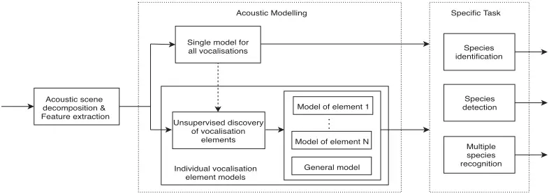
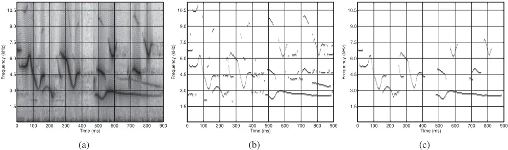
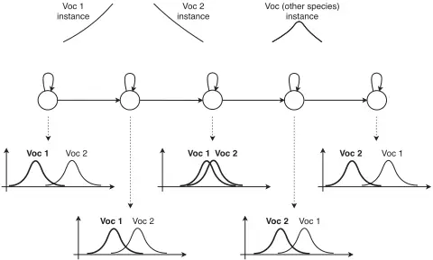
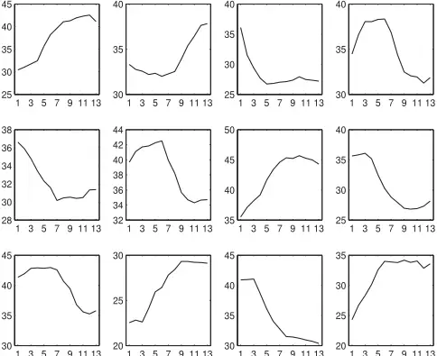
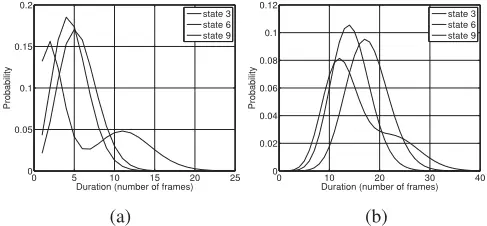
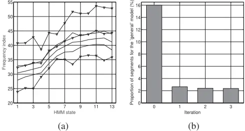
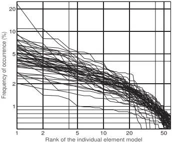
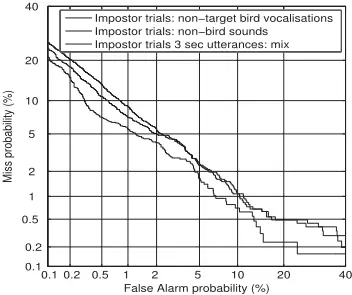

## Bird species recognition using unsupervised modeling of individual vocalization elements

## Jancovic, Peter; Kokuer Jancovic, Munevver

## [DOI: 10.1109/TASLP.2019.2904790](https://doi.org/10.1109/TASLP.2019.2904790)

License:

None: All rights reserved

Document Version Peer reviewed version

Citation for published version (Harvard): Jancovic, P &amp; Kokuer Jancovic, M 2019, 'Bird species recognition using unsupervised modeling of individual vocalization elements', IEEE - ACM Transactions on Audio, Speech, and Language Processing, vol. 27, no. 5, 8666776, pp. 932-947. https://doi.org/10.1109/TASLP.2019.2904790

## [Link to publication on Research at Birmingham portal](https://research.birmingham.ac.uk/en/publications/f072be07-dea4-484b-a4ab-dcca56140afd)

## Publisher Rights Statement:

Checked for eligibility: 12/04/2019

© 2019 IEEE. Personal use of this material is permitted. Permission from IEEE must be obtained for all other uses, in any current or future media, including reprinting/republishing this material for advertising or promotional purposes, creating new collective works, for resale or redistribution to servers or lists, or reuse of any copyrighted component of this work in other works.

P. Jancovic and M. Köküer, "Bird Species Recognition Using Unsupervised Modeling of Individual Vocalization Elements," in IEEE/ACM Transactions on Audio, Speech, and Language Processing, vol. 27, no. 5, pp. 932-947, May 2019.

https://doi.org/10.1109/TASLP.2019.2904790

## General rights

Unless a licence is specified above, all rights (including copyright and moral rights) in this document are retained by the authors and/or the copyright holders. The express permission of the copyright holder must be obtained for any use of this material other than for purposes permitted by law.

·Users may freely distribute the URL that is used to identify this publication. study or non-commercial research. ·User may use extracts from the document in line with the concept of 'fair dealing' under the Copyright, Designs and Patents Act 1988 (?)

·Users may download and/or print one copy of the publication from the University of Birmingham research portal for the purpose of private ·Users may not further distribute the material nor use it for the purposes of commercial gain.

Where a licence is displayed above, please note the terms and conditions of the licence govern your use of this document.

When citing, please reference the published version.

## Take down policy

While the University of Birmingham exercises care and attention in making items available there are rare occasions when an item has been uploaded in error or has been deemed to be commercially or otherwise sensitive.

If you believe that this is the case for this document, please contact UBIRA@lists.bham.ac.uk providing details and we will remove access to the work immediately and investigate.

## Bird Species Recognition using Unsupervised Modelling of Individual Vocalisation Elements

Peter Janˇcoviˇc\* and M¨unevver K¨ok¨uer

Abstract-This paper investigates acoustic modelling for recognition of bird species from audio field recordings. First, the acoustic scene is decomposed into isolated segments, corresponding to detected sinusoids. Each segment is represented by a sequence of the frequency and normalised magnitude values of the sinusoid. The temporal evolution of these features is modelled using hidden Markov models (HMMs). A novel method for an unsupervised modelling of individual bird vocalisation elements is proposed. The element models are initialised using HMM-based clustering and then further trained using an iterative maximum likelihood label re-assignment procedure. State duration modelling, performed in a post-recognition stage, is explored. Finally, we developed a hybrid deep neural network - hidden Markov model (DNN-HMM). The developed acoustic models are employed for bird species identification, detection of specific species and recognition of multiple bird species vocalising in a given recording. The detection system employs score normalisation. Recognition of multiple bird species is performed based on maximising the likelihood of a set of segments on a subset of bird species models, with penalisation based on Bayesian information criterion applied. Experimental evaluations are performed on over 37 hours of sound field recordings, containing vocalisations of 48 bird species, plus over 16 hours of non-bird sound recordings. Using 3 seconds of the detected signal, the best system achieved: identification accuracy of 98.7%, detection with the equal error rate of 2.7%, and recognition accuracy of 97.3% and 95.4% when vocalisations of multiple bird species are present, with the number of bird species known and estimated, respectively.

Index Terms-bird species recognition, hidden Markov model, DNN-HMM, vocalisation element, unsupervised, multiple bird species, segmentation, sinusoid, field recording.

## I. INTRODUCTION

Over the last few decades, a lot of research efforts have been devoted to automatic analysis of speech, and more recently music and audio in general. However, research in automatic analysis of vocalisations from animals, such as birds, has intensified only recently.

The identification of birds, the study of their behaviour, and the way of their communication is important for ornithology research and in the context of environmental protection [1], [2], [3]. Birds are good indicators of the general health of an ecosystem [4], [5]. They play an important role in a wide range of ecosystems, as they control insect populations, disperse plant seeds, and pollinate plants. As most birds use vocalisations as their primary communication method [2], [6], the use of acoustic signal for monitoring of bird species offers an effective approach. Acoustic sensors left on site can continuously capture the acoustic activity and as such

P. Janˇcoviˇc and M¨unevver K¨ok¨uer are with the Department of Electronic, Electrical and Systems Engineering, University of Birmingham, UK, E-mail: {p.jancovic, m.kokuer}@bham.ac.uk.

provide many benefits over the use of field observers, such as collecting data at large spatial area and temporal scales [7]. The greatest challenge with automated recordings though is to find the sounds of bird species of interest within these extensively long recordings. Therefore, there is an imperative need to develop automatic techniques for recognition of bird species in audio field recordings.

Bird vocalisations can be considered to be composed of a set of elementary units, referred to as elements or notes [4]. An element can be defined as a continuous sound trace in between silent intervals [8], [2]. Like humans compose elementary sounds into words and sentences, birds assemble vocalisation elements into calls or more elaborate songs. The knowledge of the repertoire of elements and songs of bird species is important for studies of their communication and behaviour [4], [2], [9]. Another aspect of categorising bird vocalisations is the acoustic character of the sound. Some birds produce sounds of a noisy broadband character, but most produce a tonal sound, which may consist of a pure tone frequency, several harmonics of the fundamental frequency, or several non-harmonically related frequencies [10].

## A. Related works

This section reviews techniques which have been used for analysis of bird vocalisations and bird species recognition, with also some points to relevant connections from speech recognition research. We split the section into four parts: i) acoustic scene decomposition, ii) feature representation, iii) acoustic modelling, and iv) multiple bird species recognition. However, note that some techniques do overlap across parts.

1. Acoustic Scene Decomposition: Field recordings of bird vocalisations may often contain various background noise or other birds/animals vocalising concurrently. Before passing the audio to further processing stages, the audio scene could be decomposed into individual sources, or time-frequency components, by techniques based on computational auditory scene analysis [11] or blind source separation [12]. Audio scene decomposition could be performed using a bottomup process based on, for instance, continuity and proximity, or a top-down process based on learned patterns of sound sources. Many works in bird sound processing employed an energy-based detection, either requiring an estimate of noise levels or exploiting sharp changes in energy, which was then followed with a filtering and continuity assessment to smooth the decisions to arrive at temporal or time-frequency segments [13], [14], [15]. When we are concerned with tonal vocalisations, an alternative approach is to decompose the acoustic scene into sinusoidal components. The works in [13],

[16], [17] employed the sinusoidal decomposition method proposed in [18], which considered all spectral peaks as sinusoids and used a threshold-based assessment of frequency and amplitude continuity of peaks over adjacent frames to obtain isolated segments. We introduced in [19] a pattern recognition approach which performs detection based on modelling local short-time spectrum around the peaks. This method does not require any estimate of noise and it can detect concurrent sinusoidal components occurring in different frequency regions. We employed this method in our recent works on bird sound processing, e.g., [20], [21], and also here.

2. Feature representation: Various approaches to extract features from audio for analysis of bird vocalisations have been explored. Some earlier studies employed statistical descriptors to characterise the entire detected time-frequency segments [13], [17], [14]. This was also used recently as a baseline approach in [22]. This provides a single feature vector, usually of a low dimensionality, which can then be employed in various static classifiers, such as support vector machine (SVM). However, such representation may not be able to describe well more complex types of vocalisations and may be susceptible to variations in bird vocalisation and to errors in segmentation caused by presence of noise. Inspired by features used in speech processing, many works employed Mel-frequency cepstral coefficients (MFCC), e.g., [23], [13], [24], [25]. As MFCCs capture the entire frequency band, they are affected by background noise and presence of concurrent vocalisations from other birds/animals located in other frequency regions. Moreover, the frame length used for extraction of MFCCs (or spectrogram) was often considerably large (20-45 ms), which may not allow to represent well fast varying vocalisations.

Feature representation could be learned from data by employing machine learning techniques - see [26] for a review. Neural networks (NNs) and convolutional NNs (CNNs) have been employed as a non-linear feature extractor in speech and audio processing. Features derived from the output layer or various intermediate hidden layers of NNs have been used in speech recognition, e.g., [27], [28], [29]. The input to NNs and CNNs is typically a temporal segment of spectrogram-based features, such as, logarithm filter-bank energies or MFCCs, although some works also employed directly the time-domain signal [30], [31]. CNNs have been employed in many recent works in bird sound processing, usually by taking as input a considerably large temporal segment of a spectrogram-based representation - we describe these works in the following acoustic modelling sub-section, as they extend over these two parts. While learning the representation from data is an attractive direction, it typically requires large amount of training data, with good quality annotations, and considerable care in configuration design and parameter tuning, and interpretation of the obtained features.

A prior knowledge of signal properties, obtained, for instance, based on the bird sound production mechanisms, may be exploited in the design of the feature extraction or within data-driven feature learning. Following this line, several works aimed at exploiting the sinusoidal content of bird tonal vocalisations. The use of sinusoidal representation, extracted using the short-time Fourier analysis, for bird species identification was explored in [13], [32], [20], [21]. We demonstrated in [20] that such representation performed considerably better than MFCCs in recognition of bird sounds in noisy background conditions. Several studies have recently explored the use of other time-frequency analysis techniques than the Fourier transform to analyse bird vocalisations, for instance, the use of Chirplets in [33] and Wigner-Ville distribution in [34]. The use of Chirplet transform in the lower layers as a pre-training step for CNN was explored in [35]. While these techniques may provide improved results for analysis of subtle structural differences of vocalisations or vocalisations with rapid frequency or amplitude modulations, they are more computationally demanding and the interpretation of the analysis in terms of feature representation for a classifier may be more difficult. The sinusoidal modelling can offer a very low-dimensional representation, which also offer physical interpretation.

3. Acoustic modelling: A variety of acoustic modelling approaches for bird vocalisations have been explored. Some studies did not attempt to model explicitly the temporal sequence of features. This included earlier works on the use of Gaussian mixture modelling (GMM) to model the distribution of the feature space as in [13], [20] and the use of discriminative methods, such as, SVMs in [36] and more recently in [25], NNs in [37], and decision trees in [38]. The use of SVMs, NNs and decision trees requires to employ a fixedlength vector representation of the entire detected segment, which has limitations and disadvantages as mentioned earlier in this section.

Many recent works, in particular those involved in recent bird classification [39] and bird audio detection evaluations [40], have focused on the use of CNNs. Many of the works participating in the evaluations, e.g., [41], [42], [43], used a spectrogram-based representation of an entire audio recording, which was of several seconds long, as a single static image that was input to the CNN. The works in [6], [42], [44] performed the analysis in a continuous manner by splitting the entire audio recording into temporal segments (also referred to as receptive field, or context in the field of speech processing), which were passed as input to the CNN, and receiving output for each segment. The output of the CNN is then interpreted as a detection function and the detection decision is obtained based on peaks above a fixed threshold [6], [42], [44] or by performing a pooling over required time duration [42]. The receptive field, or context, used in the above studies was of several seconds, with the exception of [44] that used around 50 ms context due to detection of short flight calls. However, as bird vocalisations may often be localised in only a small section of a recording, the use of such a large context may cause that the CNN is learning a variety of non-relevant information, such as, background noise and the temporal position of the bird vocalisations. These CNN-based systems have shown to perform well on the above mentioned evaluations (although there have been limited comparisons with other approaches). However, it was also reported by many of the above works that these systems require considerable tuning of parameters and of the training procedure and usually data augmentation, which may include adding of background noise, performing frequency shifts and temporal shifts and stretching. Many of these data augmentation requirements in CNNs are due to modelling non-related information and not being able to model explicitly temporal variability of data.

Fig. 1. An overview of the proposed approach for bird species recognition.

Other stream of works have aimed at explicitly modelling bird vocalisations as temporal evolution of sequences. Audio signal is treated as a continuous sequence of features, but a sound activity detector may be employed to discard silent/noise parts. This approach allows for a fine modelling of vocalisations and it can also provide the temporal location of bird sounds in the audio. Dynamic time warping (DTW) was earlier employed for recognition of bird song units in [45], [23] and more recently for discovery of vocalisation elements [46] or classification of phrases [47]. Conventional hidden Markov models (HMMs), employing a probability density function at each state to model the features, were employed for recognition of bird species [13], [32], [48], [21] by constructing a single model for each species. We have demonstrated in [49] that using a set of HMMs, each modelling an individual type of vocalisation element, provides considerable improvements over the single model per species approach. Recent progress in speech recognition has been driven by the use of hybrid deep neural network - hidden Markov models (DNN-HMM) [50]. To the best of our knowledge these models have not been explored for bird audio and this is one of the part we present in this paper, in combination with the use of unsupervised element-based modelling.

4. Multiple bird species: Recordings made in the field often contain vocalisations of multiple bird species. This issue has been addressed only in few works. The authors in [14] dealt with the problem of having the training data associated with multiple class labels by employing a multi-instance multilabel (MIML) approach. This required a single fixed-length feature vector representation of a segment. On a similar task and data, there were two bird classification challenges, with contributions summarised in [51], [52]. In both challenges, most of the contributions were based on using MIML approach or a variety of pattern recognition techniques that did not model the temporal evolution of segments.

## B. Proposed approach

In this paper, we extend our recent studies on automatic bird species recognition from audio field recordings. Our work focusses on temporal modelling of bird vocalisations obtained from continuous audio field recordings. The novel contributions of this paper are, in particular, the unsupervised HMMbased modelling of individual bird vocalisation elements and the employment of hybrid deep neural network - hidden Markov models (DNN-HMMs). We also extend the frequency track feature representation of tonal bird vocalisations. The developed acoustic models are employed in three scenarios: i) the identification of bird species from a finite set, ii) detection of specific bird species in a given recording, and iii) recognition of multiple bird species. The proposed approach is designed with the capability to perform diarisation of an audio in terms of providing the bird species which vocalised in the recording, the temporal (and frequency) location of their vocalisations, and also the type of vocalisation element from their repertoire.

The overall diagram of the proposed approach is depicted in Figure 1. We split the entire system into three main parts and these are briefly introduced below, with a reference to the corresponding section in the paper.

The first part decomposes the acoustic scene into sinusoidal components by employing the method we introduced in [19]. This provides isolated time-frequency segments, each corresponding to the temporal sequence of a detected sinusoidal component. We explore representation of the detected segments as a temporal sequence of frequency values and normalised magnitude values of the detected sinusoid and also the effect of incorporating local temporal context. This is presented in Section II.

In the second part, indicated as 'acoustic modelling' block and described in Section III, the temporal evolution of extracted features is modelled in several different ways using hidden Markov models (HMMs). The top branch depicts the use of a single HMM for each bird species, which represents our baseline. The bottom branch represents the proposed approach of unsupervised discovery and modelling of individual bird vocalisation elements. This is performed directly within the HMM framework, unlike our previous work in [49] which employed DTW and clustering. This provides a dictionary, or repertoire, of vocalisation elements for each bird species, which could be exploited, for instance, in studies of bird communications [2]. We employ it here to obtain improved acoustic modelling and demonstrate its effect in terms of bird species recognition accuracy. We also explore an incorporation of state duration modelling, performed in a post-recognition stage. In addition to conventional HMMs, we also develop DNN-HMM system in which the state output PDF modelling is replaced by the use of DNN.

The third part in the overall diagram in Figure 1 is application specific and it is presented in Section IV. It builds on the probability output from the acoustic modelling part and performs further steps, depending on the specific task. The first application is bird species identification from a finite set of bird species. The second is the detection of presence of a specific bird species in an audio recording. And the last application is the recognition of multiple bird species vocalising in a recording.

Experimental evaluations and analyses of results are presented in Section V. We perform evaluations on over 37 hours of audio field recordings from 48 bird species provided by the Borror Laboratory of Bioacoustics [53] plus nearly 16 hours of non-bird audio recordings from [54] which we used in the detection task. We first use the species identification scenario and perform thorough evaluations of the effect of different feature representation and acoustic modelling. Large improvements are achieved by the following components in the recognition system: the use of magnitude and frequency for feature representation, modelling of individual vocalisation elements, and DNN-HMM system with the use of context. The best system achieved identification accuracy of 96.4% when using only 1 second of the detected signal and this increased to 98.7% when using 3 seconds. We then use the best developed model for the remaining two tasks. The detection of specific bird species performed best with t-norm score normalisation and achieved 2.7% equal error rate (EER) when the impostor trials consisted of both non-target bird vocalisations and nonbird sounds. Experiments with multiple bird species present in an utterance of recording showed that recognition accuracy of 95.4% is achieved when a varying number of bird species is present in 3 seconds of the detected signal.

## II. ACOUSTIC SCENE DECOMPOSITION INTO SINUSOIDAL COMPONENTS - SEGMENTATION AND FREQUENCY TRACKS FEATURE EXTRACTION

The first step in our proposed system (see Figure 1) is to decompose the acoustic scene into isolated time-frequency segments. This is based on detecting sinusoidal components in the signal. We perform this by employing the method we introduced in [19], but modify the window function and frame length/shift. The same procedure was used in [21] and our following bird species recognition research. As the sinusoid detection method is based on using localised spectral features, it enables to separate acoustic events occurring concurrently in time but at different frequency regions. Each detected timefrequency segment is then represented as a temporal sequence of features. The following sub-sections give details of the segmentation of the acoustic scene based on the sinusoid detection and feature representation of detected segments.

## A. Detection of sinusoidal components

The detection of sinusoidal components is performed in the short-time spectral domain based on each signal frame. It is tackled as a pattern recognition problem.

The short-time Fourier spectrum of a signal consisting of a number of sinusoidal components can be expressed as the summation of the scaled and shifted versions of the Fourier transform of the frame analysis window, each centred at the frequency of each sinusoid and scaled by the amplitude of the sinusoid. We consider that the signal may consist of an unknown number of sinusoidal components. As such, each peak in the magnitude spectrum of signal frame is considered as a potential sinusoidal component. A given peak is represented by a vector of local spectral features extracted from around the peak. A statistical model is built for peaks corresponding to sinusoidal signals and to noise and maximum likelihood assessment is made to classify peak as sinusoid or noise.

1. Local magnitude and phase spectral features: Let us denote the short-time spectrum of the lth frame of the signal obtained using the discrete Fourier transform (DFT) by Sl(k). Let us consider there is a peak in the magnitude spectrum at the frequency index kp. The peak is represented using a multivariate feature vector y = (ym, yφ ), capturing the spectral magnitude shape ym and phase continuity information yφ around the peak. The magnitude shape features are obtained by using a normalised spectral magnitude values over the range of frequency bins from kp -M to kp +M, i.e.,

<!-- formula-not-decoded -->

where M denotes the number of bins considered around the peak. The phase continuity features are obtained by using the spectral phase difference between the adjacent signal frames over the range of frequency bins from kp-M to kp+M, i.e.,

<!-- formula-not-decoded -->

where the phase difference between the current and previous signal frame is defined as ∆φl(k) = φl(k) - φl-1(k) - 2πkL/N, with L being the shift between the adjacent frames in samples and N the number of DFT bins. Note that the above considers that the kp is within the range (M, . . . ,N-M) but cases when kp falls below or above this range can be handled by using a partial feature representation.

2. Probabilistic modelling: A variety of techniques could be employed to perform the classification of a given spectral peak based on the multivariate feature vector y. In this paper, we employ Gaussian mixture modelling (GMM). Artificially generated white noise and sinusoids corrupted by white noise at various SNRs are used to train the parameters of the GMM corresponding to spectral peaks of the noise signal and of sinusoidal signals, denoted by λn and λs, respectively. In the case of sinusoidal signals, separate models are built for sinusoids corrupted at various SNRs. Moreover, as bird vocalisations are typically chirps, we build separate models for sinusoidal signals of various level of linear frequency modulation. In the testing stage, the decision whether a spectral peak at kp corresponds to a sinusoidal signal or not is based on the maximum likelihood criterion, i.e., the peak is detected as a sinusoid if p(y|λs∗) &gt; p(y|λn). The λs∗ is a GMM from the set of GMMs representing sinusoidal signals that achieved the maximum likelihood.

Fig. 2. An example of a spectrogram (a) of an audio field recording and the corresponding estimated initial (b) and final (c) frequency tracks.

3. Parameter setup: We explored various setups of the parameters and the below was found suitable in our scenario. The signal, sampled at 48 kHz, is divided into frames of 256 samples with a shift of L=48 samples between the adjacent frames. This, corresponding to 5.3 ms frame length and 1 ms frame shift, is considerably shorter than used in most other studies on processing bird vocalisations. This was found to be a good compromise between the temporal and frequency resolution. While most current studies in audio pattern processing use Hamming window, our evaluations of the sinusoidal detection demonstrated that the use of rectangular window provides better performance. This reflects that the maximum likelihood estimation of a single tone requires rectangular window [55]. This has also an advantage of the main-lobe being narrower and as such has a potential to deal better with sinusoids of similar frequencies. The DFT size is set to 512 points, i.e., the signal is appended by 256 zeros in order to provide a finer sampled DFT spectrum. The parameter M is set to 6 frequency bins. To obtain models for sinusoidal signals, the signal was corrupted by noise at SNRs of -5 dB, 5 dB and 15 dB but negligible differences were observed by using only -5 dB conditions. Modelling is performed using GMMs of 32 mixture components for each sinusoidal model and noise model.

## B. Segmentation of the acoustic scene

The above provides a set of detected sinusoidal components at each signal frame. We consider a continuous temporal sequence of a sinusoid longer than 4 frames (i.e., 8.3 ms) to form a detected time-frequency segment. This provides an initial time-frequency segmentation of the acoustic scene. The following sequence of steps is performed to further refine this segmentation result. First, two segments whose ending and starting points are separated by up to 2 frames (i.e., 2 ms) and

2 frequency bins from each other are connected into a single segment using a linear interpolation for the missing points. This is performed in order to avoid accidental split of a segment due to a couple of missed detections. Next, all segments whose length is less than 14 frames, corresponding to 18.3 ms, are discarded as it is unlikely to have bird vocalisations of such short lengths. Finally, all segments whose median frequency is below 2 kHz are discarded. This is to avoid detection of human speech segments, which are present in some of our recordings. It does not compromise the detection of bird vocalisations as these are above this region in our data.

Depending on the application, it may be useful to employ an additional step that would omit segments whose average energy is low, i.e., vocalisations in the background. As our dataset consists of field recordings, with co-vocalisations of other birds and animals present in the background, and as there is no label information available that would indicate the time and frequency location of the vocalisations of the bird of interest, we employ this step in order to avoid these background co-vocalisations to be present in experimental evaluations. Based on our informal assessment of several recordings, we use only those of the detected segments whose average energy is not more than 15 dB below the highest average segment energy in a given recording.

Figure 2 depicts, from left to right, an example of a spectrogram of an audio field recording, the initial detected sinusoidal components at each signal frame, and the final frequency track segments. The middle figure demonstrates that even faint sinusoidal signals can be well detected, for instance, see the sinusoidal component around time of 800 ms and frequency of 3.5 kHz. Note that due to the reasons mentioned in the previous paragraph, we exclude faint sinusoidal segments in the final outcome (right figure). Overall, it can be seen that frequency tracks detected correspond well to vocalisations of birds.

## C. Feature representation of detected segments

Each detected segment is characterised as a sequence of feature vectors. This consists of the frequency value of the detected sinusoidal component at each frame time. In order to include information about how the features vary over time, we calculate temporal derivatives of these features, which we refer to as delta and acceleration features. These are obtained as in [56] with the window set to 3 and 2, respectively, and appended to the frequency values, resulting in sequence of 3 dimensional feature vectors.

We also explore the effect of including the magnitude value of the detected sinusoids. To avoid the effect of different loudness, magnitude values at each frame are normalised by the maximum magnitude in the detected segment. Temporal derivatives of the magnitude values are again appended similarly as above. This resulted in a sequence of 6 dimensional features.

## III. ACOUSTIC MODELLING OF BIRD VOCALISATIONS

The following subsections present details of different acoustic modelling approaches we explored to model the temporal evolution of frequency tracks of the detected segments.

## A. A single model for each bird species

Each bird species could be represented by a single acoustic model. An example of a basic such model could be a GMM, which models only the distribution of the features, without taking into account the temporal structure. The temporal modelling could be incorporated by using a single left-to-right HMM to represent each bird species. The parameters of a such model would be estimated using the entire collection of the detected segments from all training recordings of that species. In the case of HMM, the probability density function (PDF) at each state needs to be modelled with a mixture of Gaussians in order to account for the variety of vocalisation patterns and variations of individual instances of vocalisations.

## B. Unsupervised HMM-based modelling of individual bird vocalisation elements

While the use of Gaussian mixture PDF at each state of a single HMM per bird species can enable to better model the variability in vocalisations it also reduces the discriminatory power of the model since at each HMM state it allows to use a mixture component that may represent different type of vocalisation. As such, an incorrect model is less constrained and thus could more easily produce a high likelihood for a segment which does not belong to that bird species vocalisations. An example of this is illustrated in Figure 3 - this considers two mixture components at each HMM state, each component corresponding to a type of vocalisation element (Voc 1, Voc 2). A vocalisation from other species, depicted on the right top of the figure, may then use mixture component corresponding to element type 1 in the first few states while use component corresponding to element type 2 for the further states. This could not happen if we had two separate HMMs, each modelling a particular type of vocalisation element.

This section describes an approach of building such a system consisting of a set of individual models for each bird species, each model corresponding to a type of vocalisation pattern. Since there is no information about the set of bird vocalisation elements nor any label information at the elementlevel available, we are facing the problem of an unsupervised discovery and training of individual element models. In our previous research [46], we employed dynamic time warping (DTW) to perform initial unsupervised clustering of the detected vocalisation segments. Although this worked reasonably well, it required careful parameter tuning and was computationally demanding as the DTW needed to be performed between each pair of segments. Here, we present a novel approach that performs the unsupervised clustering and modelling directly within the HMM framework.

Fig. 3. An illustration of the drawback of using a single HMM per bird species, with GMM at each state.

1. Unsupervised HMM-based clustering: To perform the clustering of segments, we first need to obtain a distance (or similarity) measure between the individual segments which are of a variable length. This could be obtained by performing a DTW between each pair of segments, as in our previous research [57]. Alternatively, we could convert the variable-length segments into a fixed-dimensional representation, with the distance calculation then being straightforward. The conversion to a fixed-dimensional representation could be performed in various ways. For instance, we could employ the supervector/ivector methodology used in recent speaker recognition research [58], [59], [60], with the consideration that different types of vocalisations are seen as different speakers. In this way, GMM would be used to model the feature space of each, or all, bird species vocalisations and then the features of each segment would be used to adapt the GMM parameters and create a supervector representation of each segment. The high-dimensional supervector representation could be further reduced to a low dimensional i-vector representation [59]. In this paper, we take a different approach - we base on the trained single HMM of each bird species (as described in Section III-A) and use the GMM components associated with HMM states to express a similarity between segments.

Let us consider two detected segments and denote by Y = (y1, . . . , yT ) and Y ′ = (y′1 , . . . , y′T ′) the sequence of T and T ′ feature vectors corresponding to each segment. We use the Viterbi algorithm to obtain the state-time alignment of each of the sequence on the single HMM corresponding to the bird species of the segments. This provides an association of feature vectors from Y and from Y ′ to each HMM state s. The obtained state-time alignment gives a way of quantising the sequence of features over time and this could be used to obtain a fixed-dimensional representation of each segment. However, we employ an approach which makes use of the already trained GMM components at each HMM state to characterise the similarity between segments. This is described in details below.

Given the alignment, we can calculate for each state s the average distance between the Gaussian mixture components, weighted by the posterior probabilities of the mixture components given the feature vectors from Y and Y ′ associated with the state s as

<!-- formula-not-decoded -->

where the i and j denote the indices of the mixture components and ds(mi,mj) denotes a distance between the Gaussian component mi and mj at the HMM state s. Here we employ the Bhattacharyya distance. The Ki,j, acting in Eq. 3 as a weighting factor, reflects with what probability the particular feature vector from the sequence Y and Y ′ belong to particular GMM components. It is calculated as

<!-- formula-not-decoded -->

where the summations are over the feature vectors from Y and from Y ′ associated with the state s. The P(mi|yt, s) is the posterior probability of the mixture component mi at the state s for the feature vector yt and it is calculated as P(mi|yt, s) = p(yt|s,mi)P(mi|s)/ ∑l p(yt|s,ml)P(ml|s). Note that there is often only one mixture component whose posterior probability is largely dominating over the other components. As such, we have observed that without any significant effect, the Ds in Eq. 3 could be approximated by using only the distance between the Gaussian components with the highest posterior probability.

The overall distance between a pair of segments is calculated by accumulating the distance Ds over the states. However, the use of only the Ds could result in a small distance for two very different segments because the segments could have a very different occupancy at each state. As such, we also incorporate the state duration information into the overall similarity measure calculation. Let qs denote the difference between the number of frames stayed at the state s for the two segments. In order to combine these two aspects into the overall similarity measure, we use sigmoid function to convert the Ds and qs into the range (0, 1). This also allows us to easily control the effect of each term in the overall similarity measure between the two segments, denoted by L(Y, Y ′ ), which is then calculated as

<!-- formula-not-decoded -->

where αi and βi are constants defining the slope and the shift of the sigmoid function, respectively, and values for these were set experimentally. The similarity score L is calculated for each pair of the detected segments.

The final step is to perform a clustering of the segments based on the similarity scores L to arrive at a set of clusters of vocalisation patterns, which reflect the elements of vocalisations. We use an agglomerative hierarchical clustering. Initially, each segment is assumed to be a distinct cluster. At each clustering level, two clusters with the highest similarity score are merged into a new joint cluster. The similarity score for the new joint cluster is calculated as the average similarity score over all the segments from each of the clusters.

The clustering process is stopped after the similarity score of a cluster reaches a specified threshold value, resulting in a number of clusters. The decision on the number of individual element models to be used for each bird species can be determined in various ways; for instance, based on the cumulative percentage of segments being assigned to individual clusters or the relative cluster occupancy. We have found that this decision is not critical. As only a given number of individual models is used, there will be remaining clusters whose segments are not assigned to any of the individual models. Thus, in addition to the individual element models, we also create a single 'general' model for each bird species to model all these remaining segments.

2. Refining the Individual Vocalisation Element Models: The outcome of the unsupervised clustering is a set of clusters of vocalisation patterns for each bird species. Consequently, this also provides the label information for each detected segment of data. Thus, based on this label information, the conventional Baum-Welch algorithm can be employed to train the individual element HMMs and the 'general' HMM of each species. As the obtained clusters of vocalisation patterns are expected to be homogenous, we set the state output PDF of the individual element HMMs to consist only of a single Gaussian distribution. The state output PDFs of the 'general' HMM for each bird species consists of several Gaussian mixture components in order to cover the variety of the remaining segments not assigned to individual models.

The above trained individual element and general models are so far entirely based on the outcome of the unsupervised clustering. However, clustering results may contain some inaccuracies, e.g., some segments may be accidentally assigned to a cluster they actually do not belong to or some segments may be left in the general model while they actually should be assigned to one of the clusters. To mitigate the effect of such errors on the quality of the trained individual element HMMs and the general HMM, we perform further the following iterative training procedure. We consider the above trained individual and general models as being initial models. These models are then used to calculate the likelihood of each detected segment of a given bird species to belong to each of the individual element HMM and the general HMM of that species. This likelihood can be obtained using the BaumWelch or the Viterbi algorithm. The label assigned for each segment is then modified according to the model achieving the highest likelihood. This is performed for all segments of the training set. The individual and general models for each bird species are then re-trained based on the new label information using the Baum-Welch algorithm. We have observed that few iterations of this procedure led to convergence in terms of small amount of changes in the label assignments of segments or small change of the overall likelihood.

Fig. 4. The mean values of the state output Gaussian PDFs, modelling frequency track features, for twelve trained element HMMs of bird species Carolina Wren. The x- and y-axis denotes the HMM state and frequency index, respectively.

A variant of this procedure could also be used to modify the number of individual models. For instance, if a given segment achieves similar likelihood on several individual models, it may be assigned a label not of the model achieving the maximum likelihood but of the model whose likelihood is close to the maximum and whose occupancy was largest at the previous iteration. Models with a very low occupancy could then be discarded with the remaining segments being assigned elsewhere. We have observed that this did not change significantly the number of individual element models and as such this procedure is not used in this paper.

An example of the mean values of the Gaussian PDFs at each state of twelve trained individual element HMMs of Carolina Wren bird species is depicted in Figure 4. It can be seen that each model provides a distinctive pattern.

## C. Incorporating duration modelling

The duration is a key aspect of the structure of bird vocalisations. The underlying model of state duration in conventional HMMs follows geometric distribution, which is not well suited to modelling bird vocalisations. This could be improved by using explicit state duration modelling, which however requires the use of a modified decoding instead of the conventional Viterbi algorithm and this would be computationally expensive. An alternative approach is to employ the duration modelling in a post-recognition stage [61], [62]. We explore this approach in this paper.

The alignment of each segment of the training data on the corresponding individual element or general model, obtained using the Viterbi algorithm, provides the duration of staying in each state, which we denote by R = (r1, . . . , rS), where S

is the number of states. State durations are collected for each individual element and general model of each bird species over the whole training set and used to estimate the state-duration probability distributions. A variety of distribution functions could be employed, for instance, in the context of speech processing, Gamma and Poisson distributions have often been used [63]. We have observed that the state occupancies may not follow well a single Poisson distribution. As such, we use a mixture of Poisson distributions, whose parameters are estimated using the Expectation-Maximisation algorithm.

We first considered modelling the duration rs at each state s individually. However, this may not be robust against inaccuracy in the frame-state alignment. This could be improved by considering the duration within several adjacent states, i.e., the duration rs at state s will be the sum of the durations within the range of states (s, s + τ). We explored a range of values for τ in our experiments. Examples of the estimated state duration Poisson mixture distributions for τ set to 0 and 2 are depicted in Figure 5.

Fig. 5. Examples of the state duration models for several states of a bird element model when τ = 0 (a) and τ = 2 (b).

We also explore modelling of the entire state duration vector R. This enables to explicitly account for the relationship between the duration at each state. Due to the complexity in estimating parameters of a mixture of multivariate Poisson distributions, we employ here a mixture of Gaussian PDFs and perform modelling of the logarithm state durations.

## D. DNN-HMM acoustic modelling

In addition to the conventional HMMs, which model the state output PDFs using a mixture of Gaussians, we also develop a hybrid DNN-HMM system, which is the state-ofthe-art in speech recognition [50].

In the DNN-HMM system, the modelling of state output PDFs is replaced by the use of a DNN. The DNN is trained to estimate the posterior probability of each individual vocalisation element model or general model of each bird species and the HMM state based on the given data alignment. The alignment is initially obtained from the conventional HMMbased system. The obtained posterior probabilities from the DNN are converted to likelihoods and then used within the HMM framework.

In this system, we also explore incorporation of temporal context into the input feature representation. This is typically referred to as splicing and is common to use in DNN-HMM systems [64]. For a given value of the splicing, ∆, the current frame is then represented by a feature vector consisting of features within frame range (t -∆, t +∆).

## IV. IDENTIFICATION, DETECTION AND MULTIPLE BIRD SPECIES RECOGNITION

The acoustic modelling is employed for the task of identification of bird species from a finite set, detection of bird species in an open set scenario and recognition of multiple bird species present in a recording.

We consider the recognition decision to be based on an utterance of the detected signal of a given length. Let us consider that the utterance contains a set of J detected segments Y={Y j }Jj=1 . Each segment j is represented by a sequence of feature vectors Y j =(yj1 , . . . , yjTj ), where Tj is the number of frames in the segment j. Each detected segment is treated individually. For each segment j and bird species b, the Viterbi algorithm is used to obtain the probability p(Y j |λb, s∗ ), where λb denotes the acoustic model of bird species b and s∗ the optimum state sequence. In the case of using individual element modelling, this probability is obtained as the maximum over all the individual element models and the general model, i.e.,

<!-- formula-not-decoded -->

where the index i goes through the set of general and individual element models. The overall probability of the utterance Y on the bird species b is obtained as p(Y |λb) = ∏j p(Y j |λb).

When the duration modelling is also employed, the duration vector Rj is obtained based on the optimal state sequence s∗ . It is then used to calculate the duration probability of the segment j, p(Rj |γb), where γb denotes the duration model. The overall probability p(Y |λb) is then calculated as p(Y |λb) = ∏Jj=1 p(Y j |λb)p(Rj |γb)β , where the parameter β is weighting the contribution of the duration probability to the overall probability as the acoustic and duration probabilities are of a different scale. The value for the weight parameter β can be set based on recognition experiments on training data.

## A. Identification of bird species

In the identification task, the recognised bird species, denoted by b∗ , is obtained as b∗ = argmaxb p(Y |λb).

## B. Detection of bird species

The objective in bird species detection is to determine whether a particular bird species of interest b is present in a given utterance of recording.

The general approach used in detection is to base the decision on the likelihood ratio of the test utterance Y against the target bird species model λb and the non-target model λ¯b, i.e., p(Y |λb)/p(Y |λ¯b). The bird species b is then detected if the ratio is above a given threshold. The decision threshold is set to adjust the trade-off between rejecting the true target bird species utterances, i.e., false rejection errors, and accepting non-target bird species utterances, i.e., false acceptance errors. The calculation of the likelihood p(Y |λb) is clearly defined, as the model λb is available from the training stage. It is less so for the likelihood p(Y |λ¯b). The model λ¯b, usually referred to as 'world' or 'background' model, is built using non-target bird species sounds. This can be constructed as a single model or a collection or cohort of background models.

In verification systems, it is common to perform a normalisation of the log-likelihood scores in order the same threshold could be applied across different classes and test conditions. We have explored a number of ways to normalise the score, which have been extensively employed in the area of automatic speaker verification. This included the use of cohort of nontarget bird species to build the non-target model λ¯b, scaling of the likelihood values [65] and the use of zero-normalisation (z-norm) and test-normalisation (t-norm) [66]. As similar performance was obtained with most of the normalisation techniques, we present only the t-norm. In the t-norm, the test utterance Y is scored against a cohort of non-target (impostor) models to obtain a set of impostor scores. The normalised score on the target bird species b, Λnorm(Y ; λb), is then computed as

<!-- formula-not-decoded -->

where the µnorm and σnorm are, respectively, the mean and standard deviation of the impostor log-likelihood scores.

## C. Recognition of Multiple Bird Species

This section describes two approaches, majority voting and maximum likelihood, we developed to perform recognition in situations when a given recording contains vocalisations of multiple bird species.

The majority voting method considers that for each segment only the information about the best bird species model is used. The recognition is then performed based on counting the number of segments or the accumulated length of segments classified to each bird species.

The maximum likelihood method, we proposed in [67], partitions the entire set of segments Y into C subsets and assigns each partition to a bird species model bi in a way that the overall likelihood of the set is maximised. The calculation of this likelihood can be split into two steps. First, for a given subset of models {b1, . . . , bC}, calculate the likelihood of the best partitioning of Y , which we denote by p∗b1,...,bC . This can be obtained simply by assigning each segment j, j=1, . . . , J to a model from the subset {b1, . . . , bC} that achieves the highest likelihood. The calculation of the likelihood p∗b1,...,bC is then repeated for all C model combinations out of the number of bird species and the final likelihood, denoted by p(C) , is obtained as

<!-- formula-not-decoded -->

The above procedure does not allow to incorporate constraints on the minimum length of signal assigned to each bird species. This can be performed using binary linear programming or using a more computationally efficient approximation as presented in [67]. The parameter C, corresponding to the number of bird species present in the utterance, can be estimated based on the Bayesian information criterion (BIC). Increasing the value of K effectively means that we are allowing a more complex model to fit the data. As such, the likelihood p(C) needs to be subjected to a penalisation. The estimated C ∗ can be obtained as

<!-- formula-not-decoded -->

and the set of recognised bird species {b1, . . . , bC}∗ is then obtained as corresponding to p(C∗ ) . There have been various ways proposed for setting the penalisation factor α(C), e.g., [68], [69]. We use the segmental BIC as it can account for different amount of signal assigned to each model. The penalisation is calculated as α(C) = ψ(C) ∑Ci=1 logT(i), where T(i) is the number of signal frames assigned to the ith model and ψ(C) is a tuning factor whose value can be obtained based on experiments on training data simulated mixture.

## V. EXPERIMENTAL EVALUATIONS

## A. Data description and experimental setup

Experimental evaluations are performed using audio field recordings from Borror Laboratory of Bioacoustics [53]. Further audio recordings not containing bird vocalisations are used for the bird species detection task - these are described later in Section V-C1. The Borror audio recordings were made in real world natural habitats of birds, mostly in the western United States, and were collected over several decades. Each bird species contains several audio files, each file being typically several minutes long. The recordings are encoded as mono 16-bit wav files, with sampling rate of 48 kHz. As these are field recordings, the audio contains also background environmental noise, vocalisations of other birds/animals and human speech. For each recording, there is a label indicating the single bird species vocalising but there is no label information that would indicate the start and end times of each bird vocalisation.

We arbitrarily extracted a subset of 48 bird species (mainly passerines), for which sufficient amounts of data were available, and whose vocalisations were considered to be tonal. The list of bird species and the audio recordings used is available under the additional material supplied with this paper. The used dataset of recordings contains in total 37.5 hours of audio, with between 28 to 95 minutes per bird species. The total length of detected and used frequency track segments is over 3.9 hours.

For experimental evaluations, each recording is split into training and testing part in proportion of two to one, respectively. The data used for testing are further split into utterances, where each utterance consisted of signal containing approximately a given length of detected segments, which is set to 1, 2 or 3 seconds. In total, there is 210265 detected segments in 13586 utterances of 1 second length. The utterances of one, two, and three seconds of the detected segments contained by average 13, 20, and 40 segments, respectively.

In all experiments, the number of states in HMMs for all bird species is set to 13. This value is chosen based on an overall informal visual assessment of temporal complexity of the segments across bird species. Note that our earlier experiments, with a smaller subset of bird species, presented in [21] showed that while the recognition accuracy improved in absolute terms by over 11% when the number of states increased from 5 to 9, it improved by less than 2% when going from 9 to 13 states. The chosen value also reflects the minimum allowed length of detected segments. In addition to our source code, we used the Hidden Markov Model Toolkit (HTK) [56] to build the GMM-based and HMM-based systems and KALDI toolkit [64] to build the DNN-HMM systems.

## B. Experimental results of different acoustic modelling

This section presents experimental evaluations of different ways of acoustic modelling and feature representation. Results are presented on the task of bird species identification. Experiments throughout this section, except for the last subsection, are performed using the utterances of 1 second length and 3-dimensional temporal sequence of frequency values as features.

1. Evaluations of incorporating temporal modelling: Our first experiments aim to demonstrate the effect of modelling the temporal structure of bird vocalisations. This is performed because models that do not attend to the temporal structure have often been used in recent bird species recognition research and also in some state-of-the-art research in other areas, e.g., speaker recognition. We compare the performance when using Gaussian mixture model (GMM) versus a single HMM per bird species. The GMM contained 260 mixture components and the HMM had 20 mixture components per state. This provides the same number of mixture components available for modelling the feature space for both systems. The identification accuracy achieved by the GMM-based system is 67.5% while by the HMM-based system is 75.4%. This demonstrates that the incorporation of temporal modelling is beneficial for bird species recognition.

We also performed experiments with varying the number of mixture components in the HMM-based system. The performance improves gradually to 78.8% when using 70 mixture components per state, with no change beyond this.

2. Evaluations using individual element models: This section presents results obtained by using models of individual vocalisation elements for each bird species, which were obtained in an unsupervised manner. In order to perform a comparison to the use of a single HMM per bird species, we aimed for models to have the same complexity in terms of state output PDF modelling. Based on the results presented in the previous section, the number of Gaussian mixture components per state is set to 70 in the case of single HMM approach. For the element HMMs, we have explored the two criteria for deciding the number of models for each species, specifically, the cumulative percentage of segments being assigned to individual models and the relative occupancy of individual models. The latter was observed to perform slightly better but both results differed only little from the case of having the same number of models for all species when the number of models is higher. As such, the presented experiments are obtained using the same number of models for all bird species.

Note that this also provides a comparable setup to the single HMM system, in which the complexity of models was the same for all bird species. Then, each individual element HMM is set to use only a single Gaussian distribution for each state output PDF. The additional 'general' model, used to cover the segments not assigned to any of the individual models, uses GMM at each state with the number of mixture components set in a way that the overall total number of parameters is the same for both the element-based HMM system and the single HMM system.

Results are presented in Table I. These were obtained with three iterations of the label-reassignment training procedure, presented in Section III-B2. It can be seen that the use of element modelling provides considerable identification accuracy improvements over the use of a single model with the same model complexity. A large improvement is seen when increasing the number of models from 10 to 20 and then also to 30. This seems to indicate that 30 element models may cover the core of the vocalisation vocabulary in our data. Smaller but steady improvements are still observed as the number of element models increases up to 60, achieving identification accuracy of 89.8% compared to 78.8% when using the single model approach. These results demonstrate that restricting the freedom of competing bird species models to account for data which do not belong to them provides substantial benefits.

TABLE I Bird species identification accuracy (Acc) obtained by the HMM-based system employing individual models of bird vocalisation elements compared to the use of a single HMM. Utterances of 1 second length used.

|         | Single HMM | Element HMMs Number of individual element models / mixture components for general model - 10/60 | Element HMMs Number of individual element models / mixture components for general model - 20/50 | Element HMMs Number of individual element models / mixture components for general model - 30/40 | Element HMMs Number of individual element models / mixture components for general model - 40/30 | Element HMMs Number of individual element models / mixture components for general model - 50/20 | Element HMMs Number of individual element models / mixture components for general model - 60/10 |
| ------- | ---------- | ----------------------------------------------------------------------------------------------- | ----------------------------------------------------------------------------------------------- | ----------------------------------------------------------------------------------------------- | ----------------------------------------------------------------------------------------------- | ----------------------------------------------------------------------------------------------- | ----------------------------------------------------------------------------------------------- |
| Acc (%) | 78.8       | 79.0                                                                                            | 84.0                                                                                            | 86.9                                                                                            | 87.6                                                                                            | 88.8                                                                                            | 89.8                                                                                            |

Using the system with 60 individual element models, we analyse the effect of the iterative label-reassignment training procedure. Figure 6(a) shows an example demonstrating the effect of the training on the model parameters. The full and the dashed-dotted line depict, respectively, the mean values and one standard deviation around the mean of the Gaussian PDFs at each state of an individual element HMM from the bird species Carolina Wren. The lines with and without the triangle markers denote the parameters before and after three iterations of the training, respectively. It can be seen that the variance of the model decreased considerably after the iterative training. This indicates that there were some segments originally assigned to this model which did not fit well and their assignments are modified as a result of the iterative training. Figure 6(b) presents the amount of segments being assigned to the 'general' model as a function of the number of iterations. It can be seen that there is 16% of all the segments assigned to the 'general' model before application of the iterative training procedure. This is reduced considerably to only 2.7% after the first iteration. Further two iterations have only a very minor effect, reducing it further down to 2.4%. These results would suggest that the first iteration will have the most significant effect during the recognition experiments. The identification accuracy of 85.1% is achieved without the iterative training procedure and this improves to 88.5% after the first iteration, then to 89.4% after the second iteration and to 89.8% after the third iteration of the label-reassignment procedure.

Fig. 6. The effect of the iterative label-reassignment training procedure on the HMM state output Gaussian PDF parameters (a) and on the number of segments assigned to the 'general' model (b).

Finally, Figure 7 depicts, in descending order, the relative occupancy of individual bird element models for each bird species. Note that the figure is in log-log scale. Interestingly, the shape of the curves, in general, seem to follow the ZipfMandelbrot law that is used to model word frequencies in human language [70], [71].

Fig. 7. Frequency distribution of the ranked individual bird element models.

3. Evaluations of the state duration modelling: Next we analyse the effect of incorporating the HMM state duration modelling. We have experimented with various setups for the parameter values and modelling and observed that this resulted only in marginal differences in identification accuracy. The best setup achieved an increase of identification accuracy from 89.8% to 90.7% when the state duration was incorporated. This was achieved by setting the parameter τ to 2, modelling the logarithm of the duration using GMM with 4 components and full covariance matrices, and setting the duration model weight parameter β to 5.

4. Evaluations using DNN-HMM: Results obtained by the DNN-HMM system based on using individual vocalisation element models are presented in Table II. The DNN is set to have 2 hidden layers. We explored different number of neurons, from 100 to 1300, at each layer but only minor identification accuracy differences were observed. The presented results are obtained using 300 neurons at each hidden layer. Experiments were performed without and with incorporation of temporal context into the feature representation, i.e., the parameter splice in Table II that indicates the number of proceeding and following frames appended to features. It can be seen that the DNN-HMM system only slightly outperformed the HMM system when no context is used. However, it should be noted that the DNN-HMM system was built using KALDI while the HMM system was built using the HTK. The HMM-based system built using KALDI achieved identification accuracy of only 86.5%. As such, the use of DNN could be seen to provide an improvement when considering KALDI implementation. Analysing the effect of incorporating the temporal context, it can be seen that there is a considerable accuracy improvement when the context of ±2 frames is used as opposed to no context. Further modest improvement is obtained when the context is increased to 4 frames but then only small improvement when further increased to 6 frames. This indicates that the most important context is covered by around ±4 frames, which corresponds to approximately 13 ms, or in fact 17 ms when taking into account the delta features calculation. We use the system with splicing of 4, which results in 27-dimensional input vector, in the following experiments.

TABLE II Bird species identification accuracy (Acc) obtained by the individual element-based HMM system and DNN-HMM system with different temporal context (splice). Utterances of 1 second length used.

|         | HMM  | DNN-HMM - no context | DNN-HMM - with 2 | DNN-HMM - temporal context 4 | DNN-HMM - (splice) 6 |
| ------- | ---- | -------------------- | ---------------- | ---------------------------- | -------------------- |
| Acc (%) | 89.8 | 89.9                 | 91.8             | 92.6                         | 92.9                 |

5. Evaluations with incorporated magnitude into the feature representation: This section presents experiments when using feature representation that contains for each frame not only the frequency value of the detected sinusoid (as used in previous sub-sections) but also the normalised value of the magnitude of the sinusoid. The temporal derivatives of both features are also appended. These experiments are presented with the element-based DNN-HMM with splice set to 4. Utterances of different length, specifically, 1, 2, and 3 seconds, were used. Results are presented in Table III. It can be seen that incorporating magnitude into the feature representation provides significant identification accuracy improvements - more specifically, it provides over 50% error rate reduction. The identification accuracy increases with increasing the length of the detected signal used for recognition and 98.7% accuracy is achieved when using 3 seconds long utterances.

TABLE III Bird species identification accuracy (%) obtained by the element-based DNN-HMM system for different length of utterance when also the magnitude is incorporated into the feature representation.

| Utterance - length (sec) | Feature representation - Frequency only | Feature representation - Frequency & Magnitude |
| ------------------------ | --------------------------------------- | ---------------------------------------------- |
| 1                        | 92.6                                    | 96.4                                           |
| 2                        | 95.5                                    | 97.9                                           |
| 3                        | 97.1                                    | 98.7                                           |

## C. Experimental evaluations for bird species detection

This section presents results obtained on the task of bird species detection.

1. Experimental methodology: Experiments were performed using the Borror data plus nearly 16 hours of recordings from 'freefield1010' collection used in the Bird Audio Detection challenge [54]. The 'freefield1010' collection contains audio with 'field-recording' tag selected from the Freesound audio archive. From these data, only recordings marked as not-containing bird vocalisations were used as impostor trials. From the set of 48 bird species from the Borror dataset, a sub-set of 24 bird species was used for the 'background' model. The remaining sub-set of 24 bird species was used in a leave-one-out methodology - at a time, one bird species was used as the target bird species and data of the other 23 bird species were used for impostor trials. Performance is evaluated using detection error trade-off plots, which have been used as the main performance measure for speaker verification tasks in NIST evaluations [72].

2. Results: We analysed the effect of cohort selection, likelihood weighting, and the z-norm and t-norm score normalisation. Similar performance was obtained by all the employed normalisation techniques, except for the z-norm which gave worse results. Figure 8 presents results obtained using the tnorm when using utterances of 1 second from the Borror bird vocalisation data (full line) and non-bird sounds (dashed line) as impostor trials and when using utterances of 3 seconds containing the mixture of both types of impostor trials (dashdotted line). It can be seen that the achieved results are very similar for different types of impostor trials, with the equal error rate (EER) being 3.6% for both cases. When using utterances of 3 seconds containing a mixture of bird vocalisations and non-bird sounds as impostor trials, the EER drops from 3.6% to 2.7%. In terms of employing the presented detection system for a long-term automatic acoustic monitoring of bird species, the total impostor trials consisted of over 34 hours of recordings. Out of this, the sinusoidal detection algorithm found around 204 mins of potential vocalisation segments. As such, using the presented detection system with, for instance, 2% false acceptance error rate setup would mean that less than 3 minutes of audio would be incorrectly detected as target bird species in 24 hours of continuous field recordings, while only 4% of target bird species vocalisations would be missed.

## D. Experimental results for multiple bird species recognition

This section presents results when there are vocalisations of multiple bird species present in a given utterance. The performance is now evaluated in terms of the recognition correct and recognition accuracy, which are defined as 100·Nc/N and 100·(Nc-Ni)/N, respectively, with Nc, Ni and N being the number of correctly recognised, inserted and the total number of bird species in utterance.

Fig. 8. Bird species detection results obtained by the DNN-HMM bird element modelling system, employing t-norm score normalisation.

First, we consider separately the case with one, two, or three bird species present, each species with 2 seconds of the detected segments and we assume that the number of bird species is known. Experiments were performed using the element-based DNN-HMM system with magnitude features and context incorporated. Table IV presents results obtained by using the conventional majority voting method and the maximum likelihood method. In the majority voting method, the cumulative length criteria performed little better than segment counting when more than a single bird species were present. The proposed maximum likelihood method provides considerable improvements over the majority voting method, for instance, from 93.1% to 96.9% in the case of 3 bird species present. We have also explored incorporation of constraints within the maximum likelihood method. While the use of constraints showed relative recognition performance improvement of over 18% in our earlier research [67] which used lesspowerful acoustic models, the relative improvement achieved now was negligible (below 0.1% absolute). This indicates that the constraints may be omitted when the acoustic models achieve a high recognition accuracy performance for the case of single bird species.

TABLE IV

Bird species recognition correct (%) as a function of the number of species present achieved by the majority voting and the maximum likelihood method. Each species contained 2 seconds of the detected signal.

| Number of bird species present | Score combination method - Majority - count | Score combination method - Majority - length | Score combination method - Maximum-likelihood |
| ------------------------------ | ------------------------------------------- | -------------------------------------------- | --------------------------------------------- |
| 1 species                      | 95.1                                        | 94.0                                         | 97.3                                          |
| 2 species                      | 93.0                                        | 93.4                                         | 97.0                                          |
| 3 species                      | 91.8                                        | 93.1                                         | 96.9                                          |

We now present results achieved for the scenario when a given length of the detected signal may contain vocalisations of a various number of bird species. The number of bird species was generated from a uniform distribution in the range from 1 to 3 and data then contained vocalisations of around 3 seconds of the detected signal as follows: either 3 sec from 1 bird species, 1.5 sec from 2 bird species, or 1 sec from 3 bird species. The constraint on the minimum length of the signal assigned to a bird species model is set to 800 ms. The value of the tuning factor ψ(C) is set to 0 for C being 1 and to 75 and 85 for C being 2 and 3, respectively, with similar results obtained within the range (70, 90). Results are presented in Table V. For reference, the first row gives the performance when the number of bird species is known. When the number of bird species is estimated, the recognition correct drops only by 0.7%, from 97.3% to 96.6%. The recognition accuracy, affected by the number of insertions, is 95.4%. This demonstrates a very high performance for recognition of multiple bird species.

TABLE V Bird species recognition correct and accuracy achieved by the maximum likelihood method when one, two, or three bird species are present in a given utterance of 3 seconds of the detected signal.

| Number of bird species | Maximum Likelihood score combination method - Rec. Corr. (%) | Maximum Likelihood score combination method - Rec. Acc. (%) |
| ---------------------- | ------------------------------------------------------------ | ----------------------------------------------------------- |
| Known                  | 97.3                                                         | 97.3                                                        |
| Estimated              | 96.6                                                         | 95.4                                                        |

## VI. CONCLUSION

## A. Summary

In this paper, we presented a comprehensive analysis of different acoustic modelling techniques for recognition of bird species from audio field recordings. Experimental evaluations were performed on audio field recordings made in real-world natural habitats of birds, mostly in the western United States and collected over several decades. Over 37 hours of audio recordings from 48 bird species were processed. In addition to this, we used another nearly 16 hours of audio field recordings not containing bird vocalisations for the bird species detection task.

The proposed system first employed a method for detection of sinusoidal components to decompose the acoustic scene into isolated time-frequency segments. The sinusoid detection was based on probabilistic modelling of local spectral features extracted around peaks in the short-term spectrum. As only local spectral information is used, the method can deal with bird vocalisations occurring simultaneously in time but at different frequencies. A possible frequency modulation of sinusoids was accounted for in the modelling. This method does not require any estimate of noise.

A detected time-frequency segment was represented as a temporal sequence of feature vectors. We explored the use of features containing the value of the frequency and also normalised magnitude of the detected sinusoid and their local temporal derivatives and direct use of local temporal context.

We investigated several approaches to acoustic modelling of the temporal evolution of frequency track features by employing HMMs. We started with a conventional single HMM per bird species that had a number of Gaussian mixture components per state to account for variety of bird vocalisations as well as their variations. This achieved the bird species identification accuracy of 78.8%. We then introduced an unsupervised modelling of individual bird vocalisation elements. A HMM-based clustering was employed to discover an initial set of vocalisation patterns produced by each bird species. The individual vocalisation element models were then trained using an iterative procedure that aimed to maximise the likelihood by re-assigning data to models. The use of individual element HMMs improved the identification accuracy significantly in comparison to the single HMM per bird species with the same complexity, to 89.8%.

Next, we explored an incorporation of HMM state duration modelling. This was performed in a post-recognition stage. A modest performance improvement was achieved, to 90.7%.

We then employed a hybrid DNN-HMM approach. This alone gave very small improvement but the incorporation of context into the feature representation resulted in considerable improvement, to 92.6%. The use of context larger than 17 ms was observed to give only minor improvements to recognition results.

Finally, we extended the feature representation by also including a normalised magnitude of the detected sinusoids. This provided further significant recognition performance improvements to 96.4%. Evaluations with the detected signal of length 2 and 3 seconds gave identification accuracy of 97.9% and 98.7%, respectively.

The final element-based DNN-HMM system with magnitude features and context was then employed for the task of detection of specific bird species. We explored several score normalisation techniques, all except of the z-norm showing similar performance. Experiments were performed using detected bird vocalisations from other bird species and from nonbird audio data as impostor trials. In both cases, the EER of 3.6% was achieved when using utterances of 1 second and this dropped to 2.7% when utterances of 3 seconds were used.

In the final part, we presented an extension of the recognition system to deal with situation when multiple bird species are vocalising concurrently in a given recording. The acoustic scene decomposition approach we used naturally allowed to handle such situations. Instead of recognising each detected segment separately, we employed method based on finding a subset of models that achieved maximum likelihood aggregated over all the detected segments in the recording. To arrive at the decision on the number and identity of bird species, the obtained likelihood was penalised, according to the number of models considered to account for the data, based on the principles of Bayesian information criterion. Experimental results demonstrated that the proposed method considerably outperformed conventional majority voting approach. For instance, when one, two or three bird species are present in a given 3 seconds of recording, the method achieved recognition accuracy of 96.6% when the number of bird species was known and 95.4% when this was estimated.

## B. Discussion

Here we make few final discussion notes in relation to our presented work.

The sinusoidal representation we used to characterise bird tonal vocalisations, i.e., frequency and normalised amplitude of the sinusoid, is very low-dimensional and physically interpretable. This contrasts with the input feature representation used for CNN-based systems, which is typically very highdimensional. Due to various factors, such as environment, background noise or other birds vocalising in the area, birds often systematically modify their vocalisations, for instance, by introducing a frequency shift [2]. The use of a lowdimensional and interpretable features, such as the sinusoidal representation we used, allows for an easy adaptation of the recognition system to particular conditions.

While experimental evaluations, due to the segmentation and feature representation we considered here, are performed on only tonal bird vocalisations, the acoustic modelling techniques (Section III), including the proposed unsupervised element modelling, are general and could be employed for dealing with both tonal and non-tonal vocalisations.

The processing of non-tonal bird vocalisation could be also performed by employing different signal processing and machine learning approaches than those used to handle tonal vocalisations. Such approaches could be employed in various components in the system, i.e., different way of performing acoustic scene decomposition (if any), feature extraction, and acoustic modelling.

From the perspective of ornithology, it would be interesting to employ and evaluate the proposed unsupervised element modelling technique for estimation of the repertoire of bird element vocalisations and how this could be exploited further, for instance, for analysis of bird communication.

## ACKNOWLEDGMENT

Data provided by Borror Laboratory of Bioacoustics, The Ohio State University, Columbus, OH, all rights reserved.

## APPENDICES

List of bird species used in experimental evaluations:

Carolina Wren, Indigo Bunting, Lark Sparrow, Canada Warbler, Chipping Sparrow, Fox Sparrow, Hermit Thrush, House Finch, Louisiana Waterthrush, Nashville Warbler, Northern Waterthrush, Pine Warbler, Purple Finch, Baltimore Oriole, Common Yellowthroat, Eastern Meadowlark, Eastern Wood Pewee, Gray Catbird, Green Tailed Towhee, Hooded Warbler, House Wren, Marsh Llong Billed Wren, Northern Cardinal, Ovenbird, Rose Breasted Grosbeak, Scarlet Tanager, Summer Tanager, Swamp Sparrow, Vesper Sparrow, Yellow Warbler, Prothonotary Warbler, Magnolia Warbler, Kirtlands Warbler, Kentucky Warbler, American Goldfinch, American Redstart, Blue Grosbeak, Wilsons Warbler, White-eyed Vireo, Warbling Vireo, Savannah Sparrow, Northern Yellow Shafted Flicker, Field Sparrow, Slate-colored Dark-eyed Junco, Willow Flycatcher, Winter Northern Wren, Western Meadowlark, Yellowthroated Warbler.

## REFERENCES

- [1] T. Caro, "Behavior and conservation: a bridge too far?," TRENDS in Ecology and Evolution, vol. 22, no. 8, pp. 394-400, 2007.
- [2] C.K. Catchpole and P.J.B. Slater, Bird Song: Biological themes and variations, Cambridge University Press, 2008.
- [3] P. Laiolo, M. Vgeli, D. Serrano, and J. Tella, "Song diversity predicts the viability of fragmented bird populations," PLOS ONE, vol. 3, no. 3, pp. 1-5, 3 2008.
- [4] P. Marler and H. Slabbekoorn, Nature's Music: The science of birdsong, Elsevier Academic Press, 2004.
- [5] R.D. Gregory and A. van Strien, "Wild bird indicators: using composite population trends of birds as measures of environmental health," Ornithological Science, vol. 9, no. 1, pp. 3-22, 2010.
- [6] E.C. Knight, K.C. Hannah, G. Foley, C. Scott, R.M. Brigham, and E. Bayne, "Recommendations for acoustic recognizer performance assessment with application to five common automated signal recognition programs," Avian Conservation and Ecology, vol. 12, no. 2, 2017.
- [7] A. Digby, M. Towsey, B.D. Bell, and P.D. Teal, "A practical comparison of manual and autonomous methods for acoustic monitoring," Methods in Ecology and Evolution, vol. 4, pp. 675-683, 2013.
- [8] D.A. Nelson, "Feature weighting in species song recognition by field sparrow (spizella pusilla)," Behaviour, vol. 106, pp. 158-181, 1988.
- [9] L.Z. Garamszegi, S. Zseb¨ok, and J. T¨or¨ok, "The relationship between syllable repertoire similarity and pairing success in a passerine bird species with complex song," Journal of Theoretical Biology, vol. 295, pp. 68-76, 2012.
- [10] N.H. Fletcher, "A class of chaotic bird calls?," The Journal of the Acoustical Society of America, vol. 108, no. 2, pp. 821-826, Aug. 2000.
- [11] A.S. Bregman, Auditory scene analysis: the perceptual organization of sound, The MIT Press, Cambridge, USA, 1990.
- [12] G.R. Naik and W. Wang, Blind Source Separation: Advances in Theory, Algorithms and Applications, Springer-Verlag Berlin Heidelberg, 2014.
- [13] P. Somervuo, A. H¨arm¨a, and S. Fagerlund, "Parametric representations of bird sounds for automatic species recognition," IEEE Trans. on Audio, Speech, and Language Proc., vol. 14, no. 6, pp. 2252-2263, Nov. 2006.
- [14] F. Briggs, B. Lakshminarayanan, L. Neal, X.Z. Fern, R. Raich, S. J.K. Hadley, A.S. Hadley, and M.G. Betts, "Acoustic classification of multiple simultaneous bird species: A multi-instance multi-label approach," The Journal of the Acoustical Society of America, vol. 131, no. 6, pp. 46404650, 2012.
- [15] I. Potamitis, "Unsupervised dictionary extraction of bird vocalisations and new tools on assessing and visualising bird activity," Ecological Informatics, vol. 26, pp. 6-17, 2015.
- [16] Z. Chen and R. C. Maher, "Semi-automatic classification of bird vocalizations using spectral peak tracks," The Journal of the Acoustical Society of America, vol. 120, no. 5, pp. 2974-2984, 2006.
- [17] Jason R. Heller and John D. Pinezich, "Automatic recognition of harmonic bird sounds using a frequency track extraction algorithm," The Journal of the Acoustical Society of America, vol. 124, no. 3, 2008.
- [18] R.J. McAulay and T.F. Quatieri, "Speech analysis/synthesis based on a sinusoidal representation," IEEE Trans. on Acoustic, Speech, and Signal Proc., vol. 34, pp. 744-754, Aug. 1986.
- [19] P. Janˇcoviˇc and M. K¨ok¨uer, "Detection of sinusoidal signals in noise by probabilistic modelling of the spectral magnitude shape and phase continuity," IEEE Int. Conf. on Acoustics, Speech, and Signal Processing, Prague, Czech Republic, pp. 517-520, May 2011.
- [20] P. Janˇcoviˇc and M. K¨ok¨uer, "Automatic detection and recognition of tonal bird sounds in noisy environments," EURASIP Journal on Advances in Signal Processing, pp. 1-10, 2011.
- [21] P. Janˇcoviˇc, M. K¨ok¨uer, and M. Russell, "Bird species recognition from field recordings using HMM-based modelling of frequency tracks," in IEEE Int. Conf. on Acoustics, Speech, and Signal Processing (ICASSP), Florence, Italy, May 2014, pp. 8307-8311.
- [22] J. Salamon, J.P. Bello, A. Farnsworth, and S. Kelling, "Fusing shallow and deep learning for bioacoustic bird species classification," in IEEE Int. Conf. on Acoustics, Speech, and Signal Processing (ICASSP), New Orleans, USA, 2017, pp. 141-145.
- [23] J. A. Kogan and D. Margoliash, "Automated recognition of bird song elements from continuous recordings using dynamic time warping and hidden Markov models: a comparative study," The Journal of the Acoustical Society of America, vol. 103, no. 4, pp. 2185-2196, Apr. 1998.
- [24] H. Go¨eau, H. Glotin, W.-P. Vellinga, R. Planqu´e, and A. Joly, "Lifeclef bird identification task 2016: The arrival of deep learning," in Working Notes of CLEF 2016 - Conference and Labs of the Evaluation forum, ´Evora, Portugal, Sept. 2016, pp. 440-449.
- [25] A. Thakur, R. Jyothi, P. Rajan, and A.D. Dileep, "Rapid bird activity detection using probabilistic sequence kernels," in European Signal Processing Conference, Kos Island, Greece, 2017, pp. 1804-1808.
- [26] Y. Bengio, A. Courville, and P. Vincent, "Representation learning: a review and new perspectives," IEEE Trans. on Pattern Analysis and Machine Intelligence, vol. 35, no. 8, pp. 1798-1828, 2013.
- [27] F. Grezl, M. Karafi´at, and M. Janda, "Study of probabilistic and bottleneck features in multilingual environment," in IEEE Workshop on Automatic Speech Recognition and Understanding (ASRU), 2011, pp. 359-364.
- [28] L. Deng and J. Chen, "Sequence classification using the high-level features extracted from deep neural networks," in IEEE Int. Conf. on Acoustics, Speech and Signal Processing (ICASSP), 2014, pp. 68446848.
- [29] L. Bai, P. Janˇcoviˇc, M. Russell, and P. Weber, "Analysis of a lowdimensional bottleneck neural network representation of speech for modelling speech dynamics," in Interspeech, Dresden, Germany, 2015, pp. 583-587.
- [30] Y. Hoshen, R. Weiss, and K.W. Wilson, "Speech acoustic modeling from raw multichannel waveforms," in IEEE Int. Conf. on Acoustics, Speech and Signal Processing (ICASSP), Brisbane, Australia, 2015, pp. 4624-4628.
- [31] T.N. Sainath, R. Weiss, A. Senior, K.W. Wilson, and O. Vinyals, "Learning the speech front-end with raw waveform cldnns," in Interspeech, Dresden, Germany, 2015, pp. 1-5.
- [32] T.S. Brandes, "Feature vector selection and use with hidden Markov models to identify frequency-modulated bioacoustic signals amidst noise," IEEE Trans. on Audio, Speech, and Language Proc., vol. 16, no. 6, pp. 1173-1180, Aug. 2008.
- [33] D. Stowell and M. D. Plumbley, "Framewise heterodyne chirp analysis of birdsong," in European Signal Processing Conference, 2012.
- [34] M. Sandsten and J. Brynolfsson, "Classification of bird song syllables using wigner-ville ambiguity function cross-terms," in European Signal Processing Conference, Kos Island, Greece, 2017, pp. 1789-1793.
- [35] H. Glotin, J. Ricard, and R. Balestriero, "Fast chirplet transform injects priors in deep learning of animal calls and speech," in Int. Conf. on Learning Representations, 2017.
- [36] S. Fagerlund, "Bird species recognition using support vector machines," EURASIP Journal on Advances in Signal Processing, vol. 2007, no. 1, pp. Article ID 38637, Jan. 2007.
- [37] A.L. McIlraith and H.C. Card, "Birdsong recognition using backpropagation and multivariate statistics," IEEE Transactions on Signal Processing, vol. 45, no. 11, pp. 2740-2748, 1997.
- [38] M. Lasseck, "Improved automatic bird identification through decision tree based feature selection and bagging," in Working notes of CLEF 2015 conference, 2015.
- [39] H. Go¨eau, S. Kahl, H. Glotin, W.-P. Vellinga, R. Planqu´e, W-P. Vellinga, and A. Joly, "Overview of birdclef 2018: monospecies vs. soundscape bird identification," in Working Notes of CLEF 2018 - Conference and Labs of the Evaluation forum, 2018.
- [40] "Detection and classification of acoustic scenes and events," http://dcase. community, Accessed: 2019-01-09.
- [41] E. Cakir, S. Adavanne, G. Parascandolo, K. Drossos, and T. Virtanen, "Convolutional recurrent neural networks for bird audio detection," in European Signal Processing Conference, Kos Island, Greece, 2017, pp. 1794-1798.
- [42] T. Grill and Jan Schl¨uter, "Two convolutional neural networks for bird detection in audio signals," in European Signal Processing Conference, Kos Island, Greece, 2017, pp. 1814-1818.
- [43] M. Lasseck, "Audio-based bird species identification with deep convolutional neural networks," in Working Notes of CLEF 2018 - Conference and Labs of the Evaluation forum, vora, Portugal, 2018.
- [44] V. Lostanlen, J. Salamon, A. Farnsworth, S. Kelling, and J.P. Bello, "Birdvox-full-night: A dataset and benchmark for avian flight call detection," in IEEE Int. Conf. on Acoustics, Speech, and Signal Processing (ICASSP), Calgary, Canada, 2018, pp. 266-270.
- [45] S.E. Anderson, A.S. Dave, and D. Margoliash, "Template-based automatic recognition of birdsong syllables from continuous recordings," The Journal of the Acoustical Society of America, vol. 100, no. 2, pp. 1209-1219, Aug. 1996.
- [46] P. Janˇcoviˇc, M. K¨ok¨uer, M. Zakeri, and M. Russell, "Unsupervised discovery of acoustic patterns in bird vocalisations employing DTW and clustering," European Signal Processing Conference (EUSIPCO), Marrakech, Morocco, Sept. 2013.
- [47] K. Kaewtip, A. Alwan, C. O'Reilly, and Ch.E. Taylor, "A robust automatic birdsong phrase classification: A template-based approach,"

The Journal of the Acoustical Society of America, vol. 140, no. 5, pp. 3691-3701, Nov. 2016.

- [48] W. Chu and D.T. Blumstein, "Noise robust bird song detection using syllable pattern-based hidden Markov models," in IEEE Int. Conf. on Acoustics, Speech, and Signal Processing (ICASSP), Prague, Czech Republic, May 2011, pp. 345-348.
- [49] P. Janˇcoviˇc, M. K¨ok¨uer, M. Zakeri, and M. Russell, "Bird species recognition using HMM-based unsupervised modelling of individual syllables with incorporated duration modelling," in IEEE Int. Conf. on Acoustics, Speech, and Signal Processing (ICASSP), Shanghai, China, March 2016, pp. 559-563.
- [50] G. Hinton, L. Deng, G.E. Dahl, A. Mohamed, N. Jaitly, A. Senior, V. Vanhoucke, P. Nguyen, T. Sainath, and B. Kingsbury, "Deep neural networks for acoustic modeling in speech recognition," IEEE Signal Processing Magazine, vol. 29, no. 6, pp. 82-97, Nov. 2012.
- [51] F. Briggs, R. Raich, Z. Lei, K. Eftaxias, and Y. Huang, "The Ninth Annual MLSP Competition: Overview," in IEEE Int. Workshop on Machine Learning for Signal Processing, Sept. 2013.
- [52] H. Glotin, Y. LeCun, S. Mallat, T. Artieres, O. Tchernichovski, and X. Halkias, "Neural information processing scaled for bioacoustics," in http://sabiod.univ-tln.fr/nips4b/, 2013.
- [53] "Borror Laboratory of Bioacoustics," The Ohio State University, Columbus, OH, www.blb.biosci.ohio-state.edu.
- [54] D. Stowell and M. D. Plumbley, "An open dataset for research on audio field recording archives: freefield1010," in AES Int. Conf., Jan 2014, pp. 1-6.
- [55] D. C. Rife and R. R. Boorstyn, "Single tone parameter estimation from discrete-time observations," IEEE Trans. on Information Theory, vol. 20, no. 5, pp. 591-598, Sept. 1974.
- [56] S. Young, D. Kershaw, J. Odell, D. Ollason, V. Valtchev, and P. Woodland, The HTK Book. V2.2, 1999.
- [57] P. Janˇcoviˇc, M. Zakeri, M. K¨ok¨uer, and M. Russell, "HMM-based modelling of individual syllables for bird species recognition from audio field recordings," in IEEE Int. Conf. on Acoustics, Speech, and Signal Processing (ICASSP), Brisbane, Australia, Apr. 2015, pp. 768-772.
- [58] W. Campbell, D. Sturim, D. Reynolds, and A. Solomonoff, "SVM based speaker verification using a gmm supervector kernel and nap variability compensation," in ICASSP, Toulouse, France, 2006, vol. I.
- [59] N. Dehak, P. Kenny, R. Dehak, P. Dumouchel, and P. Ouellet, "Front-end factor analysis for speaker verification," IEEE Trans. on Audio, Speech and Language Proc., vol. 19, no. 4, pp. 788-798, 2011.
- [60] S. Safavi, M. Russell, and P. Janˇcoviˇc, "Automatic speaker, age-group and gender identification from childrens speech," Computer Speech &amp; Language, 2018.
- [61] B.H. Juang, L.R. Rabiner, S.E. Levinson, and M.M. Sondhi, "Recent developments in the application of hidden Markov models to speakerindependent isolated word recognition," in IEEE Int. Conf. on Acoustics, Speech, and Signal Processing (ICASSP), 1985, pp. 9-12.
- [62] P. Janˇcoviˇc and J. Ming, "A probabilistic union model with automatic order selection for noisy speech recognition," The Journal of the Acoustical Society of America, vol. 110, no. 3, pp. 1641-1648, 9 2011.
- [63] M. Russell and A. Cook, "Experimental evaluation of duration modelling techniques for automatic speech recognition," in IEEE Int. Conf. on Acoustics, Speech, and Signal Processing (ICASSP), 1987, pp. 23762379.
- [64] D. Povey, A. Ghoshal, G. Boulianne, L. Burget, O. Glembek, N. Goel, M. Hannemann, P. Motliˇcek, Y. Qian, P. Schwarz, J. Silovsk´y, G. Stemmer, and K. Vesely, "The KALDI speech recognition toolkit," in IEEE Workshop on Automatic Speech Recognition and Understanding (ASRU), Hawaii, USA, 2011.
- [65] L. F. Lamel and J. L. Gauvain, "Speaker verification over the telephone," Speech Communication, vol. 31, no. 2-3, pp. 141-154, June 2000.
- [66] R. Auckenthaler, M.J. Carey, and H. Lloyd-Thomas, "Score normalisation for text-independent speaker verification systems," Digital Signal Processing, vol. 10, no. 1-3, pp. 42-54, Jan.-Jul. 2000.
- [67] P. Janˇcoviˇc and M. K¨ok¨uer, "Acoustic recognition of multiple bird species based on penalised maximum likelihood," IEEE Signal Processing Letters, vol. 22, no. 10, pp. 1585-1589, Oct. 2015.
- [68] M. Lavielle, "Using penalized contrasts for the change-point problem," Signal Processing, vol. 85, pp. 1501-1510, 2005.
- [69] T. Stafylakis, V. Katsouros, and G. Carayannis, "The segmental Bayesian information criterion and its applications to speaker diarization," IEEE Journal of Selected Topics in Signal Processing, vol. 4, no. 5, pp. 857866, Oct. 2010.
- [70] G. K. Zipf, Human Behavior and the Principle of Least Effort, AddisonWesley Press, Oxford, 1949.
- [71] B. Mandelbrot, "On the theory of word frequencies and on related markovian models of discourse," Structure of language and its mathematical aspects, pp. 190-219, 1962.
- [72] A. Martin, G. Doddington, T. Kamm, M. Ordowski, and M. Przybocki, "The DET curve in assessment of detection task performance," Technical report, Defense Technical Information Center, 1997.
