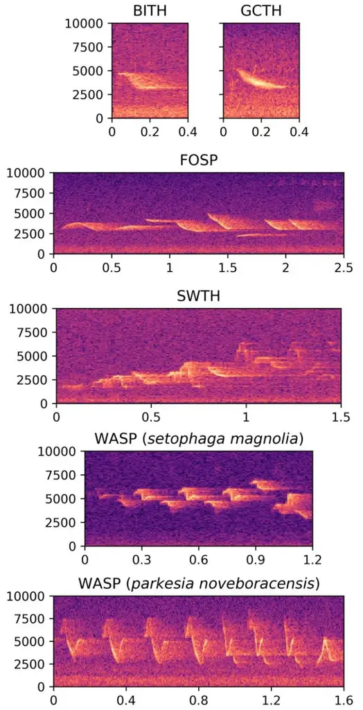
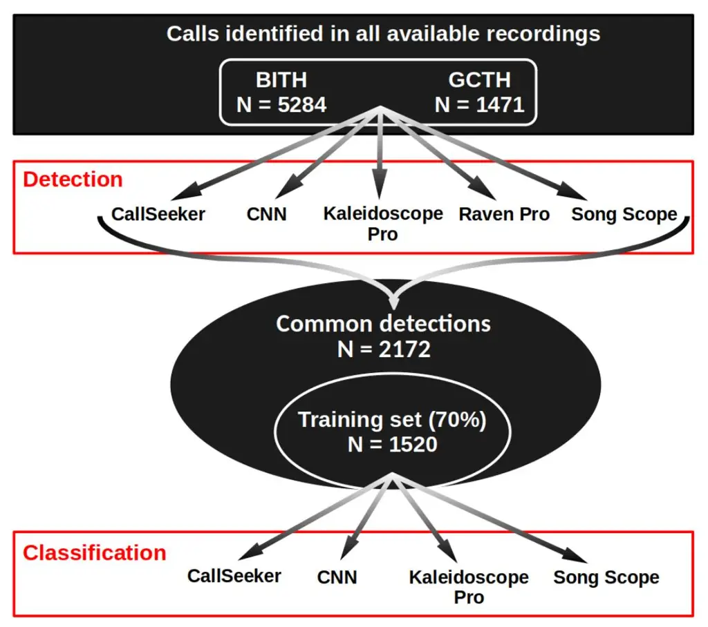
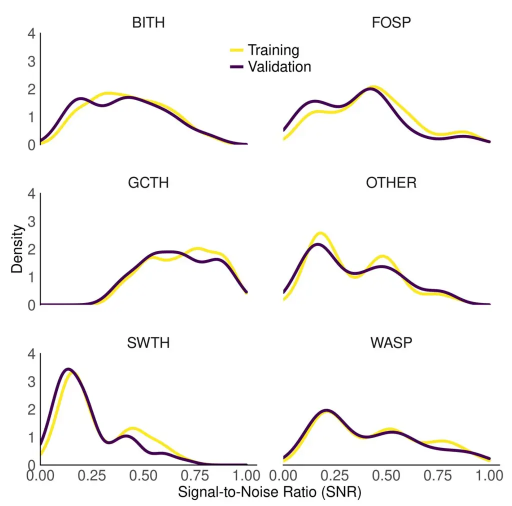
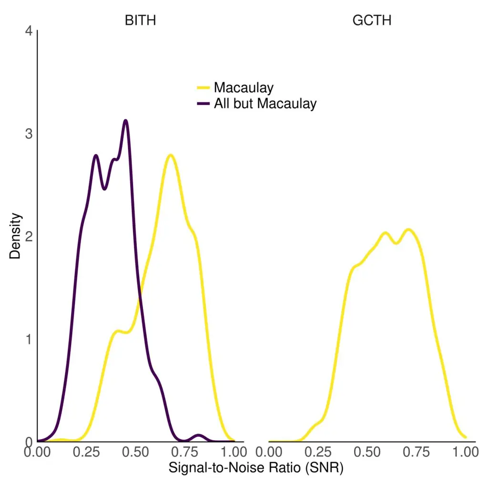
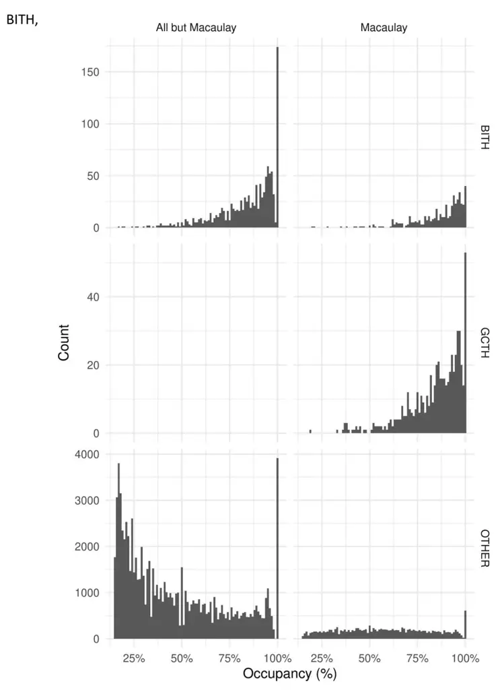

**Table S1.** Parameter settings used in CallSeeker software for call recognition of the Bicknell's Thrush and the Gray-cheeked Thrush.

| Parameter                     | Setting | Unit |
| ----------------------------- | ------- | ---- |
| Detection Threshold           | 4       | dB   |
| Minimum time between calls | 100     | ms   |
| Exponential decay gain        | 0.996   |      |
| Minimum duration              | 100     | ms   |
| Maximum duration              | 500     | ms   |
| Low-pass cutoff               | 6       | kHz  |
| High-pass cutoff              | 2       | kHz  |

**Table S2.** Parameter settings used to train the convolutional neural network for call recognition of the Bicknell's Thrush and the Gray-cheeked Thrush.

| Parameter       | Setting              | Unit |
| --------------- | -------------------- | ---- |
| Loss            | Binary cross-entropy |      |
| Optimiser       | Adam                 |      |
| Learning rate   | 0.01                 |      |
| Batch size      | 32                   |      |
| Score threshold | 0.5                  |      |

**Table S3.** Parameter settings used in Kaleidoscope software for call recognition of the Bicknell's Thrush and the Gray-cheeked Thrush.

| Parameter                    | Setting                                                   | Unit |
| ---------------------------- | --------------------------------------------------------- | ---- |
| Minimum frequency            | 2000                                                      | Hz   |
| Maximum frequency            | 6000                                                      | Hz   |
| Minimum duration             | 0.1                                                       | s    |
| Maximum duration             | 0.5                                                       | s    |
| Max distance from cluster | 2                                                         |      |
| FFT Window size              | 5.33 (256 @0-24 kHz 512 @25-48 kHz 1024 @49-96 kHz) | ms   |
| Max states                   | 12                                                        |      |
| Max distance to cluster      | .5                                                        |      |
| Max clusters                 | 500                                                       |      |

**Table S4.** Parameter settings used in Raven software for call detection of the Bicknell's Thrush and the Gray-cheeked Thrush.

| Parameter          | Setting | Unit |
| ------------------ | ------- | ---- |
| Minimum frequency  | 3500    | Hz   |
| Maximum frequency  | 4200    | Hz   |
| Minimum duration   | 100     | ms   |
| Maximum duration   | 500     | ms   |
| Minimum separation | 100     | ms   |
| Minimum occupancy  | 15      | %    |
| SNR threshold      | 7       | dB   |
| Block size         | 1.5     | s    |
| Hop size           | 500     | ms   |
| Percentile         | 35      | %    |

**Table S5.** Parameter settings used in Song Scope software for call recognition of the Bicknell's Thrush and the Gray-cheeked Thrush.

| Parameter          | Setting | Unit      |
| ------------------ | ------- | --------- |
| Sample rate        | 24000   | Hz        |
| FFT size           | 256     | bin       |
| FFT overlap        | ½       |           |
| Frequency minimum  | 21      | bin       |
| Frequency range    | 43      | bin       |
| Amplitude gain     | 0       | dB        |
| Background filter  | 5       | s         |
| Max syllable       | 500     | ms        |
| Max syllable gap   | 1       | ms        |
| Max song           | 500     | ms        |
| Dynamic range      | 30      | dB        |
| Algorithm          | 2.0     |           |
| Maximum complexity | 32      | state     |
| Maximum resolution | 8       | dimension |
| Score threshold    | 0       |           |
| Score threshold    | 0       |           |

**Figure S1.** Spectrograms showing the vocalisations of our target species as well as those of bird species often confused with our target species.

BITH, Bicknell's Thrush; FOSP, Fox Sparrow; GCTH, Gray-cheeked Thrush; OTHER, any other detection; SWTH, Swainson's Thrush; WASP, Warblers sp.

**Figure S2.** Methodological framework illustrating which calls and detected audio events were used to evaluate the performance of the software in the detection and classification steps.

CNN, Convolutional Neural Network. Raven Pro does not offer automated classification of detected audio events, and therefore does not appear in the classification section.

**Figure S3.** Distribution of average Signal-to-Noise Ratios (SNR) of detected audio events (_i.e._, background noises and vocalisations) in the training and validation datasets.

BITH, Bicknell's Thrush; FOSP, Fox Sparrow; GCTH, Gray-cheeked Thrush; OTHER, any other detection; SWTH, Swainson's Thrush; WASP, Warblers sp. SNR is calculated as the sum of the energy in the frequency band 2–6 kHz over the total energy contained in all frequency bands. Separate analyses were performed depending on whether the calls were located in the Macaulay library recordings or not (_i.e._, field recordings).

**Figure S4.** Distribution of the recording quality of the audio segments delimiting the calls of Bicknell's Thrush (BITH) and Grey-cheeked Thrush (GCTH) previously identified manually in the recordings used for the detection step, according to their origin (from the Macaulay library or not). The recording quality is defined here as the Signal-to-Noise Ratio (SNR).

The SNR was calculated as described in the caption to Figure S1.

**Figure S5.** Distribution of occupancy per class and origin (from the Macaulay library or not) as calculated by Raven Pro.

Bicknell's Thrush; GCTH, Gray-cheeked Thrush; OTHER, any other detection.
