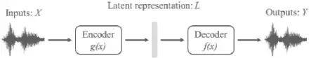
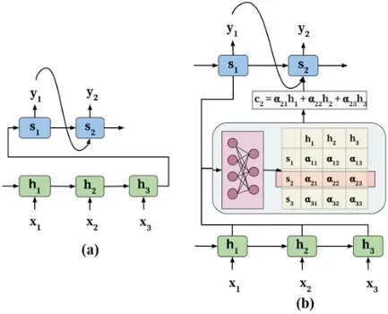
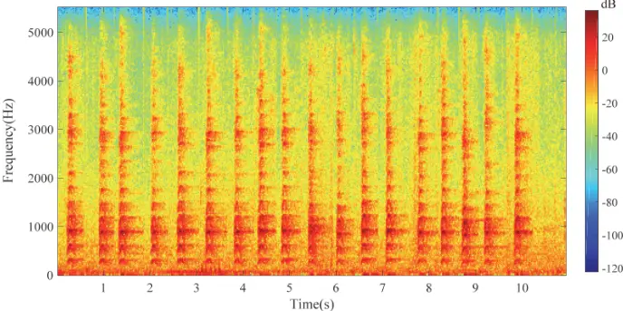
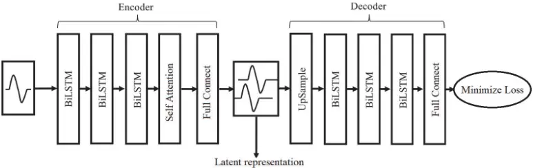
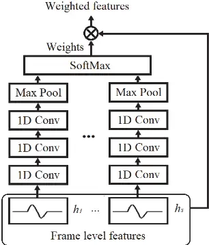
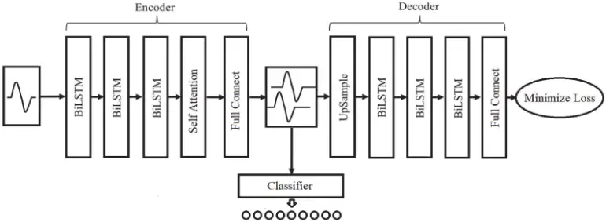
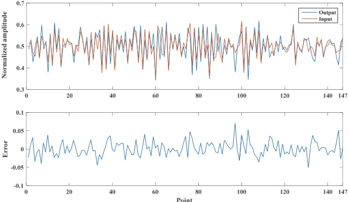
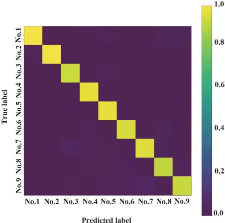
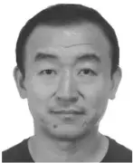

Received December 25, 2019, accepted February 5, 2020, date of publication February 11, 2020, date of current version March 10, 2020.

Digital Object Identifier 10.1109/ACCESS.2020.2973243

## High Accuracy Individual Identification Model of Crested Ibis (Nipponia Nippon) Based on Autoencoder With Self-Attention

## JIANGJIAN XIE 1,2 , JUN YANG 1 , CHANGQING DING 3 , AND WENBIN LI 1,2

1 School of Technology, Beijing Forestry University, Beijing 100083, China

2 Key Laboratory of National Forestry and Grass land Administration for Forestry Equipment and Automation, Beijing Forestry University, Beijing 100083, China 3 School of Ecology and Nature Conservation, Beijing Forestry University, Beijing 100083, China

Corresponding authors: Changqing Ding (cqding@bjfu.edu.cn) and Wenbin Li (leewb@bjfu.edu.cn)

This work was supported in part by the National Natural Science Foundation of China under Grant 31670553 and Grant 31772483, in part by the Natural Science Foundation of Beijing Municipality under Grant 6192019, in part by the Fundamental Research Funds for the Central Universities under Grant 2016ZCQ08, and in part by the Science and Technology Project of State Grid Corporation of China under Grant SGGR0000WLJS1801082.

ABSTRACT As the population and the distribution of Crested Ibis (Nipponia nippon) become larger, it is necessary to propose a highly ef�cient census method to estimate the population size of the Crested Ibis. Passive acoustic monitoring (PAM) has a very good prospect for the Crested Ibis monitoring. To realize the automatic census of the Crested Ibis with PAM, the automatic individual identi�cation method based on the vocalization is the key technology. A novel individual identi�cation model was proposed in this paper, which built the autoencoder based on LSTM to obtain the meaningful latent representation from the raw recording directly, further, embedded self-attention and putted forward a combined training mode to achieve distinctive latent representation. With this model, nine Crested Ibis individuals were identi�ed accurately, the highest accuracy is 0.971, and the average accuracy reaches 0.958. As for other three species, Little owl (Athene noctua), Chiffchaff (Phylloscopus collybita) and Tree pipit (Anthus trivialis), the better performances were achieved than the existing method, which means the proposed model can provide an alternative method for the individual identi�cation of other bird species.

INDEX TERMS Nipponia nippon, individual identi�cation, autoencoder, self-attention, LSTM.

## I. INTRODUCTION

Crested Ibis (Nipponia nippon) is a globally endangered bird species (IUCN, 2019). From 1981, many effective conservation measures were taken by the Chinese government, the population size and distribution areas of Crested Ibis have been increasing year by year. In 2012, the number of Crested Ibis reached 1090 in Shaanxi Hanzhong Crested Ibis National Nature Reserve [1]. Although the IUCN Red List of the Crested Ibis has been upgraded from critically endangered (CR) to endangered (EN) [2], the Crested Ibis has not gotten rid of the danger of extinction completely. The census of the population size and distribution of the Crested Ibis is the foundation of protection work.

Crested Ibis is resident bird with seasonal activity characteristics. Its activity period can be divided into breeding

The associate editor coordinating the review of this manuscript and approving it for publication was Robert P. Schumaker.

period (February to June), wandering stage (July to November) and overwintering period (December to January of the next year). During the wandering period, the Crested Ibis has the habit of roosting in groups on high arbor at night [3]. Based on this habit, the existing census method of the Crested Ibis was proposed [1]. In this method, researchers need to count the number of the Crested Ibis individuals in each roosting site at the same time, then the summation of each roosting site is the population size of the study area. This method can be thought as a speci�c point count method, which needs a lot of human resource, material resource and �nancial resource, and the census ef�ciency is low. It is not suitable to be used as a conventional census method. Moreover, as the census is performed in dusk, the leaves may obscure part of the Crested Ibis body, which makes the census results are easily affected by subjective factors such as the eyesight, census skills and experiences of the researchers. Also, the results cannot be repeatedly veri�ed, and have a strong subjectivity. It is necessary to propose a higher ef�cient census method of the Crested Ibis.

By using remote autonomous recording units(ARUs), passive acoustic monitoring (PAM) can be a non-invasive, large spatial and temporal scale monitoring method, which has a very good prospect for the bird monitoring [4]�[6]. To realize the automatic census of the bird with PAM, the automatic individual identi�cation method based on the vocalization is the key technology. To our best knowledge, most existing methods realized the individual identi�cation with human designed features, different kinds of features lead to different performance for certain identi�cation task [7]�[12]. It is meaningful to propose a general automatic individual identi�cation method for multiple species.

The vocalization features of the Crested Ibis can be used to identify the individuals [13], which is the basis for automatic identi�cation. With the rapid development of deep learning technology, the bird detection and identi�cation methods based on audio using deep learning technology have become the state-of-the-art. In this paper, a novel individual identi�cation method of the Crested Ibis was proposed based on autoencoder and Long Short-Term Memory (LSTM) network. The remainder of this paper is arranged as follows: in Section II, we brie�y review the related works on automatic individual identi�cation, autoencoder with LSTM and attention mechanism. Section III presents the proposed latent representation extraction model based on autoencoder �rstly, then individual identi�cation model is presented. In section IV, we describe the data preparation, structure parameters of the proposed model, further compare the performance with different model structure and existing model through experiments. Finally, Section V shows the conclusion.

## II. RELATEDWORK

## A. AUTOMATIC INDIVIDUAL IDENTIFICATION METHOD BASED ON THE VOCALIZATION

Given the number of bird individuals, the individual identi�cation can be considered as a classi�cation problem. Cheng [7] realized the individual recognition of 40 Bulbuls with support vector machine, and the accuracy reached 90%. Budka et al. [8] selected the pulse-to-pulse duration (PPD) of the call as individual-speci�c feature of the Corncrake(Crex crex), a high percentage of 98 % was achieved when the number of individuals is 122. Arriaga et al. [9] used an ensemble of learners to identify individual Cassin's Vireo from the structural properties of their vocalizations. The ensemble achieved 96% accuracy identifying 13 individual birds within the same year and 95% for 8 individual birds across two years. Cao [10] realized the recognition of 10 Crested Ibis individuals by building Gaussian mixture model of different individuals, with the highest recognition rate of 84.73%. Zsebfik et al. [11] conducted discriminant function analysis on ten selected acoustic parameters to distinguish 26 male Common Cuckoos(Cuculus canorus) individuals, the accuracy exceeded 90%. Takagi [12] used the discriminant function analyses (DFAs) to identify 31 Ryukyu Scops Owls male individuals with 11 hoot parameters, which achieved a 97.4% probability of correct classi�cation. Stowell et al. [14] introduced two audio mixing based data augmentation method to reduce the confounding effect of background sound, then spherical k-means method was used to learn features from mel spectrograms of both foreground and background sounds, �nally, a random forest classi�er was utilized to identify 13 little owls (Athene noctua), 10 chiffchaffs (Phylloscopus collybita) and 10 tree pipits (Anthus trivialis), the best AUC was 92.6%.

## B. LATENT REPRESENTATION BASED ON THE AUTOENCODER

Extracting discriminable latent representation of the input vocalization is critical to achieve high performance. Autoencoder is a kind of neural networks, the ideal output of which is its input data. As shown in Fig. 1, the autoencoder can be divided into two following parts: encoder network and decoder network [15]. The encoder network converts the high-dimensional input data X into low-dimensional codes L, which can be represented by an encoding function LD g(X). The decoder network rebuilds the inputs from the generated codes, it can be represented by a decoding function Y D f(L). The autoencoder makes the output Y as close as the input X, which means that the generated codes contain most of the information of the input data. Then, the generated codes can be regarded as the latent representation of the input data.

FIGURE 1. The architecture of an autoencoder.

LSTM network is an ef�cient recurrent neural network (RNN) and uses one or multiple memory cells to replace hidden neurons of the conventional RNN [16]. The memory cell consists of a memory unit c, a hidden state h, an input gate i, a forget gate f , and an output gate o. These gates are introduced for the reading and writing to the memory unit. For the time step t, given an input xt and the hidden state of the last time step ht�1, the update of the memory cell is realized by the following formulasV

<!-- formula-not-decoded -->

<!-- formula-not-decoded -->

<!-- formula-not-decoded -->

<!-- formula-not-decoded -->

<!-- formula-not-decoded -->

where � (x) D 1=(1Cexp(�x)) is a logistic sigmoid function; W and b are the weights and biases of the memory unit and three gates.

From the above equations, it is concluded that the values of the previous time step will certainly affect the outputs of all three gates and the inputs in the current time step, which enable it to store states. Hence, the LSTM performs excellently for time series prediction tasks [17], [18].

Due to above advantages, Autoencoder based on LSTM had been used for extracting the latent representations of many kinds of data and achieved good performances, such as time sequence data [19], image data [20], [21] and biological data [22] et al.

## C. ATTENTION MECHANISM

Attention mechanism(AM) was �rst proposed by D. Bahdanau et al. in the machine translation task [23], it is becoming more and more popular in the design of neural networks recently.

AM comes from the human biological systems. For example, humans are prone to focus on meaningful parts of the image, while omitting other irrelevant information to achieve better perception. AM realizes different levels of attention through empowering the model to dynamically pay attention to only certain parts of the input that improve the performance effectively. Take the model of [23] as example (shown in Fig.2 adapted from [24])), the core idea is introducing the attention weights � to the input sequence to scale the importance of the encoded input sequence (h1, h2,. . . , hT). The context vector c is calculated with these attention weights, and inputted to the decoder, which makes the decoder can access the whole input sequence also focus on relevant positions in the input sequence.

FIGURE 2. Example model: (a) traditional (b) with attention model.

Given good performance, there are numerous applications of AM in Natural Language Processing [25], [26], Speech Recognition [27], [28], Text Processing [29] and Computer Vision [30], et al.

## III. PROPOSED MODELS AND THEIR TRAININGS

## A. LATENT REPRESENTATION OF THE CRESTED IBIS CALL

The vocal of the Crested Ibis is mainly call. According to different behaviors of the Crested Ibis, there are several kinds of calls, such as mating call, alert call and answer call et al.

The spectrum structures of the calls are relatively simple, and their spectrograms are always multi-harmonic with frequency bands of line and half-arched structure [31], [32]. The example spectrogram of the answer calls is shown in Fig. 3.

Due to the sample structure, it is more dif�cult to identify the Crested Ibis individual by the call. To extraction effective latent representation of the Crested Ibis call, it is necessary to not only extract the features of each call, but also the relationship features between the neighboring calls. An autoencoder was proposed to obtain the discriminative latent presentations of different Crested Ibis individual, its overview is shown in Fig. 4.

There are three bidirectional LSTMs (BI-LSTMs), a selfattention model and one full connect layer to obtain the latent representation. BI-LSTM can learn temporal features in both time directions, which is advantage for fetching the feature between the neighboring calls.

The self-attention model is shown in Fig. 5, h1; h2. . .hs (s is the time steps of the BI-LSTM) are the frame level feature of each time step respectively, which are the outputs of the third BI-LSTM. Each frame level feature is compressed by three 1D convolutional layers and one 1D max pooling layer. At last, the softmax layer is used to achieve the weights of the features of all the time steps. The weights control how much the input of each time step should be attended or ignored. At last, the weighted features are calculated by the dot product of the frame level features and the weights.

The full connect layer is used to achieve a much smaller latent space. Autoencoder learns the latent representation from the raw recordings directly, which can reduce the human factors in the feature design as much as possible. Reconstruction is generated by an upsampling layer followed by three BI-LSTMs and one full connect layer to obtain autoencoder output.

Huber Loss is a loss function for regression problems, its advantage is that it can enhance the robustness of the mean square error (MSE) to outliers. The Huber Loss between the input sequence and the reconstructed sequence from the latent representation is selected as the cost function, which ensures that the reconstructed sequence is well represented after the dimensionality reduction. The loss (LossHL) is calculated as follows [33]:

<!-- formula-not-decoded -->

where y is the true value, \_ y is the predicted value, � is the parameter of Huber Loss, it is a boundary used to determine whether the data point is an outlier. The data within this boundary uses MSE Loss by default, data larger than this boundary uses a linear function. This method can reduce the weight of outliers for loss and avoid over�tting the model.

The Huber Loss is mainly focused on the amplitude difference between the input and predicted output. To reconstruct the input more accurately, cosine distance (CD) loss is introduced to reduce the phase difference between the input and dB

FIGURE 3. Example spectrograms of the answer calls.

FIGURE 4. The overview of proposed latent representation extraction model.

FIGURE 5. The overview of proposed self-attention model.

predicted output. Then, the whole loss (LossAE) is calculated as followV

<!-- formula-not-decoded -->

where nor() is the normalization process, � is the trade-off of two losses, LossCD(u; v) is the calculation of cosine distance between u and v, the formula is as follow [34].

<!-- formula-not-decoded -->

## B. INDENTIFICATION MODEL OF THE CRESTED IBIS CALL

An identi�cation model was designed to identify the Crested Ibis individual based on its calls. Fig. 6 shows the overview of the proposed identi�cation model, the latent representation is inputted into a classi�er which concludes two full connect layers and a softmax layer.

Considering the data set is unbalance, a weighted cross entropy loss function was introduced. This loss function solves the problem of unbalanced data through increasing the weight of the individual with few samples. For multi-class identi�cation, the improved cross entropy loss of the jth (j D 1,2,3. . .NB) sample in current batch belonging to the ith (i D 1,2,3. . .NC) class isV

<!-- formula-not-decoded -->

where NB is the batch size, NC is the number of classes, yi represents whether the sample belongs to the ith class, its value is 1 when the sample belongs to the ith class, otherwise is 0. \_ yi denotes the prediction probability that the sample belongs to the ith class. �i is the weight of the ith class, which is determined by the following equationV

FIGURE 6. The overview of proposed identification model.

<!-- formula-not-decoded -->

where �i indicates the ratio of the sample size of the ith class to the whole sample size.

The improved loss (LossCE) is calculated as followV

<!-- formula-not-decoded -->

Further, a combined training mode was induced: during the training step, the trained parameters of the autoencoder are used as initial values to �netune the identi�cation model, and the optimization is executed by the minimization of the sum of two losses, one is LossAE, the other is the improved loss (LossCE). The �nal loss (LossC) is calculated as followsV

<!-- formula-not-decoded -->

where � represents the trade-off of two losses.

## IV. EXPERIMENT AND ANALYSIS

## A. DATA PREPARATION

## 1) DATA COLLECTION

During January 10-22 and March 22-April 25, 2011, we recorded the audios of the Crested Ibises in the morning (before sunrise-10:00), and late afternoon (16:00-20:00), at two different places: Crested Ibis Ecological Park (107 � 56'E, 33 � 26'N), Huayang Crested Ibis Acclimation Base (107 � 53'E, 34 � 00'N) in Yangxian County, Shaanxi Province. These Crested Ibises are captive-bred individuals in cages, all the individuals were marked individually with numbered metal bands on their legs, which brings the convenience for the labeling of the recording of speci�c individual. All the audios were manually recorded with the following equipment: Marantz PMD-671 (MARANTZ, Japan) solid-state recorder and Sennheiser MKH416-P48 (SENNHEISER ELECTRONIC, German) directional microphone. The sampling frequency and the format of the recordings are 11025Hz and 16bit PCM respectively. At last, 92 individuals were recorded, 62 from Crested Ibis Ecological Park, 30 from Huayang Crested Ibis Acclimation Base.

Hereafter, the recordings of 9 Crested Ibis individuals were selected to perform our latter experiments. The signalto-noise ratios of the selected recordings were very good (subjectively assessed), and the environmental sounds, other animal sounds were relative weak compared to the vocalization of Crested Ibis. The recording examples can be download from the website in APPENDIX. After deleting the obvious part with no Crested Ibis call form the raw recordings, the total durations of the recording datasets of 9 Crested Ibis individuals are listed in Table 1.

TABLE 1. Details of the recording datasets used.

| Individual No. | Total durations | Total durations after augmentation | Number of samples |
| -------------- | --------------- | ---------------------------------- | ----------------- |
| 1              | 2min15s         | 14min15s                           | 644               |
| 2              | 1min27s         | 13min19s                           | 782               |
| 3              | 1min32s         | 14min34s                           | 1139              |
| 4              | 1min21s         | 13min18s                           | 645               |
| 5              | 1min03s         | 13min49s                           | 1102              |
| 6              | 1min23s         | 16min05s                           | 651               |
| 7              | 2min12s         | 15min37s                           | 793               |
| 8              | 2min19s         | 14min43s                           | 564               |
| 9              | 1min01s         | 14min46s                           | 792               |

## 2) DATA AUGMENTATION

Deep learning system commonly requires large amounts of data to train the model, which means it is infeasible for tasks with limit recordings per individual. Data augmentation is an effective measure to expand dataset size. Data augmentation refers to the implement of comprehensively producing additional data samples by modifying or recombining existing samples. For audio data, this could be performed by several methods, such as stretching time, adding noise, shifting pitch, modifying loudness, acting on the log mel spectrogram, �ltering or mixing audio clips together [35], [36]. Training with the arti�cially enlarged datasets often results in improving the performance of automatic classi�cation [35], which helps to reduce the effects of limited data availability.

In this work, mixing audio clips was chosen as the augmentation method. The audio edit software Audacity 2.1.1 was used to execute the mixing of the Crested Ibis recordings. The independent calls are cropped to fragments, which are mixed IEEEAccesS

randomly among the recordings from the same individual, and integrated to new recordings afterward. The details of augmented data are list in Table 1 too.

## 3) DATA SEGMENTATION

To reduce the in�uences of the silent parts of the recordings, silent parts were discarded through energy threshold method. In this method, each recording was split into short frames (20ms), then the frames with energy lower than the percentile thresholding were abandoned.

As in many previous researches, the recordings were always segmented into separate parts with the same duration before being fed into the identi�cation model [37]. It is analyzed that the duration of most of the Crested Ibis calls is about 600ms. Then, after the modi�cation process of data augmentation and silent remove, all the modi�ed recordings were segmented into several frames of length 6615 (600ms), with Hamming windows, 50% frame overlap. If the last frame is shorter than 6615, it will be discarded. It means that the shape of the input of the proposed autoencoder is [s, 6615/s]. For each Crested Ibis individual, the number of produced frames is listed in Table 1. During the training step, the data set is randomly split into train set and test set with a ratio of 8:2.

## B. EXPERIMENTAL RESULTS AND ANALYSIS

## 1) EXPERIMENT CONDITIONS AND PARAMETERS SETTING

All the experiments were implemented using Python, TensorFlow 1.12.0 software and 64 bits win 10 operation system, 64 GB memory, 8 cores of 3.6 GHz CPU, two GTX 1080Ti GPUs of NVIDIA Company.

After several attempts, the optimal structure parameters of the proposed identi�cation model were selected, there are shown in Table 2. Also, the parameter choices involved in the training process are shown in Table 3.

## 2) COMPARISONS BETWEEN AUTOENCODERS WITH DIFFERENT CONFIGURATION

Autoencoder is used to achieve the latent presentations of the inputs. Performance of autoencoder is better when the output is closer to the input. To obtain an optimal autoencoder, six following different con�gurations of the proposed autoencoder were studied:

1. Autoencoder with self-attention and LossAE (SA-LAE).
2. Autoencoder with self-attention and LossHL (SA-LHL).
3. Autoencoder with self-attention and LossCD (SA-LCD).
4. Autoencoder without self-attention, with LossAE (NSA-LAE).
5. Autoencoder without self-attention, with LossHL (NSA-LHL).
6. Autoencoder without self-attention, with LossCD (NSA-LCD).

The MSE and CD are selected as the metrics of the performance of autoencoder. Twenty randomly chosen inputs and the corresponding predicted outputs were normalized to [0, 1]

TABLE 2. Structure parameters of the proposed identification model.

| Part        | Type                        | Configuration                    | Output |
| ----------- | --------------------------- | -------------------------------- | ------ |
|             | BI-LSTM1                    | Cell number: 256; Time steps: 45 | 45×512 |
|             | BI-LSTM2                    | Cell number: 128; Time steps: 45 | 45×256 |
|             | BI-LSTM3                    | Cell number:128; Time steps: 45  | 45×256 |
|             | 1D conv1 (Self- attention)  | Kernel size: 32; Stride: 4       | 1×57   |
|             | 1D conv2 (Self-attention)   | Kernel size: 17; Stride: 2       | 1×21   |
|             | 1D conv3 (Self- attention)  | Kernel size: 9; Stride: 2        | 1×7    |
| Autoencoder | 1D Maxpool (Self-attention) | Size: 7                          | 1      |
|             | Softmax1                    | Node number: 45                  | 1×45   |
|             | Full connect1               | Node number: 64                  | 1×64   |
|             | Full connect2               | Node number: 6615                | 1×6615 |
|             | BI-LSTM4                    | Cell number: 128; Time steps: 45 | 45×256 |
|             | BI-LSTM5                    | Cell number: 128; Time steps: 45 | 45×256 |
|             | BI-LSTM6                    | Cell number: 256; Time steps: 45 | 45×512 |
|             | Full connect3               | Node number: 147                 | 45×147 |
|             | Full connect4               | Node number: 256                 | 1×256  |
| Classifier  | Full connect5               | Node number: 64                  | 1×64   |
|             | Softmax2                    | Node number: 9                   | 1×9    |

TABLE 3. Value choices of parameters.

| Parameters            | Value                                       |
| --------------------- | ------------------------------------------- |
| Activated function    | ReLu 1e-8 for autoencoder                   |
| Initial learning rate | 1e-6 for classifer                          |
| Batch size α          | 16 5                                        |
| β                     | 10                                          |
| δ                     | 0.9                                         |
| Parameter initializer | Xavier for LSTM Random for other            |
| Optimize algorithm    | LazyAdam for autoencoder Adam for classfier |

�rstly, the averages of MSE and CD between each pair of input and output were calculated and listed in Table 4.

As shown in Table 4, with the comprehensive consideration of both MSE and CD, the performance of SA-LAE is the best. Taken one timestep signal of No.1 individual as example, the input and output are shown in Fig. 7. It is demonstrated that both the amplitudes and phases of the input are well �tted by the output.

Also, it is found that without self-attention the MSE and CD are only a little higher than with self-attention, which means the in�uence of the self-attention to the reconstruction of the input is limited.

Point

FIGURE 7. The curves of input and predicted output and their error.

TABLE 4. Performances of different autoencoders.

| Model   | MSE      | CD        |
| ------- | -------- | --------- |
| SA-LAE  | 7.24e-4  | 7.15e-2   |
| SA-LHL  | 6.11e-4  | 16.37e- 2 |
| SA-LCD  | 14.23e-4 | 6.15e-2   |
| NSA-LAE | 7.51e-4  | 7.43e-2   |
| NSA-LHL | 6.52e-4  | 17.32e- 2 |
| NSA-LCD | 14.81e-4 | 7.13e-2   |

## 3) COMPARISONS OF IDENTIFICATION PERFORMANCE

After the training of the autoencoder weights, meaningful latent representations can be obtained. With these weights as the initial values, the weights of autoencoder and classi�er were further updated by minimizing the LossC to fetch the discriminative latent representations. This combed training mode can prevent any problematic result deviate from the original input [38], the latent representation will converge at a suitable representation through minimizing both the classi�cation loss (LossCE) and the autoencoder loss (LossAE).

As the control subjects, three different classi�ers from machine learning, Support vector machine (SVM), K-nearest neighbor (KNN), and Random Forest (RF) were built. There were trained to identify the individuals through using the latent representations of the proposed autoencoder (described in section III.A) as the inputs directly.

Area under the receiver operating curve (AUC) [39] is used to quantify the identi�cation performance. The performances with or without self-attention in autoencoder are compared, and the results are list in Table 5.

As shown in Table 5, whether with or without selfattention, PM-SA and PM-NSA both achieve the higher AUC

TABLE 5. Performance of three machine learning classifiers. PMmeans the proposed model in Table 2; SA means with self-attention; NSA means without self-attention.

| Models  | AUC   |
| ------- | ----- |
| PM-SA   | 0.965 |
| SVM-SA  | 0.912 |
| KNN-SA  | 0.844 |
| RF-SA   | 0.924 |
| PM-NSA  | 0.903 |
| SVM-NSA | 0.857 |
| KNN-NSA | 0.791 |
| RF-NSA  | 0.872 |

than these three machine learning models, which means the �netune is preferable to acquire more discriminative latent representation. When self-attention is included, higher AUC is achieved than without self-attention for the same classi�er. The largest difference is 0.062 for PM. It is implied that selfattention is favorable to seek out more distinctive parts of the input through training, which leads to more discriminative latent representation too.

Overall, PM-SA is superior to other models, which can be used to identify the Crested Ibis individual effectively. Further, to better analyze the classi�cation results, the averaged confusion matrix of PM-SA was plotted in Fig. 8. It is observed that the identi�cation accuracies of all the nine Crested Ibis individuals are higher than 0.9. The lowest is 0.912 for No.8 individual, the highest accuracy of No.1 individual is 0.971, and the average accuracy is 0.958, it is 0.111 higher than the highest accuracy of [10], even though their recordings with lower disturbing sound than ours, which means PM-SA model has an excellent ability to identify different Crested Ibis individuals.

## 4) PERFORMANCE OTHER BIRD SPECIES

To validate whether the proposed model can be used for other species, the recordings of three species: Little owl

FIGURE 8. Confusion matrix of the best result for PM-SA.

(Athene noctua), Chiffchaff (Phylloscopus collybita) and Tree pipit (Anthus trivialis)were utilized to test the proposed model. The download link of their labeled individual recordings can be found in [14]. The foreground recordings were selected as our datasets. These audio �les are 44.1 kHz mono WAV �les, grouped into subfolders according to species and each was labeled to certain individual. The individual numbers of three species are listed in Table 6. According to the duration distribution of the calls and syllables, the input lengths of little owl, tree pipit and chiffchaff were set to 800ms, 1000ms and 200ms respectively. Further, the structure parameters of the identi�cation models for three species were adjusted to achieve well performance. For different species, the AUCs of our models and the optimal model in [14] were compared in Table 6. The AUCs of [14] are calculated approximately from its �gures.

TABLE 6. AUC comparisons of different species.

| Species                | Numbers | Our models | Optimal model in [18] |
| ---------------------- | ------- | ---------- | --------------------- |
| chiffchaff within-year | 13      | 0.935      | 0.926                 |
| chiffchaff across-year | 10      | 0.814      | 0.60                  |
| little owl cross-year  | 16      | 0.902      | 0.86                  |
| pipit within-year      | 10      | 0.921      | 0.91                  |
| pipit across-year      | 10      | 0.878      | 0.85                  |

As shown in Table 6, all the AUCs of our models are higher than 0.85, and there are generally higher than that of the model in [14], especially for the AUC of chiffchaff across-year, which improved 35.67% than the AUC of the model in [14]. Then, it is concluded that the proposed model can extract discriminative latent representation of the bird vocalization and classify them accurately.

## V. CONCLUSION

In this paper, a novel identi�cation model for Crested Ibis individual based on its call was proposed. This model utilized autoencoder with LSTM as the backbone network, further, self-attention was embedded to achieve the distinct latent representation of the input. In the experiments, nine Crested Ibis individuals were identi�ed accurately, the highest accuracy is 0.971, and average accuracy reaches 0.958. Finally, through the experiments on Little owl (Athene noctua), Chiffchaff (Phylloscopus collybita) and Tree pipit (Anthus trivialis), it is found that proposed model can achieve higher AUC than the model in [18], which means the proposed model can be used for bird individual identi�cation with high accuracy.

In the future, we will research on the individual identi�cation method with noisy recordings and higher abundant populations, even when the number of individuals is previous unknown.

## APPENDIX

Recording examples of the Crested Ibis individuals can be download at https://github.com/shyneforce/Crested-IbisNipponia-Nippon-identi�cation/tree/recording-example.

## REFERENCES

- [1] C. Wang, D. Liu, B. Qing, H. Ding, Y. Cui, Y. Ye, J. Lu, L. Yan, L, Ke and C. Ding, ''The current population and distribution of wild Crested Ibis Nipponia nippon,'' Chin. J. Zool., vol. 49, no. 5, pp. 666�671, 2014.
- [2] ''The IUCN red list of threatened species. Version 2019-3,'' Standards Petitions Subcommittee, Int. Union Conservation Nature Natural Resour., Gland, Switzerland, Tech. Rep., 2019.
- [3] C. Ding, Research on the Crested Ibis. Shanghai, China: Shanghai Science and Technology, 2004, pp. 97�105.
- [4] A. K. Kalan, R. Mundry, O. J. J. Wagner, S. Heinicke, C. Boesch, and H. S. K�hl, ''Towards the automated detection and occupancy estimation of primates using passive acoustic monitoring,'' Ecol. Indicators, vol. 54, pp. 217�226, Jul. 2015.
- [5] O. SedlÆ£ek, J. VokurkovÆ, M. Ferenc, E. N. Djomo, T. Albrecht, and D. Ho�Æk, ''A comparison of point counts with a new acoustic sampling method: A case study of a bird community from the montane forests of mount cameroon,'' Ostrich, vol. 86, no. 3, pp. 213�220, Jun. 2015.
- [6] C. P. Granados, G. Bota, D. Giralt, A. Barrero, J. G. Catasœs, D. B. De La Rosa, and J. Traba, ''Vocal activity rate index: A useful method to infer terrestrial bird abundance with acoustic monitoring,'' Ibis, vol. 161, no. 4, pp. 901�907, Apr. 2019.
- [7] J. Cheng, ''Automatic bird species and individual recognition and the analysis of bird vocalizations,'' Ph.D. dissertation, Univ. Chin. Acad. Sci., Beijing, China, 2012.
- [8] M. Budka, L. Wojas, and T. S. Osiejuk, ''Is it possible to acoustically identify individuals within a population?'' J. Ornithol., vol. 156, no. 2, pp. 481�488, 2015.
- [9] J. G. Arriaga, H. Sanchez, E. E. Vallejo, R. Hedley, and C. E. Taylor, ''Identi�cation of Cassin's vireo (Vireo cassinii) individuals from their acoustic sequences using an ensemble of learners,'' Neurocomputing, vol. 175, pp. 966�979, Jan. 2016.
- [10] Q. Cao, ''For individual recognition technology based on chirpCrested Ibis research,'' M.S. thesis, Xi'an University of Architecture and Technology, Xi'an, China, 2016.
- [11] S. Zsebfik, C. MoskÆt, and M. BÆn, ''Individually distinctive vocalization in common cuckoos (Cuculus canorus),'' J. Ornithol., vol. 158, no. 1, pp. 213�222, 2017.
- [12] M. Takagi, ''Vocalizations of the ryukyu scops owl otus elegans: Individually recognizable and stable,'' Bioacoustics, vol. 29, no. 1, pp. 28�44, Nov. 2018.
- [13] Y. Bai, ''Study on calls of the Crested Ibis(Nipponia nippon),'' M.S. thesis, Shaanxi Normal Univ., Xi'an, China, 2005.

IEEEAccesS

- [14] D. Stowell, T. PetruskovÆ, M. �Ælek, and P. Linhart, ''Automatic acoustic identi�cation of individuals in multiple species: Improving identi�cation across recording conditions,'' J. Roy. Soc. Interface, vol. 16, no. 153, Apr. 2019, Art. no. 20180940.
- [15] Y. Bengio, P. Lamblin, D. Popovici, and H. Larochelle, ''Greedy layerwise training of deep networks,'' in Proc. Adv. Neural Inf. Process. Syst., Vancouver, BC, Canada, 2007, pp. 153�160.
- [16] S. Hochreiter and J. Schmidhuber, ''Long short-term memory,'' Neural Comput., vol. 9, no. 8, pp. 1735�1780, 1997.
- [17] F. Karim, S. Majumdar, H. Darabi, and S. Chen, ''LSTM fully convolutional networks for time series classi�cation,'' IEEE Access, vol. 6, pp. 1662�1669, 2018.
- [18] K. Yan, W. Li, Z. Ji, M. Qi, and Y. Du, ''A hybrid LSTM neural network for energy consumption forecasting of individual households,'' IEEE Access, vol. 7, pp. 157633�157642, 2019.
- [19] S. Mao, J. Guo, and Z. Li, ''Discriminative autoencoding framework for simple and ef�cient anomaly detection,'' IEEE Access, vol. 7, pp. 140618�140630, 2019.
- [20] F. Zhao, J. Feng, J. Zhao, W. Yang, and S. Yan, ''Robust LSTMautoencoders for face de-occlusion in the wild,'' IEEE Trans. Image Process., vol. 27, no. 2, pp. 778�790, Feb. 2018.
- [21] P. Kumar Mallick, S. H. Ryu, S. K. Satapathy, S. Mishra, G. N. Nguyen, and P. Tiwari, ''Brain MRI image classi�cation for cancer detection using deep wavelet autoencoder-based deep neural network,'' IEEE Access, vol. 7, pp. 46278�46287, 2019.
- [22] Z. Si, H. Yu, and Z. Ma, ''Learning deep features for DNA methylation data analysis,'' IEEE Access, vol. 4, pp. 2732�2737, 2016.
- [23] D. Bahdanau, K. Cho, and Y. Bengio, ''Neural machine translation by jointly learning to align and translate,'' 2014, arXiv:1409.0473. [Online]. Available: http://arxiv.org/abs/1409.0473
- [24] S. Chaudhari, G. Polatkan, R. Ramanath, and V. Mithal, ''An attentive survey of attention models,'' 2019, arXiv:1904.02874. [Online]. Available: http://arxiv.org/abs/1904.02874
- [25] A. Vaswani, N. Shazeer, N. Parmar, J. Uszkoreit, L. Jones, A. N. Gomez, �. Kaiser, and I. Polosukhin, ''Attention is all you need,'' in Proc. Adv. Neural Inf. Process. Syst., Long Beach, CA, USA, 2017, pp. 5998�6008.
- [26] D. Hu, ''An introductory survey on attention mechanisms in NLP problems,'' in Proc. SAI Intell. Syst. Conf., London, U.K., 2019, pp. 432�448.
- [27] S.-X. Zhang, Z. Chen, Y. Zhao, J. Li, and Y. Gong, ''End-to-End attention based text-dependent speaker veri�cation,'' in Proc. IEEE Spoken Lang. Technol. Workshop (SLT), San Juan, Puerto Rico, Dec. 2016, pp. 171�178.
- [28] J. K. Chorowski, D. Bahdanau, D. Serdyuk, K. Cho, and Y. Bengio, ''Attention-based models for speech recognition,'' in Proc. Adv. Neural Inf. Process. Syst., Montreal, QC, Canada, 2015, pp. 577�585.
- [29] Y. Dong, P. Liu, Z. Zhu, Q. Wang, and Q. Zhang, ''A fusion model-based label embedding and self-interaction attention for text classi�cation,'' IEEE Access, vol. 8, pp. 30548�30559, 2019.
- [30] K. Xu, J. Ba, R. Kiros, K. Cho, A. Courville, R. Zemel, Y. Bengio, and R. Salakhudinov, ''Show, attend and tell: Neural image caption generation with visual attention,'' in Proc. Int. Conf. Mach. Learn., Ithaca, NY, USA, 2015, pp. 2048�2057.
- [31] L. Chen, ''The call characteristics and the mating call of the crested ibis (Nipponia nippon ),'' M.S. thesis, Beijing Forestry Univ., Beijing, China, 2012.
- [32] M. Guo, X. Wu, J. Ren, J. Zhang, Y. Li, C. Q. Ding, and A. W. Wang, ''Vocal characteristics of the crested ibis Nipponia nippon during the breeding season,'' Acta Zool. Sinica, vol. 53, no. 5, pp. 819�825, 2007.
- [33] R. Matsuoka, S. Ono, and M. Okuda, ''Transformed-domain robust multiple-exposure blending with Huber loss,'' IEEE Access, vol. 7, pp. 162282�162296, 2019.
- [34] M. Senoussaoui, P. Kenny, T. Stafylakis, and P. Dumouchel, ''A study of the cosine distance-based mean shift for telephone speech diarization,'' IEEE/ACM Trans. Audio, Speech, Lang. Process., vol. 22, no. 1, pp. 217�227, Jan. 2014.
- [35] J. Schl�ter and T. Grill, ''Exploring data augmentation for improved singing voice detection with neural networks,'' in Proc. ISMIR, Malaga, Spain, 2015, pp. 121�126.
- [36] J. Salamon and J. P. Bello, ''Deep convolutional neural networks and data augmentation for environmental sound classi�cation,'' IEEE Signal Process. Lett., vol. 24, no. 3, pp. 279�283, Mar. 2017.
- [37] I. Potamitis, S. Ntalampiras, O. Jahn, andK. Riede, ''Automatic bird sound detection in long real-�eld recordings: Applications and tools,'' Appl. Acoust., vol. 80, pp. 1�9, Jun. 2014.
- [38] N. Sai Madiraju, S. M. Sadat, D. Fisher, and H. Karimabadi, ''Deep temporal clustering : Fully unsupervised learning of timedomain features,'' 2018, arXiv:1802.01059. [Online]. Available: http://arxiv.org/abs/1802.01059
- [39] T. Fawcett, ''An introduction to ROC analysis,'' Pattern Recognit. Lett., vol. 27, no. 8, pp. 861�874, Jun. 2006.

2

JIANGJIAN XIE received the B.S. degree from China Agricultural University, in 2007, and the Ph.D. degree from Beijing Jiaotong University, in 2013. He is currently an Associate Professor with Beijing Forestry University. His research interest includes intelligent progressing of forestry ecological environment information.

JUN YANG received the B.S. degree from Jiangxi Agricultural University, in 2019. He is currently pursuing the M.S. degree with Beijing Forestry University. His research interest includes automatic recognition of the bird.

CHANGQING DING received the B.S. degree in biology and the Ph.D. degree in ecology from Beijing Normal University, China, in 1989 and 1994, respectively. He is currently a Professor with Beijing Forestry University. His research interests include wildlife conservation, animal ecology, and ornithology.

WENBIN LI received the B.S. degree in forestry machine from Northeast Forestry University, Harbin, China, in 1982, the M.S. degree in forest engineering from Shizuoka University, and the Ph.D. degree in forest engineering from Ehime University, Matsuyama, Japan, in 1992. He is currently a Professor with Beijing Forestry University. His research interests include forest environment and information monitoring.
