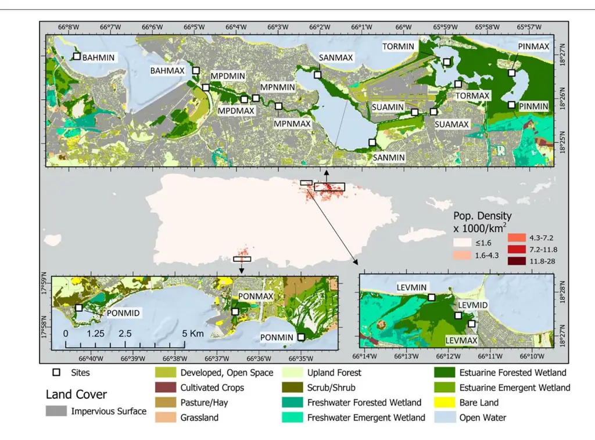
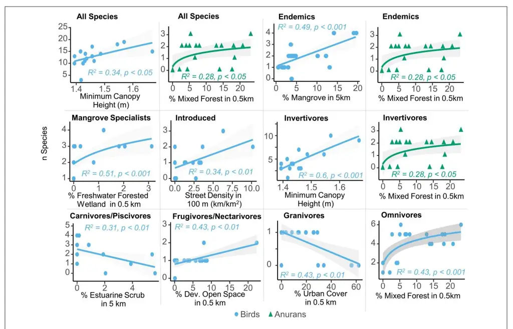
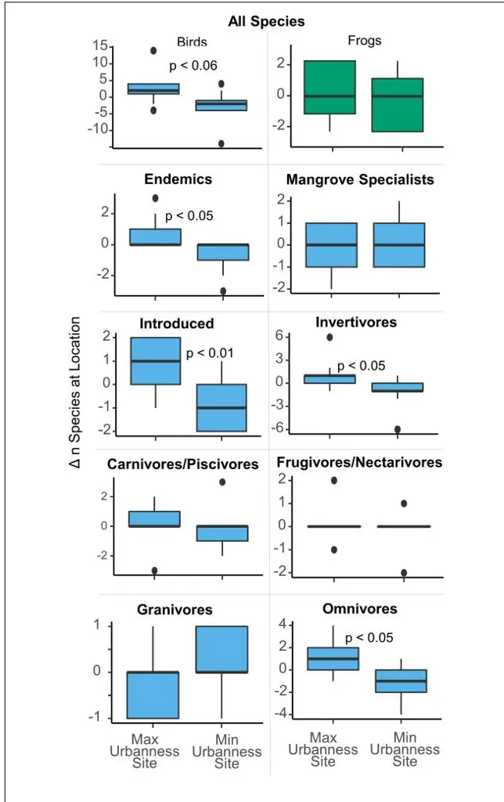
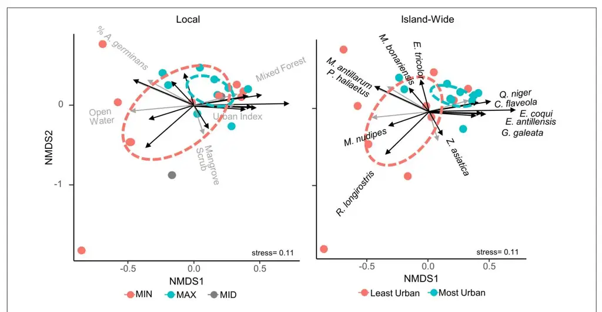

# [The Role of Urbanness, Vegetation](https://www.frontiersin.org/articles/10.3389/fmars.2021.670288/full) Structure, and Scale in Shaping Puerto Rico's Acoustically Active Mangrove Fauna Communities

Benjamin L. Branoff1 \* and Marconi Campos-Cerqueira2

1 Gulf Ecosystem Measurement and Modeling Division, Office of Research and Development, United States Environmental Protection Agency, Gulf Breeze, FL, United States, 2 Rainforest Connection, San Francisco, CA, United States

#### Edited by:

Xianghui Guo, Xiamen University, China

#### Reviewed by:

William Gould, International Institute of Tropical Forestry, Forest Service (USDA), United States Heather Bateman, Arizona State University, United States

#### \*Correspondence:

Benjamin L. Branoff Branoff.benjamin@epa.gov

#### Specialty section:

This article was submitted to Global Change and the Future Ocean, a section of the journal Frontiers in Marine Science

> Received: 20 February 2021 Accepted: 21 June 2021 Published: 22 July 2021

#### Citation:

Branoff BL and Campos-Cerqueira M (2021) The Role of Urbanness, Vegetation Structure, and Scale in Shaping Puerto Rico's Acoustically Active Mangrove Fauna Communities. Front. Mar. Sci. 8:670288. doi: [10.3389/fmars.2021.670288](https://doi.org/10.3389/fmars.2021.670288) The mangroves of Puerto Rico occupy a gradient of urbanization that offers a chance to test hypotheses on urban faunal communities. These hypotheses state that urban avifaunal communities have greater representation by generalists and that certain mangrove specialists can utilize urban landscapes. Much of this is said to be driven by food resources, with frugivores and nectarivores benefiting from abundant residential flowers and fruits, while insectivores are driven away by low food resources. This study used passive acoustic monitoring to identify the audible anuran and avifaunal species in mangroves across an urban gradient of Puerto Rico. Five anurans and thirty-one avian species were detected across all sites, with twenty-three species found at the most species rich site, and eight at the least rich site. Analyses on urban effects were conducted at an island-wide scale as well as a local scale with different results between the two. Island wide, the most urban faunal communities were more similar to each other in species composition relative to the least urban communities, and there was a significant difference in the community composition between the two. However, there were no differences in avian or anuran species richness between the least and most urban sites. Minimum canopy height was the strongest predictor of overall avian richness and avian invertivore richness, while the extent of mixed forest cover was the strongest predictor for increasing anuran richness. Some urban metrics, such as street density and the percent of surrounding urban and developed open space were strong predictors of certain avian feeding guilds and distribution groups. At the local scale, sites of maximum urbanness held 2–3 more bird species on average than corresponding sites of minimum urbanness at the same location, although there was no difference in anuran species and no differences in avian or anuran community composition between the two. Further, avian richness did increase significantly from the minimum to maximum urbanness site at six of the nine locations. These findings highlight that higher mangrove canopies are the strongest predictor of higher avian richness, but depending on the scale of observations, urbanness also plays a limited role in shaping mangrove faunal communities.

Keywords: urban mangroves, synanthropic, acoustics analysis, novel ecosystems, social-ecological systems

# INTRODUCTION

Urban bird communities have repeatedly been shown to change in composition with increasing urbanization [\(Emlen,](#page-11-0) [1974;](#page-11-0) [Tilghman,](#page-12-0) [1987;](#page-12-0) [Clergeau et al.,](#page-11-1) [1998,](#page-11-1) [2001;](#page-11-2) [Chace and Walsh,](#page-11-3) [2006;](#page-11-3) [Ortega-Álvarez and MacGregor-Fors,](#page-12-1) [2009\)](#page-12-1). Generally, urban avifauna are most represented by generalist species capable of foraging on a broad range of food types, with the more specialist species largely absent from the most urban sites [\(Chace](#page-11-3) [and Walsh,](#page-11-3) [2006\)](#page-11-3). Most of these studies also acknowledge the importance of various metrics of the surrounding land cover matrix, such as forest patch size or habitat diversity, as well as vegetation structure. Further, there is some indication that scale plays an important role in these communities and the relationship between alpha and beta diversity in urban systems [\(Norris,](#page-12-2) [2012;](#page-12-2) [Meffert and Dziock,](#page-11-4) [2013\)](#page-11-4). The above patterns in urban avifauna cover a broad range of habitats and latitudes, although comparatively little is understood about the fauna communities in urban mangroves.

A number of studies have examined urban mangrove avifaunal communities, but there is no agreement on what constitutes "urban" and few conclude on the overall influence of urbanization on bird community structure [\(Ward,](#page-12-3) [1968;](#page-12-3) [Lim](#page-11-5) [and Sodhi,](#page-11-5) [2004;](#page-11-5) [Mestre et al.,](#page-11-6) [2007;](#page-11-6) [Acevedo and Aide,](#page-11-7) [2008;](#page-11-7) [Mohd-Azlan and Lawes,](#page-12-4) [2011;](#page-12-4) [Pawar,](#page-12-5) [2011;](#page-12-5) [Mancini et al.,](#page-11-8) [2018\)](#page-11-8). Several studies acknowledge a relatively high presence of mangrove specialists in anthropogenic habitats of Malaysia, suggesting these species are particularly adept at colonizing urban landscapes [\(Ward,](#page-12-3) [1968;](#page-12-3) [Noske,](#page-12-6) [1995;](#page-12-6) [Lim and Sodhi,](#page-11-5) [2004\)](#page-11-5). Yet, in Darwin Australia, most of the mangrove specialists have yet to colonize the urban mangroves [\(Noske,](#page-12-7) [1996\)](#page-12-7), while mangrove bird richness in general is most dependent upon patch size and the diversity in the surrounding land use matrix [\(Mohd-](#page-12-4)[Azlan and Lawes,](#page-12-4) [2011\)](#page-12-4). In São Sebastião, Brazil, differences in mangrove avian communities of a port area are largely attributed to variability in habitats and vegetation structure, with higher species richness associated with greater habitat heterogeneity [\(Mancini et al.,](#page-11-8) [2018\)](#page-11-8).

In Puerto Rico, studies have shown that urban avifauna communities are distinct from their forested counterparts and that certain traits and distribution statuses (e.g., introduced, endemic, and nocturnal, etc.) are associated with higher or lower occurrences within the island's urban matrix [\(Ruiz-Jaén](#page-12-8) [and Aide,](#page-12-8) [2006;](#page-12-8) [Acevedo and Restrepo,](#page-11-9) [2008;](#page-11-9) [Suarez-Rubio and](#page-12-9) [Thomlinson,](#page-12-9) [2009;](#page-12-9) [Herrera-Montes and Aide,](#page-11-10) [2011\)](#page-11-10). Endemics, for example, seem particularly drawn to the largest forest fragments [\(Acevedo and Restrepo,](#page-11-9) [2008;](#page-11-9) [Suarez-Rubio and](#page-12-9) [Thomlinson,](#page-12-9) [2009\)](#page-12-9), while introduced species, some generalists (Quiscalus niger and Turdus plumbeus), and many anurans (Eleutherodactylus coqui and Leptodactylus albilabris) seem capable of inhabiting urban areas [\(Ruiz-Jaén and Aide,](#page-12-8) [2006;](#page-12-8) [Suarez-Rubio and Thomlinson,](#page-12-9) [2009\)](#page-12-9). For mangroves, [Acevedo](#page-11-7) [and Aide](#page-11-7) [\(2008\)](#page-11-7) found Twenty-six species of birds in one forest, with forest structural metrics (e.g., canopy cover and tree size, etc.) and the presence of standing water being the most significant variables associated with these communities, although no conclusions are drawn on the influence of urbanization.

Although urbanization is not a primary driver of global mangrove deforestation, it is the most important cause of loss in some cities and is one of the few fragmentation drivers that is permanent [\(Bryan-Brown et al.,](#page-11-11) [2020;](#page-11-11) [Goldberg et al.,](#page-11-12) [2020\)](#page-11-12). Thus, urban development not only replaces critical habitat for some species, but remaining urban mangrove forests are subject to long-term disturbance forces that create novel systems and faunal communities that may be adapting to these anthropogenic landscapes [\(Luniak,](#page-11-13) [2004;](#page-11-13) [McDonnell and Hahs,](#page-11-14) [2015\)](#page-11-14). Understanding these communities and the underlying forces driving observed changes is then critical to sustainable mangrove management in the Anthropocene. While much of our understanding of avifaunal and anuran communities comes from visual point-count surveys, the present study used passive acoustic monitoring (PAM) to quantify species presence. Acoustic monitoring has repeatedly been identified as being similar to or more effective than visual point counts in a variety of ecosystems [\(Haselmayer and Quinn,](#page-11-15) [2000;](#page-11-15) [Zwart et al.,](#page-12-10) [2014;](#page-12-10) [Alquezar and Machado,](#page-11-16) [2015\)](#page-11-16), and especially in mangroves [\(Celis-Murillo et al.,](#page-11-17) [2012\)](#page-11-17). Here, we use acoustic surveys and subsequent species identification models to detect avian and anuran presence in twenty forested mangrove sites spanning an urbanization gradient in Puerto Rico. We then aim to answer how mangrove avian and anuran communities are related to various metrics of surrounding urbanization and land cover at different scales, focusing on specific feeding guilds, distribution groups, and mangrove specialists. Understanding these patterns and the potential underlying causes will be critical to managing urban mangrove forests toward optimal function and ecosystem services provisioning.

### MATERIALS AND METHODS

### Site Description

The urban mangroves of Puerto Rico, and the sites corresponding to the present study, are described in detail in [Branoff and](#page-11-18) [Martinuzzi](#page-11-18) [\(2020\)](#page-11-18). Forest composition and structure does vary among sites, but in general the forests are composed primarily of Laguncularia racemosa, followed by Rhizophora mangle and Avicennia germinans. Additional non-halophytic flora is present, and the overall floral richness increases with human population density surrounding each forest. The floral richness of the three mangrove species, however, decreases as urban cover increases. Forest height varies between ten and twenty meters, stem density between five and eight thousand stems per hectare, and basal area between 27 and 43 m2 ha−1 . Most of the forest structural metrics are correlated with surrounding vegetation cover or surface water chemistry, with the largest contiguous forests being characterized as taller and with greater variation in height.

Relatively little is known of the mangrove fauna of Puerto Rico in comparison to other ecosystems on the island. The most urban mangroves in the Caño Mart˜ın Pena (MPNMAX ´ in this study) were surveyed in 1899 and noted the presence of Megaceryle alcyon, Pelecanus occidentalis, Ardea spp., Rallus sp., Scolopacidae sp., Setophaga spp., Tyrannus dominicensis, and Vireo altiloquus [\(Evermann et al.,](#page-11-19) [1902\)](#page-11-19). Another more recent survey found the aquatic bird community in the city of San Juan to be composed mostly of Fulica caribea, Bubulcus ibis, Pluvialis squatarola, Pelecanus occidentalis, and Calidris alba, although this study was not limited to mangroves [\(Fidalgo-De Souza,](#page-11-20) [2009\)](#page-11-20). [Acevedo and Aide](#page-11-7) [\(2008\)](#page-11-7) surveyed the bird community of the Levittown mangroves and found twenty-six species, with Coereba flaveola, Quiscalus niger, Parkesia noveboracensis, and Melanerpes portoricensis to be among the most abundant. Descriptions of the mangrove bird community in the islands second largest metropolitan area of Ponce are scarce, but other studies along the southern coast of the island note the use of mangroves for both foraging and nighttime roosting habitat, with the most abundant species being Setophaga petechia and Parkesia noveboracensis [\(Smith et al.,](#page-12-11) [2008;](#page-12-11) [Rodríguez-Colón,](#page-12-12) [2012\)](#page-12-12).

Study sites were selected to provide the greatest range in urbanness, at both the island and local scales (**[Figure 1](#page-3-0)** and **[Table 1](#page-4-0)**). To do so, an urban index was developed for all mangrove shoreline across the island, as described in detail by [Branoff](#page-11-21) [\(2020b\)](#page-11-21). This unitless index constitutes a range of values from 100 representing the most urban site to 1 representing the least urban site. High urban index values are those representing the most urban cover, the least vegetated cover, the highest street density, and the highest population density, and vice-a-versa for the lowest index values. These descriptive variables were pulled from circular buffers surrounding each site at distances of 0.5, 1, and 5 km, and were provided by a variety of spatial land cover and social datasets (**[Table 2](#page-5-0)**). Three watersheds were first selected as those with mangroves exhibiting the greatest range in urban index values. They are the San Juan Bay Estuary (SJBE) and the Rio de la Plata (Levittown) along the northern coast, and the Rio Inabón to the Rio Loco (Ponce) on the southern coast. Nine locations were selected among these three watersheds, with a minimum and maximum urban site at each. Within the SJBE, seven locations are represented by each of the estuary's seven waterbodies, with two sites at each location representing the minimum and maximum urban index values for that waterbody. This resulted in 14 sites for the SJBE. Sites are named for their waterbodies and for their local urbanness levels (BAH is the San Juan Bay, MPN, and MPD are the non-dredged and dredged portions, respectively, of the Caño Martín Peña, SAN is the San José lagoon, SUA is the Suárez canal, TOR is the Torrecilla lagoon, and PIN is the Piñones lagoon) and MIN and MAX are the minimum and maximum urbanness sites in each of those waterbodies (BAHMAX, BAHMIN, TORMAX, and TORMIN, etc.). For Levittown (LEV) and Ponce (PON), relatively little mangrove area was available and therefore sites were selected to represent the minimum (MIN), mid (MID), and maximum (MAX) urban index values across the watershed, as opposed to individual waterbodies as was done in the SJBE. This resulted in three sites each in the two locations of Levittown and Ponce. Together, with the seven locations in the SJBE and one each in Levittown and Ponce, a grand total of nine locations and twenty sites are represented by this study.

### Faunal Surveys

Two surveys were conducted in each site, one from March 11th to March 22nd, 2017 and another from November 1st to November 12th, 2017. Hurricanes Irma and María passed near and over Puerto Rico in September of 2017 and changed the forest structure between the two sampling periods, with no available data describing the post-hurricane forests. Therefore, data from both surveys are reported but hypothesis testing is conducted primarily on surveys from the undisturbed prehurricane forests. Passive acoustic monitoring devices were fixed to a tree at a height of approximately 1.5 m at each site and programmed to sample for 1 min at 10-min intervals at a sampling rate of 44.1 kHz. Recorders are comprised of an Android smartphone attached to an external Monoprice microphone with flat response between 50 Hz and 20 kHz and a sensitivity of −45 ± 2 dB, all enclosed in a waterproof case. Recorders were programmed with the ARBIMON Touch application and allowed to record until the smartphone battery died, or until they were collected 10 days later. Each site was sampled with an audio recorder device for ∼1 week in each survey period generating ∼1,500 1-min recordings per site/survey.

### Acoustic Pattern Matching

All recordings (32,345 1-min recordings) were stored, processed, and analyzed using the RFCx-ARBIMON II platform[1](#page-2-0) [\(Aide et al.,](#page-11-22) [2013\)](#page-11-22). Recordings were visually inspected for interference or damage caused by temporary microphone malfunction or rain and these recordings (6.3% of all recordings, **[Supplementary](#page-11-23) [Table 1](#page-11-23)**) were removed from the analyses. Species specific acoustic models were constructed by first finding the most representative, loud, and clear examples (templates) of each species' most consistent vocalization(s). Species identifications were checked with those found on [xeno-canto.com](http://xeno-canto.com) and by the authors' personal records. In the case of Ardea spp. and Psittacidae spp., similar species could not be differentiated by the authors and are referred to by their genus and family, respectively. Call templates were used in a pattern matching algorithm to scan all relevant (diurnal, nocturnal, or both) recordings and identify potential regions of interest (ROIs) with matching patterns. All ROIs with values above the selected correlation threshold (0.1) were presented as potential detections for posterior validations [\(LeBien et al.,](#page-11-24) [2020\)](#page-11-24). The selection of a low threshold resulted in a high number of false positives though the number of false negatives was negligible. We manually reviewed the pattern matching results. In this step, we annotated the results as either positive or negative, indicating the corresponding species presence or absence. Then, the same templates, along with validated presence and absence recordings were used to train Random Forest Models to recognize the selected acoustic patterns [\(Breiman,](#page-11-25) [2001;](#page-11-25) [Aide et al.,](#page-11-22) [2013,](#page-11-22) [Campos-Cerqueira and Aide,](#page-11-26) [2016\)](#page-11-26). Models were considered sufficiently accurate if they achieved at least 80% accuracy and precision in at least ten of the validated recordings. These models were then used to again scan all recordings for the presence of each vocalization and each species. All recordings marked as present for a given species were again visually scanned by the authors to verify its presence. The presence

1<https://arbimon.rfcx.org/project/mangroves-of-puerto-rico/dashboard>

Branoff and Campos-Cerqueira Puerto Rico's Urban Mangrove Fauna

FIGURE 1 | Passive acoustic monitoring devices were placed in twenty one-hectare mangrove forests spanning an urbanization gradient across the island of Puerto Rico, as represented by the urban index. This index is calculated using the surrounding cover of urban, vegetated, open water, and mangrove classifications, as well as road and population density. Individual locations have a "MAX" and "MIN" urbanness site, referring to the relative urban index values. Urban characteristics for each site are described in [Table 1](#page-4-0).

of each species at each site for each deployment was then cross-checked between the two methods, pattern matching and Random Forest Models. Although most of the crossvalidation resulted in agreement, any disagreement between the two was resolved manually by again visually inspecting the inconsistent recordings. Thus, presence for a species at a site for each deployment is defined when at least two of three methods (i.e., patten matching, Random Forest Models, and manual inspection) resulted in presence. For some species, an insufficient number of verified presence recordings were identified for robust Random Forest Models so only verified pattern matching results were used. Detection frequencies were calculated as the percent of surveyed days in which a species was detected.

# Statistical Testing

Tests on species richness, defined as the number of species, were performed on groups defined by distribution status, mangrove specialization, and feeding guilds. Avian species were classified into feeding guilds of granivores, omnivores, invertivores, frugivores and nectarivores, and carnivores, piscivores and scavengers following [Wilman et al.](#page-12-13) [\(2014\)](#page-12-13). Avian endemism was determined from [Lepage](#page-11-27) [\(2018\)](#page-11-27) and mangrove specialization was determined through [\(Luther and](#page-11-28) [Greenberg,](#page-11-28) [2009\)](#page-11-28), which distinguishes between dependent and restricted mangrove specialists. Resident or migrant status was determined through [Oberle](#page-12-14) [\(2018\)](#page-12-14) and [Del Hoyo](#page-11-29) [et al.](#page-11-29) [\(1992\)](#page-11-29). Anuran diets were determined from [Oliveira](#page-12-15) [et al.](#page-12-15) [\(2017\)](#page-12-15) and endemism from [Heatwole and MacKenzie](#page-11-30) [\(1967\)](#page-11-30).

Variability in species richness was used in hypothesis tests against several covariates describing surrounding land cover, forest composition and structure, and hydrology (**[Table 2](#page-5-0)**). Surrounding land cover was sampled from a 2 m resolution 2010 dataset of Puerto Rico [\(Office for Coastal Management,](#page-12-16) [2017\)](#page-12-16), using circular buffers or radii 0.5, 1, and 5 km. The percentage of each land cover class was calculated as the area of each class within the circle over the area of the circular buffer, and this value was used as a predictor in regression models. Forest composition and structure variables were taken from [Branoff and Martinuzzi](#page-11-31) [\(2018\)](#page-11-31), and describe the forests before the passing of hurricanes Irma and Maria between

TABLE 1 | Site abbreviations used throughout the study and their corresponding locations as well as select urban variables from a 1,000 m sampling radius, as adapted from [Branoff](#page-11-21) [\(2020b\)](#page-11-21).

| San Juan Bay Estuary Río Bayamón/ Río | BAHMIN BAHMAX | −66.1302 | 18.44985                           |     |      |      |         | cover | mangrove |
| ---------------------------------------- | ---------------- | -------- | ---------------------------------- | --- | ---- | ---- | ------- | ----- | -------- |
|                                          |                  |          |                                    | 29  | 9.0  | 1.1  | 301.3   | 4.0   | 2.7      |
|                                          |                  | −66.0827 | 18.44436                           | 63  | 45.0 | 6.4  | 2,330.7 | 10.0  | 4.5      |
| Hondo to The Río                         | MPDMIN           | −66.0788 | 18.43787                           | 60  | 44.0 | 6.1  | 1,338.2 | 20.0  | 2.1      |
| Puerto Nuevo/ Río Piedras                | MPDMAX           | −66.0636 | 18.43329                           | 73  | 59.0 | 11.3 | 3,450.0 | 16.0  | 3.6      |
|                                          | MPNMIN           | −66.0591 | 18.43373                           | 82  | 65.0 | 15.3 | 4,317.9 | 11.0  | 6.1      |
|                                          | MPNMAX           | −66.0498 | 18.4307                            | 98  | 75.0 | 19.4 | 7,253.6 | 5.0   | 13.7     |
|                                          | SANMAX           | −66.0342 | 18.44253                           | 46  | 30.0 | 5.3  | 2,568.7 | 13.0  | 2.3      |
|                                          | SANMIN           | −66.0125 | 18.41686                           | 35  | 21.0 | 4.3  | 1,418.0 | 9.0   | 2.3      |
|                                          | SUAMIN           | −65.9957 | 18.42838                           | 56  | 54.0 | 3.6  | 1,460.4 | 10.0  | 5.4      |
|                                          | SUAMAX           | −65.9881 | 18.42849                           | 64  | 60.0 | 6.8  | 2,426.6 | 10.0  | 6.1      |
|                                          | TORMIN           | −65.9829 | 18.44735                           | 14  | 10.0 | 1.3  | 376.2   | 32.0  | 0.3      |
|                                          | TORMAX           | −65.9782 | 18.43906                           | 19  | 16.0 | 3.4  | 606.8   | 33.0  | 0.5      |
|                                          | PINMAX           | −65.9570 | 18.44315                           | 5   | 6.0  | 1.8  | 115.2   | 55.0  | 0.1      |
|                                          | PINMIN           | −65.9572 | 18.43104 1 0.0 0.3 0.0 |     | 50.0 | 0.0  |         |       |          |
| Levittown Río de la Plata                | LEVMIN           | −66.2068 | 18.46477                           | 9   | 2.0  | 0.7  | 29.1    | 42.0  | 0.0      |
|                                          | LEVMID           | −66.1961 | 18.45779                           | 24  | 18.0 | 4.1  | 1,942.2 | 41.0  | 0.4      |
|                                          | LEVMAX           | −66.1906 | 18.45468                           | 48  | 40.0 | 9.3  | 2,597.0 | 23.0  | 1.8      |
| Ponce–Río Inabón to Río Loco             | PONMID           | −66.6716 | 17.97408                           | 31  | 13.0 | 1.4  | 321.2   | 12.0  | 1.0      |
|                                          | PONMAX           | −66.6095 | 17.97253                           | 42  | 37.0 | 3.1  | 598.8   | 15.0  | 2.4      |
|                                          | PONMIN           | −6.5833  | 17.96285                           | 21  | 0.00 | 0.3  | 0.2     | 19.0  | 0.0      |

The urban index is a unitless metric of urbanness that incorporates several variables, with 100 being the most urban and 0 the least urban site relative to the others. MIN and MAX subscripts on site names refer to the minimum and maximum urbanness for each location, as determined by the urban index. Urban and mangrove cover are %, street density is km km−r , population density is people km−2 , and the ratio of urban to mangrove cover (Urban:Mangrove) is unitless.

the two deployments. These describe summary variables from the 10 plots within each site, and include tree size (diameter at breast height, dbh) and canopy height, as well as species composition descriptors. Finally, site hydrology was described by variables taken from water level models from a 5 years period that were developed with input from water-level measurements recorded at the sites and from regional weather stations [\(Branoff,](#page-11-21) [2020b\)](#page-11-21). Hydrology variables include the average water depth, the flooding frequency, and the percentage of time a site is flooded.

All statistical tests were performed in the R language [\(R Core](#page-12-17) [Team,](#page-12-17) [2020\)](#page-12-17) and all scripts and raw data can be found in the repository on the Open Science Framework project page at: [https://osf.io/uk2fd/.](https://osf.io/uk2fd/) Relationships of detection frequency and faunal richness, with predictors of land cover, forest structure and composition, and hydrology, were tested through simple (one independent variable) linear and ln-linear regression in the lm function. Only the most explanatory predictor variables are reported on and these were chosen as those with the highest R 2 value among statistically significant models (p < 0.05). Student t-tests were performed through the t.test function in base R to test for differences in species richness between the most urban sites and the least urban sites, and this was done for island-wide urbanness as well as local urbanness. Island-wide urbanness was determined by splitting the sites into the "most urban" and "least urban" by the highest and lowest urban indices, respectively. Local urbanness was determined by the MIN and MAX subscripts at each location, which was also set by the urban index as described in section "Site Description". For local urbanness, the two MID sites (PONMID and LEVMID) were dropped from the analysis in order to maintain only two categorical levels. Species-specific tests for associations between presence and local MAX and MIN urbanness were performed through Fisher's Exact Test for Count Data on contingency tables for locations where a species was found only at one of the two sites at a location. This was performed through the fisher.test function in base R. To test for differences in the avian and anuran community structures among the most and least urban mangroves, and to account for differences in call-frequencies, nonmetric multidimensional scaling (NMDS) using the Bray-Curtis dissimilarity index [\(Bray and Curtis,](#page-11-32) [1957\)](#page-11-32) was also performed. This was done using the proportion of recordings in which each species was detected at each site, as recommend by [Minchin](#page-12-18) [\(1987\)](#page-12-18) and as performed through functions of the vegan package [\(Oksanen et al.,](#page-12-19) [2018\)](#page-12-19). The metaMDS function iterates the NMDS process from random starting points and chooses the solution with the overall lowest stress and thus the most accurate representation of the sites in the ordination space [\(Clarke and Ainsworth,](#page-11-33) [1993\)](#page-11-33). To show how site characteristics and species' detection frequencies correlate with the grouping of the faunal communities, vectors representing site environmental metrics and species were fit to the ordination through the envfit function. Ordination ellipses representing the 95% standard error confidence ellipse of the group centroid locations were drawn for the island-wide least urban and most urban groups as well as for the local MIN

TABLE 2 | Covariates used to test hypotheses on the most important drivers of fauna community richness and structure.

|            | Variable                                     | Units      | Description                                                                                                                         | Sources                           |
| ---------- | -------------------------------------------- | ---------- | ----------------------------------------------------------------------------------------------------------------------------------- | --------------------------------- |
| Ground     | Max, mean, and min dbh                    | cm         | The maximum, mean, and minimum diameter at breast height of each woody stem within the plot                                   | Branoff and Martinuzzi (2020)  |
|            | Stem density                                 | Stems/ha   | The number of stems over 1 cm in dbh within the plot over the area of the plot                                                   | Branoff and Martinuzzi (2020)  |
|            | Basal area                                   | m2 /ha  | 2  dbh The sum of cross-sectional areas: π of 2 all trees in the plot over the area of the plot                   | Branoff and Martinuzzi (2020)  |
|            | Percent stand biomass composition of spp. | %          | The total biomass of a species at a site over the total biomass of all species at that plot                                      | Branoff and Martinuzzi (2020)  |
|            | Diversity                                    | n          | The total number of tree species encountered in a site                                                                           | Branoff and Martinuzzi (2020)  |
| LiDAR      | Min/Mean/Max Height                          | m          | Minimum, mean and maximum return heights                                                                                            | NASA G-LiHTa                      |
|            | Height SD                                    | m          | Standard deviation of all return heights above 1.4 m                                                                             | NASA G-LiHTa                      |
|            | Canopy cover                                 | %          | Number of first returns above 2 m over the total number of first returns                                                         | NASA G-LiHTa                      |
|            | Canopy density                               | %          | Number of all returns above 2 m over the total number of all returns                                                             | NASA G-LiHTa                      |
| Land Cover | % Habitat cover                              | %          | Percentage of a circular area, described by radii of 0.5, 1, and 5 km centered at sites, occupied by a given land cover class | LULC rasterb                      |
|            | Vegetation diversity                         | n          | Number of natural vegetation classes surrounding each site within 0.5, 1, and 5 km                                               | LULC rasterb                      |
|            | Mangrove patch size                          | km2        | Area of mangrove patch in which recorder was placed                                                                              | LULC rasterb                      |
|            | Road density                                 | km/km2     | Length of roads over area of sampling circle                                                                                        | Road network vectorc           |
|            | Population density                           | People/km2 | Number of people within the sampling circle over area of sampling circle                                                         | Census tract total populationd |
|            | Urban index                                  | –          | Normalized mean of the above urbanization variables such that 0 is the least urban and 100 is the most urban value            | Above urbanness variables      |
| Hydrology  | Proportion of time flooded                | %          | Proportion of time with positive depth at the site from 2012 to 2017 based on water level models                                 | Water level modelse               |
|            | Mean daily flood frequency                | Floods/day | Mean number of times per day a positive depth was estimated at the site from 2012 to 2017 based on water level models         |                                   |
|            | Mean flood length                            | day        | Mean length of positive depth estimated at the site from 2012 to 2017 based on water level models                             |                                   |

a[Cook et al.](#page-11-34) [\(2013\)](#page-11-34).

and MAX urban groups using the ordiellipse function, also from vegan. To test for differences in communities within the ordination, a permutation multivariate analysis of variance using distance matrices (ADONIS) was performed through the adonis function of vegan. This was also performed on the percentage of recordings at each site in which each species was detected and grouped according to both the island-wide and local relative urbanness characterizations as described above (detection frequency∼urbanness).

Species accumulation curves for each site and each watershed were constructed by counting the number of time-ordered recordings necessary to detect a new species. The specaccum function from the vegan package was also used to construct curves from random permutations of the data and a jackknife extrapolation. Logarithmic curves were then fit to these species-accumulation plots [\(Ugland et al.,](#page-12-22) [2003\)](#page-12-22), and the number of recordings required to reach a given number of species, as well as the number of species predicted for a given sample area were calculated through the predict function. All graphical visualizations were produced from the ggplot2 package in R [\(Wickham,](#page-12-23) [2009\)](#page-12-23).

b[Office for Coastal Management](#page-12-16) [\(2017\)](#page-12-16).

c[United States Census Bureau](#page-12-20) [\(2015\)](#page-12-20).

d[United States Census Bureau](#page-12-21) [\(2017\)](#page-12-21).

e[Branoff](#page-11-21) [\(2020b\)](#page-11-21).

FIGURE 2 | The strongest linear models to predict diversity among multiple groups of both bird and frog species in the urban mangroves of Puerto Rico. Land cover and canopy height were the strongest predictors, with urban variables most strongly predicting many of the bird groups.

# RESULTS

Five anuran species from two families and thirty-one bird species from nineteen families were detected across all sites during the study (**[Supplementary Table 1](#page-11-23)**). All five anurans and five bird species are endemic to the Puerto Rico Bank. An additional five bird species are mangrove specialists, and three are introduced. Two families were represented by the anurans, five species from Eleutherodactylidae and one from Leptodactylidae. Parulidae was the most represented bird family, with five species, followed by Tyrannidae with three species. Columbidae, Cuculidae, Icteridae, Rallidae, and Vireonidae were all represented by two species. Ardeidae was also represented by at least two species, Egretta tricolor and likely a few herons and egrets (e.g., Butorides virescens, Bubulcus ibis, and Ardea herodias), whose similar vocalizations could not be differentiated by the authors. The remaining families were each represented by only one species and they are Accipitridae, Alcedinidae, Coerebidae, Mimidae, Pandionidae, Phasianidae, Picidae, Psittacidae, Scolopacidae, Strigidae, and Turdidae. Psittacidae was also likely represented by at least two species (e.g., Brotogeris versicolurus and Myiopsitta monachus) that could not be distinguished in the recordings. All the anuran species are invertivores and 14 (45%) of the birds as well. Of the remaining bird species, nine (29%) are omnivores, five (16%) are piscivores/carnivores, two (6.5%) are frugivores/nectarivores, and one (3%) is a granivore.

For thirty of these species, enough detections were identified to develop both pattern recognition templates and Random Forest models. The remaining six species (Actitis macularius, Buteo jamaicensis, Crotophaga ani, Gallus gallus, Mniotilta varia, and Setophaga adelaidae) were rarely detected or exhibited vocalizations that could not be easily modeled and are therefore only represented by validated pattern recognition. Eleutherodactylus coqui had the highest mean detection rate at 17% of nighttime recordings, followed by Coereba flaveola at 14% of daytime recordings. All other species were detected in less than 10% of either daytime or nighttime recordings. Parkesia noveboracensis was the most ubiquitous species and was detected at all 20 sites, followed by Coereba flaveola at 19, Melanerpes portoricensis at 18, and Ardeidae spp. and Quiscalus niger at 17. Eleutherodactylus brittoni and Setophaga adelaidae were the rarest species and were each detected at one site only.

Species accumulation curves show that the mean number of minutes required to reach 50, 75, and 100% of all the species detected at a site are 68, 308, and 1,396, respectively (**[Supplementary Figure 1A](#page-11-23)**). But these times varied greatly among sites. Because all watersheds were not recorded for the same duration, the species accumulation curves were Branoff and Campos-Cerqueira Puerto Rico's Urban Mangrove Fauna

FIGURE 3 | Differences in the number of species between the MAX urban and MIN urban sites at each of the nine locations. The most urban sites held significantly more species than the least urban sites.

extrapolated to 10,000 mins for each watershed to predict a total of 35, 28, and 24 species in San Juan, Levittown and Ponce, respectively (**[Supplementary Figure 1B](#page-11-23)**). Randomly sampling ten hectares between the three watersheds is expected to result in thirty to thirty-six detected species (**[Supplementary Figure 1C](#page-11-23)**). Detections across all species and all sites dropped from a mean of 0.7 detections per recording to 0.3 detections per recording between the first deployment in March and the second in November. Further, there was a significant difference in the number of species detected at each site between the two sampling periods (t-test, mean difference = 3.9, p < 0.001). Of the thirty-six species detected between the two deployments, 34 were detected in March and only 29 in November. Of those that were not detected in November, Mniotilta varia, Setophaga americana, and Vireo altiloquus are migratory, while Setophaga adelaidae, Setophaga petechia, Margarops fuscatus, and Molothrus bonariensis are not. Buteo jamaicensis and Eleutherodactylus brittoni were detected only in November.

The remaining results apply only to the March 2017 survey, which occurred before hurricanes Irma and Maria. The top three linear models for all dependent richness variables are provided in **[Supplementary Table 3](#page-11-23)**. Differences in avian richness across all sites were most strongly correlated with surrounding land cover and the minimum canopy height (**[Figure 2](#page-6-0)**). Anuran richness increased logarithmically with the percent of surrounding land cover as mixed forest within 0.5 km. For birds, the total number of detected species at any site was most strongly and positively related to the minimum canopy height, which was also true for the number of invertivore birds. Endemic bird species increased linearly with the percent of mangrove cover within 5 km, while mangrove specialist species increased with surrounding freshwater forested wetland. Introduced species increased logarithmically with surrounding street density. Within other feeding guilds, carnivores/piscivores richness was negatively related to the percent estuarine scrub within 5 km, while frugivores/nectarivore richness was positively related to the percent developed open space within 0.5 km. Granivore richness was negatively related to surrounding urban cover and omnivore richness was positively and logarithmically correlated with surrounding mixed forest cover.

None of the strongest linear models to predict richness metrics included the urban index and only one feeding guild, granivores, resulted in a significant difference in richness between the most urban and least urban sites at the island scale. Further, granivores are represented by only one species, Zenaida asiatica, which was absent in all five of the most urban sites and present at almost all the others. However, when comparing the local change in species richness between the minimum and maximum urban sites, six of the nine locations (BAH, LEV, MPN, PIN, PON, and TOR) exhibited higher bird richness at the maximum urbanness site (MAX), than at the minimum urbanness site (MIN). As a result, MAX sites have significantly more bird species than MIN sites (difference = 2.4, p = 0.01) (**[Figure 3](#page-7-0)**), although the same comparison for frogs was insignificant (difference = 0.4, p = 0.3). Because all frog species are endemic and invertivores, the same result is true for frog endemics and frog invertivores. For birds, there were also more endemic (difference = 0.7, p = 0.02), introduced (difference = 0.8, p = 0.008), invertivore (difference = 1.2, p = 0.02), and omnivore (difference = 1.0, p = 0.01) species at the maximum urbanness sites in comparison to the minimum urban sites. Part of this is due to a significant dependence (Fisher's test, p = 0.03) between the MAX urban sites and the presence of Psittacidae spp., which was present only at the MAX sites for four locations and was never present only at a MIN site. Although Psittacidae spp. was the only significant species with such a relationship, several other species showed similar, albeit, insignificant trends. Quiscalus niger and Tyrannus dominicensis were all present only at MAX sites for three locations, and never present only at a MIN site (Fisher's test, p = 0.1). Five other species each were present only at a MAX site for two and one location(s), and never present only at a MIN site. On the other hand, Setophaga petechia and Rallus longirostris were only present at a MIN site for three locations and never present only at a MAX site (Fisher's test, p = 0.1), while Crotophaga ani was only present at a MIN site for one

FIGURE 4 | Non-metric multi-dimensional scaling of all sites based on the detection frequencies of their species, colored by island-wide relative urbanness (left) and local relative urbanness (right). Overlay vectors are land cover variables and species that were significantly correlated with and most responsible for the ordination. Sites are colored to the right as those with an urban index greater than the median (most urban) and those with an index value less than the median (least urban), while those to the left are colored based on their relative urbanness within each of the nine locations. Ellipses show 95% confidence areas of each group of sites. At both scales, the most urban sites are more clustered than the least urban sites, suggesting the former are more similar to each other, although analysis of variance in the ordination resulted in insignificant differences between urbanness groups at both scales.

location and never present only at a MAX site. Thus, for species that were present only at MIN or MAX sites and never at the other, thirteen were present only at a MAX site and three were present only at a MIN site, while seventeen were present at both MIN and MAX sites.

Non-metric multidimensional scaling revealed some influence of urbanization on the bird and anuran community structure of the mangroves and this influence was again dependent on scale (**[Figure 4](#page-8-0)**). At both the local and island-wide scales, the most urban faunal communities were more clustered than the least urban communities, suggesting the more urban faunal community structures are more similar to each other than are the less urban communities. Further, at the island-wide scale, ADONIS revealed a significant difference (p = 0.009) between the least urban and most urban communities, but the same test at the local scale was insignificant. The most urban sites were associated with the presence of C. flaveola, G. galeata, E. antillensis, E. coqui, and Q. niger, while M. antillarum, M. nudipes, P. haliaetus, and R. longirostris were associated with the least urban sites.

#### DISCUSSION

Previous studies on urban bird communities have consistently shown an influence of the urban landscape on faunal community structure and richness, which is largely attributed to the diversity, structure, and availability of surrounding habitats and resources. Studies in mangrove systems are much less abundant and show some consistency in those trends. This study, despite limitations related to unplanned for hurricane disturbances and acoustic identification, found both corroborating and contradictory findings in comparison to other studies. Primarily, that canopy height is most influential in explaining avian richness, but also that habitat cover and some urban variables play a role in structuring mangrove faunal communities, although scale is important in interpreting these results.

The mangrove avifauna richness of thirty-two species in the present study was five species more than that reported by [Acevedo and Aide](#page-11-7) [\(2008\)](#page-11-7), with fifteen of the same species shared between the two studies. Together, both studies suggest that the mangroves of Puerto Rico harbor at least forty-one bird species, thirty-two residents and nine migrants. Interestingly, [Acevedo and Aide](#page-11-7) [\(2008\)](#page-11-7) captured all nine migrants, while the present study captured only four. This highlights a disadvantage of acoustic avifaunal surveys, which are prone to miss nonvocal species, or species that mainly produce alarm calls, such as some non-breeding migrants. However, the present study detected fifteen additional resident species that were not detected by [Acevedo and Aide](#page-11-7) [\(2008\)](#page-11-7), many being relatively rare, cryptic, and/or potentially misanthropic and thus more likely detected by passive recorders than by visual point counts. Nonetheless, species-area curves suggest we identified nearly all of the vocal species inhabiting these forests during the observational periods.

Both the present study and [Acevedo and Aide](#page-11-7) [\(2008\)](#page-11-7) detected significant seasonal differences in the avifauna community, but while [Acevedo and Aide](#page-11-7) [\(2008\)](#page-11-7) detected higher richness attributed to migrants from August to February, the present study detected fewer species during the same period in November. Our lack of many of the migrants in November may be a result of timing, in which we missed the relatively short and fluctuating migratory period. However, only three of the eight species missing from the November survey are migratory, suggesting the absence of the other five is due to something other than normal seasonal changes in presence and/or vocalization behavior. Thus, it may be due to the forest disturbance associated with hurricanes Irma and Maria, which passed near and over Puerto Rico 2 months before the November survey, causing significant canopy loss [\(Branoff,](#page-11-35) [2020a\)](#page-11-35). This is corroborated by findings from a more generalized (not mangrove specific) census of birds that resulted in significantly fewer birds counted after the hurricane [\(Wunderle,](#page-12-24) [2017\)](#page-12-24). However, to further confound the patterns, four of the five non-migratory missing species from the present study are invertivores and the remainder is M. fuscatus, all of which were noted by [Wunderle](#page-12-24) [\(2017\)](#page-12-24) to increase after the hurricane. Thus, there is no clear explanation of the before and after hurricane differences and subsequent surveys are necessary to demonstrate the long-term resiliency of these communities to intense hurricane disturbances.

In simple linear regression, the richness of a few avian groups was most strongly explained by urbanization metrics. The percent of developed open space, defined as maintained green areas with some constructed materials but mostly lowlying vegetation, was the most important predictor for the richness of frugivores/nectarivores, while street density most strongly predicted the richness of introduced species and urban cover most strongly predicted the presence of the one granivore in the study. Both frugivores/nectarivores and introduced species increased with these urban metrics, which may be due to an abundance of food resources associated with urban environments. Other studies have noted the suitability of urban habitats for frugivores/nectarivores due to an abundance of both native and exotic flowers and fruits [\(Souza et al.,](#page-12-25) [2019\)](#page-12-25), while introduced species have also been found to be particularly abundant in streetscapes in Australia [\(White et al.,](#page-12-26) [2005\)](#page-12-26) and in Puerto Rico [\(Ruiz-Jaén and Aide,](#page-12-8) [2006;](#page-12-8) [Suarez-Rubio and](#page-12-9) [Thomlinson,](#page-12-9) [2009\)](#page-12-9), again attributed to the presence of exotic vegetation from residential landscaping. In contrast, the one granivore in this study was only found in sites with less than 40% urban cover, despite other studies suggesting favorable conditions in urban habitats for these birds [\(Chace and Walsh,](#page-11-3) [2006\)](#page-11-3).

At the local scale, pairwise comparisons of the most urban sites (MAX) with the least urban sites (MIN) resulted in significant differences in species numbers between the two. The maximum urban sites harbored around two more species per site than did the corresponding minimum urban sites for each location. This was true for six of the nine locations in the study. The same statistical differences were detected in the number of endemic, introduced, invertivore, and omnivore birds, each of which resulted in more species at the maximum urban site when compared to the minimum urban site. This may suggest that some species prefer the most urban site over the least urban site in each location, and the previously discussed patterns in omnivores and introduced species corroborate this. However, testing for dependence in presence/absence of individual species between MAX and MIN sites resulted in only one significant result. Psittacidae spp. was always present only at the MAX site when it was present at only one site at a location, which was four different locations. This is not surprising, as the two likely species that represent these detections, Brotogeris versicolurus and Myiopsitta monachus, have been noted to inhabit intense urban landscapes of Manaus, Brazil, and New York City [\(Bull,](#page-11-36) [1973;](#page-11-36) [Souza,](#page-12-27) [2017\)](#page-12-27). Twelve other species were also always present at the MAX site when they were present at only one site per location, compared to three species that were present only at the MIN site. Thus, when a gradient in urbanization is present within a mangrove forest, it seems more species are likely to be present in the most urban site than in the least urban site. The species which were most often present only at a MAX site include Quiscalus niger and Tyrannus dominicensis, which have previously been noted as successful urban inhabitants and should probably be considered synanthropes that benefit from these human landscapes [\(Ruiz-](#page-12-8)[Jaén and Aide,](#page-12-8) [2006;](#page-12-8) [Suarez-Rubio and Thomlinson,](#page-12-9) [2009\)](#page-12-9). Q. niger for example is known to forage off of human garbage, while T. dominicensis utilizes urban street lights for easier insect capture [\(Raffaele et al.,](#page-12-28) [2003\)](#page-12-28). On the other hand, Setophaga petechia and Rallus longirostris were always only detected at a MIN site if it was detected at only one site per location, which agrees with previous studies that found these species to be urban-sensitive [\(Foin et al.,](#page-11-37) [1997;](#page-11-37) [Tremblay and St. Clair,](#page-12-29) [2011\)](#page-12-29). Thus, these species should probably be considered misanthropes in urban mangroves.

Despite these clear patterns at both the island-wide and local scale, they often disagreed with one another between the scales. For example, there is no clear explanation for why endemics and invertivores were both more present in the MAX sites though neither were positively related to urban metrics at the island scale. One previous study has shown similar disjointed and inverse relationships between urban avifauna alpha and beta diversity at different scales [\(Norris,](#page-12-2) [2012\)](#page-12-2). Thus, it is possible that multiple drivers are acting at different spatial scales, resulting in higher species richness in the most urban sites locally, but with little to no effect of urbanness on mangrove fauna richness across the island of Puerto Rico.

In this study, canopy height was often the most important covariate in explaining the variability of avian richness, and this covariate was also found to be important for [Acevedo](#page-11-7) [and Aide](#page-11-7) [\(2008\)](#page-11-7), as well as for other mangroves [\(Goodenough,](#page-11-38) [2009\)](#page-11-38) and for global forests in general [\(Feng et al.,](#page-11-39) [2020\)](#page-11-39). This pattern is attributed to greater micro-climate and niche space in taller canopies, although our analysis specifically tested for a relationship with the standard deviation of canopy height, which produced a relatively weak link. Other forest metrics, such as patch size and surrounding landscape matrix diversity have also been found to be important in urban mangrove bird communities [\(Mohd-Azlan and Lawes,](#page-12-4) [2011\)](#page-12-4). Our results indicate no relationship between avian richness and surrounding vegetated habitat diversity but a positive relationship with the natural log of patch size (R 2 = 0.3, p < 0.05), which is the opposite of that found by [Mohd-](#page-12-4)[Azlan and Lawes](#page-12-4) [\(2011\)](#page-12-4). This may suggest that these metrics are location specific or that different methodologies are utilized between the studies. In any case, maintaining high canopies in Puerto Rico's urban mangroves may be the single most effective means to increasing avifauna richness, although this may be challenging in other areas where forests are still regenerating from previous development or where wood harvesting is still practiced [\(Mohamed et al.,](#page-12-30) [2009;](#page-12-30) [Branoff,](#page-11-40) [2018\)](#page-11-40).

Mangrove specialists are of particular interest due to their dependence on mangrove habitats and thus their vulnerability to mangrove deforestation from urban development. Other studies have suggested mangrove specialists are capable of inhabiting urban mangroves [\(Ward,](#page-12-3) [1968;](#page-12-3) [Noske,](#page-12-6) [1995,](#page-12-6) [Lim](#page-11-5) [and Sodhi,](#page-11-5) [2004\)](#page-11-5), but these were nectarivores, which are absent in Puerto Rico's mangrove specialists. The only two mangrove specialists present in the most urban mangroves of this study were Zenaida aurita, an omnivore, and Parkesia noveboracensis, an invertivore. Both species are defined as "mangrove dependent" rather than "mangrove restricted", suggesting they can utilize other habitats in addition to mangroves, which may explain their presence in Puerto Rico's urban forests. Further, Z. aurita is an omnivore and may benefit from the previously mentioned variety of foraging opportunities offered in urban mangroves, making these forests just as suitable, if not more so, than less urban mangroves. On the other hand, P. noveboracensis is an invertivore and was ubiquitous across all the surveyed sites, suggesting it is relatively flexible in habitat preferences, regardless of urban intensity. The two mangrove restricted specialists, Rallus longirostris and Setophaga petechia, were absent from the most urban sites, suggesting they are relatively more misanthropic and adverse to inhabiting the urban mangroves of Puerto Rico. Additionally, endemic bird richness increased with surrounding mangrove cover, suggesting mangrove habitat is particularly important for these species, despite none of the endemic birds being mangrove specialists. This further highlights the importance of mangrove cover as habitat for a wide range of avifauna and particular attention and additional conservation resources may be warranted for these species where urbanization threatens mangrove deforestation.

Anuran richness could not be analyzed among multiple groups or dietary guilds, as all five species are endemic invertivores. Thus, the only predictor for any of the anuran groups was the percent cover of surrounding mixed forests, which was positively correlated with richness. As with birds, there was little evidence for an island-wide influence of urbanization on anuran richness. This is not surprising, as previous studies have also shown no effect of traffic noise on anuran acoustic activity in Puerto Rico [\(Herrera-Montes and Aide,](#page-11-10) [2011\)](#page-11-10), despite declining numbers in lowland forests on the island [\(Campos-Cerqueira](#page-11-41) [and Aide,](#page-11-41) [2017\)](#page-11-41). Interestingly, none of the anuran species in this study have previously been described in mangrove habitat and are typically associated with palustrine, not estuarine, wetlands. This is likely because most anurans are poor osmoregulators, especially as larva [\(Gomez-Mestre et al.,](#page-11-42) [2004\)](#page-11-42). However, the direct development of Eleutherodactylus spp. probably negates poor osmoregulation, allowing them to maintain their lifecycle despite the elevated salinity in mangrove systems and with no effect from surrounding urbanization. As the Caribbean has been identified as one of five biodiversity hotspots predicted to undergo relatively rapid urbanization in the twenty-first century [\(Seto et al.,](#page-12-31) [2012\)](#page-12-31), mangrove avian and anuran faunal communities there may experience shifts toward less richness and more homogeneity. This study showed some distinction of faunal communities between the most and least urban mangroves of Puerto Rico, although scale played an important role. Islandwide, faunal community structure was distinct between the least urban and most urban sites but in avian richness, it appears urbanization is not as important as forest structure and minimum canopy height. At the local scale, however, there were no differences in faunal community structure between maximum and minimum urbanness, but the maximum urbanness sites held significantly more bird species than their counterparts. Although the extra species at the maximum sites were not always consistent across locations, there is some indication that numerous avian omnivores and synanthropes explain the elevated richness of the most urban mangroves. On the other hand, some misanthropes, as well as endemics and mangrove specialists in general will likely benefit from minimal urban influence and more expansive mangrove forests. At the same time, highly urban forests can be managed to optimize cultural ecosystem services that take advantage of both avian and anuran use of these habitats. This includes recreational services such as bird watching, and educational services focused on ecology. Both strategies will be important for the long-term sustainability of these socialecological systems.

# DATA AVAILABILITY STATEMENT

The datasets presented in this study can be found in online repositories. The names of the repository/repositories and accession number(s) can be found below: [https://osf.io/uk2fd/.](https://osf.io/uk2fd/)

### AUTHOR CONTRIBUTIONS

BB contributed to the study conception, design, implementation, completion of statistical analysis, also performed analysis and acoustic pattern species identification, and wrote the manuscript. MC-C performed training, verification, validation, and revision of the manuscript. Both authors contributed to the article and approved the submitted version.

### FUNDING

Portions of this work were funded by the United States Department of Agriculture's Forest Service International Institute of Tropical Forestry.

# ACKNOWLEDGMENTS

We would like to thank Orlando Acevedo-Charry for his assistance in the field and T. Mitchell Aide for his assistance in acoustic analyses.

# REFERENCES

- Acevedo, M. A., and Aide, T. M. (2008). Bird community dynamics and habitat associations in Karst, mangrove and pterocarpus forest fragments in an urban zone in Puerto Rico. Caribb. J. Sci. 44, 402–416. [doi: 10.18475/cjos.v44i3.a15](https://doi.org/10.18475/cjos.v44i3.a15)
- Acevedo, M. A., and Restrepo, C. (2008). Land−cover and land−use change and its contribution to the large-scale organization of Puerto Rico's bird assemblages. Divers. Distrib. 14, 114–122. [doi: 10.1111/j.1472-4642.2007.00435.x](https://doi.org/10.1111/j.1472-4642.2007.00435.x)
- Aide, T. M., Corrada-Bravo, C., Campos-Cerqueira, M., Milan, C., Vega, G., and Alvarez, R. (2013). Real-time bioacoustics monitoring and automated species identification. PeerJ 1:e103. [doi: 10.7717/peerj.103](https://doi.org/10.7717/peerj.103)
- Alquezar, R. D., and Machado, R. B. (2015). Comparisons between autonomous acoustic recordings and avian point counts in open woodland savanna. Wilson J. Ornithol. 127, 712–723. [doi: 10.1676/14-104.1](https://doi.org/10.1676/14-104.1)
- Branoff, B. L. (2018). "Urban mangrove biology and ecology: emergent patterns and management implications," in Threats to Mangrove Forests, eds C. Makowski and C. Finkle (Cham: Springer), 521–537. [doi: 10.1007/978-3-319-](https://doi.org/10.1007/978-3-319-73016-5_23) [73016-5\\\_23](https://doi.org/10.1007/978-3-319-73016-5_23)
- Branoff, B. L. (2020a). Mangrove disturbance and response following the 2017 hurricane season in puerto rico. Estuar. Coasts 43, 1248–1262. [doi: 10.1007/](https://doi.org/10.1007/s12237-019-00585-3) [s12237-019-00585-3](https://doi.org/10.1007/s12237-019-00585-3)
- Branoff, B. L. (2020b). The role of urbanization in the flooding and surface water chemistry of Puerto Rico's mangroves. Hydrol. Sci. J. 65, 1326–1343. [doi:](https://doi.org/10.1080/02626667.2020.1747620) [10.1080/02626667.2020.1747620](https://doi.org/10.1080/02626667.2020.1747620)
- Branoff, B. L., and Martinuzzi, S. (2018). Mangrove forest structure and composition along an urban gradient in Puerto Rico. bioRxiv [Preprint] [doi:](https://doi.org/10.1101/504928) [10.1101/504928](https://doi.org/10.1101/504928)
- Branoff, B. L., and Martinuzzi, S. (2020). The structure and composition of puerto rico's urban mangroves. Forests 11:1119. [doi: 10.3390/f11101119](https://doi.org/10.3390/f11101119)
- Bray, J. R., and Curtis, J. T. (1957). An ordination of the upland forest communities of southern Wisconsin. Ecol. Monogr. 27, 325–349. [doi: 10.2307/1942268](https://doi.org/10.2307/1942268)
- Breiman, L. (2001). Random forests. Machine Learn. 45, 5–32.
- Bryan-Brown, D. N., Connolly, R. M., Richards, D. R., Adame, F., Friess, D. A., and Brown, C. J. (2020). Global trends in mangrove forest fragmentation. Sci. Rep. 10, 1–8. [doi: 10.1079/9781780642031.0001](https://doi.org/10.1079/9781780642031.0001)
- Bull, J. (1973). Exotic birds in the New York city area. Wilson Bull. 85, 501–505. Campos-Cerqueira, M., and Aide, T. M. (2017). Lowland extirpation of anuran populations on a tropical mountain. PeerJ 5:e4059. [doi: 10.7717/peerj.4059](https://doi.org/10.7717/peerj.4059)
- Campos-Cerqueira, M., and Aide, T. M. (2016). Improving distribution data of threatened species by combining acoustic monitoring and occupancy modelling. Methods Ecol. Evol. 7, 1340–1348. [doi: 10.1111/2041-210x.12599](https://doi.org/10.1111/2041-210x.12599)
- Celis-Murillo, A., Deppe, J. L., and Ward, M. P. (2012). Effectiveness and utility of acoustic recordings for surveying tropical birds. J. Field Ornithol. 83, 166–179. [doi: 10.1111/j.1557-9263.2012.00366.x](https://doi.org/10.1111/j.1557-9263.2012.00366.x)
- Chace, J. F., and Walsh, J. J. (2006). Urban effects on native avifauna: a review. Landsc. Urban Plan. 74, 46–69. [doi: 10.1016/j.landurbplan.2004.08.007](https://doi.org/10.1016/j.landurbplan.2004.08.007)
- Clarke, K. R., and Ainsworth, M. (1993). A method of linking multivariate community structure to environmental variables. Mar. Ecol. Prog. Ser. 92, 205–219. [doi: 10.3354/meps092205](https://doi.org/10.3354/meps092205)
- Clergeau, P., Jokimäki, J., and Savard, J. P. L. (2001). Are urban bird communities influenced by the bird diversity of adjacent landscapes? J. Appl. Ecol. 38, 1122–1134. [doi: 10.1046/j.1365-2664.2001.00666.x](https://doi.org/10.1046/j.1365-2664.2001.00666.x)
- Clergeau, P., Savard, J.-P. L., Mennechez, G., and Falardeau, G. (1998). Bird abundance and diversity along an urban-rural gradient: a comparative study between two cities on different continents. Condor 100, 413–425. [doi: 10.2307/](https://doi.org/10.2307/1369707) [1369707](https://doi.org/10.2307/1369707)
- Cook, B. D., Corp, L. W., Nelson, R. F., Middleton, E. M., Morton, D. C., McCorkel, J. T., et al. (2013). NASA goddard's lidar, hyperspectral and thermal (G-LiHT) airborne imager. Remote Sens. 5, 4045–4066. [doi: 10.3390/rs5084045](https://doi.org/10.3390/rs5084045)
- Del Hoyo, J., Elliott, A., and Sargatal, J. (1992). Handbook of the Birds of the World. Barcelona: Lynx edicions.

# SUPPLEMENTARY MATERIAL

The Supplementary Material for this article can be found online at: [https://www.frontiersin.org/articles/10.3389/fmars.](https://www.frontiersin.org/articles/10.3389/fmars.2021.670288/full#supplementary-material) [2021.670288/full#supplementary-material](https://www.frontiersin.org/articles/10.3389/fmars.2021.670288/full#supplementary-material)

- Emlen, J. T. (1974). An urban bird community in Tucson, Arizona: derivation, structure, regulation. Condor 76, 184–197. [doi: 10.2307/1366729](https://doi.org/10.2307/1366729)
- Evermann, B. W., Marsh, M. C., and Wilcox, W. A. (1902). Investigations of the Aquatic Resources and Fisheries of Porto Rico. Washington, DC: U.S. Government Printing Office, 20.
- Feng, G., Zhang, J., Girardello, M., Pellissier, V., and Svenning, J. C. (2020). Forest canopy height co-determines taxonomic and functional richness, but not functional dispersion of mammals and birds globally. Glob. Ecol. Biogeogr. 29, 1350–1359. [doi: 10.1111/geb.13110](https://doi.org/10.1111/geb.13110)
- Fidalgo-De Souza, L. L. (2009). Evaluación de las Comunidades de aves Acuáticas del Estuario de la Bahía de San Juan. Caracas: Universidad Meetropolitano.
- Foin, T. C., Garcia, E. J., Gill, R. E., Culberson, S. D., and Collins, J. N. (1997). Recovery strategies for the California clapper rail (Rallus longirostris obsoletus) in the heavily-urbanized San Francisco estuarine ecosystem. Landsc. Urban Plan. 38, 229–243. [doi: 10.1016/s0169-2046\(97\)00036-4](<https://doi.org/10.1016/s0169-2046(97)00036-4>)
- Goldberg, L., Lagomasino, D., Thomas, N., and Fatoyinbo, T. (2020). Global declines in human-driven mangrove loss. Glob. Change Biol. 26, 5844–5855. [doi: 10.1111/gcb.15275](https://doi.org/10.1111/gcb.15275)
- Gomez-Mestre, I., Tejedo, M., Ramayo, E., and Estepa, J. (2004). Developmental alterations and osmoregulatory physiology of a larval anuran under osmotic stress. Physiol. Biochem. Zool. 77, 267–274. [doi: 10.1086/378143](https://doi.org/10.1086/378143)
- Goodenough, C. (2009). The effect of habitat variables on bird density and species richness in Newcastle and Lake Macquarie mangrove forests. Whistler 3, 1–6.
- Haselmayer, J., and Quinn, J. S. (2000). A comparison of point counts and sound recording as bird survey methods in Amazonian southeast Peru. Condor 102, 887–893. [doi: 10.2307/1370317](https://doi.org/10.2307/1370317)
- Heatwole, H., and MacKenzie, F. (1967). Herpetogeography of Puerto Rico. IV. Paleogeography, faunal similarity and endemism. Evolution 21, 429–438. [doi:](https://doi.org/10.2307/2406605) [10.2307/2406605](https://doi.org/10.2307/2406605)
- Herrera-Montes, M. I., and Aide, T. M. (2011). Impacts of traffic noise on anuran and bird communities. Urban Ecosyst. 14, 415–427. [doi: 10.1007/s11252-011-](https://doi.org/10.1007/s11252-011-0158-7) [0158-7](https://doi.org/10.1007/s11252-011-0158-7)
- LeBien, J., Zhong, M., Campos-Cerqueira, M., Velev, J. P., Dodhia, R., Ferres, J. L., et al. (2020). A pipeline for identification of bird and frog species in tropical soundscape recordings using a convolutional neural network. Ecol. Inform. 59:101113. [doi: 10.1016/j.ecoinf.2020.101113](https://doi.org/10.1016/j.ecoinf.2020.101113)
- Lepage, D. (2018). Checklist of Birds of Puerto Rico." Avibase Bird Checklists of the world. Available online at: <https://avibase.bsc-eoc.org/checklist.jsp?region=PR>
- Lim, H. C., and Sodhi, N. S. (2004). Responses of avian guilds to urbanisation in a tropical city. Landsc. Urban Plan. 66, 199–215. [doi: 10.1016/s0169-2046\(03\)](<https://doi.org/10.1016/s0169-2046(03)00111-7>) [00111-7](<https://doi.org/10.1016/s0169-2046(03)00111-7>)
- Luniak, M. (2004). "Synurbization–adaptation of animal wildlife to urban development," in Proceedings of the 4th international urban wildlife symposium, (Princeton, NJ: Citeseer).
- Luther, D. A., and Greenberg, R. (2009). Mangroves: a global perspective on the evolution and conservation of their terrestrial vertebrates. Bioscience 59, 602–612. [doi: 10.1525/bio.2009.59.7.11](https://doi.org/10.1525/bio.2009.59.7.11)
- Mancini, P. L., Reis-Neto, A. S., Fischer, L. G., Silveira, L. F., and Schaeffer-Novelli, Y. (2018). Differences in diversity and habitat use of avifauna in distinct mangrove areas in São Sebastião, São Paulo, Brazil. Ocean Coast. Manag. 164, 79–91. [doi: 10.1016/j.ocecoaman.2018.02.002](https://doi.org/10.1016/j.ocecoaman.2018.02.002)
- McDonnell, M. J., and Hahs, A. K. (2015). Adaptation and adaptedness of organisms to urban environments. Annu. Rev. Ecol. Evol. Syst. 46, 261–280. [doi: 10.1146/annurev-ecolsys-112414-054258](https://doi.org/10.1146/annurev-ecolsys-112414-054258)
- Meffert, P. J., and Dziock, F. (2013). The influence of urbanisation on diversity and trait composition of birds. Landsc. Ecol. 28, 943–957. [doi: 10.1007/s10980-013-](https://doi.org/10.1007/s10980-013-9867-z) [9867-z](https://doi.org/10.1007/s10980-013-9867-z)
- Mestre, L. A. M., Krul, R., and Moraes, V. D. S. (2007). Mangrove bird community of paranaguá bay - paraná, Brazil. Braz. Arch. Biol. Technol. 50, 75–83. [doi:](https://doi.org/10.1590/s1516-89132007000100009) [10.1590/s1516-89132007000100009](https://doi.org/10.1590/s1516-89132007000100009)

- Minchin, P. R. (1987). "An evaluation of the relative robustness of techniques for ecological ordination," in Theory and Models in Vegetation Science, eds E. van der Maarel and I. C. Prentice (Dordrecht: Springer), 89–107. [doi: 10.1007/978-](https://doi.org/10.1007/978-94-009-4061-1_9) [94-009-4061-1\\\_9](https://doi.org/10.1007/978-94-009-4061-1_9)
- Mohamed, M. O. S., Neukermans, G., Kairo, J. G., Dahdouh-Guebas, F., and Koedam, N. (2009). Mangrove forests in a peri-urban setting: the case of Mombasa (Kenya). Wetlands Ecol. Manag. 17, 243–255. [doi: 10.1007/s11273-](https://doi.org/10.1007/s11273-008-9104-8) [008-9104-8](https://doi.org/10.1007/s11273-008-9104-8)
- Mohd-Azlan, J., and Lawes, M. J. (2011). The effect of the surrounding landscape matrix on mangrove bird community assembly in north Australia. Biol. Conserv. 144, 2134–2141. [doi: 10.](https://doi.org/10.1016/j.biocon.2011.04.003) [1016/j.biocon.2011.04.003](https://doi.org/10.1016/j.biocon.2011.04.003)
- Norris, J. L. (2012). Urban Development In Costa Rica: The Direct And Indirect Impacts On Local And Regional Avian Assemblages. El Desarrollo Urbano En Costa Rica: Los Impactos Directos E Indirectos Sobre La Congregación De Aves Locales Y Regionales." Dissertation, Ph. D. St. Louis, MO: University of Missouri at St. Louis Graduate School.
- Noske, R. A. (1995). The ecology of mangrove forest birds in Peninsular Malaysia. IBIS 137, 250–263. [doi: 10.1111/j.1474-919x.1995.tb03247.x](https://doi.org/10.1111/j.1474-919x.1995.tb03247.x)
- Noske, R. A. (1996). Abundance, zonation and foraging ecology of birds in mangroves of Darwin Harbour, Northern Territory. Wildlife Res. 23, 443–474. [doi: 10.1071/wr9960443](https://doi.org/10.1071/wr9960443)
- Oberle, M. W. (2018). Puerto Rico's Birds in Photographs: an illustrated guide including the Virgin Islands. Bucharest: Editorial Humanitas.
- Office for Coastal Management (2017). C-CAP Land Cover, Puerto Rico, 2010 from 2010-06-15 to 2018-08-15. Charleston: Office for Coastal Management.
- Oksanen, J., Blanchet, G. F., Friendly, M., Kindt, R., Legendre, P., McGlinn, D., et al. (2018). vegan: Community Ecology Package. Available online at: [https:](https://cran.r-project.org/web/packages/vegan/index.html) [//cran.r-project.org/web/packages/vegan/index.html](https://cran.r-project.org/web/packages/vegan/index.html)
- Oliveira, B. F., São-Pedro, V. A., Santos-Barrera, G., Penone, C., and Costa, G. C. (2017). AmphiBIO, a global database for amphibian ecological traits. Sci. Data 4, 1–7. [doi: 10.1111/j.1442-9993.2007.01812.x](https://doi.org/10.1111/j.1442-9993.2007.01812.x)
- Ortega-Álvarez, R., and MacGregor-Fors, I. (2009). Living in the big city: effects of urban land-use on bird community structure, diversity, and composition. Landsc. Urban Plan. 90, 189–195. [doi: 10.1016/j.landurbplan.2008.11.003](https://doi.org/10.1016/j.landurbplan.2008.11.003)
- Pawar, P. R. (2011). Species diversity of birds in mangroves of Uran (Raigad), Navi Mumbai, Maharashtra, West coast of India. J. Exp. Sci. 2, 73–77.
- R Core Team (2020). R: A Language and Environment for Statistical Computing. Vienna: R Foundation for Statistical Computing.
- Raffaele, H. A., Wiley, J., Garrido, O. H., Keith, A., and Raffaele, J. I. (2003). Birds of the West Indies. Princeton, NJ: Princeton University Press.
- Rodríguez-Colón, I. (2012). Inference Of Hábitat Connectivity Via Hábitat Use By Resident And Migratory Birds Between Secondary Dry Forest And Mangroves At Jobos Bay National Estuarine Research Reserve, Ph.D. Thesis. Gurabo, PR: Universidad del Turabo, 99.
- Ruiz-Jaén, M. C., and Aide, T. M. (2006). An integrated approach for measuring urban forest restoration success. Urban For. Urban Green. 4, 55–68. [doi: 10.](https://doi.org/10.1016/j.ufug.2005.09.002) [1016/j.ufug.2005.09.002](https://doi.org/10.1016/j.ufug.2005.09.002)
- Seto, K. C., Güneralp, B., and Hutyra, L. R. (2012). Global forecasts of urban expansion to 2030 and direct impacts on biodiversity and carbon pools. Proc. Natl. Acad. Sci. 109, 16083–16088. [doi: 10.1073/pnas.1211658109](https://doi.org/10.1073/pnas.1211658109)
- Smith, J. A. M., Reitsma, L. R., Rockwood, L. L., and Marra, P. P. (2008). Roosting behavior of a Neotropical migrant songbird, the northern waterthrush Seiurus noveboracensis, during the non-breeding season. J. Avian Biol. 39, 460–465.
- Souza, F. L., Valente-Neto, F., Severo-Neto, F., Bueno, B., Ochoa-Quintero, J. M., Laps, R. R., et al. (2019). Impervious surface and heterogeneity are opposite drivers to maintain bird richness in a Cerrado city. Landsc. Urban Plan. 192:103643. [doi: 10.1016/j.landurbplan.2019.103643](https://doi.org/10.1016/j.landurbplan.2019.103643)

- Souza, R. C. H. P. D. (2017). Variação Temporal E Ocupação Do Periquito-De-Asa-Branca Brotogeris Versicolurus Na Área Urbana De Manaus, AM. Manaus: Instituto Nacional de Pesquisas da Amazônia.
- Suarez-Rubio, M., and Thomlinson, J. R. (2009). Landscape and patch-level factors influence bird communities in an urbanized tropical island. Biol. Conserv. 142, 1311–1321. [doi: 10.](https://doi.org/10.1016/j.biocon.2008.12.035) [1016/j.biocon.2008.12.035](https://doi.org/10.1016/j.biocon.2008.12.035)
- Tilghman, N. G. (1987). Characteristics of urban woodlands affecting breeding bird diversity and abundance. Landsc. Urban Plan. 14, 481–495. [doi: 10.1016/0169-](<https://doi.org/10.1016/0169-2046(87)90061-2>) [2046\(87\)90061-2](<https://doi.org/10.1016/0169-2046(87)90061-2>)
- Tremblay, M. A., and St. Clair, C. C. (2011). Permeability of a heterogeneous urban landscape to the movements of forest songbirds. J. Appl. Ecol. 48, 679–688. [doi: 10.1111/j.1365-2664.2011.01978.x](https://doi.org/10.1111/j.1365-2664.2011.01978.x)
- Ugland, K. I., Gray, J. S., and Ellingsen, K. E. (2003). The species–accumulation curve and estimation of species richness. J. Anim. Ecol. 72, 888–897. [doi:](https://doi.org/10.1046/j.1365-2656.2003.00748.x) [10.1046/j.1365-2656.2003.00748.x](https://doi.org/10.1046/j.1365-2656.2003.00748.x)
- United States Census Bureau (2015). TIGER/Line Shapefile, 2015, nation, U.S., Primary Roads National Shapefile. Suitland, MD: United States Census Bureau.
- United States Census Bureau (2017). American Community Survey Census Tract Estimates for Puerto Rico. Suitland, MD: United States Census Bureau.
- Ward, P. (1968). Origin of the avifauna of urban and suburban Singapore. IBIS 110, 239–255. [doi: 10.1111/j.1474-919x.1968.tb00036.x](https://doi.org/10.1111/j.1474-919x.1968.tb00036.x)
- White, J. G., Antos, M. J., Fitzsimons, J. A., and Palmer, G. C. (2005). Nonuniform bird assemblages in urban environments: the influence of streetscape vegetation. Landsc. Urban Plan. 71, 123–135. [doi: 10.1016/j.landurbplan.2004.](https://doi.org/10.1016/j.landurbplan.2004.02.006) [02.006](https://doi.org/10.1016/j.landurbplan.2004.02.006)
- Wickham, H. (2009). ggplot2: Elegant Graphics for Data Analysis. New York, NY: Springer-Verlag.
- Wilman, H., Belmaker, J., Simpson, J., de la Rosa, C., Rivadeneira, M. M., and Jetz, W. (2014). EltonTraits 1.0: species−level foraging attributes of the world's birds and mammals: ecological archives E095−178. Ecology 95:2027. [doi: 10.1890/](https://doi.org/10.1890/13-1917.1) [13-1917.1](https://doi.org/10.1890/13-1917.1)
- Wunderle, J. Jr. (2017). Effects of hurricanes irma and maria on birds in the fajardo christmas bird count in northeastern puerto Rico: a preliminary assessment. Acta Científica 31, 18–33.
- Zwart, M. C., Baker, A., McGowan, P. J. K., and Whittingham, M. J. (2014). The use of automated bioacoustic recorders to replace human wildlife surveys: an example using nightjars. PLoS One 9:e102770. [doi: 10.1371/journal.pone.0102770](https://doi.org/10.1371/journal.pone.0102770)

**Disclaimer:** The views expressed in this manuscript are those of the authors and do not necessarily represent the views or policies of the United States Environmental Protection Agency. Any mention of trade names, products, or services does not imply an endorsement by the United States Government or the United States Environmental Protection Agency. The EPA does not endorse any commercial products, services, or enterprises.

**Conflict of Interest:** The authors declare that the research was conducted in the absence of any commercial or financial relationships that could be construed as a potential conflict of interest.

Copyright © 2021 Branoff and Campos-Cerqueira. This is an open-access article distributed under the terms of the [Creative](http://creativecommons.org/licenses/by/4.0/) [Commons](http://creativecommons.org/licenses/by/4.0/) [Attribution](http://creativecommons.org/licenses/by/4.0/) [License](http://creativecommons.org/licenses/by/4.0/) [\(CC BY\).](http://creativecommons.org/licenses/by/4.0/) The use, distribution or reproduction in other forums is permitted, provided the original author(s) and the copyright owner(s) are credited and that the original publication in this journal is cited, in accordance with accepted academic practice. No use, distribution or reproduction is permitted which does not comply with these terms.
