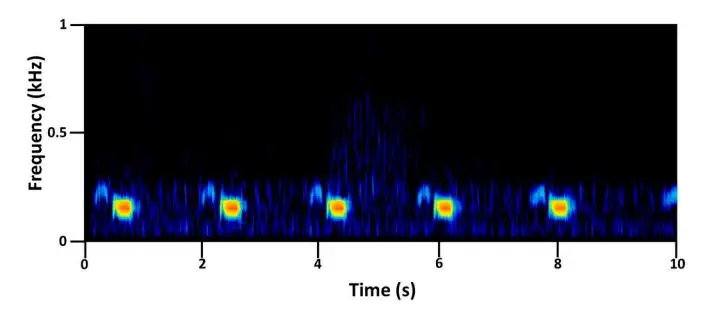
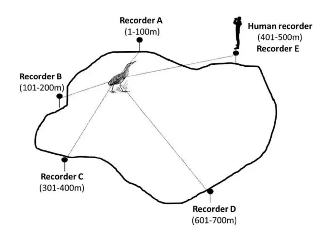
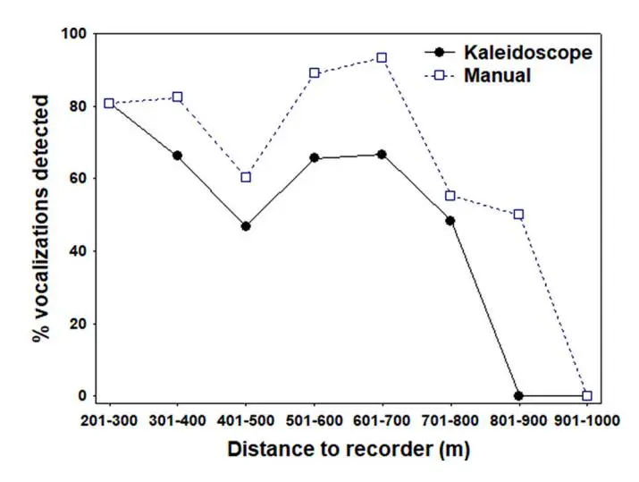

ELSEVIER

Contents lists available at ScienceDirect

# **Ecological Informatics**

journal homepage: www.elsevier.com/locate/ecolinf

## Low-cost open-source recorders and ready-to-use machine learning approaches provide effective monitoring of threatened species

Robert Manzano-Rubio a, Gerard Bota a, Lluís Brotons a, c, d, Eduardo Soto-Largo e, Cristian Pérez-Granados a, b, \*

- a Biodiversity and Animal Conservation Lab, Landscape Dynamics and Biodiversity Programme, Forest Science and Technology Center of Catalonia (CTFC), Solsona, Catalonia. Spain
- b Ecology Department, Alicante University, Alicante, Spain
- c CSIC, Cerdanyola del Vallès, Spain
- d CREAF, Cerdanyola del Vallès, Spain
- e OIKOS Consultores & Medio Ambiente S.L., Madrid, Spain

#### ARTICLE INFO

# Keywords: Autonomous recording unit BirdNET Botaurus stellaris Eurasian bittern Kaleidoscope Pro Passive acoustic monitoring Wildlife monitoring

#### ABSTRACT

Passive acoustic monitoring is a powerful tool for monitoring vocally active taxa. Automated signal recognition software reduces the expert time needed for recording analyses and allows researchers and managers to manage large acoustic datasets. The application of state-of-the-art techniques for automated identification, such as Convolutional Neural Networks, may be challenging for ecologists and managers without informatics or engineering expertise. Here, we evaluated the use of AudioMoth — a low-cost and open-source sound recorder — to monitor a threatened and patchily distributed species, the Eurasian bittern (Botaurus stellaris). Passive acoustic monitoring was carried out across 17 potential wetlands in north Spain. We also assessed the performance of BirdNET — an automated and freely available classifier able to identify over 3000 bird species — and Kaleidoscope Pro — a user-friendly recognition software — to detect the vocalizations and the presence of the target species. The percentage of presences and vocalizations of the Eurasian bittern automatically detected by BirdNET and Kaleidoscope Pro software was compared to manual annotations of 205 recordings. The species was effectively recorded up to distances of 801-900 m, with at least 50% of the vocalizations uttered within that distance being manually detected; this distance was reduced to 601-700 m when considering the analyses carried out using Kaleidoscope Pro. BirdNET detected the species in 59 of the 63 (93.7%) recordings with known presence of the species, while Kaleidoscope detected the bittern in 62 recordings (98.4%). At the vocalization level, BirdNet and Kaleidoscope Pro were able to detect between 76 and 78%, respectively, of the vocalizations detected by a human observer. Our study highlights the ability of AudioMoth for detecting the bittern at large distances, which increases the potential of that technique for monitoring the species at large spatial scales. According to our results, a single AudioMoth could be useful for monitoring the species' presence in wetlands of up to 150 ha. Our study proves the utility of passive acoustic monitoring, coupled with BirdNET or Kaleidoscope Pro, as an accurate, repeatable, and cost-efficient method for monitoring the Eurasian bittern at large spatial and temporal scales. Nonetheless, further research should evaluate the performance of BirdNET on a larger number of species, and under different recording conditions (e.g., more closed habitats), to improve our knowledge about BirdNET's ability to perform bird monitoring. Future studies should also aim to develop an adequate protocol to perform effective passive acoustic monitoring of the Eurasian bittern.

#### 1. Introduction

Bird monitoring is often based on acoustic cues, mainly by human observers performing point counts or transects (Bibby et al., 2000). As

many birds are highly vocal, passive acoustic monitoring (PAM) has become a common technique for bird monitoring. PAM is based on the deployment of autonomous recording units (ARUs), programmed to record during a period of interest, followed by recording analysis and

\* Corresponding author at: Ecology Department, Alicante University, Alicante, Spain. _E-mail address:_ cristian.perez@ua.es (C. Pérez-Granados).

interpretation. It is a trending technique whose use has exponentially increased in the last decade, with birds being the terrestrial group most commonly monitored using ARUs [\(Sugai et al., 2019\)](#page-6-0). Currently, several studies have proven the utility of PAM to detect species presence, infer bird species richness, and even estimate bird density from sound recordings (reviewed by [Darras et al., 2018](#page-6-0) and P´[erez-Granados and](#page-6-0) [Traba, 2021\)](#page-6-0).

Among the main advantages of PAM are the ability to monitor nocturnal and cryptic bird species in ecosystems difficult to reach for ecologists (e.g. [Lambert and McDonald, 2014](#page-6-0); P´[erez-Granados and](#page-6-0) [Schuchmann, 2020\)](#page-6-0). Wetlands are a good example of ecosystems logistically complex to monitor owing to the usually damp and boggy substrate, and the typically dense, yet fragile, vegetation structure ([Znidersic et al., 2020](#page-7-0)). Wetlands are home to many threatened species, and therefore the use of ARUs, which avoids the constant presence of highly qualified ornithologists in the field, may reduce human disturbance while improving monitoring of threatened species [\(Celis-Murillo](#page-6-0) [et al., 2009\)](#page-6-0). Moreover, PAM allows researchers to perform monitoring at large spatial and temporal scales ([Sugai et al., 2019\)](#page-6-0).

The collection of large acoustic datasets requires substantial time and expert knowledge to manage. Combined with the elevated costs associated with acquiring ARUs, this may be an obstacle that has hampered the widespread use of PAM for bird monitoring. However, in the last few years, several low-cost ARUs for long-term acoustic monitoring have been launched (e.g. [Hill et al., 2018](#page-6-0); [Karlsson et al., 2021\)](#page-6-0), although few studies have evaluated the effectiveness of such recorders for bird monitoring. Recordings can be listened to or visually processed, but such a process can be challenging when the total recording time is several hundreds or thousands of hours [\(Towsey et al., 2018,](#page-7-0) but see [Cameron](#page-6-0) [et al., 2020\)](#page-6-0). Many bird species utter clear, distinctive, and consistent vocalizations, thus opening the door for using automated signal recognition software to efficiently process large acoustic datasets (e.g. [Gupta](#page-6-0) [et al., 2021; Stowell et al., 2019](#page-6-0)). Some of the state-of-the-art techniques for handling big datasets, such as deep learning and convolutional neural networks [\(Stowell, 2022; Stowell et al., 2019\)](#page-6-0), can be difficult to run for ornithologists, managers, and researchers without bioacoustics or engineering backgrounds. However, user-friendly and ready-to-use machine learning approaches have recently been developed and are increasingly accessible to respond to real-life monitoring challenges and the general public ([Cole et al., 2022](#page-6-0)). Among these approaches is Bird-NET, a research project between The Cornell Lab of Ornithology and the Chemnitz University of Technology. BirdNET facilitates the automated detection and classification of bird vocalizations, through a developed deep neural network, from sound recordings [\(Kahl et al., 2021](#page-6-0)). Bird-NET is able to identify over 3000 bird species [\(Wood et al., 2021](#page-7-0)) and is available as a mobile application or a platform ([https://birdnet.cornell.](https://birdnet.cornell.edu/api/) [edu/api/](https://birdnet.cornell.edu/api/)) where citizens and researchers may freely upload and analyze the collected recordings. Previous studies have already proven the ability of BirdNET for detecting and reliably identifying a large proportion of bird vocalizations within focal recordings [\(Arif et al., 2020](#page-6-0); [Kahl et al., 2021\)](#page-6-0). However, there are still few assessments of the ability of BirdNET to detect and identify bird vocalizations under real monitoring conditions. For example, [Wood et al. \(2021\)](#page-7-0) stated that BirdNET's precision may greatly decrease when identifying species in sound recordings collected with omnidirectional microphones, the ones usually mounted in ARUs employed for PAM, when compared to focal recordings. Likewise, BirdNET's ability to identify bird vocalizations largely differs among species. For example, [Cole et al. \(2022\)](#page-6-0) found that the proportion of annotated calls correctly identified by BirdNET may differ from 9% for the Mourning dove (_Zenaida macroura_) to 68% for the California Quail (_Callipepla californica_). There are also off-the-shelf commercially available programs like Kaleidoscope Pro (300\$ annual license, Wildlife Acoustics, USA) that can be used to detect and to group candidate sounds into clusters using Hidden Markov Models [\(Abrahams](#page-6-0) [and Geary, 2020](#page-6-0); P´[erez-Granados and Schuchmann, 2020](#page-6-0)). Moreover, species-specific classifiers can be created by training Kaleidoscope Pro to identify which of the candidate sounds are vocalizations of the desired species (e.g. [Rycyk et al., 2022\)](#page-6-0).

In this paper, we used passive acoustic monitoring in a threatened, aquatic, and nocturnal cryptic bird species using low-cost ARUs and ready-to-use machine learning approaches for automated bird detection to: i) estimate the percentage of Eurasian bittern (_Botaurus stellaris_) vocalizations (and presences) automatically detected by BirdNET and Kaleidoscope Pro, to ii) evaluate the distance at which the open-source and low-cost AudioMoth recorder is able to detect Eurasian bittern vocalizations, and iii) apply PAM coupled with automated signal recognition to a real-world monitoring situation, aiming to detect the presence of the Eurasian bittern in potential wetlands of seemingly appropriate habitat. Finally, we also aimed to iv) assess the effectiveness of the proposed technique when compared to traditional field surveys for detecting the species presence. We expect that the evaluation of real applications of PAM paves the way for bioacoustic monitoring to be used as an attractive monitoring option for future studies with different taxa and monitoring scenarios.

#### **2. Material and methods**

### _2.1. Study species_

We selected the Eurasian bittern as a study species because it is an elusive species, difficult to monitor owing to its cryptic behaviour. The species is almost impossible to spot in dense reed vegetation, while most vocal activity occurs at night and during the crepuscular periods ([Poulin](#page-6-0) [and Lefebvre, 2003](#page-6-0)). However, the very characteristic vocalization of the species, a loud boom usually uttered at very low frequency and in sequences of a few elements [\(Frommolt and Tauchert, 2014,](#page-6-0) Fig. 1), can be heard over distances of *>*1 km [\(McGregor and Byle, 1992\)](#page-6-0), which suggests that PAM would be a suitable technique for monitoring this species. Indeed, previous studies with the Eurasian bittern and closely related species have already proven the utility of ARUs for detecting their presence and even estimating bittern density from sound recordings [\(Frommolt and Tauchert, 2014](#page-6-0); [Matsubayashi et al., 2022](#page-6-0); [Williams et al., 2018](#page-7-0); [Znidersic et al., 2020](#page-7-0)). [Frommolt and Tauchert](#page-6-0) [\(2014\)](#page-6-0) demonstrated the ability of using an array of four ARUs, each equipped with four microphones, to count the number of Eurasian bitterns based on the location of vocalizing birds. Recently, [Matsubayashi](#page-6-0) [et al. \(2022\)](#page-6-0) used an array of eight microphones to locate Eurasian bitterns during a single night. Prior research using ARUs for monitoring the Eurasian bittern used an array of microphones, and therefore our current knowledge to monitor the Eurasian bittern using a single ARU equipped with omnidirectional microphones, the most common deployement for PAM, is quite limited. In Spain, where the study was carried out (see Study area section), the Eurasian bittern is cataloged as "Critically endangered" in the Red Book of Birds [\(Vera, 2021\)](#page-7-0) and facing "Extinction risk" according to Spanish legislation (Real Decreto 139/ 2011). Despite its decline in Spain, on a global scale the species is listed as "Least Concern" by the IUCN ([BirdLife International, 2016\)](#page-6-0). The most

**Fig. 1.** Spectrogram of a typical (A) Eurasian bittern vocalization recorded in Pitillas lagoon (Navarra, Spain) using an AudioMoth recorder.

recent update about the Spanish population size, performed in 2011, estimated a total population of 40 breeding territorial males (booming males hereafter) and 35 wintering individuals ([Garrido and Molina,](#page-6-0) [2012\)](#page-6-0). However, population size was estimated using variable counting methods, which may have a significant effect on Eurasian bittern population size estimates; additionally, not all potential wetlands were surveyed, and thus the estimated population size may be incomplete. One of the key conclusions of the recent Red Book of Birds of Spain was the need to have a precise and comparable counting method for detecting the species [\(Vera, 2021](#page-7-0)).

#### _2.2. Study area_

selection.

The study was carried out during the spring of 2021 (April–June), in the Navarra region (north Spain), at 17 suitable wetlands for the Eurasian bittern (Table 1). The species' population in Navarra has been estimated at around 5–10 booming males ([Lekuona et al., 2017](#page-6-0)). As potential sites, we considered wetlands with: i) recent presence of booming males (from 2015 onwards), ii) historical presence of booming males (before 2015), or iii) individuals detected only during the migrating period. Site delimitation and recent or historical presence of the species were based on previous studies [\(Bertolero and Soto-Largo,](#page-6-0) [2004;](#page-6-0) [García et al., 2015](#page-6-0); [Soto-Largo et al., 1996](#page-6-0); [Soto-Largo et al.,](#page-6-0)

**Table 1** Potential wetlands monitored using passive acoustic monitoring and traditional field surveys for monitoring the presence of the Eurasian bittern in Navarra (north Spain), during the spring of 2021. One AudioMoth recorder was located per monitored site, excluding Pitillas Lagoon, sites F and G, where four recorders were placed in the former and two in the rest. Recorders were programmed to record continuously, at least during the two hours after sunset and one hour before and after sunrise. Wetland name is anonymized due to threatened status

of the species. Letters following wetland name refers to the criteria employed for

Potential wetland Size (ha) Recording period Kaleidoscope Pro Booms Field Survey Pitillas Lagoona, b,c 216.0 29 Apr – 25 Jun **YES** Not counted **YES** Site Ac 18 09–24 Jun NO 0 NO Site Ba,b 4.3 30 Apr - 13 May NO 0 NO Site Ca,b 51.2 27 May - 08 Jun NO 0 NO Site Da,b 5.0 30 Apr – 13 May **YES** 14 **YES** Site Ea,b,c 20.3 30 Apr - 13 May NO 0 NO Site Fa,b,c 89.2 28 May - 08 Jun NO 0 NO Site Ga,b,c 112.3 14–26 May **NO** 0 **YES** Site Ha,c 1.0 14–26 May **YES** 597 **YES** Site I a,d 3.7 30 Apr - 13 May NO 0 NO Site Jb,c 48.0 09–24 Jun NO 0 NO Site Kc 5.2 28 May - 08 Jun NO 0 NO Site Lb,c 6.4 27 May - 08 Jun NO 0 NO Site Mb,c 7.4 09–24 Jun NO 0 NO Site N b 10.5 14–26 May NO 0 NO Site Oc 2.2 14–26 May NO 0 NO

**YES** 344 NO

09–24 Jun

Site Pc 2.2 14–26 May,

2015.

[2021\)](#page-6-0), consulting the eBird online database [\(eBird., 2021](#page-6-0)), and the expert opinion and experience of our research team in the study area.

#### _2.3. Passive acoustic monitoring_

At each potential wetland we placed between one to four AudioMoth recorders (v. 1.2.0, [Hill et al., 2018,](#page-6-0) see Table 1), which operated during a minimum of 11 consecutive days in each wetland. Each recorder was placed in an Audiomoth IPX7 case (Open Acoustic Devices) and attached to a 1–4 m wooden stick to be located at 1.5 m above the vegetation, near or inside the reedbed. In one wetland, the recorders were attached to a tree, three meters above the natural vegetation. The recorders were programmed to record (in mono and .wav format) continuously during the two hours after sunset and one hour before and after sunrise, using a sampling rate of 16 kHz, gain Med-High, and 16 bits per sample. The selected recording period was based on previous species studies that showed two peaks of vocal activity, one occurring around 30 min after sunset, and a second around 30–60 min before sunrise ([Poulin and](#page-6-0) [Lefebvre, 2003](#page-6-0)).

#### _2.4. Automated recognition software comparison_

To validate the use of automated signal recognition software for detecting the Eurasian bittern, we created a database of referenced calls using 205 recordings (6-min recordings) of the species that totalled 1230 min. The recordings were randomly selected among those collected during the survey in Pitillas lagoon (the only wetland with regular presence of the species in previous years) and thus could be considered as representative of the recording conditions of our monitoring survey, i.e. same ARU and noise created by other bird species, similar habitat structure, etc. One experienced researcher (RM) identified acoustically and visually, using spectrograms, a total of 1174 Eurasian bittern vocalizations within 63 different recordings out of the set of 205 recordings (Fig. 2). For each recording, we annotated the total number of vocalizations manually detected and these values were used as the validation dataset to assess the performance of BirdNET and Kaleidoscope Pro. The software performance was evaluated by comparing the recall rate and the percentage of occurrences detected using each software when compared to the ones obtained in the validation dataset. The recall rate is an index commonly used in bioacoustics

**Fig. 2.** Sampling procedure applied to estimate the effective distance of Eurasian bittern detection. A human observer acoustically located a booming male and bird position within the lagoon was acoustically located based on the direction and sound pressure of the vocalization. Time when the boom was detected was also annotated. Later, the distance in meters, from the position of the booming male to four permanent recorders and to one additional recorder carried by the observer, was estimated in 100-m categories (i.e. 1–100, 101–200).

a Presence of Eurasian bittern during the breeding period after the year 2015. b Presence of Eurasian bittern during the breeding period before the year

c Historical presence of Eurasian bittern just during the migration period. Since the Eurasian bittern is listed as an Endangered species in the region, according to Spanish legislation (Real Decreto 139/2011), the names of the locations have been kept hidden.

that represents the proportion of target vocalizations automatically detected by the recognizer ([Knight et al., 2017\)](#page-6-0). We estimated the recall rate by dividing the number of Eurasian bittern vocalizations detected by each of the two software by the total number of bittern vocalizations detected within the validation dataset [\(Knight et al., 2017](#page-6-0)).

The 205 recordings were independently scanned using the two types of software and were analyzed blindly with respect to whether the species had been detected manually. The acoustic analyses in BirdNET (LB) and Kaleidoscope Pro (CPG) were performed by different researchers than the one manually reviewing the recordings (RMR), to avoid any bias.

#### _2.5. BirdNET (v. 2.1)_

To assess the ability of BirdNET for detecting Eurasian bittern vocalizations we used the automatic bird sound classifier ([Kahl et al.,](#page-6-0) [2021\)](#page-6-0), which is freely available on GitHub [\(https://github.com/kahst](https://github.com/kahst/BirdNET-Analyzer) [/BirdNET-Analyzer](https://github.com/kahst/BirdNET-Analyzer)), to evaluate the same recording segments annotated by the human observer and assessed used Kaleidoscope Pro. We ran BirdNET using Python 3.6.7 [\(Van Rossum and Drake, 1995\)](#page-7-0), set to classify sounds only for the Eurasian bittern. BirdNET divides recordings into 3-s non-overlapping segments and outputs a text file that provides identities for a maximum of 3 species that BirdNET had the highest confidence – measured in a score ranging from 0 (least confident) to 1 (most confident) – were present on a given segment. Since we set BirdNET to use only information from the Eurasian bittern, the software provided a confidence score for each vocalization. During inference, mainly three settings can be adjusted in BirdNET: the detection sensitivity, overlap of prediction segments, and the minimum confidence threshold ([Kahl et al., 2021\)](#page-6-0). We set these values to 1.5 (highest allowed value), 1.5 s of overlap, and 0.4, respectively. The low confidence threshold may result in increased recall and false positive rates, but the value employed was similar to the one used by Kahl et al. when evaluating BirdNET accuracy on 984 bird species (value of 0.5, [Kahl et al.,](#page-6-0) [2021\)](#page-6-0).

## _2.6. Kaleidoscope Pro (v 5.4.7)_

To analyze the recordings using Kaleidoscope Pro we needed to provide adequate signal parameters for locating candidate sounds that matched the proposed parameters. To do this, we parameterized 239 Eurasian bittern vocalizations from 24 high-quality recordings downloaded from the xeno-canto online database of sounds. The frequency ranges, duration, and time between successive booms of the Eurasian bittern were measured from spectrograms using Raven Pro 1.6 (see Supplemental Table S1). Based on the minimum (and maximum) values of the frequency ranges and call length, we introduced the following signal parameters into Kaleidoscope Pro 5.4.7 ([Wildlife Acoustics Inc.,](#page-7-0) [2020\)](#page-7-0): minimum and maximum frequencies (50 and 500 Hz, respectively), and minimum and maximum lengths of detection (0.3 and 30 s). The introduced maximum intersyllable gap was of 3 s, and the "distance from cluster to centre" was set to its maximum value (2.0), since we aimed to detect as many bittern vocalizations as possible (see P´[erez-](#page-6-0)[Granados et al., 2020\)](#page-6-0). Therefore, bittern vocalizations separated by less than three seconds were considered to be part of the same vocalization ([Fig. 1](#page-1-0)). All candidate sounds that matched the introduced signal parameters were automatically (i.e. done by the software itself) grouped into clusters by applying the cluster analysis function in Kaleidoscope Pro. Kaleidoscope Pro extracts the Discrete Cosine Transform coefficients (DCT) of the spectrum of all candidate sounds, and a Hidden Markov Model is built from the vector of the DCT of each signal frame. Vectors are grouped using K-means clustering. The clusters are composed of groups of similar sounds, and thus most of the signals in each cluster belonged to a vocalization type of the same species. In the last step, the created clusters were manually labelled as "_Eurasian bittern_" or "_Others_" according to whether there was a bittern vocalization within the first 50 candidate sounds of each cluster. Finally, all candidate sounds of the cluster "_Eurasian bittern_" were visually and/or acoustically checked to separate false positives (sounds mislabelled) from true positives (correct classifications), while candidate sounds of the cluster "_Others_" were not checked and not considered on subsequent analyses (see validation of the employed approach and full description of Kaleidoscope Pro workflow in P´[erez-Granados and Schuchmann,](#page-6-0) [2020\)](#page-6-0).

#### _2.7. Effective distance of Eurasian bittern detection_

We performed a series of field tests to estimate the distance at which the AudioMoth recorder was able to effectively record the Eurasian bittern vocalization. To do this, we conducted three field surveys around sunrise (5:30–8:00 a.m.), during 30 April and 14 and 28 of May 2021, in the Pitillas lagoon. During the field surveys, an experienced observer (ESL) acoustically estimated the location of booming males in the lagoon and annotated the the time (minute and second) at which the bittern vocalized. The observer watch was synchronized to ARU time at second scale. Such a procedure allowed us to acoustically locate 64 boom and later estimate the distance, in meters, from the position of booming males to the four recorders deployed in the lagoon (Table 2) and to one additional recorder at the observer location [\(Fig. 2\)](#page-2-0). Bird distance to the recorder was categorized in 100-m categories (i.e. 1–100, 101–200). Field surveys were carried out at the same time as the ARU recording schedule and following the recording parameters explained above. Therefore, we had a matrix of 64 booms, including the distance from bird position to each of the five recorders and whether the species was visually detected from sound recordings or automatically detected by Kaleidoscope Pro (in both cases following the same procedure explained in the section above). A boom was considered detected when there was a detection during the three seconds before or after the observer timestamp. Such a matrix allowed us to assess the relationship between the percentage of Eurasian bittern vocalizations, manually or automatically detected, as a function of bird distance to the recorder.

#### _2.8. Potential wetlands monitoring_

Once we assessed the performance of the two types of automated signal recognition software, we selected Kaleidoscope Pro to automatically scan the whole batch of recordings collected at the 17 potential wetlands, following the same procedure and settings explained in the section above. For each potential site, we annotated whether the species was automatically detected by Kaleidoscope Pro, the number of recordings the species was detected per wetland, and the total number of booms detected. Due to the large number of booms detected in Pitillas lagoon, we did not check every candidate sound recognized by Kaleidoscope Pro, and just annotated that the species was present in the wetland [\(Table 1\)](#page-2-0). Due to threatened status of the species in the region according to Spanish legislation (Real Decreto 139/2011), the names of the wetlands surveyed have been kept hidden.

**Table 2**

Summary table evaluating the efficiency of Kaleidoscope Pro and BirdNET for detecting the occurrence and vocalizations of the Eurasian bittern when compared to manual reviewing. The total validation dataset included 205 6-min recordings collected in an occupied wetland and manually annotated by a researcher. The Eurasian bittern was detected on 63 different recordings and the manual reviewing process was used to assess the effectiveness of the number of occurrences and vocalizations annotated by Kaleidoscope Pro and BirdNET.

| Reviewing process | Occurrences | % occurrences | Vocalizations | Recall |
| ----------------- | ----------- | ------------- | ------------- | ------ |
| Manual            | 62          | 98.4          | 1174          |        |
| Kaleidoscope Pro  | 62          | 98.4          | 915           | 0.78   |
| BirdNET           | 59          | 93.7          | 891           | 0.76   |

#### _2.9. Traditional bird data censuses_

Two coordinated and simultaneous censuses were carried out following acoustic field surveys, with on-site observers in the 17 monitored sites to monitor the presence and abundance of the Eurasian bittern in the Navarra region ([Poulin and Lefebvre, 2003](#page-6-0)). The censuses were carried out from one hour before to 30 min to sunrise, on 27 April and 11 May, coinciding with the two periods of maximum vocal activity of the species ([Poulin and Lefebvre, 2003\)](#page-6-0). The observers acoustically estimated the number and location of booming males. The censuses were carried out on dry and windless days and were done by experienced forest rangers of Navarra, who have been in charge of counting the species since 2000 [\(Gobierno de Navarra, 2021\)](#page-6-0).

#### **3. Results**

#### _3.1. Automated recognition software comparison_

The probability of detecting Eurasian bittern was high for both types of automated software, and ranged between 93.7% (BirdNET) and 98.4% (Kaleidoscope Pro, [Table 2\)](#page-3-0). There was no difference in the number of recordings that the species was detected using manual reviewing and Kaleidoscope Pro. However, Kaleidoscope Pro was able to detect three vocalizations of the species within a recording with no manual annotations. On the other hand, there was another recording manually annotated with four vocalizations, on which the species was not detected by Kaleidoscope Pro. BirdNET detected the Eurasian bittern in 59 of the 63 recordings with known presence of the species, but failed to detect the species in four recordings with very low vocal activity of the species (mean of 3.5 vocalizations per recording, 0.58 vocalizations per minute of recording). At the vocalization level, the recall varied from 0.76 to 0.78 for BirdNET and Kaleidoscope Pro, respectively ([Table 2](#page-3-0)), which means that both automated software were able to automatically detect over three quarters of the vocalizations detected by a human observer.

#### _3.2. Effective distance of Eurasian bittern detection_

The manual reviewing process showed that the Eurasian bittern was effectively recorded in 72.7% of the instances that a booming male was detected by the observer, vocalizing in the lagoon (242 out of 333 cases detected), while Kaleidoscope Pro detected the species in 57.4% of the cases (191 out of 333). The species was effectively recorded up to distances of 801–900 m, since at least 50% of the bittern vocalizations uttered within that distance category were manually detected (Fig. 3), while that distance was reduced to the category 601–700 m when considering the analyses carried out using Kaleidoscope Pro (Fig. 3 and see Supplementary Table S2 for a detailed table showing the total and percentage of calls detected at each distance category using each approach).

#### _3.3. Potential wetlands monitoring_

Eurasian bittern was automatically detected by Kaleidoscope Pro in four of the 17 monitored wetlands, the same number of wetlands as for traditional field surveys ([Table 1](#page-2-0)). However, only in three of the wetlands was it detected using both techniques, since in "site P" the species was only detected using passive acoustic monitoring, while in "site G" the Eurasian bittern was only detected by human observers, but not by ARUs. In "site G" only one booming male was detected by human observers in the first coordinated census carried out in 27 of April, but it was not detected in the second coordinated census performed on 11 May, a few days before the recorder was placed at that wetland ([Table 1\)](#page-2-0). The Eurasian bittern was detected for the first time in "site P", a wetland without previous presence of the species during the breeding season and where the species was not detected during the two

**Fig. 3.** Mean percentage of Eurasian bittern vocalizations acoustically detected as a function of booming male distance to the recorder. Results are shown separately for recordings manually reviewed and reviewed using Kaleidoscope Pro, an automated signal recognition software.

coordinated censuses ([Table 1](#page-2-0)). In that case, the recorder was placed almost one month after performing the second, and last, coordinated census.

#### **4. Discussion**

In this study, we validated the use of AudioMoth and both BirdNET and Kaleidoscope Pro, as useful tools to effectively monitor the presence of the Eurasian bittern using PAM. Our findings open the door for using this technique as an accurate and repeatable method for monitoring the species at large spatial and temporal scales. The cluster analysis function of Kaleidoscope Pro detected over 98% of the occurrences and 78% of the booms of the species annotated by a human on sound recordings. Similarly, BirdNET was also able to detect 94% of bittern occurrences and 76% of the booms in the validation dataset. The recall rate obtained using Kaleidoscope Pro is in agreement with previous studies using such software for automated bird identification (e.g. [Abrahams, 2019;](#page-6-0) P´[erez-](#page-6-0)[Granados and Schuchmann, 2021\)](#page-6-0). However, the recall rate obtained using BirdNET is among the highest values ever published using this technique. For example, [Cole et al. \(2022\)](#page-6-0) recently evaluated BirdNET for detecting 13 bird species in North America and found that the recall rate ranged from 9% to 68%. Similarly, the recall rate obtained by [Tolkova et al. \(2021\)](#page-7-0) ranged between 11% and 71% for three common bird species. Previous research has claimed that the accuracy of BirdNET increases when analysing bird songs of species that BirdNET was more familiar with [\(Arif et al., 2020](#page-6-0)). The Eurasian bittern is a widespread species, with over 900 recordings uploaded to Xeno-canto database and the Macaulay library of sounds, which may have contributed to the high recall obtained when using BirdNET with that target species. We are aware that we did not verify BirdNET detection, and therefore cannot rule out some false positives (mislabelled vocalizations) within the BirdNET output. However, no BirdNET detection occurred within the 143 recordings (69.8% of the total) with no annotated presence of the species, while the Eurasian bittern was annotated in 58 of the 63 recordings with known presence. These findings suggest that the false positive rate in our dataset was likely very low and had minimal impact on our results.

Kaleidoscope Pro performed slightly better than BirdNET, but the good performance of BirdNET also enables the use of that technique for monitoring the Eurasian bittern using PAM. Therefore, the selection of one or another recognition software may be decided according to the expertise of the personnel in charge of running the analyses and on the importance of missing a few occurrences of the species. Kaleidoscope Pro is able to detect a larger proportion of occurrences and booms of the species, which might be important when working with threatened species, as is the case. However, the large number of survey replicates achievable using PAM may be able to improve detection estimates of the species and to provide effective monitoring, even when species' detectability is low ([Abrahams and Geary, 2020](#page-6-0)). Kaleidoscope Pro is a proprietary commercial software that contains intuitive user-friendly interfaces that enable users to process audio data with little learning and without computer skills. However, license expenditure can be costly, and limitations of these tools are often not clearly reported by the manufacturer [\(Browning et al., 2017](#page-6-0)). On the other hand, and unlike Kaleidoscope Pro, BirdNET does not allow you to create species-specific recognizers, thus cannot be used for detecting species not already included in BirdNET, and has limited performance for detecting and correctly identifying rare species ([Arif et al., 2020\)](#page-6-0).

AudioMoth recordings allowed for automated detection of the Eurasian bittern at distances over 700 m and at distances of around 800 with visual detection of spectrograms. To the best of our knowledge, our estimate is the largest detection distance ever published by AudioMoth when using birds as target species, which is mainly due to the target species selected. Low-frequency sounds, such as booms of the Eurasian bittern, are expected to experience low degradation and propagate over long distances with minimal attenuation ([Marten and Marler, 1977](#page-6-0); [Podos et al., 2004\)](#page-6-0). Indeed, Eurasian bittern booms can be heard by humans over distances farther than 1 km [\(McGregor and Byle, 1992](#page-6-0)), and low signal degradation could make the boom of the Eurasian bittern an adequate signal of interest to detect at far distances, even when using signal recognition software. The long detection distance obtained in our study is in agreement with prior research using AudioMoth for monitoring canids (e.g. 800 m for the Golden jackal, _Canis aureus_, and up to 3.2 km for wild wolves, _Canis lupus_, [Barber-Meyer et al., 2020, Graf and](#page-6-0) [Hatlauf, 2021](#page-6-0)). For loud sounds, such as gunshots, the probability of detecting the audible signal using AudioMoth was up to 93% at ≤1 km ([Hill et al., 2018\)](#page-6-0). Further research is needed to increase the detection distance of AudioMoth in order to acoustically monitor a larger area with the same field effort and reduced equipment costs. The distance at which a target species is detected is highly influenced by the choice of recording equipment. ARUs vary in sound sensitivity, signal-to-noise ratio (SNR), the directionality and quality of microphones [\(Browning](#page-6-0) [et al., 2017](#page-6-0); [Rempel et al., 2013;](#page-6-0) [Turgeon et al., 2017](#page-7-0)), among others. Between these factors, microphone SNR can impact acoustic monitoring surveys by affecting the probability that a bird, singing or calling, will be audible and identifiable on a recording ([Darras et al., 2019](#page-6-0); [Rempel](#page-6-0) [et al., 2013](#page-6-0)). The latest versions of Audiomoth allows connecting external microphones, so the detection range can be potentially improved using external microphone with lower SNR, using different signal settings, or even using directional or parabolic microphones ([Hobson et al., 2002](#page-6-0)). However, a larger detection range may be at cost of lower quality recordings (at least for those calls recorded at large distances), and therefore result in less accurate estimates of bird distance to the recorder [\(Yip et al., 2020\)](#page-7-0) and difficult the estimate of bird density from distance sampling ([Buckland et al., 2001\)](#page-6-0).

PAM allowed us to perform large-scale and long-term monitoring surveys and to include in the monitoring scheme potential wetlands with appropriate habitat for the species. The species was detected both acoustically and using traditional counting methods in three of the selected wetlands. However, there were two wetlands where the Eurasian bittern was only detected by humans or by Kaleidoscope Pro. Interestingly, the species was acoustically detected in one site with unrecorded presence during the breeding period, which may represent a first record as a breeding site for the species in Navarra (site P, [Table 1](#page-2-0)). These results are in agreement with previous studies using PAM to reveal unknown breeding sites of rare and patchily distributed species (e.g. P´[erez-Granados et al., 2018a](#page-6-0)). Our results suggest that PAM can be considered a viable technique for monitoring the Eurasian bittern at a

large spatial scale.

Further studies seeking to monitor the Eurasian bittern using PAM should attempt to include information about the number of individuals vocalizing around recorders, to extend monitoring beyond detecting species' presence. [Frommolt and Tauchert \(2014\)](#page-6-0) demonstrated the ability of using an array of microphones to count the number of Eurasian bitterns based on the location of vocalizing birds. However, budget can be a limiting factor for long-term monitoring programmes aiming to make use of microphone arrays ([Blumstein et al., 2011](#page-6-0)). A more viable option to estimate Eurasian bittern density from sound recordings would be to use ARUs equipped with just two microphones. Stereo recordings may allow researchers and managers to determine bird density around recorders based on the direction (channel employed) and distance (sound level) of the recorded bird (see similar approach for the Australasian bittern, _Botaurus poiciloptilus_, in [Williams et al., 2018](#page-7-0)). Among the methods available for bird density estimation from sound recordings collected using one ARU equipped with a single microphone (reviewed by P´[erez-Granados and Traba, 2021\)](#page-6-0), it is worth highlighting the ability to discriminate between individuals based on call parameters, which has already been successfully proved with the Eurasian bittern [\(Gilbert](#page-6-0) [et al., 1994, 2002; McGregor and Byle, 1992; Puglisi and Adamo, 2004](#page-6-0)). Indeed, individual recognition of the Eurasian bittern has been used for monitoring annual survival and tracking spatial movement of the Eurasian bittern in the United Kingdom [\(Gilbert et al., 2002](#page-6-0)). However, prior research employing individual recognition with the Eurasian bittern was carried out using directional microphones, which usually have an improved performance than the omnidirectional microphones typically mounted in commercially available ARUs, such as AudioMoth. Further research should evaluate the utility of ARUs to apply individual recognition or recording in stereo, and therefore infer bittern abundance from sound recordings (see similar application in [Dent and Molles,](#page-6-0) [2016\)](#page-6-0). Individual recognition is a promising technique that can be fully automated [\(Ptacek et al., 2016](#page-6-0)) and might be a valuable tool for estimating bird abundance, even if recordings are collected during a restricted time period ([Puglisi and Adamo, 2004\)](#page-6-0).

Our study proves the utility of Audiomoth and Kaleidoscope Pro or BirdNET to be used on real-world monitoring applications and provide an assessment of the efficiency of PAM, when compared to traditional field surveys, for monitoring a threatened bird species. We conclude that the use of a low-cost ARU, coupled with automatic recognizing software, can be a repeatable and cost-effective tool for monitoring the presence of the Eurasian bittern. The development of a precise and comparable counting method and protocol for detecting the species is a major need identified by the researchers working with the species [\(Vera, 2021](#page-7-0)). According to our results, the deployment of an AudioMoth recorder should be enough for detecting over 50% of the vocalizations of the species uttered within a radius of 700 m around the recorder, and therefore a single AudioMoth could be useful for monitoring the species presence in wetlands of up to 150 ha (if placed in the middle of the wetland). Further research should determine the minimum recording length per monitoring day and the number of monitoring days needed to provide a cost-effective acoustic monitoring protocol for detecting the species (P´[erez-Granados et al., 2018b](#page-6-0)). We are aware that our assessment of BirdNET's ability to detect bird vocalization was based on a single species inhabiting wetlands, an open habitat. Therefore, further research should evaluate the performance of BirdNET with a larger number of species, species living in more closed habitats (e.g. forests), or species with more complex vocalizations, to improve our knowledge about under which circumstances BirdNET might be helpful for bird monitoring.

#### **Declaration of Competing Interest**

Eduardo Soto-Largo reports financial support was provided by Department of Rural Development and Environment of the Government of Navarra.

#### **Data availability**

Data will be made available on request.

#### **Acknowledgements**

The data analyzed in this study were collected for the "_Review of the conservation status of the Eurasian Bittern in Navarra"_, which was funded by the Department of Rural Development and Environment of the Government of Navarra. We would like to thank Enrique Casti´en Arriazu, Perico P´erez-Nievas, Marta Lopez ´ Liberal, the Rangers of Navarra, and Fernando Silvestre Barrio for their support on the project and field work. Núria Aquilu´e for her support on BirdNET analysis. CPG acknowledges the support from the Ministerio de Educacion ´ y Formacion ´ Profesional through the Beatriz Galindo Fellowship (Beatriz Galindo – Convocatoria 2020).

#### **Appendix A. Supplementary data**

Supplementary data to this article can be found online at [https://doi.](https://doi.org/10.1016/j.ecoinf.2022.101910) [org/10.1016/j.ecoinf.2022.101910.](https://doi.org/10.1016/j.ecoinf.2022.101910)

#### **References**

- [Abrahams, C., 2019. Comparison between lek counts and bioacoustic recording for](<http://refhub.elsevier.com/S1574-9541(22)00360-0/rf0005>) [monitoring Western Capercaillie \(](<http://refhub.elsevier.com/S1574-9541(22)00360-0/rf0005>)_Tetrao urogallus_ L.). J. Ornithol. 160, 685–697.
- [Abrahams, C., Geary, M., 2020. Combining bioacoustics and occupancy modelling for](<http://refhub.elsevier.com/S1574-9541(22)00360-0/rf0010>) [improved monitoring of rare breeding bird populations. Ecol. Indic. 112, 106131](<http://refhub.elsevier.com/S1574-9541(22)00360-0/rf0010>).
- [Arif, M., Hedley, R., Bayne, E., 2020. Testing the Accuracy of a birdNET, Automatic Bird](<http://refhub.elsevier.com/S1574-9541(22)00360-0/rf0015>) [Song Classifier. Universiity of Alberta, Alberta, Canada](<http://refhub.elsevier.com/S1574-9541(22)00360-0/rf0015>).
- [Barber-Meyer, S.M., Palacios, V., Marti-Domken, B., Schmidt, L.J., 2020. Testing a new](<http://refhub.elsevier.com/S1574-9541(22)00360-0/rf0020>) [passive acoustic recording unit to monitor wolves. Wildl. Soc. Bull. 44 \(3\), 590](<http://refhub.elsevier.com/S1574-9541(22)00360-0/rf0020>)–598.
- [Bertolero, A., Soto-Largo, E., 2004. Avetoro Común, Botaurus stellaris. In: Madrono,](<http://refhub.elsevier.com/S1574-9541(22)00360-0/rf0025>) ˜ A., Gonzalez, ´ [C. \(Eds.\), Libro Rojo de las Aves de Espana.](<http://refhub.elsevier.com/S1574-9541(22)00360-0/rf0025>) ˜ Direccion ´ General para la [Biodiversidad-SEO/BirdLife, Madrid.](<http://refhub.elsevier.com/S1574-9541(22)00360-0/rf0025>)
- [Bibby, C.J., Burgess, N.D., Hill, D.A., Mustoe, S., 2000. Bird Census Techniques.](<http://refhub.elsevier.com/S1574-9541(22)00360-0/rf0030>) [Academic Press, London.](<http://refhub.elsevier.com/S1574-9541(22)00360-0/rf0030>)
- BirdLife International, 2016. Botaurus stellaris. The IUCN Red List of Threatened Species 2016: e.T22697346A86438000. [https://doi.org/10.2305/IUCN.UK.2016-3.RLTS.](https://doi.org/10.2305/IUCN.UK.2016-3.RLTS.T22697346A86438000.en) [T22697346A86438000.en](https://doi.org/10.2305/IUCN.UK.2016-3.RLTS.T22697346A86438000.en) (Accessed on 05 May 2022).
- [Blumstein, D.T., et al., 2011. Acoustic monitoring in terrestrial environments using](<http://refhub.elsevier.com/S1574-9541(22)00360-0/rf0040>) [microphone arrays: applications, technological considerations and prospectus.](<http://refhub.elsevier.com/S1574-9541(22)00360-0/rf0040>) [J. Appl. Ecol. 48 \(3\), 758](<http://refhub.elsevier.com/S1574-9541(22)00360-0/rf0040>)–767.
- [Browning, E., Gibb, R., Glover-Kapfer, P., Jones, K.E., 2017. Passive Acoustic Monitoring](<http://refhub.elsevier.com/S1574-9541(22)00360-0/rf0045>) [in Ecology and Conservation.WWF Conservation Technology Series 1\(2\). WWF-UK,](<http://refhub.elsevier.com/S1574-9541(22)00360-0/rf0045>) [Woking, United Kingdom.](<http://refhub.elsevier.com/S1574-9541(22)00360-0/rf0045>)
- [Buckland, S.T., Anderson, D.R., Burnham, K.P., Laake, J.L., Borchers, D.L., Thomas, L.,](<http://refhub.elsevier.com/S1574-9541(22)00360-0/rf0050>) [2001. Introduction to Distance Sampling: Estimating Abundance of Biological](<http://refhub.elsevier.com/S1574-9541(22)00360-0/rf0050>) [Populations, 2nd ed. Oxford University Press, New York, New York, USA.](<http://refhub.elsevier.com/S1574-9541(22)00360-0/rf0050>)
- [Cameron, J., Crosby, A., Paszkowski, C., Bayne, E., 2020. Visual spectrogram scanning](<http://refhub.elsevier.com/S1574-9541(22)00360-0/optGM7wifHNIJ>) paired with an observation–[confirmation occupancy model improves the efficiency](<http://refhub.elsevier.com/S1574-9541(22)00360-0/optGM7wifHNIJ>) [and accuracy of bioacoustic anuran data. Can. J. Zool. 98 \(11\), 733](<http://refhub.elsevier.com/S1574-9541(22)00360-0/optGM7wifHNIJ>)–742.
- [Celis-Murillo, A., Deppe, J.L., Allen, M.F., 2009. Using soundscape recordings to estimate](<http://refhub.elsevier.com/S1574-9541(22)00360-0/rf0055>) [bird species abundance, richness, and composition. J. Field Ornithol. 80 \(1\), 64](<http://refhub.elsevier.com/S1574-9541(22)00360-0/rf0055>)–78.
- [Cole, J.S., Michel, N.L., Emerson, S.A., Siegel, R.B., 2022. Automated bird sound](<http://refhub.elsevier.com/S1574-9541(22)00360-0/rf0060>) [classifications of long-duration recordings produce occupancy model outputs similar](<http://refhub.elsevier.com/S1574-9541(22)00360-0/rf0060>) [to manually annotated data. Ornithol. Appl. 124 \(2\), duac003.](<http://refhub.elsevier.com/S1574-9541(22)00360-0/rf0060>)
- Darras, K., Batary, ´ [P., Furnas, B., Celis-Murillo, A., Van Wilgenburg, S.L., Mulyani, Y.A.,](<http://refhub.elsevier.com/S1574-9541(22)00360-0/rf0065>) [Tscharntke, T., 2018. Comparing the sampling performance of sound recorders](<http://refhub.elsevier.com/S1574-9541(22)00360-0/rf0065>) [versus point counts in bird surveys: a meta-analysis. J. Appl. Ecol. 55 \(6\),](<http://refhub.elsevier.com/S1574-9541(22)00360-0/rf0065>) [2575](<http://refhub.elsevier.com/S1574-9541(22)00360-0/rf0065>)–2586.
- Darras, K., Batary, ´ [P., Furnas, B.J., Grass, I., Mulyani, Y.A., Tscharntke, T., 2019.](<http://refhub.elsevier.com/S1574-9541(22)00360-0/rf0070>) [Autonomous sound recording outperforms human observation for sampling birds: a](<http://refhub.elsevier.com/S1574-9541(22)00360-0/rf0070>) [systematic map and user guide. Ecol. Appl. 29 \(6\), 1247](<http://refhub.elsevier.com/S1574-9541(22)00360-0/rf0070>)–1265.
- [Dent, J.M., Molles, L.E., 2016. Call-based identification as a potential tool for monitoring](<http://refhub.elsevier.com/S1574-9541(22)00360-0/rf0075>) [great spotted kiwi. Emu-Austral Ornithol. 116 \(4\), 315](<http://refhub.elsevier.com/S1574-9541(22)00360-0/rf0075>)–322.
- eBird., 2021. eBird: An Online Database of Bird Distribution and Abundance [web application]. eBird. Cornell Lab of Ornithology, Ithaca. New York. [http://www.](http://www.ebird.org) [ebird.org](http://www.ebird.org).
- [Frommolt, K.H., Tauchert, K.H., 2014. Applying bioacoustic methods for long-term](<http://refhub.elsevier.com/S1574-9541(22)00360-0/rf0085>) [monitoring of a nocturnal wetland bird. Ecol. Informa 21, 4](<http://refhub.elsevier.com/S1574-9541(22)00360-0/rf0085>)–12.
- García, J., Soto-Largo, E., Gonzalez, ´ [C., 2015. Borrador de la Estrategia Nacional para la](<http://refhub.elsevier.com/S1574-9541(22)00360-0/rf0090>) Conservacion ´ [del Avetoro \(Botaurus stellaris\) en Espana.](<http://refhub.elsevier.com/S1574-9541(22)00360-0/rf0090>) ˜ Proyecto Botaurus: Gestion ´ del habitat ´ [del avetoro \(Botaurus stellaris\) en la cuenca del Duero. Fundacion](<http://refhub.elsevier.com/S1574-9541(22)00360-0/rf0090>) ´ Tierra Ib´[erica / Fundacion](<http://refhub.elsevier.com/S1574-9541(22)00360-0/rf0090>) ´ Biodiversidad.
- [Garrido, J.R., Molina, B. \(Eds.\), 2012. Las garzas en Espana,](<http://refhub.elsevier.com/S1574-9541(22)00360-0/rf0095>) ˜ poblacion ´ reproductora e invernante en 2010–2011 y m´[etodo de censo. SEO/BirdLife, Madrid.](<http://refhub.elsevier.com/S1574-9541(22)00360-0/rf0095>)

- [Gilbert, G., McGregor, P., Tyler, G., 1994. Vocal individuality as a census tool: practical](<http://refhub.elsevier.com/S1574-9541(22)00360-0/rf0100>) [considerations illustrated by a study of two rare species. J. Field Ornithol. 65,](<http://refhub.elsevier.com/S1574-9541(22)00360-0/rf0100>) 335–[348](<http://refhub.elsevier.com/S1574-9541(22)00360-0/rf0100>).
- [Gilbert, G., Tyler, G.A., Smith, K.W., 2002. Local annual survival of booming male great](<http://refhub.elsevier.com/S1574-9541(22)00360-0/rf0105>) [bittern Botaurus stellaris in Britain, in the period 1990](<http://refhub.elsevier.com/S1574-9541(22)00360-0/rf0105>)–1999. Ibis 144 (1), 51–61.
- [Gobierno de Navarra, 2021. Censo coordinado de Avetoro común en Navarra y Aragon.](<http://refhub.elsevier.com/S1574-9541(22)00360-0/rf0110>) ´ [Guarderío de Navarra.](<http://refhub.elsevier.com/S1574-9541(22)00360-0/rf0110>)
- [Graf, L., Hatlauf, J., 2021. Distance estimation of howling golden jackals \(Canis aureus\)](<http://refhub.elsevier.com/S1574-9541(22)00360-0/rf0115>) [using relative sound level. Mammal Res 66 \(4\), 567](<http://refhub.elsevier.com/S1574-9541(22)00360-0/rf0115>)–572.
- [Gupta, G., Kshirsagar, M., Zhong, M., Gholami, S., Ferres, J.L., 2021. Comparing](<http://refhub.elsevier.com/S1574-9541(22)00360-0/rf0120>) [recurrent convolutional neural networks for large scale bird species classification.](<http://refhub.elsevier.com/S1574-9541(22)00360-0/rf0120>) [Sci. Rep. 11 \(1\), 1](<http://refhub.elsevier.com/S1574-9541(22)00360-0/rf0120>)–12.
- Hill, A.P., Prince, P., Pina ˜ [Covarrubias, E., Doncaster, C.P., Snaddon, J.L., Rogers, A.,](<http://refhub.elsevier.com/S1574-9541(22)00360-0/rf0125>) [2018. AudioMoth: evaluation of a smart open acoustic device for monitoring](<http://refhub.elsevier.com/S1574-9541(22)00360-0/rf0125>) [biodiversity and the environment. Methods Ecol. Evol. 9 \(5\), 1199](<http://refhub.elsevier.com/S1574-9541(22)00360-0/rf0125>)–1211.
- [Hobson, K.A., Rempel, R.S., Greenwood, H., Turnbull, B., Van Wilgenburg, S.L., 2002.](<http://refhub.elsevier.com/S1574-9541(22)00360-0/rf0130>) [Acoustic surveys of birds using electronic recordings: new potential from an](<http://refhub.elsevier.com/S1574-9541(22)00360-0/rf0130>) [omnidirectional microphone system. Wildl. Soc. Bull. 709](<http://refhub.elsevier.com/S1574-9541(22)00360-0/rf0130>)–720.
- [Kahl, S., Wood, C.M., Eibl, M., Klinck, H., 2021. BirdNET: a deep learning solution for](<http://refhub.elsevier.com/S1574-9541(22)00360-0/rf0135>) [avian diversity monitoring. Ecol. Informa 61, 101236](<http://refhub.elsevier.com/S1574-9541(22)00360-0/rf0135>).
- [Karlsson, E.C.M., Tay, H., Imbun, P., Hughes, A.C., 2021. The Kinabalu recorder, a new](<http://refhub.elsevier.com/S1574-9541(22)00360-0/rf0140>) [passive acoustic and environmental monitoring recorder. Methods Ecol. Evol. 12](<http://refhub.elsevier.com/S1574-9541(22)00360-0/rf0140>) [\(11\), 2109](<http://refhub.elsevier.com/S1574-9541(22)00360-0/rf0140>)–2116.
- [Knight, E., Hannah, K., Foley, G., Scott, C., Brigham, R., Bayne, E., 2017.](<http://refhub.elsevier.com/S1574-9541(22)00360-0/optGeePYTuxBu>) [Recommendations for acoustic recognizer performance assessment with application](<http://refhub.elsevier.com/S1574-9541(22)00360-0/optGeePYTuxBu>) [to five common automated signal recognition programs. Avian Conserv. Ecol. 12 \(2\).](<http://refhub.elsevier.com/S1574-9541(22)00360-0/optGeePYTuxBu>)
- [Lambert, K.T., McDonald, P.G., 2014. A low-cost, yet simple and highly repeatable](<http://refhub.elsevier.com/S1574-9541(22)00360-0/rf0145>) [system for acoustically surveying cryptic species. Austral Ecol. 39 \(7\), 779](<http://refhub.elsevier.com/S1574-9541(22)00360-0/rf0145>)–785.
- [Lekuona, J.M., Guerrero, J., Sagaste, F., Barrachina, P., 2017. La poblacion](<http://refhub.elsevier.com/S1574-9541(22)00360-0/rf0150>) ´ de avetoro común (_Botaurus stellaris_) en Aragon ´ y su evolucion. ´ [Anuario Ornitologico](<http://refhub.elsevier.com/S1574-9541(22)00360-0/rf0150>) ´ de Aragon ´ [AODA, vol. VIII. Asociacion](<http://refhub.elsevier.com/S1574-9541(22)00360-0/rf0150>) ´ Anuario Ornitologico ´ de Aragon-Rocín ´ y Consejo de Proteccion ´ [de la Naturaleza de Aragon,](<http://refhub.elsevier.com/S1574-9541(22)00360-0/rf0150>) ´ Zaragoza, pp. 17–29.
- [Marten, K., Marler, P., 1977. Sound transmission and its significance for animal](<http://refhub.elsevier.com/S1574-9541(22)00360-0/rf0160>) [vocalization. Behav. Ecol. Sociobiol. 2 \(3\), 271](<http://refhub.elsevier.com/S1574-9541(22)00360-0/rf0160>)–290.
- [Matsubayashi, S., Nakadai, K., Suzuki, R., Ura, T., Hasebe, M., Okuno, H.G., 2022.](<http://refhub.elsevier.com/S1574-9541(22)00360-0/rf0165>) [Auditory survey of endangered Eurasian bittern using microphone arrays and robot](<http://refhub.elsevier.com/S1574-9541(22)00360-0/rf0165>) [audition. Front. Robotics AI 80](<http://refhub.elsevier.com/S1574-9541(22)00360-0/rf0165>).
- [McGregor, P.K., Byle, P., 1992. Individually distinctive bittern booms: potential as a](<http://refhub.elsevier.com/S1574-9541(22)00360-0/rf0170>) [census tool. Bioacoustics 4 \(2\), 93](<http://refhub.elsevier.com/S1574-9541(22)00360-0/rf0170>)–109.
- P´[erez-Granados, C., Schuchmann, K.L., 2020. Monitoring the annual vocal activity of two](<http://refhub.elsevier.com/S1574-9541(22)00360-0/rf0175>) [enigmatic nocturnal Neotropical birds: the common Potoo \(Nyctibius griseus\) and](<http://refhub.elsevier.com/S1574-9541(22)00360-0/rf0175>) [the great Potoo \(Nyctibius grandis\). J. Ornithol. 161 \(4\), 1129](<http://refhub.elsevier.com/S1574-9541(22)00360-0/rf0175>)–1141.
- P´[erez-Granados, C., Schuchmann, K.L., 2021. Passive acoustic monitoring of Chaco](<http://refhub.elsevier.com/S1574-9541(22)00360-0/rf0180>) [Chachalaca \(Ortalis canicollis\) over a year: vocal activity pattern and monitoring](<http://refhub.elsevier.com/S1574-9541(22)00360-0/rf0180>) [recommendations. Trop. Conserv. Sci. 14 \(19400829211058295\).](<http://refhub.elsevier.com/S1574-9541(22)00360-0/rf0180>)
- P´[erez-Granados, C., Traba, J., 2021. Estimating bird density using passive acoustic](<http://refhub.elsevier.com/S1574-9541(22)00360-0/rf0185>) [monitoring: a review of methods and suggestions for further research. Ibis 163 \(3\),](<http://refhub.elsevier.com/S1574-9541(22)00360-0/rf0185>) 765–[783](<http://refhub.elsevier.com/S1574-9541(22)00360-0/rf0185>).
- P´[erez-Granados, C., Bustillo-De La Rosa, D., Gomez-Catasús,](<http://refhub.elsevier.com/S1574-9541(22)00360-0/rf0190>) ´ J., Barrero, A., Abril-Colon, ´ [I., Traba, J., 2018a. Autonomous recording units as effective tool for](<http://refhub.elsevier.com/S1574-9541(22)00360-0/rf0190>) [monitoring of the rare and patchily distributed Dupont](<http://refhub.elsevier.com/S1574-9541(22)00360-0/rf0190>)'s Lark Chersophilus duponti. [Ardea 106 \(2\), 139](<http://refhub.elsevier.com/S1574-9541(22)00360-0/rf0190>)–146.
- P´[erez-Granados, C., Bota, G., Giralt, D., Traba, J., 2018b. A cost-effective protocol for](<http://refhub.elsevier.com/S1574-9541(22)00360-0/rf0195>) [monitoring birds using autonomous recording units: a case study with a night-time](<http://refhub.elsevier.com/S1574-9541(22)00360-0/rf0195>) [singing passerine. Bird Study 65 \(3\), 338](<http://refhub.elsevier.com/S1574-9541(22)00360-0/rf0195>)–345.
- P´[erez-Granados, C., Schuchmann, K.L., Marques, M.I., 2020. Vocal behavior of the](<http://refhub.elsevier.com/S1574-9541(22)00360-0/rf0200>) [undulated Tinamou \(Crypturellus undulatus\) over an annual cycle in the Brazilian](<http://refhub.elsevier.com/S1574-9541(22)00360-0/rf0200>) [Pantanal: new ecological information. Biotropica 52 \(1\), 165](<http://refhub.elsevier.com/S1574-9541(22)00360-0/rf0200>)–171.
- [Podos, J., Huber, S.K., Taft, B., 2004. Bird song: the interface of evolution and](<http://refhub.elsevier.com/S1574-9541(22)00360-0/rf0205>) [mechanism. Annu. Rev. Ecol. Evol. Syst. 55](<http://refhub.elsevier.com/S1574-9541(22)00360-0/rf0205>)–87.
- [Poulin, B., Lefebvre, G., 2003. Optimal sampling of booming bitterns Botaurus stellaris.](<http://refhub.elsevier.com/S1574-9541(22)00360-0/rf0210>) [Ornis Fennica 80, 11](<http://refhub.elsevier.com/S1574-9541(22)00360-0/rf0210>)–20.
- [Ptacek, L., Machlica, L., Linhart, P., Jaska, P., Muller, L., 2016. Automatic recognition of](<http://refhub.elsevier.com/S1574-9541(22)00360-0/rf0215>) [bird individuals on an open set using as-is recordings. Bioacoustics 25 \(1\), 55](<http://refhub.elsevier.com/S1574-9541(22)00360-0/rf0215>)–73.
- [Puglisi, L., Adamo, C., 2004. Discrimination of individual voices in male great bitterns](<http://refhub.elsevier.com/S1574-9541(22)00360-0/rf0220>) [\(Botaurus stellaris\) in Italy. Auk 121 \(2\), 541](<http://refhub.elsevier.com/S1574-9541(22)00360-0/rf0220>)–547.
- [Rempel, R.S., Francis, C.M., Robinson, J.N., Campbell, M., 2013. Comparison of audio](<http://refhub.elsevier.com/S1574-9541(22)00360-0/rf0225>) [recording system performance for detecting and monitoring songbirds. J. Field](<http://refhub.elsevier.com/S1574-9541(22)00360-0/rf0225>) [Ornithol. 84 \(1\), 86](<http://refhub.elsevier.com/S1574-9541(22)00360-0/rf0225>)–97.
- [Rycyk, A.M., Berchem, C., Marques, T.A., 2022. Estimating Florida manatee \(Trichechus](<http://refhub.elsevier.com/S1574-9541(22)00360-0/rf0230>) [manatus latirostris\) abundance using passive acoustic methods. JASA Express Lett. 2](<http://refhub.elsevier.com/S1574-9541(22)00360-0/rf0230>) [\(5\), 051202](<http://refhub.elsevier.com/S1574-9541(22)00360-0/rf0230>).
- [Soto-Largo, E., Velasco, T., Sanz-Zuasti, J., Gonzalez,](<http://refhub.elsevier.com/S1574-9541(22)00360-0/rf0235>) ´ J.L., 1996. Plan de recuperacion ´ del Avetoro Común (_Botaurus stellaris_[\) en Navarra. Consultores en Biología de la](<http://refhub.elsevier.com/S1574-9541(22)00360-0/rf0235>) [Conservacion](<http://refhub.elsevier.com/S1574-9541(22)00360-0/rf0235>) ´ S.L, Madrid.
- [Soto-Largo, E., Manzano, R., Bota, G., P](<http://refhub.elsevier.com/S1574-9541(22)00360-0/rf0240>)´erez-Granados, C., 2021. Revision ´ del estado de conservacion ´ [del avetoro común en Navarra. Informe in](<http://refhub.elsevier.com/S1574-9541(22)00360-0/rf0240>)´edito. OIKOS Consultores & [Medio Ambiente S.L.U./ Gobierno de Navarra](<http://refhub.elsevier.com/S1574-9541(22)00360-0/rf0240>).
- [Stowell, D., 2022. Computational bioacoustics with deep learning: a review and](<http://refhub.elsevier.com/S1574-9541(22)00360-0/rf0245>) [roadmap. PeerJ 10, e13152](<http://refhub.elsevier.com/S1574-9541(22)00360-0/rf0245>).
- Stowell, D., Wood, M.D., Pamuł[a, H., Stylianou, Y., Glotin, H., 2019. Automatic acoustic](<http://refhub.elsevier.com/S1574-9541(22)00360-0/rf0250>) [detection of birds through deep learning: the first bird audio detection challenge.](<http://refhub.elsevier.com/S1574-9541(22)00360-0/rf0250>) [Methods Ecol. Evol. 10 \(3\), 368](<http://refhub.elsevier.com/S1574-9541(22)00360-0/rf0250>)–380.
- [Sugai, L.S.M., Silva, T.S.F., Ribeiro Jr., J.W., Llusia, D., 2019. Terrestrial passive acoustic](<http://refhub.elsevier.com/S1574-9541(22)00360-0/rf0255>) [monitoring: review and perspectives. BioSci 69 \(1\), 15](<http://refhub.elsevier.com/S1574-9541(22)00360-0/rf0255>)–25.

- [Tolkova, I., Chu, B., Hedman, M., Kahl, S., Klinck, H., 2021. Parsing birdsong with deep](<http://refhub.elsevier.com/S1574-9541(22)00360-0/rf0260>) [audio embeddings. arXiv preprint \(arXiv:2108.09203\)](<http://refhub.elsevier.com/S1574-9541(22)00360-0/rf0260>).
- [Towsey, M., Znidersic, E., Broken-Brow, J., Indraswari, K., Watson, D.M., Phillips, Y.,](<http://refhub.elsevier.com/S1574-9541(22)00360-0/rf0265>) [Street, G., 2018. Long-duration, false-colour spectrograms for detecting species in](<http://refhub.elsevier.com/S1574-9541(22)00360-0/rf0265>) [large audio data-sets. J. Ecoacoust. 2 \(1\).](<http://refhub.elsevier.com/S1574-9541(22)00360-0/rf0265>)
- [Turgeon, P., Van Wilgenburg, S., Drake, K., 2017. Microphone variability and](<http://refhub.elsevier.com/S1574-9541(22)00360-0/rf0270>) [degradation: implications for monitoring programs employing autonomous](<http://refhub.elsevier.com/S1574-9541(22)00360-0/rf0270>) [recording units. Avian Conserv. Ecol. 12 \(1\)](<http://refhub.elsevier.com/S1574-9541(22)00360-0/rf0270>).
- [Van Rossum, G., Drake Jr., F.L., 1995. Python tutorial, \(Vol. 620\).. Centrum voor](<http://refhub.elsevier.com/S1574-9541(22)00360-0/optkkJ9XuUIKX>) [Wiskunde en Informatica, Amsterdam, The Netherlands.](<http://refhub.elsevier.com/S1574-9541(22)00360-0/optkkJ9XuUIKX>)
- [Vera, P., 2021. Avetoro común. Botaurus stellaris. In: Lopez-Jim](<http://refhub.elsevier.com/S1574-9541(22)00360-0/rf0280>) ´ ´enez, J. (Ed.), Libro Rojo de las Aves de Espana. ˜ [SEO/BirdLife, Madrid, pp. 162](<http://refhub.elsevier.com/S1574-9541(22)00360-0/rf0280>)–171.
- [Wildlife Acoustics Inc, 2020. Kaleidoscope Pro 5 User Guide. Wildlife Acoustics Inc,](<http://refhub.elsevier.com/S1574-9541(22)00360-0/rf0290>) [Maynard, Massachusetts.](<http://refhub.elsevier.com/S1574-9541(22)00360-0/rf0290>)
- Williams, E.M., O'[Donnell, C.F., Armstrong, D.P., 2018. Cost-benefit analysis of acoustic](<http://refhub.elsevier.com/S1574-9541(22)00360-0/rf0295>) [recorders as a solution to sampling challenges experienced monitoring cryptic](<http://refhub.elsevier.com/S1574-9541(22)00360-0/rf0295>) [species. Ecol. Evol. 8 \(13\), 6839](<http://refhub.elsevier.com/S1574-9541(22)00360-0/rf0295>)–6848.
- [Wood, C.M., Kahl, S., Chaon, P., Peery, M.Z., Klinck, H., 2021. Survey coverage,](<http://refhub.elsevier.com/S1574-9541(22)00360-0/rf0300>) [recording duration and community composition affect observed species richness in](<http://refhub.elsevier.com/S1574-9541(22)00360-0/rf0300>) [passive acoustic surveys. Methods Ecol. Evol. 12 \(5\), 885](<http://refhub.elsevier.com/S1574-9541(22)00360-0/rf0300>)–896.
- [Yip, D.A., Knight, E.C., Haave-Audet, E., Wilson, S.J., Charchuk, C., Scott, C.D.,](<http://refhub.elsevier.com/S1574-9541(22)00360-0/rf0305>) Solymos, ´ [P., Bayne, E.M., 2020. Sound level measurements from audio recordings](<http://refhub.elsevier.com/S1574-9541(22)00360-0/rf0305>) [provide objective distance estimates for distance sampling wildlife populations.](<http://refhub.elsevier.com/S1574-9541(22)00360-0/rf0305>) [Remote Sens. Ecol. Conserv. 6 \(3\), 301](<http://refhub.elsevier.com/S1574-9541(22)00360-0/rf0305>)–315.
- [Znidersic, E., Towsey, M., Roy, W.K., Darling, S.E., Truskinger, A., Roe, P., Watson, D.M.,](<http://refhub.elsevier.com/S1574-9541(22)00360-0/rf0310>) [2020. Using visualization and machine learning methods to monitor low](<http://refhub.elsevier.com/S1574-9541(22)00360-0/rf0310>) detectability species—[the least bittern as a case study. Ecol. Informa 55, 101014](<http://refhub.elsevier.com/S1574-9541(22)00360-0/rf0310>).
