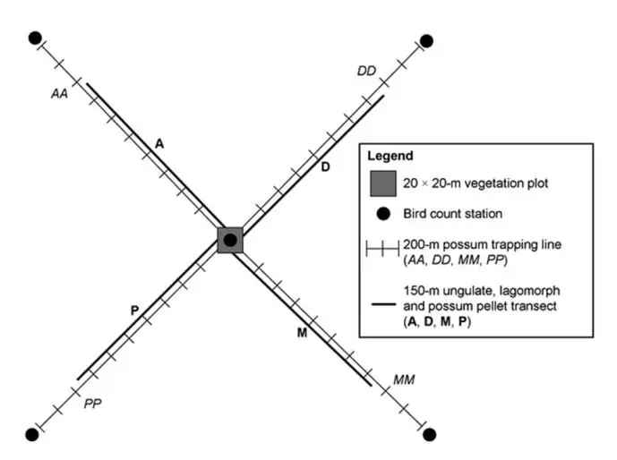
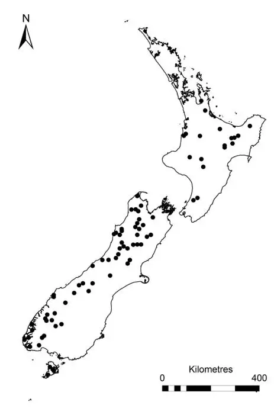
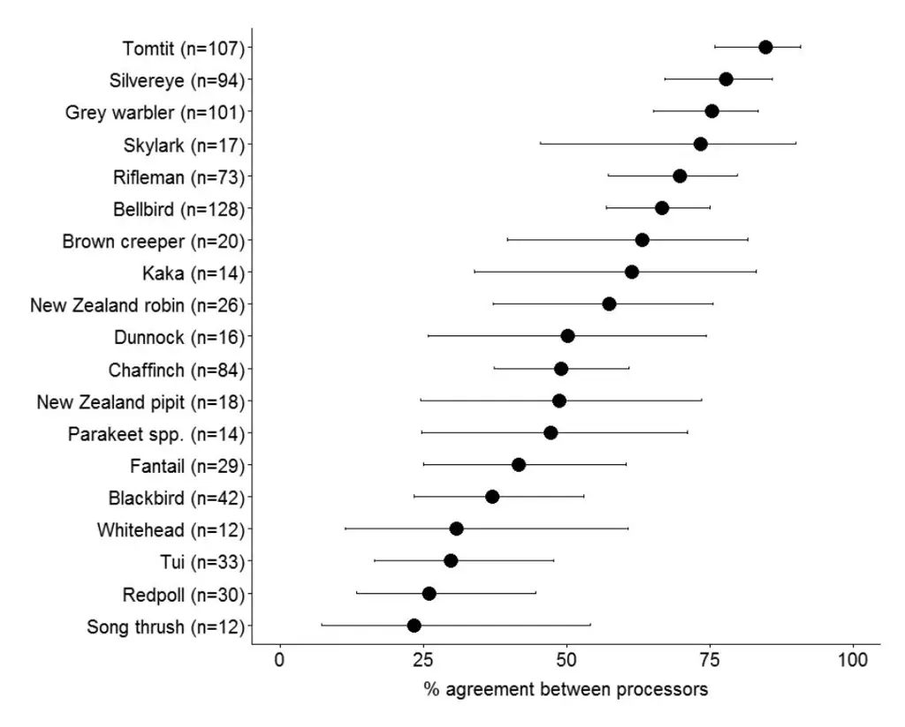
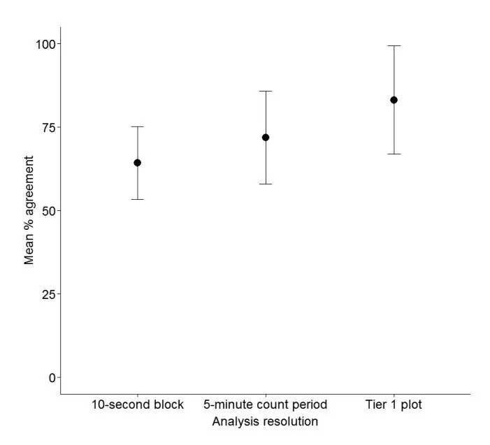

126 New Zealand Journal of Ecology, Vol. 41, No. 1, 2017 DOI: 10.20417/nzjecol.41.10

# Investigating bird call identification uncertainty using data from processed audio recordings

## James A. J. Mortimer\* and Terry C. Greene

Department of Conservation, 70 Moorhouse Avenue, Addington, Christchurch 8011, New Zealand \*Author for correspondence (Email: jmortimer@doc.govt.nz)

Published online: 30 September 2016

**Abstract:** To effectively monitor bird populations, accurate identification of species is critical. However, the reliability of species identification is rarely taken into account or quantified. For this study, bird call data was collected using automated acoustic recording devices (ARDs) over a 3-year period. We then compared the results from experienced ornithologists who independently identified bird calls from the same samples. Results were highly variable. The level of agreement between processors on identification for some species was high (e.g. tomtit _Petroica macrocephala_, 85.1%), whilst for others it was considerably lower (e.g. song thrush _Turdus philomelos_, 23.5%). There was no statistically significant difference in agreement between native and non-native species. However, there was some evidence for improvement in agreement for the third survey season, when compared to the first. In a more specific comparison of bellbird _Anthornis melanura_ and tui _Prosthemadera novaeseelandiae_ calls, our results showed that these two species were frequently confused. There were many instances where only one of the processors identified a species. Possible explanations for why calls were missed include differences in hearing ability and levels of concentration between processors, whilst false positives could have resulted from confirmation bias. These results have implications not only for data collected using recording devices but also field-based counts of birds conducted by observers.

**Key words:** automatic recording device; bellbird; forest birds; identification; tui; vocalisations; uncertainty

## Introduction

'There are three stages to learning bellbird and tūī call identification: (1) you can't tell them apart; (2) you think you can tell them apart; (3) you realise that you can't tell them apart' – Anon.

Robust and accurate monitoring tools are essential for measuring changes in population abundance or distribution, particularly when assessing effectiveness of management actions. Commonly used bird survey methods, particularly in forest habitats, rely on identification of vocalisations of the species of interest (Dawson & Bull 1975; DeJong & Emlen 1985). With practice, many birds can be reliably identified from their calls, however some species are difficult to identify with certainty, as they sound similar to other species (e.g. bellbird _Anthornis melanura_ and tūī _Prosthemadera novaeseelandiae_). Confidence in data quality is essential if the information is to be used to inform effective conservation decision-making, but there are few cases where the accuracy of the data is quantified (for examples, see Alldredge et al. 2007; Simons et al. 2007).

The use of automated acoustic recording devices (ARDs) for detecting birds and other animals has increased rapidly in recent years (Steer 2010; Frick 2013). Technological developments and increased interest in the potential of ARDs have resulted in production of a range of devices and systems providing various options for monitoring (Brandes 2008; Frick 2013). Advantages include the ability to estimate the number of species present at many sites simultaneously, the generation of a permanent and reviewable record over prolonged time periods, minimal disturbance to wildlife and the ability to sample the audible soundscape 24 hours per day (Haselmayer & Quinn 2000; Acevedo et al. 2006; Steer 2010). Despite these obvious benefits, particularly the potential of more accurate identification, the process of converting sound recording into useable data remains a largely manual task that can be protracted and costly (Swiston & Mennill 2009). The application of automated call recognition to acoustic recordings remains problematic despite being the subject of much recent research (e.g. Chou et al. 2008; Bardeli et al. 2010; Chu & Blumstein 2011; Lopes et al. 2011). The absence of a readily applicable solution continues to hamper the wider adoption of the methodology to intensive and large-scale monitoring programmes.

This study examines the issues of uncertainty around identification of bird calls, using recordings from ARDs processed by different experienced ornithologists or 'processors'. The data were collected through the National Biodiversity Monitoring and Reporting System, administered by the Department of Conservation (DOC). The Tier 1 Monitoring Programme underpins this project and provides biodiversity data to enable reporting on the national status and trend for common and widespread species (Lee et al. 2005). For birds, observer counts and ARD monitoring were implemented concurrently to test efficacy and determine which method was most appropriate for the programme. This study used data gathered during the first three field seasons (2011/12, 2012/13 and 2013/14) to determine the extent of processor agreement and disagreement in terms of species identification, and quantifies the uncertainty. Two endemic honeyeater species, bellbird and tūī, were then investigated in more detail. The calls of these two species can be very similar (Falla et al. 1966) and are often confused (Scofield & Stephenson 2013).

## Materials and methods

The Tier 1 Monitoring Programme is based upon an 8 km grid across New Zealand, from which a random selection of locations is surveyed. At each grid intersection on Public Conservation Lands, a 20 x 20 m vegetation plot is measured following the method described in Hurst and Allen (2007). Mammals (e.g. possum _Trichosurus vulpecula_; deer _Cervus_ spp., _Dama dama dama_ and _Odocoileus virginianus borealis_; European rabbit _Oryctolagus cuniculus_; and brown hare _Lepus europaeus_) are monitored using transects that radiate from each of the four vegetation plot corners, to a distance of 200 m. At the end of each transect and in the centre of the vegetation plot there is a bird count station (five in total for each Tier 1 plot; Figure 1). A single ARD is deployed at each count station to record audio continuously for one nocturnal time period (2000–0600 hrs) and one diurnal time period (0700–1300 hrs); see MacLeod et al. (2012).

ARDs were developed and designed by DOC, each incorporating 4 x wm61a electret microphones in parallel with a foam 'pop filter' and custom-made low noise pre-amplifier with a DSP anti-aliasing filter. Recordings were saved to Secure Digital (SD) memory card as a series of uncompressed 32 kHz, 16-bit audio files in waveform audio file format ('.WAV' file extension) with a bit-rate of 512 kbps, each approximately 15 minutes in length.

In total, a maximum of 80 hours of recordings could potentially be generated for each Tier 1 plot. In practice it was often less than this number, due to either (1) technical issues with ARDs; or (2) station abandonment resulting from safety concerns or excessive environmental noise. Even so, many hours of recordings were generated. To make processing manageable in terms of time and cost, only a small proportion of audio recordings were selected for processing, i.e. two 5-minute diurnal count periods for each bird count station (one to coincide with the field observer bird count and one additional from around 0900 hrs), plus one 15-minute nocturnal period for every hour between official New Zealand sunset and sunrise, per bird count station. Excessively noisy audio recordings (e.g. from wind, rain, or other unwanted environmental noise) were excluded from processing.

There was no formal method of assessing the bird identification abilities of processors in this study; however, all processors were considered competent at bird call identification,

**Figure 1.** Tier 1 Monitoring Programme plot design. ARDs were located at bird count stations.

having completed numerous field surveys for birds in New Zealand in recent years. Everyone received training in the use of the processing software prior to beginning work on the project. Eleven processors were involved, five of whom processed recordings from all three survey seasons. Five-minute count periods were randomly assigned, then processed using the custom-designed Freebird bird call analysis software, version 1.1.6.4 (Freebird 2013). This software generated sonograms from the ARD recordings and allowed audio playback for identification. Processors used Sennheiser HD 205 headphones, with a frequency response of 14-20000 Hz, to listen to recordings. Once a bird call had been identified, it was then tagged with the species name from a drop-down list. For diurnal audio recordings, the processor identified presence of each species within consecutive 10-second blocks of time (i.e. a species would not be tagged more than once within the same 10-second block). Each 5-minute count period therefore consisted of thirty 10-second blocks in which the presence of bird species was recorded. In an attempt to limit the effects of fatigue, processors were advised not to spend more than 20–25 hours per week processing recordings. Upon completion of processing each audio recording, the results were exported in comma separated values (CSV) format. The CSV files were later aggregated for analysis to compare species detection/ non-detection between data from ARDs and field observers (the subject of a separate study, in preparation).

During the first three Tier 1 monitoring survey seasons (2011/12, 2012/13 and 2013/14), ARD recordings were collected from 83, 93 and 279 plots respectively, which resulted in a total of 2924 5-minute diurnal count periods processed. For the purposes of this study, a small proportion of the diurnal audio recordings (about 7%) was randomly selected and reprocessed by another processor (i.e. selected recordings were processed independently by two individuals). The 79 Tier 1 plots that were included in this study ranged across New Zealand from the Coromandel Peninsula to Stewart Island (Figure 2).

**Figure 2.** Locations of Tier 1 Monitoring Programme plots for which recordings were processed independently by two individuals (2011/12, 2012/13 and 2013/14 survey seasons).

All analyses were carried out using the R statistical software package, version 3.1.2 (R Core Team 2013). Unless otherwise stated, agreement between processors was calculated per 5-minute count period, with the rationale that this was probably most useful as studies commonly collect data at this resolution. To test effects of resolution on agreement, data from the 10-second block resolution were aggregated to provide 'recorded/not recorded' per 5-minute count period. These data were then aggregated again to provide 'recorded/ not recorded' per Tier 1 plot, and included all 5-minute count periods processed for a plot. The number of 5-minute count periods processed per plot was variable (mean 7.2 ± 0.95 SEM). This aggregation provided data on agreement at three resolutions. The sensitivity of resolution was only assessed for 2012/13 due to the method of sample selection for this survey season (Tier 1 plots were randomly selected for processing, rather than 5-minute count periods). To avoid effects of small sample sizes, species recorded in less than 10% of 5-minute count periods were excluded from this analysis. For all other analyses, species recorded in less than 5% of 5-minute count periods were excluded to avoid effects of small sample sizes.

To calculate agreement between processors for each species, each row of data was classified as a binary response variable (1 = both processors recorded the species, 0 = only one processor recorded the species, excluding those not recorded by either processor). The data were then modelled using logistic regression, assuming a binomially distributed error structure. Species (_Sp_) and Season (_Sn_) were included as explanatory categorical variables in the model formula:

$$Logit[\pi(y)] = \beta_1 Sp + \beta_2 Sn$$
(1)

where π(_y_) was the probability that y was 1 (both processors agreed the species was present), given fixed values of the explanatory variables. Coefficient estimates and 95% confidence intervals were converted back from the log to the original scale, to provide predicted percentage agreement with associated error for each species. The first survey season (2011/12) was taken as the reference season. 'Processor pairs' was also considered as an explanatory variable in the above model. Diagnostic plots compared Pearson's residuals to fitted values and variables included and not included in the model, and the data were tested for over-dispersion (Zuur et al. 2013). Species status (native or non-native) and resolution (10-second block, 5-minute count period and Tier 1 plot) were tested for significant differences using one-way ANOVA _F_ tests.

**Table 1.** Possible outcomes for each bird call tagged 'bellbird' or 'tūī', in a comparison of honeyeater identification.

| Outcome                           | Description                                                                                                                  |     |     |
| --------------------------------- | ------------------------------------------------------------------------------------------------------------------------------- | --- | --- |
| Same identification               | Both processors agreed on identification.                                                                                    |     |     |
| Different identification          | Both processors tagged the call but with different identifications.                                                          |     |     |
| Tagged by only 1 processor     | One processor tagged the call as bellbird or tūī, whilst the other processor did not tag the call.                        |     |     |
| Identified by only 1 processor | One processor tagged the call as bellbird or tūī, whereas the other processor tagged the call as 'unidentifiable'.  |     |     |

Separate analysis was carried out for the commonlyencountered honeyeaters (i.e. bellbird and tūī). For this, the audio recordings for processors 1 and 2 were opened side-byside in Freebird, and tagged calls directly compared. For each bellbird or tūī tag, one of four outcomes was recorded (Table 1).

## Results

#### **General species comparison**

In total, 207 5-minute count periods were processed; a mean of 37.62 (± 6.62 SEM) per processor. These comprised a total of 6210 10-second blocks (Table 2), which equates to 17.25 hours of recordings. For all 5-minute count periods (across all survey seasons), the ratio of agreement to disagreement was 56.1:43.9%. Agreement scores varied considerably between species (Fig. 3), with lowest from song thrush _Turdus philomelos_ (23.5%) and highest from tomtit _Petroica macrocephala_ (85.1%). Bellbird was the most commonlyrecorded species, being identified by at least one processor in more plots than any other species, and had agreement of 67.3%. Several native species had relatively low processor agreement (<50%; fantail _Rhipidura fuliginosa_, tūī and whitehead _Mohoua albicilla_). Generally, native species had higher agreement (mean 60.4%) than introduced species (mean 46.8%), although this was not significantly higher (_F_ (1,17) = 2.47, _p_ = 0.134).

Logistic regression results for the effect of season provided some evidence that processor agreement improved in the 2013/14 survey season, compared to the 2011/12 survey season (2011/12: 50.0% agreement; 2013/14: 60.4% agreement; significant at the 5% level, _p_ = 0.047). The effect of season varied for different species. Processor pairs was removed from the model, as this variable did not have any significant effect on agreement. Diagnostics did not indicate any potential problems with the model.

Mean agreement between processors increased as resolution decreased (Fig. 4), although there was a large degree of overlap in 95% confidence intervals and the difference between resolutions was not significant (_F_(2,21) = 1.802, _p_ = 0.19). Several species attained 100% agreement at the Tier 1 plot resolution (New Zealand pipit _Anthus novaeseelandiae_, rifleman _Acanthisitta chloris_, silvereye _Zosterops lateralis_ and tomtit). No species reached 100% agreement at the 10-second block or 5-minute count period resolutions.

**Table 2.** Number of data points for each resolution within each survey season.

| Resolution            | Data points |         |         |                       |     |
| ------------------------ | ----------- | ------- | ------- | --------------------- | --- |
|                          | 2011/12     | 2012/13 | 2013/14 | All survey seasons |     |
| 10-second block       | 2130        | 3090    | 990     | 6210                  |     |
| 5-minute count period | 71          | 103     | 33      | 207                   |     |
| Tier 1 plot           | na          | 10      | na      | 10                    |     |

**Figure 3.** Predicted percentage agreement, from logistic regression, between processors at the 5-minute count period resolution (±95% confidence intervals), for species recorded in at least 5% of count periods. _n_ = number of count periods in which the species was recorded by at least one processor.

**Figure 4.** Changes in mean percentage agreement (±95% confidence intervals) between processors at different resolutions: 10-second block, 5-minute count period and Tier 1 plot (2012/13 season only). Data include species recorded in at least 10% of counts: bellbird, chaffinch, grey warbler, New Zealand pipit, rifleman, silvereye, skylark and tomtit.

### **Honeyeater comparison**

Direct comparison of bellbird and tūī showed that in only 40.7% of cases for bellbirds and an even lower 13.5% of cases for tūī did processors' identification agree (Table 3). Processor agreement was higher when bellbird and tūī were aggregated together into 'honeyeaters' (62.4%), due to the majority (82.1%) of tags with the outcome 'different identification' being identified as bellbird by one processor and tūī by the other. The remaining 17.9% of tags with the outcome 'different identification' were identified by one processor as either Australian magpie _Gymnorhina tibicen_, blackbird _Turdus merula_, chaffinch _Fringilla coelebs_, grey warbler _Gerygone igata_, kākā _Nestor meridionalis_, silvereye, starling _Sturnus vulgaris_ or tomtit. The outcome 'tagged by only one processor' accounted for a large proportion of cases (bellbird 27.1%, tūī 22.8%, honeyeater 31.6%). To assess what effect differences in identification had on species distributions, each Tier 1 plot was assigned a 1 (if recorded) or 0 (not recorded) for bellbird, tūī and honeyeater, for each processor. For bellbird, the percentage of plots on which this species was recorded was similar between processors one and two, at 84.6% and 89.7% respectively (Table 4). However, there were differences in _which_ plots bellbirds were detected, resulting in 74.4% overall agreement. For tūī, overall agreement was lower, at 50%. When bellbird and tūī records were combined into 'honeyeaters', both processors recorded presence at 92.3% of plots, with overall agreement of 84.6% (approximately 10% higher than bellbird, and 34% higher than tūī).

**Table 3.** Summary of identification outcomes for calls identified by at least one processor as bellbird or tūī.

| Outcome                              | % of tags |      |            |     |
| --------------------------------------- | --------- | ---- | ---------- | --- |
|                                         | Bellbird  | Tūī  | Honeyeater |     |
| Same identification                     | 40.7      | 13.5 | 62.4       |     |
| Different identification             | 30.9      | 62.6 | 4.5        |     |
| Tagged by only one processor         | 27.1      | 22.8 | 31.6       |     |
| Identified by only one processor  | 1.3       | 1.2  | 1.6        |     |

**Table 4.** Agreement between processors on presence per plot, for bellbird, tūī and honeyeaters (bellbird and tūī combined).

| Species/species group |             | % plots recorded |  % agreement |
| ------------------------ | ----------- | ------------------- | ------------------ |
|                          | Processor 1 | Processor 2         |                    |
| Bellbird                 | 84.6        | 89.7                | 74.4               |
| Tūī                      | 43.6        | 25.6                | 50.0               |
| Honeyeaters           | 92.3        | 92.3                | 84.6               |

## Discussion

This study has highlighted varying levels of agreement/ disagreement, and therefore uncertainty, concerning species identification from bird calls. The four highest scoring species (at the 5-minute count period resolution) were grey warbler, silvereye, skylark _Alauda arvensis_ and tomtit, all with higher than 70% agreement. These species are generally common and widespread in New Zealand (Robertson et al. 2007) and have calls that are easily recognisable. However, despite their familiarity and distinctive calls, these species still had lower than expected levels of agreement. The four lowest scoring species were redpoll _Carduelis flammea_, song thrush, tūī and whitehead, all with lower than 35% agreement. This result suggests that calls of these species were most difficult to identify, presumably due to other species having similar vocalisations or lack of processor familiarity with regional call variations. For example, some redpoll calls may have been confused with other finch species such as greenfinch _Carduelis chloris_, goldfinch _C. carduelis_ or chaffinch, whilst song thrush may have been confused with blackbird, and tūī with bellbird. In a study of avian detection by field observers in the USA, Simons et al. (2007) reported that misidentification rates were highest among species with similar calls. It is perhaps more difficult to explain why agreement was low for whitehead, as there are no obvious candidates for confusion. Several studies have revealed regional variation in vocalisations of a number of species, including bellbird (Brunton & Li 2006), tūī (Bergquist 1989; Hill 2011), North Island saddleback _Philesturnus rufusater_ (Parker et al. 2012) and kea _Nestor notabilis_ (Bond & Diamond 2005). Such variation may lead to misidentifications, as a person familiar with calls from one geographical region may not recognise calls from another. An additional factor that may account for variation between processors is data entry error, which in the

context of this study would involve accidentally choosing the wrong species when tagging a call in Freebird. For example, 'Redpoll' may be selected instead of 'Rifleman' or vice versa, as these species appear next to each other on the species list. Data quality checks for this study suggested that data entry error was random and occurred infrequently. Implementation of an appropriate quality assurance process is recommended to minimise this type of error.

Not surprisingly, there was a general increase in percentage agreement between processors as the resolution decreased (i.e. from 10-second block to the Tier 1 plot). As resolution decreased, the amount of time processed increased, from 10 seconds (10-second block resolution), to 5 minutes (5-minute count period resolution), to anywhere between 5 and 50 minutes (Tier 1 plot resolution) depending upon how many 5-minute count periods were processed for a particular plot. This indicates that for detection/non-detection data, longer time periods are preferable to shorter time periods for attaining higher levels of agreement and therefore confidence in accuracy of identifications. This provides some justification in the Tier 1 Monitoring Programme for treating the plot as the sample unit, with multiple 5-minute count periods processed per plot.

There was some evidence of an increase in processor agreement in subsequent seasons, however because there were some changes in processors employed between survey seasons, it is impossible to determine the cause of improvement. It may be due partly to feedback received on results, however this was limited. Regular and detailed feedback, especially concerning commonly confused species pairs or groups, may lead to higher levels of agreement in subsequent survey seasons, providing the same staff are employed. We recommend that feedback to processors is considered and factored into any multi-season programme involving processing of acoustic recordings. One example of a format in which feedback could be provided is via production of guides to distinguishing between frequently confused species pairs or groups.

The results of the processor comparison for honeyeaters re-confirmed that bellbird and tūī were commonly confused, presumably because of their similar-sounding calls and the tūī's mimicry habits (Robertson 1996; Hill 2011). The lower tūī agreement score may suggest a tendency by processors to choose bellbird rather than tūī when making a decision on identification. Perhaps when uncertain, and when listening to recordings from geographic locations where both species commonly occur, processors more frequently chose bellbird, as this species is generally considered more abundant and widespread than tūī, and may be less seasonally mobile (Heather & Robertson 2000). Although agreement between processors was relatively low when bellbird and tūī were considered individually, when identifications were combined into 'honeyeaters', agreement was considerably higher. This trend suggests that processors agree on most occasions that a honeyeater is calling, though often disagree on which honeyeater species it is. Although bellbird and tūī vocalisations have been the subject of several scientific studies (e.g. Brunton & Li 2006; Hill 2011; Hill et al. 2013), to our knowledge no studies to date have directly compared the call characteristics of these two species to provide assistance with identification. Clearly more work is required in this area and would hopefully provide field workers with techniques for distinguishing between calls of the two species. In the meantime, consideration could be given to aggregating certain species into pairs or groups with similar calls. Other than honeyeaters, other possible groupings could include the Turdine species (blackbird and song thrush) and finches (chaffinch, greenfinch, goldfinch and redpoll). It may still be desirable to analyse the data for each individual species, however, it is important to acknowledge that some species identifications may be less certain and reliable and by grouping similar-sounding species this uncertainty is likely to be reduced. Grouping species together for analysis may reduce the usefulness of the data, but this will depend upon the level of uncertainty and the question(s) the data are being used to address. Therefore, for some groups it could still potentially be used for conservation benefit. For example, the introduced common wasp _Vespula vulgaris_ has been shown to have negative impacts on bellbird and tūī populations in beech forests by depleting the honeydew resource (Beggs 2001). Wasp control in these areas would benefit both bird species and therefore monitoring 'honeyeaters' (rather than incorrectly identified individual species) could materially help inform the degree of management success.

A large proportion of bellbird/tūī disagreement arose from species being tagged by only one processor. There are two potential explanations for this occurring. The first possibility is that one of the processors did not tag the call because they did not hear it, due to hearing ability or concentration levels. If this is indeed the case and occurs more widely, for species other than bellbird and tūī, it suggests that levels of agreement/disagreement not only depend upon bird identification experience, but also other factors such as fatigue or an individual's hearing frequency range. For those involved in this type of work, hearing should be regularly tested by an audiologist, and ability taken into account when analysing results. To minimise effects of fatigue, processors should be set maximum hours per processing session and per week. The second possibility is that one of the processors tagged a non-existent call, due to confirmation bias. Also known as expectation bias, this is a type of cognitive bias whereby an observer subconsciously searches for information that will confirm their thinking, which may in turn lead to the psychological phenomenon known as pareidolia – the imagined perception of a pattern where it is not actually present (Gray 2007). This can result in the recording of false-positives, such as identification of bird calls that are not in fact present. There may be no way to prevent occurrence completely, however simply having an awareness is likely to help an individual avoid this bias.

ARDs have a number of advantages compared to field observers, however, they are not without their limitations. Context can be extremely important for bird identifications and, in combination with the observer's experience, can heavily influence what species may be expected to be found at any given location. When carrying out bird surveys in the field, context is derived from a combination of factors, including geographical location, topography, altitude, habitat type(s) and their structure, weather conditions, time of year/day and species behaviour. When processing ARD recordings much of this context is either not available or limited, making call identification potentially more challenging; for example, some habitat information can be gleaned from satellite and aerial photographs, but this is a poor substitute for being physically at the site. Using known presence/absence from existing species distribution data can also provide context to assist with identification of difficult calls, however, these data must be used with caution as they rely on assumptions, namely: (1) that the existing data are accurate and unbiased; and (2) the species range has not changed since the data were collected. A further potential drawback of relying heavily on

existing distribution data is that it may lead to an increase in confirmation bias.

Another influential factor for ARD file processing is background noise, which can limit the detection of bird calls and lead to misidentifications (Simons et al. 2007; Brandes 2008). Although background noise was limited to some extent in this study (i.e. excessively noisy recordings were excluded from processing), the assessment of suitability for processing was subjective and the noise present in the recordings processed could be responsible for some of the differences in species identification, or instances where a species was tagged by one processor only. It may be useful to determine an objective background noise level, using appropriate software, above which calls are difficult to hear or identify accurately, and use this to screen out noisy recordings. This screening would then standardise the maximum noise levels permitted in recordings to be processed.

A further disadvantage of ARDs is that they are currently audio-only devices and therefore limited to detection of birds that regularly vocalise or make other distinctive sounds. This limitation may not lead to misidentifications, but could result in under-recording of species that vocalise infrequently, such as kākā, New Zealand falcon _Falco novaeseelandiae_, and New Zealand pigeon _Hemiphaga novaeseelandiae_ (although the latter has very distinctive wing-beats). If these species are missed, ARDs may prove unsuitable for their inventory or monitoring, whilst an observer has the potential to detect them visually.

One of the main limitations of this study is the absence of 'correct' answers to the species identifications. When processors disagreed on species identifications it was clear that at least one of them must have been incorrect (perhaps both of them), however, we could not say with certainty what was the correct identification. Therefore, our assessment was limited to agreement or disagreement. We have made the assumption that when both processors agreed on species identification, they were both correct. It is likely that in the majority of cases this is a safe assumption, however, it is entirely possible that there are instances when both processors agree but are both incorrect. Therefore, knowing the correct identification is essential for accurate quantitative analysis of error rates. With this in mind, we are currently developing a bird identification test, designed to quantify the accuracy of species identification. The purpose of this will be two-fold: (1) it will provide known identifications, and therefore error rates can be accurately measured; and (2) it will provide a means of objectively assessing a person's bird identification skills, which can be used for observer/processor ability calibration. Such tests have been used previously for the latter. For example, in a programme for monitoring amphibians in North America the coordinators considered observer skill and inter-observer variation to be such important factors that participants were required to pass a test on amphibian vocalisations before being allowed to enrol (Dickinson et al. 2010).

The results of this study highlight some of the difficulties faced with bird call identification, which have implications not only for surveys utilising ARDs, but also for surveys employing field-based observers. To some extent, confidence in species identification in field-based surveys may be higher than for processed audio recordings for two reasons: (1) additional context is gained from the surrounding environment; and (2) visual clues provide additional information for species identification. Context is important in all situations, whilst visual clues may be limited in New Zealand forests, previous studies have demonstrated that in these areas there is a heavy reliance on auditory cues for identification (Mortimer 2011; Dowding 2012). However, in the more open non-forest habitats visual information may be more important for species identification. It would be useful to investigate agreement/ disagreement levels between field observers, perhaps using the double-observer count method (Nichols et al. 2000; Forcey et al. 2006) or similar, and compare the results to those from processed ARD recordings.

In conclusion, agreement (and therefore confidence) in bird call identification varies widely between species, and this should be acknowledged when analysing and interpreting survey data from ARD or field-based surveys. To limit the amount of identification error, specific training on identification of known or suspected confusion pairs/groups should be provided, or alternatively, some species may be grouped together during analysis. Further research is required to investigate observer bird identification ability in the field, and quantify associated error rates.

## Acknowledgements

This study would not have been possible without the hard work of those people who dedicated a great deal of time and effort to processing ARD recordings for the Tier 1 Monitoring Programme: Mitch Bartlett, Robyn Blyth, Iris Broekema, Miles Burford, Tracey Dearlove, Rowan Hindmarsh-Walls, Sabrina Leucht, Ralph Powlesland**,** Marion Rhodes, Jason van de Wetering and Maddie van de Wetering. Thanks also to Ian Westbrooke for statistical advice, Ashley Ross for providing background information on confirmation bias and Brenda Greene and two anonymous referees for reviewing the draft manuscript and providing helpful comments.

## References

- Acevedo MA, Villanueva-Rivera LJ 2006. Using automated digital recording systems as effective tools for the monitoring of birds and amphibians. Wildlife Society Bulletin 34: 211–214.
- Alldredge MW, Simons TR, Pollock KH 2007. Factors affecting aural detections of songbirds. Ecological Applications 17: 948–955.
- Bardeli R, Wolff D, Kurth F, Koch M, Tauchert KH, Frommolt KH 2010. Detecting bird sounds in a complex acoustic environment and application to bioacoustic monitoring. Pattern Recognition Letters 31: 1524–1534.
- Beggs J 2001. The ecological consequences of social wasps (_Vespula_ spp.) invading an ecosystem that has an abundant carbohydrate resource. Biological Conservation 99: 17–28.
- Bergquist CAL 1989. Tui sociodynamics: foraging behaviour, social organisation, and use of song by tui in an urban area. Unpublished PhD thesis, University of Auckland, New Zealand. 79 p.
- Bond AB, Diamond J 2005. Geographic variation in the contact calls of the kea (_Nestor notabilis_). Behaviour 142: 1–20.
- Brandes TS 2008. Automated sound recording and analysis techniques for bird surveys and conservation. Bird Conservation International 18: 163–173.
- Brunton DH, Li X 2006. The song structure and seasonal patterns of vocal behavior of male and female bellbirds (_Anthornis melanura_). Journal of Ethology 24: 17–25.

- Chou CH, Liu PH, Cai B 2008. On the studies of syllable segmentation and improving MFCCs for automatic birdsong recognition. Proceedings of the 3rd IEEE Asia-Pacific Services Computing Conference, APSCC 2008. Yilan, Taiwan, IEEE. Pp. 745–750.
- Chu W, Blumstein DT 2011. Noise robust bird song detection using syllable pattern-based hidden Markov models. International Conference on Acoustics, Speech and Signal Processing, ICASSP 2011. Prague, Czech Republic, IEEE. Pp. 345–348.
- Dawson DG, Bull PC 1975. Counting birds in New Zealand forests. Notornis 22:101–109.
- DeJong MJ, Emlen JT 1985. The shape of the auditory detection function and its implications for songbird censusing. Journal of Field Ornithology 56: 213–223.
- Dickinson JL, Zuckerberg B, Bonter DN 2010. Citizen science as an ecological research tool: challenges and benefits. Annual review of ecology, evolution, and systematics 41: 149–172.
- Dowding J 2012. Introduction to bird monitoring. Inventory and monitoring toolbox: birds. Wellington, Department of Conservation. 33 p.
- Falla RA, Sibson RB, Turbott EG, Talbot-Kelly C 1966. A field guide to the birds of New Zealand and outlying islands. Auckland, Collins. 254 p.
- Forcey GM, Anderson JT, Ammer FK, Whitmore RC 2006. Comparison of two double-observer point-count approaches for estimating breeding bird abundance. Journal of Wildlife Management 70: 1674–1681.
- Freebird 2013. Freebird: fast and easy to use bird call analysis. www.freebird.co.nz (accessed 1 February 2015).
- Frick WF 2013. Acoustic monitoring of bats, considerations of options for long-term monitoring. Therya 4: 69–78.
- Gray PO 2007. Psychology. 5thedn. Duffield, Worth Publishing Ltd. 768 p.
- Haselmayer J, Quinn JS 2000. A comparison of point counts and sound recording as bird survey methods in Amazonian southeast Peru. The Condor 102: 887–893.
- Heather BD, Robertson HA 2000. The field guide to the birds of New Zealand. Revised edn. Auckland, Viking/Penguin Books. 440 p.
- Hill SD 2011. The vocalisation of tui (_Prosthemadera novaeseelandiae_)_._ Unpublished MSc thesis, Massey University, Albany, New Zealand. 44 p.
- Hill SD, Ji W, Parker KA, Amiot C, Well SJ 2013. A comparison of vocalisations between mainland tui (_Prosthemadera novaeseelandiae novaeseelandiae_) and Chatham Island tui (_P. n. chathamensis_). New Zealand Journal of Ecology 37: 214–223.
- Hurst JM, Allen RB 2007. A permanent plot method for monitoring indigenous forests - field protocols. Lincoln, Manaaki Whenua - Landcare Research. 66 p.
- Lee W, McGlone M, Wright E 2005. Biodiversity inventory and monitoring: a review of national and international systems and a proposed framework for future biodiversity monitoring by the Department of Conservation. Unpublished report. Lincoln, Landcare Research Ltd. 213 p.
- Lopes MT, Gioppo LL, Higushi TT, Kaestner CA, Silla CN Jr, Koerich AL 2011. Automatic bird species identification for large number of species. Multimedia (ISM), 2011 IEEE International Symposium. IEEE. Pp. 117–122.
- MacLeod CJ, Greene TC, MacKenzie DI, Allen RB 2012. Monitoring widespread and common bird species on New

- Zealand's conservation lands: a pilot study. New Zealand Journal of Ecology 36: 1–12.
- Mortimer JAJ 2011. A 1-year study of forest birds at Kennedy's Bush, Canterbury. Notornis 58: 158–162.
- Nichols JD, Hines JE, Sauer JR, Fallon FW, Fallon JE, Heglund PJ 2000. A double-observer approach for estimating detection probability and abundance from point counts. The Auk 117: 393–408.
- Parker KA, Anderson MJ, Jenkins PF, Brunton DH 2012. The effects of translocation-induced isolation and fragmentation on the cultural evolution of bird song. Ecology Letters 15: 778–785.
- R Core Team 2013. R: a language and environment for statistical computing. R Foundation for Statistical Computing. Version 3.1.2. Vienna, Austria. www.R-project.org/.
- Robertson CJR 1996. Tui (_Prosthemadera novaeseelandiae_)

Editorial board member: Dean Anderson Received 11 January 2016; accepted 27 July 2016

- mimic parakeet calls at Raoul Island. Notornis 43: 52–53. Robertson CJR, Hyvönen P, Fraser MJ, Pickard CR 2007.
- Atlas of bird distribution in New Zealand 1999 2004. Wellington, Ornithological Society of New Zealand. 533 p.
- Scofield RP, Stephenson B 2013. Birds of New Zealand: a photographic guide. Auckland University Press. 544 p.
- Simons TR, Alldredge MW, Pollock KH, Wettroth JM 2007. Experimental analysis of the auditory detection process on avian point counts. The Auk 124: 986–999.
- Steer J 2010. Bioacoustic monitoring of New Zealand birds. Notornis 57: 75–80.
- Swiston KA, Mennill DJ 2009. Comparison of manual and automated methods for identifying target sounds in audio recordings of pileated, pale-billed, and putative ivory-billed woodpeckers. Journal of Field Ornithology 80: 42–50.
- Zuur AF, Hilbe JM, Ieno EW 2013. A beginner's guide to GLM and GLMM with R: a frequentist and Bayesian perspective for ecologists. Newburgh, Highland Statistics Ltd. 256 p.
